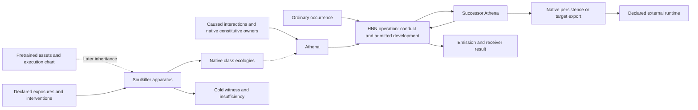

# Holonics: mathematical framework and executable architectures

[project-postulate] Holonics is a theory of everything grounded in the reality of difference:
a mathematical, physical and philosophical framework for situated objects, causal composition,
information transport and physical realization. Its research develops
methods for constructing and explaining mathematical, physical, biological and learning
systems. The Millennium lines investigate those methods through exact source problems;
their purpose includes reusable explanation and computational application.

[definition] [The reality of difference](canon/THE_REALITY_OF_DIFFERENCE.md) explains the
philosophical starting point: every value is a measured difference through a situated comparison,
and relevance concerns how actual relations condition consequence. That philosophy governs how
existing mathematical and executable owners are interpreted, composed and developed.

[definition] The elementary [holon](../formal/elementary-holonics/ElementaryHolonics/Foundation/Holon.lean)
retains an occurrence population, oriented source and target ports, and a receiver. Its preimage
fibre preserves the occurrences behind a returned face; composition retains the joining
population; a rebase carries the complete diagram. The
[causal-natural extension](../formal/elementary-holonics/ElementaryHolonics/Foundation/CausalNaturalHolon.lean)
transports that construction through parameter changes.

[project-postulate] HNN is an executable architecture within this framework. Its product
objective is frontier-level usefulness on consumer hardware. Mathematical research and HNN
construction have their own explicit returns and can inform each other. The current
[moving-frame strategy](plans/THE_MOVING_FRAME_RETURNS_THE_NULL_FIBRE_AND_THE_PHYSICAL_CONTINUATION.md)
joins null fibres, physical continuation and the RH source without making the neural product
the limit of the mathematics. The [mathematics tablet](canon/THE_MATHEMATICS_TABLET.md) supplies
the broader doctrine; the remainder of this guide describes the current executable architecture.

## Names and responsibilities

| Name | Responsibility | Current source |
|---|---|---|
| **Holonics** | The mathematical framework and ontology, with executable applications | [Holon](../formal/elementary-holonics/ElementaryHolonics/Foundation/Holon.lean), [mathematics](canon/THE_MATHEMATICS_TABLET.md), [public Rust entry point](../crates/holonics/src/lib.rs) |
| **HNN** | The Holonic Neural Network architecture and recurrent runtime | [native phase session](../crates/holonics-hna/src/native.rs), [constitutive ecology](../crates/holonic-engine/src/native_ecology/constitutive_fibre/circulation.rs); earlier [full operator](../crates/holonic-engine/src/holonic_intelligence/full_operation.rs) |
| **Athena** | The general wisdom/model ecology, its available constructions, changing morphology and admitted capability domain | [Athena lifecycle](ATHENA.md) |
| **Eros** | Union, composition and formative activity throughout the holonic organization, including nested constituents | [native relation formation](../crates/holonic-engine/src/native_ecology/constitutive_fibre.rs) and [circulation](../crates/holonic-engine/src/native_ecology/constitutive_fibre/circulation.rs); earlier [adjoint return](../crates/holonic-engine/src/holonic_intelligence/operative_return.rs) |
| **Hephaestus Automata** | Operator-scoped mathematical applications and returned working constructions of Holonic Encoding/HNNs | [application design](HEPHAESTUS_AUTOMATA.md); existing [exact synthesis reference](../crates/holonic-engine/examples/generator_factorization.rs) |
| **Soulkiller** | Independent model-intake, excitation and dismantling apparatus | [Soulkiller](SOULKILLER.md), [consumed-input boundary](../crates/holonic-engine/src/soulkiller/boundary.rs) |
| **Applications/codecs** | Text, image, audio, files, user protocols and target runtimes | [CLI](../applications/holonics-workbench/src/cli.rs), [interoperability](INTEROPERABILITY.md) |

[definition] HNN means Holonic Neural Network. Earlier records and source identifiers use HNA,
sometimes expanded as Holonic Neural Athena; those identifiers and phase labels remain historical
references. A tensor, Transformer, SSM or diffusion process
is an admissible mathematical/application chart. None of those labels by itself supplies the
native topology or proves a particular executable adapter exists.

## The lifecycle

[project-postulate] Native founding and contextual development are now the primary construction
path. Inherited material is a later composition path, not the source of the missing contextual
architecture. The diagram describes roles and composition, not completed capabilities.

[definition] Eros names union and development within this recurrence; Athena carries the formed
structure and current. The [expanded architecture diagrams](HNN_COMPOSITION.md#the-architecture-as-explicit-passages)
show the local passage, developmental return, classical block arithmetic and Soulkiller's
commuting realization/restriction maps. Their full assembly is a construction account, with the
implemented bindings and remaining contextual attachments stated separately.

[definition] Eros operates at nested scopes as well as the whole ecology; it is not restricted
to a separate training program. Hephaestus Automata are application instances obtained by
confining the general construction capability to a requested mathematical domain and receiver.
“Holonic Solver” describes that activity. The current exact synthesis reference remains exterior
apparatus; the product naming does not promote it to an already complete native HNN application.

[definition] One operation consumes an occurrence and the contemporary ecology and returns
an emission, trace and successor. The next operation uses that successor. Inference is a
receiver reading this recurrence; training is developmental recurrence whose changed successor
is retained. Application-produced and self-emitted occurrences use the same port. Persistence
and external compilation are separate operations over the resulting model, not alternative
definitions of learning.

[established-bounded; source-inspected] The public framework exposes `holonics::structure`
and `holonics::geometry` independently of the device runtime. Default `native` adds
`holonics::{engine,hna,soulkiller,interop}` by composing existing owners; the
[Rust guide](RUST_FRAMEWORK.md) states the exact scopes.
The CLI uses that HNN entry point. It does not duplicate the native operation or treat an old
snapshot/commit API as the full neural runtime.

## What the mathematics buys the implementation

[project-postulate] The [sustained programme](plans/THE_ROADMAP.md#sustained-objective-and-construction-rhythm)
makes mathematics, native construction and applications one continuing effort. Recovering
applicable generators, comparing receiver-preserving realizations, incorporating returned
constraints and reusing their compressed continuation are the common problems expressed in
Athena, Eros and Hephaestus. Mathematical/physical sources provide exact constraints and
separating examples; the engine implements the resulting computational relations and returns
new observations. The [blueprint's binding table](plans/THE_ATHENA_ALPHA_CULTIVATES_GENERAL_CONVERSATION_THROUGH_NATIVE_CONTEXTUAL_TRANSPORT.md#the-shared-mathematical-to-native-construction)
identifies current consumers and remaining work. The difference in evidence scope between a
formal theorem and an executable body is an implementation responsibility within this programme.

[project-postulate] “Learning” is not a capability grade inferred from a changed state. Describe
the actual conditional association, applicable transformation, receiver reconstruction or
predictive/product result. The [named Athena phases](plans/THE_ROADMAP.md#athena-construction-order)
separate those outcomes and their code changes. Attention-like interaction, covector pullback,
diffusion, phase resonance and physical gravity retain their actual operators and realization
maps; shared mathematical structure is developed through those maps rather than synonym labels.

[definition] The [HNN composition guide](HNN_COMPOSITION.md) binds section/incidence, actual
local standing, interaction/reaction, returned difference, chart and model-realization owners.
Its [deeper source review](../research/records/2026-09-09_ARCHITECTURE_CHARTS_REQUIRE_COMPOSED_MECHANISMS_AND_FINITE_CONSTRUCTION_RETURNS.md)
recovers the classical architecture mechanisms and tensor commuting maps. These are concrete
construction comparisons, not merely I/O conventions or a requirement to implement a Transformer.

[established-bounded; source-inspected] Current owners retain typed incidence and chronology,
exact dyadic coefficient interpretation, interval-certified reactions, receiver-indexed
comparison, quotient/reopening laws, factorized morphology overlays, and resident execution.
The forward and reverse passages share the morphology that produced the retained carriers;
new deposits join only after the reverse traversal succeeds. The
[owner map](ARCHITECTURE_MAP.md) connects the Lean laws with their Rust/CUDA implementations.
The [mathematical synthesis](MATHEMATICS_AND_NATIVE_CONDUCT.md) carries the recent fluid, moving-frame
and RH consequences together with the existing classical ML charts, normalization, integration by
reflection, leader growth, fractal restriction and compression. Their productive composition is
unfinished, but their bounded mathematical and executable returns remain available. Theorems guide native constructions; Lean does not run in
cultivation or inference pipelines.

[definition] Finite native arithmetic is exact about its declared representation. Transcendental
reactions and midpoint projections have their stated enclosure/quotient boundaries. This does
not turn source assumptions, external calibration or model quality into theorems. The framework
can report the complete declared defect instead of silently treating a projected scalar as the
whole causal object.

[definition] The [final tension/kinetic handoff](../research/records/2026-09-10_TENSION_DYNAMICS_BECOME_ATHENAS_COMPUTATIONAL_CONSTRUCTION.md)
makes computational use explicit: preserve joint constraints, let actual contact/condition change
later response, return labeled emission and the complete successor, and reuse generators only
through their admitted future receivers. The [Athena blueprint](plans/THE_ATHENA_ALPHA_CULTIVATES_GENERAL_CONVERSATION_THROUGH_NATIVE_CONTEXTUAL_TRANSPORT.md)
specifies the continuing source/family incorporation, constituent formation, encoding and
product work; native emission and coupled ownership are existing dependencies. A
rendered manifold is a receiver of these constructions; the runtime need not render its state.

## Consumer hardware and the 20W ideology

[historical; source-inspected] Brandon's May 2026 messages state the aim of a fast, continuously
learning model on his PC and explicitly say the 20W ideology is not a literal rule about watts.
His August messages connect it to learning relevant structure, locality and reuse instead of
indiscriminately coupling a large population. The
[August 21 synthesis](../research/records/2026-08-21_EQUALITY_IS_OCCURRENCE_IDENTITY_THE_SOUL_MAPS_KINSHIP_AND_THE_LEADER_RETURNS_THROUGH_THE_ACTIVE_CODEC.md)
records that construction stance.

[project-postulate] Efficiency is an architectural obligation: exploit active causal extent,
shared generators, restricted bodies, retained state, compact factors and device-local work.
Measure the complete product: useful consequence, native standing, decoder, retained fibres,
work, span, residency, transfer, latency and energy where measured. Shrinking a file while
retaining full resident allocations is one improvement, not every improvement.

[established-bounded; measured] The current complete native text operator has run on one
RTX 4080 SUPER with 16 GiB, alongside a Ryzen 9 7900X and approximately 30 GiB host memory.
The September 4 repeated-cultivation regression used previously retained overlays and completed
three cycles. See the [actual receipt](../research/records/2026-09-04_recurrent_adjoint_receipts/repeated_cultivation.json).
These are bounded execution results, not a twenty-watt power measurement or a quality comparison
against frontier models.

## Cultivation direction

[definition] [Holonic Encoding](HNN_COMPOSITION.md#holonic-encoding) is the shared perception and
representation construction: form and reuse situated transformation passages, retaining their
receiver faces and Preimage Fibres across changed conditions and clocks. Its tokenizer analogue
extends to optical, acoustic and other material through source/receiver charts. The current
symbol-basis text attachment is one exterior chart; it does not establish that complete faculty.

[project-postulate] The [September 7 correction](../research/records/2026-09-07_GENERATOR_RECOVERY_AND_PHASE_TRANSPORT_REJOIN_TEXT_AND_ACOUSTICS.md)
joins black-box generator recovery, group/phase transport and Holonic Compression in native
formation. A Preimage Fibre represents compatible causes at the available observation scope;
its family characteristics guide future conduct without requiring a perfect inverse or a
reversible record of the past. This is the shared attachment question for text and acoustics.

[definition] The [live roadmap](plans/THE_ROADMAP.md) records completed native contextual
foundations and conversation-data preparation, followed by September 6 synthesis. Athena-alpha
remains unattained; the subsequent cultivation direction is general English, code and mathematics
through the [curated conversations](CONVERSATION_DATA.md), using native contextual transport.
The earlier [production campaign](plans/THE_HNA_PRODUCTION_CAMPAIGN_COMPOSES_LOCAL_LEARNING_PERSISTENT_MODELS_AND_EXECUTABLE_EXPORT.md)
is paused. Existing prefix/adjoint and tied-head experiments are bounded charts, not the general
learning contract. Context is the situated organization that makes a relation applicable and
transportable; neither a changed parameter nor a longer input window establishes it. The
[contextual audit](../research/records/2026-09-05_CONTEXTUAL_TRANSPORT_PRECEDES_INHERITED_MODEL_PRODUCTION.md)
states the correction and existing mathematical owners to compose.

[definition] The standard pipeline has explicit products: source/codec configuration; admitted
native model and insufficiency; an ordered exposure stream; run results and successor model;
native checkpoint; evaluation result; and a target-specific export. Each carries its actual
scope. The current checkpoint/session returns and remaining product/compiler bridges are described in
[Athena](ATHENA.md) and [interoperability](INTEROPERABILITY.md).

[project-postulate] Frontier competition must eventually be evaluated through useful language,
coding, mathematics and multimodal behavior, alongside end-to-end cost, on declared held-out
tasks and comparable hardware. A test count, selected-token equality or serialization round-trip
cannot substitute for that product evaluation. Existing exact foundations are reused, not
repeated as demonstrations before each pipeline improvement.

[definition] Hardware placement and modality codecs are separate charts over the same recurrence.
The [hardware and modality guide](HARDWARE_AND_MODALITY_BOUNDARIES.md) records the Linux/CUDA
build boundary, the MLX comparison and existing acoustic owners for subsequent MacBook work.
It adds no backend or modality-specific learning law.
