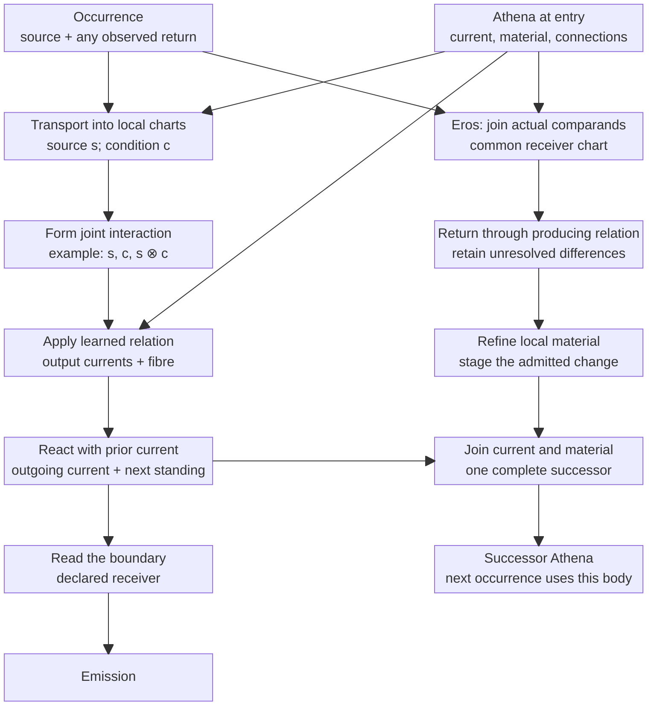
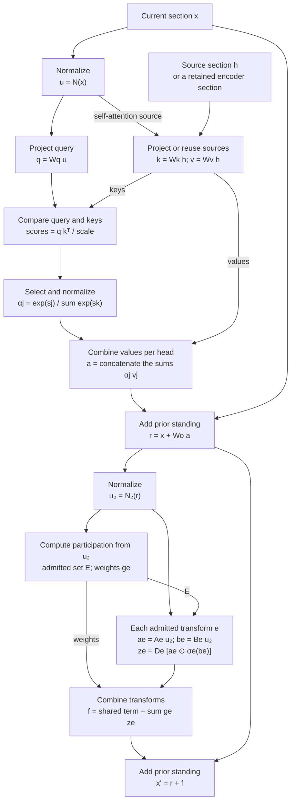
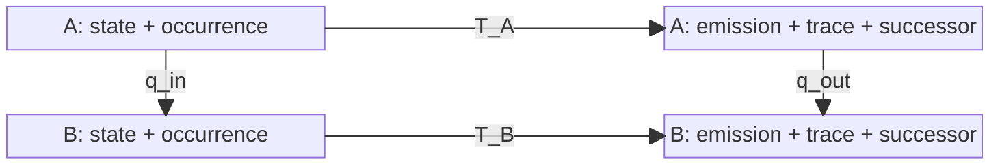
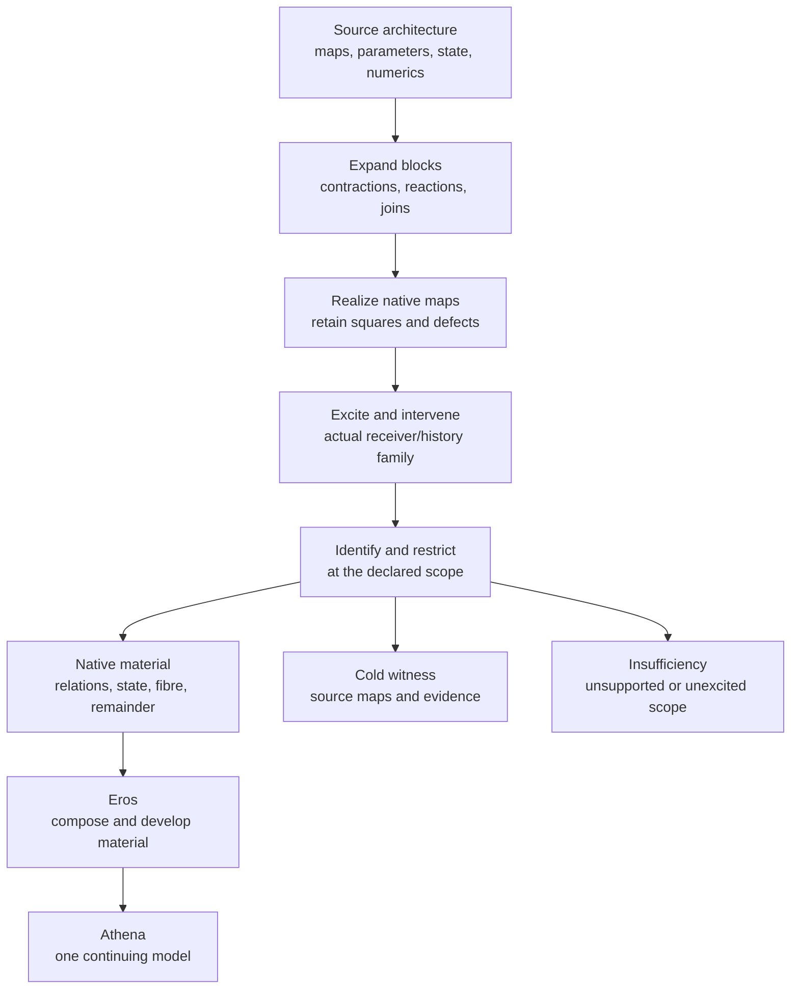

# HNN composition: section, operation, return and chart

[definition] HNN is a developing ecology of situated sections and interactions. Athena is a
particular model/ecology; Eros composes and develops it. This guide describes the shared
mathematical assembly and its actual owners. It is not a new runtime or a proposed generic
`Holon` wrapper around unrelated implementations. The [deep review](../research/records/2026-09-09_ARCHITECTURE_CHARTS_REQUIRE_COMPOSED_MECHANISMS_AND_FINITE_CONSTRUCTION_RETURNS.md)
retains direct-message provenance, architecture comparisons and the repaired formal reaction.

[interpretation] The [DeepSeek V4.1 comparison](../research/records/2026-09-10_DEEPSEEK_V41_SEPARATES_SHARED_STANDING_CONTACT_AND_CONTEXTUAL_TRANSFORMATION.md)
separates reusable material, current interaction and fresh response, and maps them to these
existing owners. Its exact local-stencil collision identifies a limit of the current conversation
source chart; its finite attention difference separates changes to transported values from changes
to their participation. This informs the existing contextual attachment work without changing AC
order or installing a DeepSeek architecture.

## The architecture as explicit passages

[definition] Brandon's September 10 clarification names **Eros** for union/composition and the
developmental phase that forms reusable material; **Athena** is the continuing model which carries
and uses that material. HNN names the architecture of the complete operation. These are roles in
one recurrence. Eros's developmental activity does not require an external verdict or a second
learning engine. The [diagrammatic research return](../research/records/2026-09-10_HNN_DIAGRAMS_EXPOSE_COMPOSITION_DEVELOPMENT_AND_SOULKILLER_LIFTS.md)
records the source inspection, categorical distinctions and concrete lift obligations.

[interpretation] This diagram specifies the full assembly to explain and construct, rather than
claiming that its whole contextual composition is already implemented. Each box names a map or
operation; arrows carry actual sections or comparisons. The local passage composes over admitted
incidence and chronology, not a prescribed universal layer count. Text, images and sound enter
through their source charts and use this same assembly.



[definition] The diagram separates the outgoing reading from the received comparison so that an
emission is not silently its own desired target. A self-emission can subsequently enter through
the same ordinary occurrence port. A comparison can also be a joined internal passage; it need
not originate in a human label. It must name its actual producer and comparands. The producing
material can belong to an earlier cut than the contemporary body; return follows that retained
production, and new deposits join only when the return succeeds. Unchanged material remains part
of the successor. Retained producing evidence is only what the particular return requires, not a
mandatory archive of all prior occurrences.

### What a local box means mathematically

[definition] One finite additive chart of the local passage is

```text
s_j = source restriction at j
c_i = restriction of actual condition standing at i
u_i = sum_(j incident to i) transport_ij(interaction_ij(s_j,c_i))
z'_i = reaction_i(z_i,u_i; M_i)
y = receiver(z').
```

The interaction, transport and reaction are declared constitutive maps, not synonyms. General
relations can return a family instead of a unique vector; joint images then retain their common
source fibre. The additive chart above is not a command to average independent marginal centres.
Connections and local spaces may change when their actual update law admits that change.

[established-bounded; source-inspected] An existing concrete binding is
`ResidentConstitutiveFibre` with `phi(s,c)=(s,c,s tensor c)`. Its material is a learned linear
relation on this lifted source and output, so its response may remain plural. The neighboring
`ResidentConditionCurrent::contact` supplies an explicit local reaction: for compatible conditions
`F=a+V`, in its declared unit-admittance real chart,

```text
c' = P_V c + (I-P_V)a.
```

It preserves the prior current's undetermined component. Empty F preserves c and returns the
scoped obstruction. `ResidentGeneratorNeighborhood::advance` subsequently forms material from
the supplied source, proposed condition and actual observation, then publishes both together.
The local linear-relation construction spans received source/output pairs; it does not invent
one separate law per observation. These statements concern that owner, not arbitrary learning.

[established-bounded; source-inspected] A different concrete binding, the current normal response,
retains `H=I+sum xx*`, `B=sum yx*` and target energy, and fits its bounded response against the exact
normal relation. `ResidentNormalWave` supplies the actual join `(p,c)->(c,c+R(c-p,c,p))`.
It must not be drawn as if its source map already included the neighborhood's mixed interaction.
The current source-field actuation and richer contextual composition gaps remain in
[CONSTRUCTION_STATE](../CONSTRUCTION_STATE.md).

### Expanding familiar Transformer block names

[definition] The following is a finite conventional attention plus gated conditional-transform
chart. It exposes the arithmetic hidden by attention and mixture-of-experts labels. Particular
architectures must supply their exact mask, scale, activation, bias, selection, normalization,
cache and residual conventions; the diagram is not a claim that every Transformer uses this
particular order. Ordinary feed-forward layers are the single-transform specialization.



[definition] `A`, `B`, `D` and the query/key/value maps are coefficient contractions;
`sigma` is the declared pointwise activation; `odot` multiplies paired coordinates. The displayed
transform is a gated family, not an arbitrary unexplained expert. Source-specific versions without
gating, shared transforms or pre-normalization change the corresponding map explicitly. Positional
transport acts at its declared query/key/source ports, and cache state is part of the complete
transition even when omitted from this single-block view.

[interpretation] This is the common comparison with HNN: source restriction and transport,
input-dependent joint interaction, combination, local reaction, retained standing and a receiver.
It does not install a Transformer as HNN's universal topology. A finite tensor contraction or
normalized contact can be a native realization of one of these maps. The particular order and
source/condition dependence explain its behavior; an architecture name does not.

## When two architecture diagrams are equivalent

[definition] Treat an architecture as a diagram of typed carriers and operations, including its
state and parameter sharing. A supported interpretation maps its generators into native passages
and preserves their composition. For deterministic charts, the comparison square is:



```text
q_out ∘ T_A = T_B ∘ q_in.
```

[definition] The state map is the same on entry and successor:
`q_in=(q_state,q_occurrence)` and `q_out=(q_emission,q_trace,q_state)`.
Otherwise this would only compare two isolated I/O faces and would not supply a continuing
architecture correspondence. Initialization, allowed occurrences and reset behavior belong to
the admitted state-machine comparison as well.

[definition] **Re-expression of the complete architecture** requires invertible compatible maps
on the admitted state, input, output and trace carriers. **A quotient or realization comparison**
may use noninvertible maps and preserves only its stated receiver/domain. **An approximation**
retains the difference between the square's two paths. Equality of a few terminal answers is a
fourth, weaker observation. These claims must not all be called architecture equivalence.

[definition] A particular realized model also differs from an architecture family. Matching one
parameter setting proves a statement about that model. Equivalence of two parameterized families
requires maps between their admitted parameter/state realizations that preserve the operations
throughout the stated family; one-way representability gives inclusion, not equivalence. Efficiency
is a further apparatus comparison even when the computed maps agree exactly.

[proved-derived; formal-checked] `HolonicRecurrentEcology.OperationRebase` already carries
equivalences of ecology, occurrence, emission and trace with this complete naturality equation.
`MachineLearningChart.DynamicReceiverChart` separately proves every ordered-word consequence from
commutation of every admitted generator and receiver factorization. Its
`quotientSuccessorTransformer_exists_iff` states the exact descent criterion: states identified by
q must remain identified after the operation. `MachineLearningStrictLift` supplies the invariant
kernel specialization and a hidden-direction counterexample. These are existing formal results;
the new diagrams do not extend their hypotheses.

[definition] At the occurrence-bearing level, an elementary passage is `X <- W -> Y` with a
receiver on W. Serial composition retains `W_f ×_Y W_g`, including the joining equality. The
category diagram must carry those occurrence maps when lineage equivalence is claimed. Parallel
juxtaposition is a product of carriers; scheduling it concurrently additionally requires actual
independence of effects and shared resources. A wire fork shares an immutable value or parameter
owner; it does not clone Athena. A feedback wire closes only through the actual successor and
chronology, not an unproved arbitrary fixed point.

[proved-derived] Exact local squares compose. If `q_Y f = f' q_X` and `q_Z g = g' q_Y`, then
`q_Z(g f) = (g' f')q_X` by substitution and associativity. This is why expanding architecture
blocks into explicit maps helps Soulkiller: it localizes each realization obligation and then
assembles their result. Shared state and mutation must already be included in those types.

[proved-derived] Two examples show the strength and limits of this comparison:

- Consecutive affine maps can fuse: `B(Ax+a)+b = (BA)x+(Ba+b)`. A nonlinear reaction between them
  generally obstructs that rewrite. Bypassing an intermediate receiver or learning return also
  needs its own preservation statement.
- Attention's query/key basis can change without changing scores: for invertible P and column
  vectors, `q'=Pq`, `k'=P^(-T)k` give `q'ᵀk'=qᵀk`. The value basis can change by invertible S
  if its downstream projection is composed with `S^-1`. Masks and chronology must travel too.
  Numerical rounding can break exact equality and belongs to the realized comparison.

[proved-derived] A finite family of pure, total local transforms with deterministic selection can
be written either sparsely or as a masked sum:
`sum_(e in E(u)) g_e(u) f_e(u) = sum_e 1_[e in E(u)] g_e(u) f_e(u)`.
This is the same output map by splitting the finite sum into admitted and excluded indices.
It exposes a routed-transform block as selection, local transformations and combination. It does
not erase the selector, convert the block into a single affine map or prove equal computational
cost. Stateful expert execution, random-source advancement and training updates require their
complete transition comparison too.

[conditional] Forward equivalence does not imply training equivalence. For a parameter rechart
`theta'=q(theta)`, equality of the two models' learning steps additionally requires
`q(U_A(theta,observation))=U_B(q(theta),observation)`, with optimizer and current state included.
Under a fixed smooth rechart, covectors pull back by `Dq*`; turning them into parameter changes
requires the transported metric. Ordinary Euclidean descent is not invariant under every change
of basis. Eros therefore needs its own commuting developmental square when equivalence of
learning, rather than inference, is claimed.

## Soulkiller lifts the expanded operations

[definition] This diagram separates faithful realization from excitation-founded restriction.
The source decomposition is executable semantics, not a new module-label taxonomy.



[established-bounded; source-inspected] The current implementation already separates these
responsibilities. `operative_atlas.rs::dismantle_full_native_operator` constructs the supported
configured Gemma text graph from explicit `NativeOperationPrimitive` nodes, coefficient populations
and carriers. `operative_segment.rs` executes those maps. Excitation/intervention and
`NativeSignatureQuotient` provide declared-family testimony; `ResidentExcitationDismantling`
crosses `soulkiller::dismantle` into productive material, cold witness and insufficiency.
The realization parser currently rejects `enable_moe_block=true`; it is not a V4.1 adapter.

[definition] Source realization uses a map i from an admitted source state into a native state:
`T_N i = i T_S` and matching observations. Restriction uses a potentially noninvertible map r
from that realization into a retained body: `r T_N = T_R r` at the admitted scope. Their composition
then gives `T_R(r i) = (r i)T_S`. Actual finite SKE evidence retains its declared exposures and
withdrawals; it is not a universal all-history proof of this stronger diagram. Eros may subsequently
develop T_R into a new operation; the old source then remains provenance rather than an equality
that the changed Athena must preserve forever.

[open] A V4.1 lift needs exact source bindings for its routed transforms, causal encoder-derived
KV, Full/Reindex/Reuse sharing, query-specific candidate populations, residual mixing, conditional
memory, numeric formats and any requested draft/verification continuation. Existing contractions,
Hadamard products, nonlinear and contact owners cover some local mathematics. They do not yet
establish the complete source graph, sharing semantics or native consumer binding. An omitted
decoder/drafter/approximate replay path must be an explicit requested scope, never an implicit
claim of full deployment equivalence. Inherited production remains deferred in the live order.

## The assembly has several distinct roles

| Role | Carried relation | Existing owner and implementation boundary |
|---|---|---|
| Situated occurrence | Actual source/target, local frame, conditions and lineage; co-presence alone is not contact | Formal `Holon`, `CausalNaturalHolon`, `AddressedPassage`; native `NativeFieldOccurrence`, emission/anchor and lineage owners |
| Section and incidence | Local values/potentials over addressed carriers; links retain orientation and actual joins | `NativeCarrierChart`, `NativeFactorizedSection`, native spool sections and field contact population; resident sections are physical storage, not semantic identity |
| Constitutive operation | Transport, interaction/aggregation and reaction using the target's prior standing | `FiniteLocalCurrentEcology`, `HolonicRecurrentEcology`; generic full-operator primitives and the separate constitutive-field law |
| Return and plasticity | Actual comparison, producing factors, covector or other derived response, metric/constitutive update and its finite successor | `SituatedLearningReturn`, `GradientProposal`, `FactorizedLinearOverlay`; field material/contact returns and full-operator local/recurrent returns |
| Receiver and compatible causes | Joint future section, declared measurement, retained Preimage Fibre and separating histories | `ReceiverTransformer`, `DynamicReceiverChart`, `CausalRelevance`, native current/fibre/material receivers |
| Reuse and scale | Restriction, rebase, generator/decoder and the future consequences preserved | Leader jets, fractal restrictions, sheaf diffusion, spool incidence, source-map/current journals and receiver-history compression |
| Realization and persistence | Device placement, exact codewords/series, residency, transfer, checkpoint and exterior presentation | `ResidentSurface`/passages, source/rest owners, `NativeSavedSession`, alpha checkpoint, tensor/ONNX intake/export charts |

[definition] These are responsibilities within one operation, not seven sequential engines.
The successor includes changed state and morphology. A readout, borrowed producer or receiver
view does not clone that owner. An older frozen-morphology chart remains a valid comparison
without defining inference universally as frozen morphology.

## Local standing is part of reaction

[proved-derived; formal-checked] In the finite homogeneous chart,

```text
current(target) = sum_source J(morphology, occurrence, state, target, source)
next(target) = R(morphology, occurrence, target, state(target), current(target)).
```

`FiniteLocalCurrentEcology` now carries both arguments to R. The graph specialization previously
substituted zero for `state(target)`; it is repaired. Complete graph update/relabeling and the
no-contact retention control are verified. This chart does not require a universal scalar local
state: its Carrier is a parameter, and dependent carrier/shape transport has its own existing
owner. Native field kernels do not acquire a new reaction merely because the formal signature
has been corrected.

[definition] A finite paired reflection is one constitutive choice. A state-conditioned contact
is another. A joined product, a nonlinear local response, a retained-state update and an exterior
receiver are mathematically different operations. The model assembly must say which actually
occurs and how it affects later conduct. Listing all as “phase transport” hides their differences.

## A tensor is an operation chart, not just a file payload

[definition] For a finite admitted family, a linear transport has a matrix chart; a multilinear
interaction contracts a tensor product; a general neural map composes these with local reactions
and state. For example, pairwise compatibility, value transport, a normalized ratio family and
reaction can form an attention chart. Translation-tied coefficients form a convolution chart.
Sparse incidence forms a graph chart. Retained state plus observation forms an SSM chart.
None supplies the entire model merely by assigning it that architecture's name.

[definition] `NativeOperationPrimitive` already includes contraction, causal contact, Hadamard
product, addition, nonlinear response and rebase. `NativeOperatorNode` records their incidence
in the admitted full-operator chart. These owners demonstrate an executable mathematical graph;
their inherited configuration, supported shapes and local law restrictions remain explicit.
They are not to be copied into an unrelated second graph system or installed as an entire
Transformer inside native Athena.

[definition] The common comparison is a source-qualified realization map. A coefficient tensor
and its axes can be projected or reindexed while preserving the operation; a lossy projection
retains its complete defect and admitted receiver scope. Safetensors stores those coefficients;
ONNX may serialize their operation graph. Soulkiller recovers and restricts productive operations
and returns native material plus a cold witness. Eros develops the material. Export makes the
opposite comparison on an actual target graph; storage round trips alone do not perform it.

## The missing native attachment is explicit

[established-bounded; source-inspected] The existing field and full-operator paths already share
resident-section execution apparatus. Their semantic assemblies differ. The active field
selects a material source from `NativeMaterialTransportSource` and uses a paired constitutive
law. The full operator assembles a richer word of generic primitives but retains its supported
source graph and artifact dependencies. The `holonics` facade exposes both owners; it does not
make their model states interchangeable.

[established-bounded; implemented-exact] The [first finite native assembly](../research/records/2026-09-09_AC1_AC2_THE_HOLON_FIELD_OWNS_ASSEMBLY_AND_OBSERVED_RETURN.md)
now uses the existing `OperativeContextual` feature `Q(1,s) tensor Q(1,c)`, where c is the actual
operative standing including interior current. Its material factors, joint source/condition
pullback and producing paired return retain their original scope. This is recovery and
composition of existing mechanisms, not the installation of a new nonlinear law.

[historical] The field/model wrapper and byte-cultivation adapters were
[removed from the live SDK](../archive/implementations/2026-09-09-byte-field-cultivation/README.md).
The [representation audit](../research/records/2026-09-09_THE_BYTE_CLOCK_AND_OCCURRENCE_EXPANSION_ARE_NOT_GENERATOR_CULTIVATION.md)
records why generic API factoring, per-occurrence material and source archive persistence did
not establish productive generator organization. Their local comparisons remain evidence.

[definition] The first replacement attachment uses the existing `ResidentConstitutiveFibre`
as local learned generator material. Its relation basis carries source/condition conduct and
its full receiver fibre; independent relation formation, not occurrence count, changes rank.
`ConstitutiveFibreRest` adds validated rest/remount of that law without the observation population.
Current returns compose through the existing resident current ports. A whole HNN must still
compose these local generators, incidence, nonlinear response, scale and applicable fibres.

[established-bounded; implemented-exact; computational-witness] The [joint-family return](../research/records/2026-09-09_LEARNED_GENERATORS_COMPOSE_THROUGH_JOINT_FIBRES_AND_RETURNS_REFINE_THE_SOURCE.md)
now supplies composition through plural currents: the source and receiver remain actual objects,
their joint affine fibre preserves correlation, and partial source coverage is explicit. A
downstream observation restricts the source through that joint object. The original-condition
check permits its returned constraint to meet existing actual condition current; the prior
current determines the still-free component. This changes subsequent native conduct without
selecting an external cause or retaining a chain of past image/current objects.

[definition] `ResidentGeneratorNeighborhood` now composes those local owners around an explicitly
shared condition field. The particular law supplies dependence; membership supplies no coefficient.
Its received passage prepares condition reaction, forms local material, and publishes the complete
successor under one move owner. This is a declared neighborhood chart, not a claim that every Holon
contacts every other Holon. Its rest separates applicable laws, actual current and latest received
constraint evidence. Wider incidence, scale changes and source attachments retain their own maps;
the local construction does not replace them with a source archive.

[definition] `ResidentNormalMaterial` attaches the already-derived accumulated normal response
to resident current operands. It retains exact source geometry and cross-source phase, with
fit discrepancy separate from numerical solve error. Its reports retain the complete bounded
response, and its update stages the existing normal calculation before publication. The actual
source/receiver chart still determines what a supplied observation means; this objective is not
an authored semantic score or proof that an observed response is a correct answer.

[definition] Whole-section input now uses `ResidentConstitutiveSection` and the generic local
difference receiver. `receive_section` fits the common successor after all supplied observations;
it does not install a new source coordinate for each observation. Its returned before/after
fields retain actual operator cuts. Bounded outputs can enter the normal current port intact.
The exterior Unicode/symbol-basis attachment is one declared source chart; its local stencil
does not define every medium's geometry or all language context.

## Partial conduct and comparison

[definition] Useful restricted behavior can arise before every mechanism learns or every chart
commutes exactly. Compare the actual dependency being exercised: local sensitivity, preservation
of standing, conditioned interaction, acquisition of an observed relation, later reuse or
response under a changed circumstance. Derivative checks establish the differentiated map;
learned behavior establishes its observed scope. Neither is replaced by prose quality, entropy,
the number of tests or a requirement to return through the entire history.

[proved-derived; formal-checked] `ChangingReceiver.passageDefect_comp` preserves an exact
nonlinear finite defect and `norm_passageDefect_comp_le` transports its norm under a declared
bound. This allows an approximate chart to carry a receiver tolerance through a finite
continuation. Exact every-word commutation belongs to the stronger exact compression claim.
Neither theorem demands that all compatible causes be individually enumerated or identified.

[definition] Text, audio and visual material meet this same assembly through different source
and receiver charts. A byte boundary, PCM sample clock or raster/mesh coordinate does not found
the native interaction class. The Apple temporal owners offer actual section/clock/condition
construction to compare. Bringing their physics or codecs into a new model requires the actual
source law; the shared abstraction alone does not establish a multimodal learner.

[definition] The [blueprint](plans/THE_ATHENA_ALPHA_CULTIVATES_GENERAL_CONVERSATION_THROUGH_NATIVE_CONTEXTUAL_TRANSPORT.md)
defines finite construction returns; [the roadmap](plans/THE_ROADMAP.md) orders them and
[CONSTRUCTION_STATE](../CONSTRUCTION_STATE.md) states the current position. The product ambition
persists across those returns and does not turn each local research question into a requirement
to complete general intelligence.
