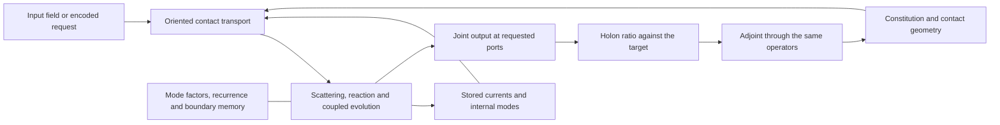

# HNN formula: the law `holonics::hnn` implements

[project-postulate] This guide states the HNN law. Rebuild step 4 implements it in
`holonics::hnn`, over aeons ([THE_REBUILD](plans/THE_REBUILD.md#order), #73); step 5 realizes
it on the card in `holonics-cuda::hnn`. Neither module exists yet. [THE_MACHINE](THE_MACHINE.md)
states the object, and the [elementary objects](ELEMENTARY_OBJECTS.md) own the vocabulary.
The HNN is the compression machine at scale ([the line](plans/THE_REBUILD.md#the-line-the-rebuild-serves)):
- its retention is the kernel quotient of Holonic Compression, the future-sufficient quotient
  taken at aeon boundaries;
- its learning is locating keys: navigator configuration inferred by loop closure;
- its release is the split between resonating (RIDE) and emanating (FOUND).

Its field is chains of complex parametron rings joined by helical pair contacts. Athena is its
first intended product; Eros names the collective formative organization and the composition
within each of its Holons. Perception, internal generation and outward expression use the same
source/current/material/receiver construction.

[established-bounded; source-inspected] A prototype realized parts of this law. At
[`13f8c734`](https://github.com/brandonrdug/holonics/tree/13f8c734) its body is under
`crates/holonics-cuda/src/hnn/` and its constitutive field under
`crates/holonics-cuda/src/native_ecology/constitutive_fibre/field/`; the
[lessons record](../research/records/2026-09-24_LESSONS_FROM_THE_WORKBENCH_AND_ATHENA_PROTOTYPES.md)
keeps what it did and did not achieve. Step 4 ports its equations one law at a time, never its
per-occurrence tape, frozen-cut replay, update journals, slot/session wires, byte or nibble
codecs, or whole foreign Q/K/V graphs ([rules](plans/THE_REBUILD.md#rules-of-the-rebuild)).

[definition] A Transformer is also executable generating mathematics. Its architecture supplies
compositions of contractions, attention, reactions and normalizations; its parameters and
execution state supply their contemporary operands. HNN generalizes the organization and
representations of such operators. It does not add a further faculty between computation and
intelligence. Safetensors, an ONNX graph and a saved field serialize different portions of an
executable system; the model specification says which laws interpret that data.

[project-postulate] The [constraint-mode and active-face contract](CONSTRAINT_MODES_AND_RECEIVER_FACES.md)
governs the notation below. `exp`, phase/π, log, Gamma and named constants refer to their
normalized generating constraints, branches and periods; a float is only a receiver face. Exact
rational scales, units and integer grades/counts remain typed. The observing Holon participates
through its current/material/frame coupling; the GR, stress, gyro and conservation relations are
part of this construction, not excluded by its software realization.

## 0. The governing composition

[project-postulate] Brandon's context, generation, tokenizer and multi-token rulings govern the
formula and are the design input to step 4. The
[composition guide](https://github.com/brandonrdug/holonics/blob/13f8c734/docs/HNN_COMPOSITION.md)
stated them first.

### Context is a situated causal boundary

[project-postulate] Brandon, September 13: context is the situated boundary over intersecting
trees of events, with the material and flux that make their continuation possible. A text
prefix, a condition port and an instantaneous array each present one face of it; none defines
the causal situation.

[definition] On an admitted event-order chart take a **causal past** `P` closed under
predecessors. Its **cut** exposes the incidences crossing `P` and the retained interfaces to its
interiors. Intersecting branches join through their actual shared occurrence/port maps, carrying
their joint constraints, phases and clock comparisons. At receiver `F`, context is the
**restriction** of that cut to what can participate through the admitted transport and future
receiver family. It is defined over the occurrence diagram: no global synchronized lattice and no
store of every ancestor. The restricted boundary carries its medium's current, storage,
constitutive response, changing incidence and the interior return that continuation needs, so a
small exterior face can have nested dynamics. A local law's source restriction `s` and condition
`h` are operands of that law, not definitions of context. Owners:
`Foundation/AddressedBoundary.boundary_join` (cancels the matched middle face by its pullback
equality) and `Transport/WorldTube.ClockedSpan.comp` (keeps both clocks, faces and obstructions).

### State-space, convolution and diffusion are one realization

[proved-derived] The recurrence `x_(k+1)=A x_k+B u_k`, `y_k=R x_k+D u_k` gives by induction

```text
y_k = R A^k x_0 + Σ_(j=0)^(k−1) R A^(k−1−j) B u_j + D u_k,
Σ_(j≥0) R A^j B z^j = R(I−zA)^(−1) B          (formal series, or on its convergence domain).
```

A retained interior, a causal convolution kernel and a rational resolvent encode one boundary
response; initial standing contributes its separate transported term. Varying maps replace
`A^k` by the ordered transition product, and the kernel then depends on both positions. With
constant coefficients, eliminating `z` from `ẋ=Ax+Bz+f`, `ż=Cx+Dz+g` gives the boundary operator
`sI−A−B(sI−D)^(−1)C` with source `x(0)+f̂+B(sI−D)^(−1)(z(0)+ĝ)`: dynamic Schur response, interior
memory and SSM resolvent are three representations of one coupled equation, and the initial
interior survives each. Owners: `Computation/HolonicArchitectureCharts`,
`Physics/ReflectedBoundaryMemory`. S4 evaluates the resolvent by structured Cauchy kernels;
Mamba's selective maps need the ordered product. Neither prescribes the HNN's topology.

[definition] **The diffusion clocks.** Deterministic diffusion conducts a field through its
constituted evolution; probabilistic diffusion conducts a source measure through transition
kernels; generative denoising carries an initial field toward product receivers by an evolution
formed from data and constraints. Its refinement index, event clock, physical clock and wall
clock are distinct clocks, and none is an output-token index. Put the initial field and every
later sampling innovation into one complete source `ξ`. Conditional on `ξ`, the realized
trajectory is `Γ_(Θ,b)(ξ)`, and the output measure is the pushforward of `ξ`'s measure through the
product receiver. Noise, deterministic execution, retained preimages and probability each keep
their place; an arbitrary forward diffusion has no inverse, and denoising is not a physical
reversal of the source events. `Computation/HolonicDiffusionCharts` proves finite Markov
composition and expectation transport, with a collapse example separating a forward kernel from
an inverse.

### Joint prediction is a boundary section of the future

[definition] For a source family `F` and admitted complete transitions `T_j`, the prospective
joint receiver is

```text
Γ_m(F) = {(ρ_1 T_1 x, ρ_2 T_2 T_1 x, …, ρ_m T_m ⋯ T_1 x) : x ∈ F}.
```

Each `T_j` carries the current, material, incidence and clock of its actual passage; the family
shares its producing variables. A requested output may be a spatial field, several future faces,
a section of a trajectory or a text block. A one-token and a multi-token receiver choose
different faces of `Γ_m`; neither defines its interior. Independent future-token heads over shared
material ([Gloeckle et al.](https://arxiv.org/abs/2404.19737)) do not by themselves specify the
joint correlations. **Generation refines the joint field and releases its boundary; it is not a
sequence of token predictions.** Scheduling several outputs together needs their dependency map.
Prediction is the prospective image of the admitted future family
([release record](../research/records/2026-09-12_PREDICTION_IS_PREPARED_TRANSPORT_AND_RELEASE_IS_BOUNDARY_CURRENT.md)):
a current can be output-null now and potent under a later admitted action, and probability
measures unresolved source conditions through the deterministic pushforward.

### The grain is derived from the interaction and the receiver

[definition] A polarized distinction is a binary state in a declared frame; its changes compose
into oriented passages with actual joining conditions, clocks and receiving faces. **A chord
class and a performance are different receivers of one source**: voicing, timing, phase,
instrument and spatial coupling vary behind one class face, and a progression keeps its ordered
joining. Receiving a coherent sum gives `|Σu_j|²=Σ|u_j|²+2 Re Σ_(j<k) ū_j u_k`; separate
magnitudes omit the cross terms ([music record](../research/records/2026-09-14_HEAR_THE_MUSIC_SITUATED_RELEASE_AND_SELF_MOTION.md)).

[proved-derived; formal-checked] A receiving family defines which differences may be
collapsed. For additive transport the criterion is preservation of the joint blind subgroup
(`JointReceiverDescent.joint_generator_descends_iff`); `ReceiverHistoryCompression` extends the
square through ordered words without enumerating histories.

[established-bounded; source-inspected] The
[clocked torus](../research/records/2026-09-08_CLOCKED_TORUS_CURRENTS_CONTINUE_THROUGH_A_RETAINED_FIBRE.md)
shows derived grain: four cut and two face coordinates give `j=Jq+Dz+r`, `Cr=Dᵀr=0`; the grain
six is the rank of `[J D]`, and the active Gram modes `3` and `5` are the eigenvalues of
`DᵀD=[[4,1],[1,4]]`. It prescribes neither six universal channels nor a byte-derived grain. [proved-derived] A
participating receiver reads `y=ρ(x_S,x_R,t)`, so `ẏ=D_Sρ F_S+D_Rρ F_R+∂_tρ`.

### Holonic Encoding

[definition] **Holonic Encoding** is the HNN's counterpart of tokenization: the situated
formation and reuse of causal transformation representations. An encoded constituent carries
addressed ports, joining incidence, conditions, chronology, its receiver/decoder and its Preimage
Fibre. Its grain can be a path, a loop, a coupled field or a region; overlapping grains stay
available through their shared occurrences. A serialized symbol handle is an exterior face.

[project-postulate] Brandon, September 11: the operative grain is **recurring transformation**,
and the encoding is general across modalities
([record](../research/records/2026-09-11_HOLONIC_ENCODING_RETAINS_TRANSFORMATION_GRAIN_ACROSS_MODALITIES.md)).
Text, vision, acoustics and motion supply different source/receiver charts to the same field.
BPE/path folding and autoencoding inform the construction; global frequency, a permanent
segmentation or an authored classifier does not found it. Byte and nibble codecs are not Holonic
Encoding.

[definition] Static reconstruction `D E=ρ` and continuing conduct `E_next T=U E` are separate
comparisons; a partial learned relation keeps its comparison and compatible family. The source
enters through `E` as phase-carried moments (below), and an ordered source word is a navigator's
address (`Transport/SourceMoment`). The complex parametron keeps quadratures and coupled
incidence before any phase/sign/intensity receiver, so encoding keeps real timing and receiver
orientation; it assigns no pump frequency to a character and imposes no torus on every datum.

### A tensor is an operation chart

[definition] For a finite admitted family a linear transport has a matrix chart, a multilinear
interaction contracts a tensor product, and a neural map composes these with local reactions and
state. Pairwise compatibility, value transport, a normalized ratio family and reaction form an
attention chart; translation-tied coefficients a convolution chart; sparse incidence a graph
chart; retained state plus observation an SSM chart. None supplies the model by the name of its
architecture. A coefficient tensor can be projected or reindexed while preserving the operation;
a lossy projection keeps its complete defect and receiver scope. Safetensors stores coefficients
and ONNX serializes an operation graph. Equation extraction reads a foreign realization's
operators as element relations, interconnection and navigators of a Holon and returns native
material with a cold witness; export is the opposite comparison on an actual target graph.

## Reading the field architecture diagram

[definition] The [situated navigator/action relation](HOLON.md#situated-generator-inference-dormant-modes-and-action)
also reads this model inversely: from the compatible source family and a receiving constraint,
infer the applicable conditions, navigators or controls. A changing receiving Holon supplies part
of that source rather than being replaced by a desired inscription. Retained material supports
dormant availability between active modes; its future action and receiver descent determine what
compression may discard. Recurrence and homeostasis refer to the constituted driven dynamics,
with storage, flux and dissipation in their actual units.

[definition] The operands are organized by the
[helical pair interaction](HOLON.md#the-helical-pair-interaction-unit). A declared representation
maps a geometric passage into current transport `U_(F←G)`; a configuration chart maps the
resident state into the spatial pair receiver. The field difference `Δ_i=U_i q_i−q_r` and the
spatial separation `Δ=x_a−x_b` keep those chart maps explicit. Participation consumes the full
pair face and its complete differential: `PairQuadranceJet::pullback`
(`holonics::geometry::screw`) supplies the scalar-`Q` parameter term, and the feature
`(Δ,Q,DQ)`, chart, material and clock variations add their own. The group return `A⁻¹FA` agrees
with an inverse/adjoint only under the declared isometry; the field keeps its actual derivative
adjoint.

[definition] **The source enters as moments.** A source passage drives the continuing machine.
On an admitted linear source chart it accumulates

```text
m_g = Σ_k Ĝ_g(τ_g(k))⁻¹ E_g(u_k)         (Ĝ_g the navigator's transport, τ_g its clock)
```

and the oriented pair moments `M_gh(δ)` at offset `δ`, keeping the decoder, the source fibre and
the future-action/injection square. A response position reads `y_j=ρ_R(Ĝ_R(τ_R(j))q)` through a
separately tagged phase binding. The adjoint of the moment needs no tape: the position adjoint is
`g∘U^(n−1−k)∘I` (`Transport/SourceMoment`). Navigator count is independent of source length;
ingestion, exact bit growth and retained source defects keep their own costs.

[definition] The [helical elementary realization](HELICAL_GEOMETRY.md) makes one geometric
instance explicit: Lie generators and initial points, frame transport, the pair contact
differential, its geometric second variation, and a quadratic receiver that factors through the
moment owner. `holonics::geometry::screw` supplies it exactly; it is an instance, not a
replacement architecture. The constant-navigator case supplies a finite reusable receiver
recurrence when the descent equation holds; changing navigators keep the `ChangingReceiver`
defect instead of deleting the interior.

[definition] The prototype's
[continuing-field construction](https://github.com/brandonrdug/holonics/blob/13f8c734/research/experiments/hnn_field_architecture/CONTINUING_FIELD.md)
evolved `(ψ,H,Φ)` before reception: complex-current contact and heat return, thermal exchange and
current-dependent nonuniform transport, with the same `Φ` carrying the toroidal supports, phase
plates and reconstruction ([received cut](https://github.com/brandonrdug/holonics/blob/13f8c734/research/experiments/hnn_field_architecture/continuing-field.png)).
The [receiver-holarchy construction](RECEIVER_HOLARCHY.md) specifies the observing Holon, its
world tube, frame, aperture and internal current. A fixed-frame volume view supplies the source
term `ρ_R ẋ` while `R` is held; receiver motion composes with it through the chart-rate law and
cannot substitute for it. The drawn tori realize circulation and overlap; they do not assert that
every Holon has genus one or that tensor rank equals visible dimension.

| Familiar diagram component | HNN operation in this same field |
|---|---|
| Embedding / encoder | Holonic Encoding: map an occurrence into situated current/field sections with declared axes, basis and source conditions. Text, images, acoustics and motion have different exterior maps into these ports. |
| Query/key comparison | A source-conditioned comparison on admitted contacts. Its comparands, pairing, phase and geometry specify the potential; co-presence alone does not establish contact. |
| Values / attention | `T_F[Ψ]=Σ_G a_FG[Ψ] U_(F←G)[Ψ] Ψ_G`. Normalized participation and transported current are both differentiated. |
| Heads and layers | Families of local/modal operators and their composition on the same object. Overlap, recurrent paths, changing material and nested scales replace a mandatory global stack. |
| SSM state | Constitutive interior and retained navigator modes. A fixed linear interior yields its evolution operator and boundary memory kernel; a changing interior keeps its actual dynamics. |
| Diffusion / refinement | Evolve a joint field against its conditions and constitutive operators. The refinement clock is not an output-token index. Stochastic corruption is one exterior comparison chart, not a mandatory native noise source. |
| Decoder / output | Reconstruct a jointly supported field and read its receiving boundary: text section, image, acoustic interval, motor command or another internal Holon. Streaming exposes available portions under their dependencies. |

[definition] A local current section has type `Ψ_F∈Γ(U_F,E_F)`, where the fibre `E_F` can be
complex, vector- or tensor-valued; a transition acts on that fibre over the actual overlap. The
plotted surface, the section's tensor axes and the navigator's phase coordinates are distinct
dimensions. Fractal return/preimage geometry belongs to the evolving object and its scale family,
not to tiles copied beside it. The
[four-paper synthesis](../research/records/2026-09-14_TRANSFORMER_FIELDS_TROPICAL_CELLS_AND_FRACTAL_GENERATORS.md)
connects the field/reaction view of transformers, finite-temperature attention geometry, operator
splitting and recursive basin structure to these operations.

[definition] These correspondences overlap within one Holonic Interaction; they are not three
transformer/diffusion/SSM engines added together. The complete model is `M=(K,Θ,x)` below. In a
fixed local carrier an admitted constitutive chart expresses `ẋ=F_(K,Θ)(x,h)` and
`Θ̇=G_(K,Θ)(x,h,returned_difference)`; combinatorial changes of `K` use their actual
incidence/transport maps rather than a time derivative of a cell label. Whole-field generation
follows the dependencies of the requested release and need not expand or settle every offscreen
degree of freedom.

[proved-derived] A fixed-linear interior `ż=Az+Bx` gives the received memory term
`C E((t−s)A) B` after elimination: an SSM/convolution face of the continuing interior. The
[fluid construction](HOLONIC_FLUID_CONSTRUCTION.md) keeps its changing-chart residual, nonlinear
microscopic feedback and additional stress; a stateless layer diagram would remove an actual term.

[definition] The normalized contact return is
`δT_F=Σ_G a_FG δ(U_FG Ψ_G)+Σ_G δa_FG U_FG Ψ_G`. A nonlinear reaction, including a sigmoid chart
where admitted, acts locally on the same current/material. Bilinear contractions are elementary
vertices; propagators carry the actual chart/phase maps. A drawn crossing has no interaction
vertex unless the source supplies contact. Delayed observation is an ordinary dependency: a
comparison cannot consume an observation before it arrives, and an output needs no new learning
event.

[definition] The [ecological roles](https://github.com/brandonrdug/holonics/blob/13f8c734/docs/HEPHAESTUS_AUTOMATA.md#ecological-roles-as-generator-relative-characteristics)
integration, separation, retention and release are read from the actual navigator, source and
receiver, and can coexist in this field. The discrete rate form `T*G_next T−G`, or the continuous
form `A*G+GA+Ġ`, ties that reading to its metric and clock. Both forms are Hermitian, so their
content is a signature under congruence (`holonics::inertia::{inertia, congruence}`), not an
eigenvalue or a score. One navigator can contract one direction of the field while expanding
another, and a chart change carries that reading exactly.

## 1. The model, its dynamics and its output

[definition] Use the [encapsulated Holon operations](HOLON.md#high-level-holonic-interactions):
chart-presented tensor kets `|H⟩_F`, receiver bras `⟨r|`, operator application, tensor
interaction, contraction and adjoint variation. The tuple below is the model's state
specification, not its computational notation; interaction diagrams carry these objects on
oriented lines with their actual maps at vertices.

[definition] Write the situated model as

```text
M = (K, Θ, x),                 y_F = ρ_F(b_H(x)).
```

`K` is the oriented contact complex, including its boundary ports and chart transitions; `Θ` is
the constitution; `x` contains the active currents and internal modes. Their representations may
be sparse sections, tensors, factors, recurrences or correlated parameter families. `K` is not a
semantic classifier. The components need not share one shape, one spatial grain or a universal
clock; at an interaction, the joined ports determine which restrictions participate.

[definition] The parameters of `ρ_F` can belong to another participating `H_R`, whose state is a
nested component of the joint model or part of the coupled environment `h`. Receiver motion and
material response then contribute to the receiving differential; a fixed readout matrix is the
specialization where those operands are fixed. `b_H` is the outwardly available field/current at
the selected boundary. Another internal region or an exterior system can receive it; it need not
be a requested message. The [computational Holon](HOLON.md) supplies the object and its operator
contract.

[definition] The executable model is a composition of actual operators:

```text
x ↦ boundary injection
  ↦ incident transport and interaction
  ↦ constitutive reaction and internal dynamics
  ↦ requested output projection.
```

An implementation instantiates the maps below; the arrow labels alone are not a model. Repeated
or recursive compositions act on the same material and can return a joint field, trajectory or
text section. Material changes between or within compositions through its specified variation. A
public input selects a task and output ports, not a different learning engine. A speculative
output and a committed step evaluate the same law with their respective ownership effects.

### Generation as field refinement and boundary radiation

[interpretation] The diffusion/embroidery reading concerns **how the pattern is formed**. The
receiving medium, existing structure, crossings, phase and material response participate in that
formation. Local transport and integration organize a larger pattern and change its further
admissible motion. A "contextual task" is an exterior application description, not a native
category that selects an answer mechanism. Text, image, acoustic and motor output are received
faces of the same construction.

[project-postulate] Generation develops a joint field or configuration through the model's
constituted dynamics. Its refinement clock is not an output-token index. Streaming may expose
available parts, but never replaces joint generation with independent per-coordinate
predictions; a text codec cannot schedule the model's evolution.

[definition] Let `ξ` parameterize a prepared latent/partial field and `h` the restricted
environment, internal material and boundary data. A generative chart is

```text
x(τ₀)=I_h(ξ),
∂_τ x = F_(Θ,K)(x,h,τ),
y_F(τ)=ρ_F b_H(x(τ)),
u_B=C_(B←H) b_H(x).
```

`F` is composed from transport, constitutive reaction, inference/score and integration operators;
its signature alone does not implement it. `C` is an actual coupling to another region, possibly
within the same larger model. Local evolution can use stored currents and internal clocks without
a fresh exterior message.

[definition] Classical denoising diffusion uses the corruption chart
`x_t=√ᾱ_t x_0+√(1−ᾱ_t) ε` and the variance step `x_t=√(1−β_t)x_(t−1)+√β_t ε`; a learned
noise/score field drives refinement of the whole latent field, and DiffWave refines whole
waveforms without autoregressive samples ([image diffusion](https://arxiv.org/html/2006.11239v2),
[acoustic diffusion](https://arxiv.org/html/2009.09761v3)).

[conditional] For the forward SDE `dx=f dt+g(t) dW`, an exact score and the density/regularity
hypotheses give the probability-flow ODE `dx=[f−(g²/2)∇log p_t]dt`. Integrating from the prior
end gives the same one-time marginals as the SDE, not the same stochastic paths or a unique
historical input. It is a deterministic generative realization, not a requirement to add a
sampler to every native operation ([score-based construction](https://arxiv.org/html/2011.13456v2)).

[definition] The initial latent may be a supplied noise realization, structured modes or an
unresolved joint family. Zero current, an unseen region, uncertainty and stochastic noise are
different operands. Heat smoothing alone does not synthesize a learned distribution; the refined
constitution supplies its structure. Known observations constrain their coordinates while
generation continues elsewhere without a singleton causal preimage.

[project-postulate] The consumer takes a whole section family, its refinement law and boundary
constraints, and emits the joint generated section. Image/acoustic arrays and symbolic sections
enter through their shape/transport maps. A two-current wave chart and a character readout are
local specializations, not the generation algorithm.

[proved-derived; formal-checked] `Holon.ofEvolution` realizes generation in the elementary
Holon type. Its encoding theorem equates full and reduced generation when their maps commute;
its composition equivalence carries one latent population through two refinements. Neither needs
a trajectory archive or independent output marginals.

### Bounded exact transport-family inference

[established-bounded; source-inspected] A finite deterministic construction shows how an exact
returned operator causes a richer declared family, leaves some predictions open and determines
others. Its inherited passive chart is `A₀(τ)=I+τL`, with symmetric passive graph Laplacian `L`.
At a positive rational interval the returned operator belongs to that chart only if it is
symmetric, has nonpositive off-diagonal entries and unit row sums. Otherwise the exact symmetry
and unit-row residuals are kept: asymmetry declares oriented skew-pair transport, a nonzero
unit-row residual declares diagonal standing/reaction, and a positive symmetric off-diagonal part
declares active symmetric transport.

The enriched family is `A(τ)=M+τ(S+K+R)`: positive diagonal receiver capacity `M`, symmetric pair
carrier `S` (whose signs distinguish passive and active terms), oriented skew pair carrier `K` and
diagonal reaction `R`. A first complete operator fixes the off-diagonal pair terms and leaves the
capacity/reaction split open on the diagonal. A receiver question is the exact functional
`y=rᵀA(τ)φ`. On a nonempty compatible parameter fibre it is determined exactly when its variation
vanishes on every unresolved kernel direction; otherwise the two models separated by that
direction return different values, so an exact distinguishing observation exists.

[proved-derived; formal-checked] `Transport/GenerativeTransport` proves the time-affine interval
identity and the kernel criteria for invariant and distinguishing linear predictions. The July
prototype's basis scan, held-out grade at `τ₃=τ₂+1` and four-receiver evidence are in the
[July record](../research/records/2026-07-27_THE_OBSTRUCTION_CAUSES_THE_FAMILY_THE_OPEN_FIBER_PREDICTS_BEFORE_IT_CLOSES.md),
which also records that its observations belong to one implicit fixed receiver family.

### One object, its charts and its recursive geometry

[definition] A computational Holon is the same situated field across its local, modal and
receiver charts. Let `K` be its oriented cell incidence, `Γ(K)` the compatible sections and `Φ_Θ`
the nonlinear operation on current, material and geometry. A restriction `r_α` gives
`|H⟩_α=r_α|H⟩`; compatible restrictions on an overlap are related by its declared transition. A
head reads/transports such currents. Composing heads, reactions and time steps acts on the same
Holon; a layer diagram is an execution chart, not a set of physically separated planes. If local
restrictions do not close dynamically, keep the coupling, interior modes and residual.

[definition] The carrier can have toroidal cycles, curved transport tubes and overlapping domains,
with higher cells recording their joints. `holonics::complex` validates cell complexes with their
connection incidence and curvature; connection/holonomy owners transport current around actual
paths. A torus is not a generic hypersphere, and an aggregate intensity isosurface does not expose
all of its constituent cycles. Interlinked cores, intersecting support domains and actual
constitutive contact are specified separately.

[definition] Fractal geometry can arise within the invariant, survivor or receiver-arrival
populations while the number of state axes stays fixed. For a recurrence `Φ` and receiving region
`A`, the **first-arrival** populations are

```text
A_0=A,
A_(n+1)=Φ^(−1)(A_n) \ A,
x∈A_n  iff  Φ^[n](x)∈A and Φ^[k](x)∉A for every k<n.
```

[proved-derived; formal-checked] `HolonicRecurrentEcology.FirstArrival` proves that
characterization and its covariance under a state-chart equivalence. Preimage here means all
compatible initial conditions, not reverse time or a chosen inverse. Stretching, folding,
passage near saddles and restriction produce fine interleaving; a finite picture neither proves
infinite-scale fractality nor replaces the recurrence.

[definition] The [analytic flux and receiving-basin construction](ANALYTIC_FLUX_AND_RECEIVING_BASINS.md)
binds that recursion to a holomorphic source: `f_s v=−f`, its enclosed release and derivative,
the complete preimage equation and certified receiving neighbourhoods. For a changing source the
law is `F_s v=−F−u̇ F_u`; backward heat joins it to the RH zero motion.
`Mathematics/AnalyticReceiving` binds the operation to `Holon` and clocked first arrivals;
`holonics::geometry` supplies the exact enclosure and capture operations. These realize field
refinement without making Newton dynamics every HNN's constitution; their logarithmic one-form
and contour periods connect potential/phase circulation to the Hodge owners.

[definition] A basin figure uses a declared family `z(a,b)=z₀+a u+b v` or a valid manifold
section; its coordinates label initial conditions for **one** full recurrence. Its trajectories
live in the full state space, and a zoom recomputes the restricted family rather than placing
copies of the model in a grid. Nonlinear dynamics need not be globally contractive. Carrier,
phase-space, fractal and effective-receiver dimensions are separate: box dimension is
`lim_(ε→0) log N(ε)/log(1/ε)` where it exists, and an uncertainty fraction `f(ε)~ε^α` gives
section-boundary dimension `d−α` only under its sampling and scaling hypotheses.

[established-bounded; computational-witness] The prototype's
[intrinsic phase-field reference](https://github.com/brandonrdug/holonics/blob/13f8c734/research/experiments/intrinsic_holonic_flow/README.md)
built six interlinked toroidal domains, a conforming volume subcomplex with shared contact cells
and a twelve-phase nonlinear map, evaluated outside the native runtime. It is a supplied analytic
constitutive example, not a trained model.

[proved-derived] The linked carrier admits a concrete incompressible material motion. At unit
nondimensional density put `u=(0,−χxz,χxy)`, `p_hyd=χ²x²(y²+z²)/2`, `f=(χ²x(y²+z²),0,0)`. Then
`div u=0`, `Δu=0` and `(u·∇)u=−∇p_hyd+f`: a local forced Euler/Navier–Stokes field for any
constant viscosity. Its flow is `F_t(x,y,z)=(x, y cos(χxt)−z sin(χxt), y sin(χxt)+z cos(χxt))`,
with determinant one and inverse `F_(−t)`; advecting the tori and every shared cell by the same map
preserves linking, incidence and containment. The reference uses `χ=1/8`, `0≤t≤1`. A circulating
point has velocity `u(F_t X)+DF_t·Ẋ`; omitting either term separates internal motion from the
material carrying it.

[definition] In that reference `q,p∈T^6`, `s^h_ij=β_h cos(2π(q_i−q_j−φ_ij))` on the admitted
incidence, `a^h=softmax(s^h)` and `g_i=σ(−cos(2πq_i))`. The potential and its gradient are

```text
V(q)=κ/(2π) Σ_i softplus(−cos(2πq_i))
     −κγ/(2π H) Σ_h β_h^(−1) Σ_i log Σ_(j∈E_i) exp(s^h_ij),
∂V/∂q_i=κ[g_i sin(2πq_i)
          +γ/H Σ_(h,j)(a^h_ij+a^h_ji) sin(2π(q_i−q_j−φ_ij))].
q'=q+κ sin(2πp),                 p'=p−∇V(q')      (mod 1).
```

[proved-derived] The two substeps are exact flows of complementary periodic Hamiltonians, so
their composition preserves `Σ_i dq_i∧dp_i` and phase volume. It need not preserve one unsplit
energy or converge to a fixed point. The full derivative includes inbound and outbound attention
and the sigmoid/softmax differentials. A detector's first reception is an output without global
settling. Dissipative material and incidence changes compose through their own laws.

### Recursive navigators, scale and transcendental operations

[definition] Repeated latent generation is `x_(n+1)=F_Θ(x_n,h)`, and its tangent evolves by
`J_(n+1)=DF_Θ(x_n,h) J_n`. One iteration may refine a whole field. Fractal basins of that
recurrence describe the sensitivity of its routes or settling times; their finite-resolution
measurements are not tensor rank.

[definition] A separated IFS specialization uses `S(H)=∪_i F_i(H)` with attractor `H=S(H)`; for
contracting similarities under the separation condition the dimension `D` obeys `Σ_i r_i^D=1`.
The maps, their scale and branch constraints are the compact construction; a lattice is one
resolved realization. `Foundation/FractalPacking` proves that specialization's restriction laws;
the recurrence, preimage, tube, connection and scale owners supply the fractal navigator in
general.

[definition] Functional calculus supplies constrained flows: `exp(tA)` denotes the normalized
flow `U'=AU`, `U(0)=I`, with generator `A`, not an unconstrained numeric primitive. `exp(iθ)` is
its phase restriction with the period/winding kernel retained; logarithms invert the declared
positive flow. Euler-Gamma shifts use their recurrence, seed constraint and block action. A
periodic bounded field has no limit at one added point at infinity; keep its phase chart.

### Capacitive, inductive and dissipative realization

[definition] On a finite real electrical chart, let `d` map node potentials to oriented edge
drops, `C` and `L` positive symmetric storage maps and `R` nonnegative resistance:

```text
q = C φ,                 λ = L j,
q̇ + d* j = b,
λ̇ + R j = d φ + e_ind.
```

`q` is stored charge, `φ` potential, `j` branch current, `λ` linked flux, `b` injected current and
`e_ind` an induced electromotive field, in coulombs, volts, amperes, webers, farads, henries and
seconds. Anisotropic maps, complex phase coordinates, nonlinear constitutive relations and
changing incidence extend these operands through their own laws. This is the parametron ring's
storage and flow, exchanging at `ω=1/√(LC)` ([parametron](ELEMENTARY_OBJECTS.md#5-parametron)).

[proved-derived] In a fixed carrier with differentiable material,

```text
H = (φ* C φ + j* L j)/2,
Ḣ = φ* b + j* e_ind − j* R j − (φ* Ċ φ + j* L̇ j)/2.
```

The internal powers cancel through the adjoint incidence: `V=IR` generalized by storage,
induction and changing material. A changing population transfers charge/flux and boundary work
through its actual contact map. Formal owners:
[PortEnergyHeat](../lean/ElementaryHolonics/Physics/PortEnergyHeat.lean),
[CoupledIncidence](../lean/ElementaryHolonics/Physics/CoupledIncidence.lean),
[ConstitutiveModulation](../lean/ElementaryHolonics/Physics/ConstitutiveModulation.lean).

[definition] Port-Hamiltonian form `ẋ=(J−R)∇H+B u`, with skew `J`, nonnegative `R` and power
output `B*∇H`, is a chart of the Holon's Dirac structure; graph interconnection composes it
([graph interconnection](https://arxiv.org/abs/1107.2006),
[neural graph realization](https://arxiv.org/abs/2405.17163)). A learned reaction or nonlocal
attention need not be a gradient flow: it enters with its actual Jacobian and power term, and
passivity is proved, not assumed.

### The constitutive scattering operator

[definition] With incident current `u`, stored interior current `b` and contact material `D`, the
normalized unit-admittance chart is

```text
A = I + D D*,
A v = 2(u + D b),
w = v − u,                 b_next = D* v − b.
```

This couples exterior and interior currents; `D` is constitution, not a descriptor appended to a
separate example. A model built from this operation computes those currents directly; fitting a
second matrix to its outputs is a distinct surrogate task.

[proved-derived; formal-checked] The scattering is the Swing
`R_G x=2P_G x−x=Swing_(P_G x)(x)`, where
`P_G(u,b)=(A⁻¹(u+Db), D*A⁻¹(u+Db))` projects onto the constituted contact graph.
`Computation/HolonicConstitutiveCirculation` proves the projection and involution from the solve
identity; with the energy adjoint, orthogonality gives the conserved norm. The
[fluid construction](HOLONIC_FLUID_CONSTRUCTION.md) carries it through material advection,
stress, Hodge projection, unresolved-mode feedback and interior memory. The prototype realized it
in [`operative/source/reflection.rs`](https://github.com/brandonrdug/holonics/blob/13f8c734/crates/holonics-cuda/src/native_ecology/constitutive_fibre/field/junction/operative/source/reflection.rs)
and its resident kernels.



### The incident word

[definition] At site `r`, with standing `q` and admitted incoming ports `i`:

```text
u_ri = U_(r←i) q_i,          Δ_ri = u_ri − q_r,
p_r  = softmax(β Re⟨q_r,u_ri⟩),     y_r = Σ_i p_ri u_ri,
f_r  = Φ(q_r, Δ_r),          a_r = y_r + M_r f_r,          Φ(s,c) = s ⊕ c ⊕ (c ⊗ s),
(w, b_ref) = S_D(a, b)       one global D and one interior b in the contact chart,
z_next = H̄ z_anchor + (I−H̄)((1−μ) z_anchor + μ(w, b_ref)),     μ = 2^(−k).
```

Participation supplies the drive `y`; the local reaction reads standing `q` and transported
differences `Δ`; one global `D/b` scatters their sum; `H̄` holds the declared boundary coordinates
through every stage. The quadrance chart replaces the bilinear score by the pair receiver's
`s_i=−β‖q_r−u_ri‖²/2`, the pair at zero advance and unit radii; a bilinear score is the pair
quadrance up to the two self-energies (`HelicalPairInteraction.bilinear_score_eq_polarized_quadrance`,
finite remainder `pairScore_add_sub`).

[proved-derived; formal-checked] **The reaction is power-neutral.** A complex-bilinear block
`c⊗s` cannot be workless for every complex contrast `c`
(`Holon/Reaction.bilinear_reaction_workless_iff_zero`). The workless reaction is real-bilinear and
skew, `J(c)=Σ_r c_r A_r` over the real coordinates of `c` with every slice skew-Hermitian, so
`Re⟨s,J(c)s⟩=0` (`skewReaction_workless`); its passive part is a separate resistance. Applied
explicitly, `x⁺=(I+hJ)x` gains `|x⁺|²=|x|²+h²|Jx|²`; the word therefore takes the Cayley step
`C=(I−½hJ)⁻¹(I+½hJ)`, an isometry, and with resistance the midpoint balance
`½|x⁺|²−½|x|²=−h⟨x̄,Rx̄⟩≤0` (`Holon/Cayley`; Rust `holonics::reaction`). This is the
power-neutral reaction step 4 builds; the learned material on `Φ` enters through it.

[proved-derived] The producing carriers give the return. For the bilinear score,
`r_j=Re⟨g_y,u_j⟩+Re(g_p[j])`, `h=(diag(p)−ppᵀ)r`, `g_q=βΣ_j h_j u_j`,
`g_u[j]=p_j g_y+βh_j q`, `g_k[j]=U_j* g_u[j]`. For the quadrance score, with
`h=J_p(⟨g_y,u_i⟩+g_p[i])`, `g_q=−βΣ_i h_i(q−u_i)` and `g_u[i]=p_i g_y+βh_i(q−u_i)`; both source
roles join before `U_i*`. The condition contributes `−Σ_i g_Δi` at the query and `+g_Δi` at
neighbour `i` before `U_i*`. The global reflection returns one interior covector and two material
outer-product factors per stage. Refinement adds `[H̄+(I−H̄)(1−μ)]g` to the anchor and `(I−H̄)μg`
through the scattered output. Every producing operand stays fixed until the return completes, and
all local reaction targets are staged together before one normal update: `M` never changes midway
through its own return.

[definition] **Source and condition.** The source restriction is `s=x_r`, and each admitted
condition component is `c_i=U_(r←i)x_i−x_r`, so `x_i=U_(r←i)^(−1)(s+c_i)` on the participating
ports. A fixed machine advances and injects `q_k⁺=U_step(q_k)+I E(u_k)`, with each source kind
supplying the common-frame contrast
`c_(k,kind,g)=Σ_(e:to(e)=k, kind(e)=kind)(E_g(u_k)−E_g(u_from(e)))`. `E` is a tangent increment;
affine translation advances standing `q` only. Exterior codec maps are boundary material in the
same normal/adjoint transaction, and alphabet size belongs to exterior ports, not to field width.

[definition] **Retention.** The source enters as the moment `m_g` with one word on the joint
field, never as a per-occurrence word interposed between occurrences and kept as a reverse tape.
A comparison observed after an update is read through the contemporary constitution. Pair
material is `D_a=ρ_a B_a`, a fixed rectangular template `B_a` with positive amplitude `ρ_a`; an
old cotangent is contracted against the current relative basis (`Transport/ContactFactorScale`),
and a completed update adds no history operand. The
[retention audit](../research/records/2026-09-22_RETENTION_IS_A_QUOTIENT_NOT_A_TAPE_AND_THE_SOURCE_ENTERS_AS_PHASE_CARRIED_MOMENTS.md)
names what this replaces.

[established-bounded; source-inspected] The prototype realized this word at `13f8c734` in
[`hnn/coupled_wave/body/field/incident.rs`](https://github.com/brandonrdug/holonics/blob/13f8c734/crates/holonics-cuda/src/hnn/coupled_wave/body/field/incident.rs)
and the fixed machine in [`hnn/field_geometry/machine.rs`](https://github.com/brandonrdug/holonics/blob/13f8c734/crates/holonics-cuda/src/hnn/field_geometry/machine.rs).
Its measured returns and failures are in the
[incident-field](../research/records/2026-09-21_THE_INCIDENT_FIELD_JOINS_ITS_GENERATOR_RECEIVER_AND_FROZEN_RETURN.md),
[ordered-source](../research/records/2026-09-21_ORDERED_SOURCE_AND_PHASE_RECEIVING_ENTER_THE_PUBLIC_GENERATOR_SESSION.md)
and [pair-material](../research/records/2026-09-22_PAIR_MATERIAL_LEARNS_WITHOUT_A_COMPLETED_UPDATE_ARCHIVE.md)
records. Its per-occurrence reverse tape (`machine_episode.rs`) is the retired object.

## 2. Transformer, convolution, SSM and diffusion operators

### One connected tensor computation

[definition] In a finite chart write the computational Holon as `|H_l⟩_F`, with current
`X_l ∈ C^(sites × channels)` and situated incidence `E_l`. A head is one pair of query/key charts
and a transported value chart on that same object. A layer composes those maps:

```text
Q_h=X_l W_Qh,  K_h=X_l W_Kh,  V_h=X_l W_Vh,
s_hij=β Re⟨Q_hi,K_hj⟩ + b_hij,                  j ∈ E_l(i),
a_hij=μ_j exp(s_hij)/Σ_(k∈E_l(i)) μ_k exp(s_hik),
Y_hi=Σ_(j∈E_l(i)) a_hij U_hij V_hj,
Z_l=X_l + Concat_h(Y_h) W_O,
g_l=σ(G_l Z_l+c_l),
X_(l+1)=N_l[Z_l+g_l ⊙ R_l(Z_l;Θ_l)].
```

[definition] `U_hij` transports values between the participating frames under a declared
unit/phase or constitutive law. `N_l` is the specified normalization, `R_l` the local reaction and
`g_l` a binary participation chart. These are typed tensor operations. Head indices label
parallel charts and layer indices label composition; neither determines a physical level or a
text-generation clock. The HNN incidence and current/material equations of §1 decide which maps
apply.

[definition] Attention is the dependence of transported current on these situated comparisons,
including its sensitivity to changing input, phase and material. For one row,

```text
da_j=a_j(ds_j−Σ_k a_k ds_k),
dY=Σ_j a_j U_j dV_j + Σ_j a_j dU_j V_j
    + Σ_j a_j(ds_j−E_a ds) U_j V_j.
```

[proved-derived] The last term curves participation through `J=diag(a)−a aᵀ`, a positive
semidefinite covariance/Laplacian with constant-shift null direction
([ratio family](#classical-learning-is-the-ratio-family)). A head can suppress a large common
perturbation while responding strongly to a smaller difference that changes its participating
current. Softmax is not an all-to-all incidence rule: its denominator ranges over the admitted
contacts. Changing a previously absent edge needs the separate incidence law; the derivative on a
fixed support does not open it.

[established-bounded; implemented-exact] The exact rational positive-kernel/log-potential
specialization is [`holonics::ratio::exponentiated::NormalizedKernel`](../crates/holonics/src/ratio/exponentiated/transport.rs).
It accepts supplied positive rational `K`; its implicit real log chart is the normalized flow
relation `E(s)=K`, so no logarithm is evaluated or stored. It is not an inferred exponential
navigator and does not approximate the exponential of arbitrary query/key products. The
prototype's [connected reference computation](https://github.com/brandonrdug/holonics/blob/13f8c734/research/experiments/connected_holonic_field/README.md)
composed it with fifteen complex toroidal channels, two heads, two layers, a sigmoid gate, a
phase-sensitive dissipative contact, a material step and a whole-field resolvent.

### Classical restrictions and modal compression

[definition] A Transformer chart evaluates `Q=XW_Q`, `K=XW_K`, `V=XW_V`, then

```text
α_ij = μ_j exp(s_ij) / Σ_k μ_k exp(s_ik),
a_i = Σ_j α_ij V_j.
```

`s` includes the declared Q/K pairing, scale, positional terms and contact mask; head/output maps,
residual addition, local reaction and normalization complete the block. The
[Transformer mathematics paper](https://arxiv.org/html/2510.03989v2) states these as field
operators and split evolution; the
[September 12 derivation](../research/records/2026-09-12_FRACTAL_MODES_LIFT_ATTENTION_INTO_MASS_PRESERVING_GENERATOR_COMPRESSION.md)
corrected its outward-normal sign and constant-input normalization domain.

[proved-derived; formal-checked] For kernel-equivalent source classes keep `m_c=Σ μ_j` and
`p_c=Σ μ_j V_j`; the same attention is `a_i=(Σ_c k_ic p_c)/(Σ_c k_ic m_c)`. The pair
(mass, current) is associative; normalized means alone are not.
[AttentionModeCompression](../lean/ElementaryHolonics/Computation/AttentionModeCompression.lean)
owns the law. `holonics::exact_linear::KernelModeReduction` constructs an exact finite
factorization, transports its signed current columns and tests action closure, or returns the
source-null separator; step 4 binds it to the HNN's operator execution.

[definition] Convolution shares the transport kernel by relative position; sparse graph transport
uses actual edges. A fixed SSM `x_next=A x+B u` has output
`y_k=R A^k x_0+Σ_(j<k) R A^(k−1−j)B u_j+D u_k` (§0); selective coefficients need ordered, varying
maps. A diffusion model composes its drift/score/reaction and integration operators with an
initial field and any declared stochastic law. `Computation/HolonicArchitectureCharts` owns these
specializations: attention as input-conditioned contact, convolution as shared
translation-relative transport, graph networks as incident message transport, SSMs as retained
recurrence with an observation map.

### Classical learning is the ratio family

[interpretation] Softmax keeps the complete ratio family and forgets only its common origin (the
[August 16](../research/records/2026-08-16_THE_JUNCTION_IS_A_HALF_TWIST_AND_A_MODULUS_IS_WHAT_A_DECLARED_QUOTIENT_RETAINS.md#10-a-modulus-is-what-a-declared-quotient-retains)
question and its [August 18 correction](../research/records/2026-08-18_THE_MARKOV_KERNEL_IS_A_SOFTMAX_CHART_THE_NORMALIZATIONS_ARE_QUOTIENT_SECTIONS_AND_THE_MANIFOLD_IS_NOT_THE_RECONSTRUCTION.md)).
Classical learning already supplies its mathematics
([history](https://github.com/brandonrdug/holonics/blob/13f8c734/docs/MATHEMATICS_AND_NATIVE_CONDUCT.md#classical-learning-already-supplies-useful-mathematics-and-conduct)).

[proved-derived; formal-checked] For a finite admitted population and `β>0`,

```text
r_ij = exp(β(s_i−s_j)),        p_i = exp(β s_i) / Σ_j exp(β s_j),
r_ij r_jk = r_ik,              s ↦ s + c·1 leaves every r_ij and p unchanged,
dp_i = β p_i (ds_i − Σ_j p_j ds_j),
J = β(diag(p) − p pᵀ),         J 1 = 0,
vᵀ J v = (β/2) Σ_ij p_i p_j (v_i − v_j)²,
softmax(a,b)_1 = σ(a − b).
```

Normalization keeps the complete ratio family `r_ij`, one per two for every pair, and forgets
only the common additive origin, which is a gauge. Its local return is a weighted graph
Laplacian, and sigmoid is its two-member restriction. Neither needs sampling or a privileged
winner. In the loss, `p−q` is the real codec-chart part of the Holon ratio's covector `R⁻¹dR`
([ratio](ELEMENTARY_OBJECTS.md#9-ratio)). Owners:
[`Computation/HolonicAdjointNormalization`](../lean/ElementaryHolonics/Computation/HolonicAdjointNormalization.lean)
(`face_add_common`, `laplacianReturn`, `quadratic_laplacianReturn`,
`sigmoid_is_binary_normalized_exponential`); Rust `holonics::ratio::exponentiated::RatioFamily`
carries the cocycle and exact normalization in its symbolic-log domain.

[proved-derived; formal-checked] **Gibbs, MDL and MAP.** A code objective `J` over declared
candidates gives `Π(g)=2^(−J(g))/Z`. MDL and MAP share the minimizing predicate on the feasible
candidates, and the Gibbs variational identity is

```text
(E_q J − H₂(q)) − (E_Π J − H₂(Π)) = KL₂(q ‖ Π).
```

The inference face factors through pairwise objective differences, so a candidate-independent
offset is the same gauge as above. A sufficient statistic with a closed update is a
`ReceiverHistoryCompression`, keeping every admitted future inference without recovering the past;
coarse candidate classes carry their summed fibre mass with log-sum-exp cost. Owner:
[`Foundation/GeneratorInference`](../lean/ElementaryHolonics/Foundation/GeneratorInference.lean)
(`variational_minimum`), with the
[September 12 record](../research/records/2026-09-12_GENERATOR_INFERENCE_CODES_FREE_ENERGY_AND_SUFFICIENT_CONTINUATION.md).
This is navigator inference priced as description plus work.

### Reflection, leaders and recursive packing

[proved-derived] For positive diagonal capacities `C`, nonnegative diagonal conductances `W`,
incidence `d` and `τ≥0`, the diffusion matrix `M=C+τ d*W d` reduces exactly to its boundary.
Partition the unknowns into boundary `b` and interior `i`:

```text
S     = M_bb − M_bi M_ii⁻¹ M_ib,
S φ_b = f_b − M_bi M_ii⁻¹ f_i,
φ_i   = M_ii⁻¹ (f_i − M_ib φ_b).
```

The source contribution survives with the boundary operator. With `f=Cφ_previous+input` the
retained interior standing survives too, and the solve is the state-space step
`φ_next=M⁻¹Cφ_previous+M⁻¹input`. `S` is integration by reflection, the discrete `Λ_DN`
([tube](ELEMENTARY_OBJECTS.md#6-tube-and-tower)). The dynamic return keeps
`ṙ=(D−KB)r+(C+DK−KA−KBK−K̇)x+g−Kf` (`Physics/ReflectedBoundaryMemory`); static elimination can fail
even for a passive oscillator whose energy decreases.

[definition] **Leaders.** Local material founds an extension and later conduct rides its retained
germ [agent-inferred: the founding is emanation (FOUND) and the riding is resonance (RIDE)]; an arc's causal path carries more than its endpoints or
accumulated integral ([leader record](../research/records/2026-07-17_THE_LEADER_GROWS_THE_CHANNEL_THE_RETURN_TRAVELS_THE_FOUND_PATH.md),
[deposition](ELEMENTARY_OBJECTS.md#8-deposition)). `Foundation/FractalPacking` constructs ordered
rational child restrictions with exact scale, containment and sibling separation; left/right order
changes the resulting cell. The prototype's
[`diffusion.rs`](https://github.com/brandonrdug/holonics/blob/13f8c734/crates/holonics-cuda/src/diffusion.rs)
and [`leader_quadrature.rs`](https://github.com/brandonrdug/holonics/blob/13f8c734/crates/holonics-cuda/src/leader_quadrature.rs)
realized the Schur transfer and the leader law.

[interpretation] The composition: a local difference extends a path; its changed boundary
determines a returned current; restriction and rebase expose reusable local laws; compression
carries those laws with an executable decoder and the distinctions future receivers need. A
changed boundary response, unequal restricted conduct or a separating future history falsifies
the corresponding compression.

## 3. Learning is variation of these operators

[proved-derived] Differentiate the scattering equation at its producing `D`, `u` and `b`:

```text
A δv = 2δu + 2δD b + 2D δb − (δD D* + D δD*) v,
δw = δv − δu,
δb_next = δD* v + D* δv − δb.
```

These determine the tangent map. Its adjoint transports an output covector back to the incident
current, stored current and contact material using the same factorization. For a composition the
chain rule composes the tangents and reverses the adjoints; the induced change of contact
transport enters with the local coefficient changes.

[definition] The Holonic loss is `ℓ=log Ĝ_(T←H)`, the logarithm of the ratio of the produced and
target Holons with its winding branch; its covector is the logarithmic derivative `R⁻¹dR`
([ratio](ELEMENTARY_OBJECTS.md#9-ratio)). The classical codec specialization is its real part on
a normalized face: with predicted `p` and observed `q`, cross-entropy has `dℓ=(p−q)·ds` at softmax
logits, and `q−p` is the descent covector. Half squared probability error has gradient `J_p(p−q)`.
A chosen constitutive metric maps the covector to a material displacement; step size and
constrained realization belong to that update law. An adjoint is not a physical reversal of time,
and a unit metric is not a theorem of learning dynamics. Dissipated power `⟨Jv,DJv⟩`,
stored-energy change and a loss are distinct until a constitutive/receiver law joins them.

[definition] In the normalized-current chart `Y=aV`, a receiver covector `G=∂ℓ/∂Y` pulls back to
`∂ℓ/∂s_ij=a_ij⟨G_i,V_j−Y_i⟩` and `∂ℓ/∂V=aᵀG` when the frame transport is identity; the general
chart also pulls back through `U`, Q/K and the metric. `NormalizedKernel`'s Euclidean material step
uses `∂ℓ/∂K=(∂ℓ/∂s)/K`, updates positive `K` and refuses a step that crosses the positive support.

[proved-derived] Integration has a differential. For the fixed-field restriction
`x_(k+1)=λ B_Θ x_k+(1−λ)h`, `x*=(I−λB_Θ)^(−1)(1−λ)h`, and its material sensitivity solves
`(I−λB_Θ) dx*=λ(dB_Θ)x*+(1−λ)dh`. For two shared layers `B=L²`, `dB=(dL)L+L(dL)`. Learning,
internal refinement and the decoded output share one chain rule; differentiating only a final
readout omits the induced change.

[definition] The normal law is one deposition: for features `f` and targets `t`, accumulate
`H=H_0+Σ w ff*`, `B=B_0+Σ w tf*`, then solve `WH=B`. Mixed current/material features and the
declared prior belong in `f` and `H_0`. It keeps sufficient statistics, not training samples.
Exact preimage and factorization solvers infer other unknown functions; each operator uses the law
appropriate to it.

[definition] Learning contact structure changes `K` or its local carrier. A rank/separation result
can expose a direction absent from the present representation; actual incidence and constitutive
transport decide how it attaches. A change of rank is not a fixed-dimensional derivative with new
coordinates; it is a chart transition with its own map.

## 4. Lattice and mode representations of the same dynamics

[definition] Let `ξ=E_t x` encode active dynamics and `D_t ξ` decode the requested observable
`ρ_t x`. For an executed step `T_t` the exact compilation conditions are

```text
E_(t+1) T_t = U_t E_t,          D_t E_t = ρ_t.
```

For differentiable changing encoders the rate is `ξ̇=Ė x+E ẋ`; the `Ė` term is part of the
dynamics. A representation with closed factors or statistics executes in those coordinates; a
lattice representation is used where local interactions need its distinguishing coordinates.
Representation follows the computed factorization, coupling and receiver defect, not a manually
assigned lattice/mode label.

[proved-derived; formal-checked] The reflected-interior law, for `ẋ=A x+B z+f`, `ż=C x+D z+g` and
`z=K x+r`, is

```text
ṙ=(D−KB)r+(C+DK−KA−KBK−K̇)x+g−Kf.
```

The residual can be another evolving mode or a memory realization; keeping it needs no replay of
the past. The same law explains a boundary whose present response hides circulating interior
dynamics. Owner: [ReflectedBoundaryMemory](../lean/ElementaryHolonics/Physics/ReflectedBoundaryMemory.lean).

[proved-derived; formal-checked] With `x_next=A x+B z+f`, eliminating arbitrary `z` in the next
boundary encoding is exact precisely when `E_next A=U E` and `E_next B=0`. The receiver
factorization of `E_next[A B]` through `[E 0]` in `holonics::exact_linear` constructs it; a
returned null-space separator identifies an omitted influence. With a constrained `z`-family,
factor only that family. The same condition at each step yields the reduced recurrence by
induction.

[definition] Approximation measures the actual projected residual and propagates its error
through the admitted dynamics. Exact invisibility, tolerated difference and physical dissipation
are different calculations: a weak perturbation can be amplified later, and a strong one can be
decoupled from the task. Attention is governed by coupling, phase, sensitivity and the task's
ongoing dynamics, not a universal amplitude threshold. An HNN represents only the effects its
interactions require; no reconstruction of every cause is implied.

## 5. The circuit, fluid, membrane and magnetic design connection

### Friction, leader formation and return propagation

[definition] The finite phase contact `δ=y−u x`, `|u|=1`, `x'=x+α ū δ`, `y'=y−αδ` has the exact
balance `|x|²+|y|²−|x'|²−|y'|²=2α(1−α)|δ|²` for `0≤α≤1`. It acts on signed/complex relative slip
and deposits a nonnegative energy difference. A physical unit calibration is additional data;
softmax weights are not electrical conductances.

[definition] The conducting-fluid construction explains the lightning analogy through coupled
equations, not a branching shape: `Γ_e=n_e u−μ_e n_e E−D_e∇n_e`,
`∂_t n_e+div Γ_e=S_ion+S_photo−S_attach−S_recomb`, `div(εE)=ρ`. A leader changes conductivity,
channel geometry and capacitance; the return current then propagates in the changed material.
Along a resolved channel `∂_s V=−∂_t(LI)−RI+e` and `∂_s I=−∂_t(CV)−GV+i` keep induction, storage,
leakage and forcing. The [fluid/leader guide](FLUID_REFLECTION_AND_CONCENTRATED_INTERIORS.md)
contains the source chain and energy/material derivatives.

[interpretation] For HNN this derives a new contact from oriented potential and the local
constitutive differential, then integrates current on the changed operator. The leader is changing
admissible transport (FOUND); the return is its realized current (RIDE). A fixed-support attention
derivative models the second operation's sensitivity, not the first operation's birth of a channel.

[definition] Membrane transport uses the same arrangement of stored quantities, interfaces and
flux laws with species-specific operands: near-equilibrium `J_i=−Σ_j L_ij ∇μ_j`, continuity
`∂_t c_i+div(c_i v+J_i)=r_i`, electrochemical potential `μ_i=μ_i^chem+z_i F φ`. Surface storage and
interface conditions join the two sides; osmosis also couples pressure, solvent flux and friction
([membrane interaction derivation](https://arxiv.org/abs/1806.00646)).

[definition] The complex Euler/Navier–Stokes chart joins advection, pressure, viscous transport and
boundary flux. For `U=a+i b`, complex-bilinear advection contains `(a·∇)a−(b·∇)b` and
`(a·∇)b+(b·∇)a`; deleting `b` changes the real dynamics. The
[fluid guide](FLUID_REFLECTION_AND_CONCENTRATED_INTERIORS.md) carries the moving-boundary and
friction constructions. A biological or astronomical model additionally supplies its actual
material and boundary laws.

[established-bounded; source-inspected] The
[discrete induction owner](../lean/ElementaryHolonics/Millennium/HolonicDiscreteInduction.lean)
states `d_1 e=−ΔΦ`, proves `d_1 d_0=0`, and separates induced electromotive circulation from
conductive response `j=σ e`; a nonzero divergence-free branch current is an eddy at that declared
receiver. Magnetic order, conductivity, inductance, excitation frequency and geometry are distinct
operands. Ferrites' high resistivity suppresses eddy losses; ferrimagnetic order alone does not
prove absence of eddies ([TDK material explanation](https://www.tdk-electronics.tdk.com/en/373562/tech-library/articles/applications-cases/applications-cases/thin-and-efficient-power-transmission/980554)).

[interpretation] An eddy/no-eddy equivalence is a boundary-response equivalence: partition the
device into observed modes `x` and circulating modes `z` and use the criterion of §4, or the full
memory term when it does not close. The original parametron is a pumped nonlinear resonant circuit
with phase selection; its computational analogue needs oscillator, coupling, damping and readout
maps, not a magnetic material name as an activation function
([Goto's original paper](https://ethw-images.s3.us-east-va.perf.cloud.ovh.us/ethw/3/33/Goto_IRE4708.pdf)).

## 6. What synthesis delivers to the library

[definition] Mathematical vocabulary names operands and operations, not extra faculties. In
explanations, expand the following shorthand:

| Shorthand | Required mathematical meaning |
|---|---|
| Source | The incident current, forcing, parameter family or boundary datum in an equation; its dependencies need not be a saved origin history. |
| Return | The result: outward current, reflected wave, cotangent, measured discrepancy or function value. |
| Condition | The restricted variables or constraints. If a weight update is meant, give the differential, normal equation or preimage operation. |
| Formation | The geometric/contact change, coefficient inference or generated mode, and the equation that constructs it. |
| Successor | The transition and its local clock/ordering; it supplies no learning criterion. |
| Preserve | The conserved physical quantity, commuting representation map or bounded output difference. Physical propagation imposes no event archive on the model. |

[definition] An initial condition and a forcing term are legitimate concepts; their unqualified
use as implementation requirements loses the content. Causal order does not replace a recurrence
equation, and computing an adjoint does not reverse physical entropy production.

[project-postulate] Synthesis identifies a common operation across the research instances,
constructs its typed executable realization in its owner, and makes the model's actual operator
composition consume it. Unification reconciles duplicate laws through their explicit
transformation; a shared vocabulary, an additional example, a re-export or a theorem-to-file table
alone does not complete it. Lean states identities, domains and hypotheses; Rust and CUDA
implement them and are checked at their representation. Lean is exterior verification and never
enters the HNN.

[project-postulate] Step 4 builds this law in the machine's own order, each stage with its host
reference and a test of the law it implements
([objects table](https://github.com/brandonrdug/holonics/blob/13f8c734/docs/plans/THE_ATHENA_ALPHA_CULTIVATES_GENERAL_CONVERSATION_THROUGH_NATIVE_CONTEXTUAL_TRANSPORT.md#the-machine-in-the-elementary-objects)):
1. ratio and one cut: the Holon ratio at one receiving cut and its covector;
2. rings gain storage and flow: the parametron's `C`, `L` and pump;
3. keys: configuration and clock inference by loop closure, and Farey lock addresses;
4. the motor chart: serial screw words;
5. Holonic Encoding, context, joint prediction and release (§0).

Its current and material refer to the same evolving contact geometry. Completion is judged from
the invoked model and its generated product, with accuracy and execution cost.
