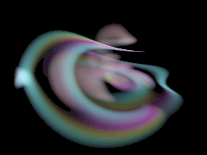
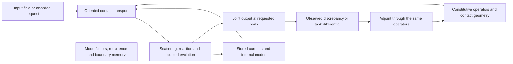

# HNN model formula and library composition

[project-postulate] This is the model-level design used by the
[Athena blueprint](plans/THE_ATHENA_ALPHA_CULTIVATES_GENERAL_CONVERSATION_THROUGH_NATIVE_CONTEXTUAL_TRANSPORT.md).
The [roadmap](plans/THE_ROADMAP.md) orders its construction and
[CONSTRUCTION_STATE](../CONSTRUCTION_STATE.md) records implementation. HNN is a network of
interacting, adaptive mathematical operators. Athena is its first product. The construction
uses the framework's circuit, field, differential, inference and compression laws directly.

[definition] Eros names the collective formative machine and the composition within each of
its Holons; Athena is a formation in that organization. Perception, internal generation and
outward expression use the same changing source/current/material/receiver construction. The
[construction ethos](canon/THE_REALITY_OF_DIFFERENCE.md#construct-cognition-through-the-shared-objects)
and [joint landmark inference](RECEIVER_HOLARCHY.md#landmarks-constrain-one-continuing-interior)
keep that whole in view when a formula is restricted to a tensor, spectral, fluid or textual chart.

[definition] A Transformer is also executable generating mathematics. Its architecture supplies
compositions of contractions, attention, reactions and normalizations; its parameters and
execution state supply their contemporary operands. HNN generalizes the organization and
representations of such operators. It does not add a further faculty between computation and
intelligence. Safetensors, an ONNX graph and a world save serialize different portions of an
executable system. The model specification must say which laws interpret that data.

[project-postulate] The [constraint-mode and active-face contract](CONSTRAINT_MODES_AND_RECEIVER_FACES.md)
governs the notation below. `exp`, phase/π, log, Gamma and named constants refer to their
normalized generating constraints, branches and periods; a floating value is only a receiver
face. Exact rational scales, units and integer grades/counts remain typed. The observing Holon
participates through its current/material/frame coupling; the GR, stress, gyro and conservation
relations are part of this construction, not excluded by its software realization.

## Reading the field architecture diagram

[definition] The shared [generator/action contract](HOLON.md#situated-generator-inference-dormant-modes-and-action)
also reads this model in the inverse direction: from the compatible source family and a
receiving constraint, infer applicable conditions, generators or controls. A changing receiving
Holon supplies part of that source, rather than being replaced by a desired output inscription.
Retained material can support dormant availability between active modes; its future action and
receiver descent determine what compression may discard. Recurrence and homeostasis refer to
the constituted driven dynamics, with storage, flux and dissipation at their actual units.

[definition] The operands of this model are organized by the
[helical pair interaction](HOLON.md#the-helical-pair-interaction-unit). A declared representation
maps its geometric passage into current transport `U_(F←G)`; a configuration chart maps the
resident state into the spatial pair receiver. The field difference `Delta_i=U_i q_i−q_r`
and the spatial separation `Δ=x_a−x_b` keep those chart maps explicit. Participation consumes
the full pair face and its complete differential. `PairQuadranceJet::pullback` supplies the
scalar-Q parameter term; feature `(Δ,Q,DQ)`, chart, material and clock variations add their
own terms. The physical group return `A⁻¹FA` agrees with an inverse/adjoint identification only
under the declared isometry; the incident word keeps its actual derivative adjoint.

A source passage drives the continuing machine. On an admitted linear source chart it may
accumulate `m_g=Σ_k Ĝ_g(τ_g(k))⁻¹E_g(u_k)` and oriented pair moments, retaining the decoder,
source fibre and future-action/injection square. A response position reads
`y_j=ρ_R(Ĝ_R(τ_R(j))q)` through a separately tagged phase binding. The
[finalized native contract](plans/THE_ATHENA_ALPHA_CULTIVATES_GENERAL_CONVERSATION_THROUGH_NATIVE_CONTEXTUAL_TRANSPORT.md#situated-generator-and-receiving-composition)
states these maps, known/inferred operands, updates, closure hypotheses and cost scope.

[established-bounded; source-inspected] The current incident word below implements bilinear
current participation on a ring with one site per source cell. Its unit-phase restriction is
the zero-advance, unit-radius pair chart; general current amplitudes retain the two
self-energy terms in polarization. It does not yet instantiate the moving `ScrewPair` contact.
Its learned M/D already apply to new currents. `IncidentTextReceiver` reads one boundary;
its character/support comparison is one receiving consequence. The
[composition boundary](HNN_COMPOSITION.md#implemented-incident-field-composition-boundary)
identifies the unconnected compatibility/future-mode work without refounding the model.

[definition] The [helical elementary realization](HELICAL_GEOMETRY.md) makes one geometric
instance of the following operator relations explicit: source generators and initial points,
frame transport, pair contact differential, its geometric second variation and a quadratic
receiver that factors through the existing moment owner. Its exact local source is available
through `holonics::geometry`; it is not a replacement HNN architecture. The constant-generator
case supplies a finite reusable receiver recurrence when the existing descent equation holds;
changing generators retain the `ChangingReceiver` defect rather than deleting the interior.



[definition] The current [continuing-field construction](../research/experiments/hnn_field_architecture/CONTINUING_FIELD.md)
evolves `(ψ,H,Φ)` before reception: complex-current contact and heat return, thermal exchange,
and current-dependent nonuniform spatial transport. The same Φ carries the toroidal supports,
phase plates and field reconstruction. The receiver image integrates that changing volume.
The previous fixed-field/three-ray aperture illustration answered only a local optical question;
it did not depict the continuing field requested here. Its data and source remain recoverable.

[definition] The [receiver-holarchy construction](RECEIVER_HOLARCHY.md) specifies the observing
Holon and its world-tube, frame, aperture and internal current. The current volume image is
a face received through its supplied fixed frame. The prior moving-aperture control preserves a fixed source and calculates local ray faces.
That specialization is insufficient for the whole-field picture. In the current volume view,
source evolution supplies the missing `ρ_R ẋ` contribution while R is held fixed. Receiver
motion can then compose with it through the existing chart-rate law; it cannot substitute for it.

[definition] The architecture comparison below concerns the operations of this continuing
field. The earlier [annotated overview](../research/experiments/hnn_field_architecture/architecture.svg)
locates their interfaces; the current motion view reconstructs changing field states. Local
sections, shared contact, internal circulation and material belong to the same object. The drawn tori are
an explicit geometric realization of circulation and overlap; they do not assert that every
Holon has genus one or that tensor rank equals the visible spatial dimension.

| Familiar diagram component | HNN operation in this same field |
|---|---|
| Embedding / encoder | Map an occurrence into situated current/field sections with declared axes, basis and source conditions. Text, images and acoustics have different exterior maps into these ports. |
| Query/key comparison | A source-conditioned comparison on admitted contacts. Its comparands, pairing, phase and geometry specify the potential; co-presence alone does not establish contact. |
| Values / attention | `T_F[Ψ]=Σ_G a_FG[Ψ] U_(F←G)[Ψ] Ψ_G`. Normalized participation and transported current are both differentiated. |
| Heads and layers | Families of local/modal operators and their composition on the same object. Overlap, recurrent paths, changing material and nested scales replace a mandatory global stack. |
| SSM state | Constitutive interior and retained generator modes. A fixed linear interior yields its evolution operator and boundary memory kernel; a changing interior retains its actual dynamics. |
| Diffusion / refinement | Evolve a joint field against its conditions and constitutive operators. The integration coordinate is distinct from an output-token index. Classical stochastic corruption is one exterior comparison chart, not a mandatory native noise source. |
| Decoder / output | Reconstruct a jointly supported field and read its receiving boundary: text section, image, acoustic interval or another internal Holon. Streaming exposes available portions under their dependencies. |

[definition] A local current section has the type `Ψ_F∈Γ(U_F,E_F)`, where the fibre E_F
can be complex, vector-valued or tensor-valued; a transition acts on that fibre over the
actual overlap. The plotted surface, the section's tensor axes and the generator's phase
coordinates are distinct dimensions. Fractal return/preimage geometry belongs to the evolving
object and its scale family, not to tiles copied beside it. The
[four-paper synthesis](../research/records/2026-09-14_TRANSFORMER_FIELDS_TROPICAL_CELLS_AND_FRACTAL_GENERATORS.md)
connects the field/reaction view of transformers, finite-temperature attention geometry,
operator splitting and recursive basin structure to these same operations.

[definition] These correspondences overlap within a single Holonic Interaction. They are not
three separate transformer/diffusion/SSM engines added together. The complete model remains
`M=(K,Θ,x)` below. In a fixed local carrier, an admitted constitutive chart can express
`ẋ=F_(K,Θ)(x,h)` and `Θ̇=G_(K,Θ)(x,h,returned_difference)`; combinatorial changes of K
use their actual incidence/transport maps, rather than pretending a cell label has an ordinary
time derivative. Whole-field generation follows the dependencies of the requested release;
it does not require every offscreen degree of freedom to be expanded or globally settled.

[proved-derived] A fixed-linear interior `ż=Az+Bx` gives the received memory term
`C E((t−s)A) B` after elimination. That is a precise SSM/convolution face of the continuing
interior. The [fluid construction](HOLONIC_FLUID_CONSTRUCTION.md) retains its changing-chart
residual, nonlinear microscopic feedback and additional stress. Replacing it by a stateless
layer diagram would remove an actual term, not merely change the illustration.

[definition] The normalized contact return is
`δT_F=Σ_G a_FG δ(U_FG Ψ_G)+Σ_G δa_FG U_FG Ψ_G`.
A nonlinear reaction, including a sigmoid chart where admitted, acts locally on the same
current/material. Bilinear contractions are elementary vertices in this composition;
propagators carry the actual chart/phase maps. A drawn crossing has no interaction vertex
unless the source supplies contact. The shared source/receiving geometry remains when the
same interaction is drawn as a tensor contraction instead of a torus.

[established-bounded; source-inspected] The accompanying
[diagram source and interface audit](../research/experiments/hnn_field_architecture/README.md)
binds these labels to `NormalizedKernel`, exact bilinear/core/receiver operators,
`ExactSheafDiffusionLaw`, `NativeConstitutiveField`, and `NativeCoupledBody`.
The richer field and coupled application still require their recorded assembly join;
the diagram does not claim that the narrowed historical session already implements every
operation shown. Delayed observation is an ordinary dependency: a comparison cannot consume
an observation before it arrives, and every output does not require a new learning event.

[definition] The [ecological-role construction](HEPHAESTUS_AUTOMATA.md#ecological-roles-as-generator-relative-characteristics)
reads integration, separation, retention and release from the actual generator, source and
receiver. They can coexist within this field. The discrete rate form `T*G_next T-G`, or the
continuous form `A*G+G A+G_dot`, keeps that reading tied to its metric and clock; role names do
not assign native topology or replace the constitutive heat/current balance. Both forms are
Hermitian, so their content is a signature under congruence — `inertia.rs::inertia` and
`inertia.rs::congruence` — and not an eigenvalue or a score. The same generator can contract one
direction of this field while expanding another, and a chart change carries that reading exactly.

## 1. The model, its dynamics and its output

[definition] The [Athena engine blueprint](ATHENA_ENGINE_BLUEPRINT.md) diagrams this operator
composition with the inspected Rust owners and the exact application attachment. Its paper
plates reuse the equations below; it does not define another model or construction order.

[definition] Use the [encapsulated Holon operations](HOLON.md#high-level-holonic-interactions)
to formulate this model: chart-presented tensor kets |H⟩_F, receiver bras ⟨r|, operator
application, tensor interaction, contraction and adjoint variation. The tuple below is the
model's state specification, not its public computational notation. Interaction diagrams
carry these objects on oriented lines and their actual maps at vertices.

[definition] Write the situated model as

```text
M = (K, Θ, x),                 y_F = ρ_F(b_H(x)).
```

K is the oriented contact complex, including its boundary ports and chart transitions; Θ is
the constitutive operator material; x contains the active currents and internal modes.
Their numerical representations may be sparse sections, tensors, factors, recurrences or
correlated parameter families. K is not a semantic classifier. The components need not share
one shape, one spatial grain or a universal clock. At a specified interaction, the joined
ports determine which restrictions of these objects participate.

[definition] The parameters of `ρ_F` can belong to another participating H_R. Its state
is either an explicit nested component of the joint model or part of the actual coupled
environment h. Receiver motion and material response then contribute to the receiving
differential. A fixed readout matrix is the specialization where those operands are fixed.

[definition] b_H is the outwardly available field/current at the selected holonic boundary.
It can be an identity/readout port in a computational chart. Another internal region or an
exterior system can receive it; it need not be a deliberately requested message. The
[computational Holon](HOLON.md) supplies the elementary object and operator contract.

[definition] The executable model is a composition of those actual operators:

```text
x ↦ boundary injection
  ↦ incident transport and interaction
  ↦ constitutive reaction and internal dynamics
  ↦ requested output projection.
```

An implementation must instantiate the maps below; the four arrow labels alone are not a
model. Repeated or recursive compositions operate on the same material, and can return a
joint field, trajectory or text section. Learned material can change between or within those
compositions through its specified variation. A public input selects a task and output ports,
not a different learning engine. A speculative output and a committed step evaluate the same
generating law with their respective ownership effects.

### Generation as field refinement and boundary radiation

[interpretation] The diffusion/embroidery reading concerns **how the pattern is formed**.
The receiving medium, existing structure, crossings, phase and material response participate in
that formation. Local transport and integration can organize a larger pattern and change its
further admissible motion. A “contextual task” is an exterior application description, not a
native category that selects an answer mechanism. Text, image and acoustic output are received
faces of the same construction. The
[application contract](plans/THE_ATHENA_ALPHA_CULTIVATES_GENERAL_CONVERSATION_THROUGH_NATIVE_CONTEXTUAL_TRANSPORT.md#next-consuming-application)
retains this correction alongside the actual software consumer.

[project-postulate] Generation develops a joint field or configuration through the model's
constituted dynamics. Its integration/refinement coordinate is not an output-token index.
Image, acoustic, geometric and symbolic outputs are receiver charts of that construction.
Streaming may expose available parts, but must not replace joint generation with independent
per-coordinate predictions. A text codec cannot schedule the model's evolution.

[definition] Let ξ parameterize a prepared latent/partial field and h the actual restricted
environment, internal material and boundary data. A generative chart is

```text
x(τ₀)=I_h(ξ),
∂_τ x = F_(Θ,K)(x,h,τ),
y_F(τ)=ρ_F b_H(x(τ)),
u_B=C_(B←H) b_H(x).
```

F is composed from transport, constitutive reaction, inference/score and integration
operators; its signature alone does not implement it. C is an actual coupling to another
region, possibly within the same larger model. Local evolution can use stored currents
and internal clocks without a fresh user message. Voluntary communication can shape the
boundary activity but does not define whether it can affect another region.

[definition] Classical denoising diffusion uses the corruption chart
`x_t=√ᾱ_t x_0+√(1-ᾱ_t) ε`. A learned noise/score field drives generative refinement of the
whole latent field. The usual variance step is
`x_t=√(1-β_t)x_(t-1)+√β_t ε`. Convolutional networks can parameterize that field with shared
kernels and multiscale connections. DiffWave refines whole acoustic waveforms without
autoregressive sample generation. [Image diffusion](https://arxiv.org/html/2006.11239v2),
[acoustic diffusion](https://arxiv.org/html/2009.09761v3).

[conditional] For forward SDE `dx=f dt+g(t) dW`, an exact score and the density/regularity
hypotheses give probability-flow ODE `dx=[f-(g²/2)∇log p_t]dt`. Integrating from the prior end
gives the same one-time marginals as the corresponding SDE, not the same stochastic paths
or a unique historical input. This is a deterministic generative realization, not a
requirement to add a sampler to every native operation.
[Score-based construction](https://arxiv.org/html/2011.13456v2).

[definition] The initial latent may be a supplied noise realization, structured modes or an
unresolved joint family. Zero current, an unseen region, uncertainty and stochastic noise
are different operands. Stable heat smoothing alone does not synthesize a learned
distribution; the learned/refined constitutive field supplies its structure. Known
observations constrain appropriate coordinates while generation can continue elsewhere
without a singleton causal preimage or complete historical reconstruction.

[project-postulate] The native consumer takes a whole resident section/family, its refinement
law and boundary constraints, and emits the joint generated section through the existing
body. Image/acoustic arrays and symbolic sections enter through their shape/transport maps.
The two-current wave chart and character readout are local specializations, not the general
generation algorithm. Inspect joint generation and composition before introducing a token
loop or another fixed assay.

[proved-derived; formal-checked] `Holon.ofEvolution` realizes generation in the elementary
Holon type. Its encoding theorem equates full and reduced generation when their maps
commute; its composition equivalence carries one latent population through two refinements.
Neither binding requires a trajectory archive or independent output marginals.

### One object, its charts and its recursive geometry

[definition] A computational Holon is the same situated field across its local, modal and
receiver charts. Let `K` be its oriented cell incidence, `Γ(K)` the compatible current/field
sections and `Φ_Θ` the actual nonlinear operation on current, material and geometry. A chart
restriction `r_α` gives `|H⟩_α=r_α|H⟩`; compatible restrictions on an overlap are related by
its declared transition. A head reads/transports such currents. Composing heads, reactions
and time steps acts on the same Holon; a layer diagram is an execution chart, not a set of
physically separated planes. If local restrictions do not close dynamically, retain the
coupling, interior modes and residual rather than treating each chart as an autonomous object.

[definition] The carrier can have toroidal cycles, curved transport tubes and overlapping
field domains, with higher cells recording their joints. `simplicial::SimplicialComplex`
provides oriented surface stars/links and hinge changes; `algebraic::GradedCausalComplex`
provides arbitrary-grade incidence with `∂²=0`; `analytic_field` supplies torus phase charts;
connection/holonomy owners transport current around actual paths. A torus is not a generic
hypersphere, and an aggregate intensity isosurface does not expose all of its constituent
cycles. An embedding into a displayed 3D scene is a receiver of these relations. Interlinked
cores, intersecting support domains and actual constitutive contact are separately specified.

[definition] Fractal geometry can arise within the operation's invariant, survivor or
receiver-arrival populations while the number of state axes remains fixed. For a fixed
recurrence `Φ` and receiving region A, the **first-arrival** populations are

```text
A_0=A,
A_(n+1)=Φ^(-1)(A_n) \ A,
x∈A_n  iff  Φ^[n](x)∈A and Φ^[k](x)∉A for every k<n.
```

[proved-derived; formal-checked] `HolonicRecurrentEcology.FirstArrival` proves that
characterization and its covariance under a state-chart equivalence with the transported
recurrence and receiver. Preimage here means all compatible initial conditions, not reverse
time or a chosen inverse. Repeated stretching, folding, passage near saddle regions and
restriction can produce fine interleaving. A small sampled dimension or a finite picture
alone neither proves infinite-scale fractality nor replaces this generator.

[definition] The [analytic flux and receiving-basin construction](ANALYTIC_FLUX_AND_RECEIVING_BASINS.md)
now binds that recursion to a supplied holomorphic source: `f_s v=-f`, its enclosed release
and derivative, complete preimage equation and certified receiving neighborhoods. The same
law for a changing source is `F_s v=-F-u_dot F_u`; backward heat joins it to the existing
RH zero motion. `AnalyticReceiving` binds the admitted operation to `Holon` and clocked
first arrivals; `relational-geometry::exact_analysis` supplies its executable enclosure and
capture operations. These are reusable analytic realizations of field refinement, not a
requirement to choose Newton dynamics as every HNN's constitutive law. Their logarithmic
one-form and contour periods connect actual potential/phase circulation to the Hodge owners.

[definition] A basin figure uses a declared family `z(a,b)=z₀+a u+b v` or a valid manifold
section. Its coordinates label initial conditions for **one** full recurrence. Color may
read first arrival, decoded settling or another specified consequence. Its nonlinear
trajectories live in the full state space; the two plotted axes and 3D embeddings need not
be dynamically invariant. A zoom recomputes that restricted family. It does not place more
copies of the complete model in a grid. Nonlinear dynamics also need not be globally
contractive; do not choose a uniform contraction merely to make the demonstration settle.

[definition] Intrinsic metric/measure and the admitted family determine dimension. For a
compact receiver family, box dimension uses `lim_(ε→0) log N(ε)/log(1/ε)` when that limit
exists. An uncertainty fraction `f(ε)~ε^α` gives section-boundary dimension `d-α` only under
its sampling and scaling hypotheses. Carrier/stratum dimension, phase-space dimension,
fractal dimension and effective receiver rank are separate quantities. A chart of twelve
phase coordinates does not force its invariant or survivor geometry to have dimension twelve;
a two-dimensional basin plot does not reduce the complete field to two dimensions.

[established-bounded; computational-witness] The
[intrinsic phase-field reference](../research/experiments/intrinsic_holonic_flow/README.md)
constructs six interlinked toroidal domains, a conforming volume subcomplex with shared
contact cells, and a twelve-phase nonlinear map. Two normalized phase-comparison potentials
and a sigmoid local reaction act on this one state. The linked geometry, changing head
weights, paired flow histories and successively resolved arrival sections are its different
receivers. This is a supplied analytic constitutive example, numerically evaluated outside
the native runtime. It is not a reproduced trained-model experiment. The older fifteen-channel
linear reference remains evidence for its differential and material step; it does not provide
the main generative or fractal geometry of the model.

[proved-derived] The linked carrier and its common cell complex also admit a concrete
incompressible material motion. At unit nondimensional density, put
`u=(0,-χxz,χxy)`, `p_hyd=χ²x²(y²+z²)/2`, and `f=(χ²x(y²+z²),0,0)`.
Then `div u=0`, `Δu=0`, and `(u·∇)u=-∇p_hyd+f`, giving a local forced Euler/Navier–Stokes
field for any constant viscosity. Its exact flow is
`F_t(x,y,z)=(x,y cos(χxt)-z sin(χxt),y sin(χxt)+z cos(χxt))`, with determinant one and
inverse `F_(-t)`. Advect the torus domains and every shared cell by the same map; linking,
incidence and containment are preserved. The reference uses `χ=1/8`, `0≤t≤1`.
A circulating point/current has velocity `u(F_t X)+DF_t·X_dot`; omitting either term would
separate internal motion from the material carrying it. The graphical edges sample these
curved images, not an assumption that the underlying cells stay affine in space.

[definition] In that reference `q,p∈T^6`, `s^h_ij=β_h cos(2π(q_i-q_j-φ_ij))` on the
geometrically admitted incidence, `a^h=softmax(s^h)`, and `g_i=σ(-cos(2πq_i))`. The potential
and its complete gradient are

```text
V(q)=κ/(2π) Σ_i softplus(-cos(2πq_i))
     -κγ/(2π H) Σ_h β_h^(-1) Σ_i log Σ_(j∈E_i) exp(s^h_ij),
∂V/∂q_i=κ[g_i sin(2πq_i)
          +γ/H Σ_(h,j)(a^h_ij+a^h_ji) sin(2π(q_i-q_j-φ_ij))].
q'=q+κ sin(2πp),                 p'=p-∇V(q')      (mod 1).
```

[proved-derived] The two substeps are exact flows of complementary periodic Hamiltonians,
so their composition preserves the canonical form `Σ_i dq_i∧dp_i` and phase volume. It need
not preserve one unsplit energy or converge to a fixed point. The full derivative includes
inbound and outbound attention and the sigmoid/softmax differentials; omitting one changes
the Hamiltonian field. A detector's first reception is an output without requiring global
settling. Dissipative material and incidence changes can be composed through their own laws;
the conservative instance does not declare them absent from HNN.

### Recursive generators, scale and transcendental operations

[definition] Repeated latent generation is `x_(n+1)=F_Theta(x_n,h)`. Its tangent evolves by
`J_(n+1)=DF_Theta(x_n,h) J_n`; both are executable recurrences. A single iteration may refine
an entire field. Fractal basins of that recurrence describe sensitivity of its routes or
settling times; their finite-resolution measurements are not tensor rank or a proof that
all algorithms must traverse the same difficult routes.

[definition] A separated IFS specialization can use `S(H)=union_i F_i(H)` and an attractor
`H=S(H)`. With contracting similarities and the stated separation condition, dimension D
obeys `sum_i r_i^D=1`. The maps, their scale and relevant branch constraints are the compact
construction. A lattice is one resolved realization, not the only way to compute it.
The existing `FractalPacking` owner proves that specialization's restriction laws. The
recurrence, preimage, tube, connection and scale owners supply the broader construction.

[definition] Functional calculus supplies constrained generator modes: `exp(tA)` denotes the normalized
flow `U'=AU`, `U(0)=I`, not an unconstrained numeric primitive;
`exp(i theta)` is its phase restriction with the primitive period/winding kernel retained;
logarithms invert the declared positive flow. Euler-Gamma shifts use their recurrence, seed
constraint and block action; Kelvin circulation Γ has a different source. The named exact
function and the native operation consuming its source are stated separately. Domains, branches and remainders belong to the operation.
A periodic bounded field generally has no limit at one added point at infinity; retain its
phase chart instead. These laws are not merely floating-point constants or ornamental
references to fractals.

### Capacitive, inductive and dissipative realization

[definition] The [paper synthesis](../research/records/2026-09-14_TRANSFORMER_FIELDS_TROPICAL_CELLS_AND_FRACTAL_GENERATORS.md)
places field transport, reaction, recursive generation and the following physical
realizations in one operator algebra. Published Transformer charts supply useful instances;
their fixed token base, frozen-key limits and empirical basin measurements do not choose
HNN's topology or impose a universal limit on generation.

[definition] On a finite real electrical chart, let d map node potentials to oriented edge
drops. Let C and L be positive symmetric storage maps and R nonnegative resistance. The
network equations are

```text
q = C φ,                 λ = L j,
q_dot + d* j = b,
λ_dot + R j = d φ + e_ind.
```

q is stored charge, φ potential, j branch current, λ linked flux, b injected current and e_ind
an induced electromotive field. The adjoint d* uses the stated pairings. Units are coulombs,
volts, amperes, webers, farads, henries and seconds in this chart. Anisotropic maps, complex
phase coordinates, nonlinear constitutive relations and changing incidence extend these
operands through their respective laws; they do not replace the equations with object labels.

[proved-derived] In a fixed carrier with differentiable material, the stored energy satisfies

```text
H = (φ* C φ + j* L j)/2,
H_dot = φ* b + j* e_ind - j* R j - (φ* C_dot φ + j* L_dot j)/2.
```

The internal powers cancel through the adjoint incidence. This is a calculable generalization
of V=IR with storage, induction and changing material. For a changing population, transfer
charge/flux and boundary work through the actual contact map; equal array indices do not
identify those quantities. [PortEnergyHeat](../formal/elementary-holonics/ElementaryHolonics/Physics/PortEnergyHeat.lean),
[CoupledIncidence](../formal/elementary-holonics/ElementaryHolonics/Physics/CoupledIncidence.lean)
and [ConstitutiveModulation](../formal/elementary-holonics/ElementaryHolonics/Physics/ConstitutiveModulation.lean)
are the existing formal owners.

[definition] Port-Hamiltonian form, `x_dot=(J-R)∇H+B u`, is an available energy-chart realization
with skew J, nonnegative R and power output `B*∇H`. Its graph interconnection is an established
compositional construction. A learned reaction or nonlocal attention field need not itself be
a gradient flow; use its actual Jacobian and balance. The model need not wait for a universal
Hamiltonian representation of every neural operator.
[Graph interconnection](https://arxiv.org/abs/1107.2006),
[neural graph realization](https://arxiv.org/abs/2405.17163).

### The existing native scattering operator

[established-bounded; source-inspected] The current operative field already supplies a concrete
complex boundary/interior operation. With incident current u, stored interior current b and
contact matrix D, its normalized unit-admittance chart is

```text
A = I + D D*,
A v = 2(u + D b),
w = v-u,                 b_next = D* v-b.
```

This map couples external and internal currents. It is implemented by the operative field and
its resident kernels. D is operator material, not a descriptor to append to a separate example.
The next application uses w and b_next through its physical/contact transport. A model assembled
from this operation directly computes those currents; fitting a second matrix to its outputs
is a distinct surrogate-model task and is justified only when that task is intended.

[proved-derived; formal-checked] This same native scattering is
`R_G x=2P_G x−x=Swing_(P_G x)(x)`, where
`P_G(u,b)=(A⁻¹(u+Db),D* A⁻¹(u+Db))` projects onto the constituted contact graph.
`HolonicConstitutiveCirculation` proves the projection and involution from the actual solve
identity and binds the result to the existing Swing definition. With the energy adjoint,
its orthogonality gives the conserved norm. The
[fluid construction](HOLONIC_FLUID_CONSTRUCTION.md) carries this relation through material
advection, stress, Hodge projection, exact unresolved-mode feedback and interior memory.
Its internal-field extension pairs advection with the actual adjoint stress; this is a
constitutive specialization to implement through these owners, not a second model definition.

[project-postulate] Extend the existing `NativeCoupledBody` application owner to execute the
field's constituted transport and the required local generator/reaction maps from their shared
resident material. The field and coupled representation must not become independently trained
copies of one purported model. The field can still be an independent physical environment when
an application actually requests learning that environment. Existing normal fitting remains a
valid local material law; it does not determine the entire architecture.



### The geometric session word

[established-bounded; source-inspected] This section records an implemented numerical word.
Its current session caller derives channels, source slots and targets from a supplied symbol
alphabet and decodes with per-slot basis selection. It has not constructed the intended Holonic
Encoding and Compression maps. The [campaign correction](../research/records/2026-09-20_THE_GEOMETRIC_FIELD_REFINES_AND_RETURNS_ITS_COMPLETE_PAIRED_CURRENT.md#correction-the-nibble-control-is-not-holonic-encoding)
locates that substitution and the existing construction to bind.

[established-bounded; source-inspected] `GeometricFieldSpec` and
`NativeCoupledBody::preview_geometric_rows` now compose the analytic junction/arc owner,
the existing normalized section receiver, constituted reaction and a finite joint refinement.
`FieldSourceChart::GeometricRegions` binds this operation through the public field session.
For each receiving site and its admitted incoming ports, the executed specialization is

```text
u_j = U_j k_j,             s_j = β Re⟨q,u_j⟩,
p = softmax(s),            y = Σ_j p_j u_j,
Φ = y ⊕ p ⊕ (p ⊗ y),     r = S_D(y + MΦ, b),
x_next = H seed + (I−H)((1−μ)seed + μ r),     μ = 2^(−relaxation_bits).
```

[definition] U is the declared complete modal phase passage on the admitted arc. Unit
single-channel comparison specializes to cosine phase comparison; amplitudes remain in the
general pairing. H holds the supplied boundary coordinates through every stage. The supplied
linked-torus instance uses exact longitude arcs and their shared junction. This finite
relaxation is a declared boundary-network law; the intrinsic reference's volume advection,
Hamiltonian shear and material dissipation have their own equations and are not implied by it.

[proved-derived] The same producing carriers give
`r_j=Re⟨g_y,u_j⟩+Re(g_p[j])`, `h=(diag(p)−ppᵀ)r`,
`g_q=βΣ_j h_j u_j`, `g_u[j]=p_j g_y+βh_j q`, and `g_k[j]=U_j* g_u[j]`.
The existing normalized receiver supplies h. Each stage returns through M*, both arms of Φ,
fixed-D reflection, phase and repeated-address scatter. Refinement adds
`[H+(I−H)(1−μ)]g` directly to the seed and `(I−H)μg` through r. The full reverse word
stages all local reaction targets together before one normal update; it never changes M
halfway through that return.

[definition] Geometry, U, D, b, β and the finite extent are fixed operands during this word.
Saved geometric comparisons retain source and receiving conditions and use the current material
when observed. M and pending comparisons persist; a generated global phase field is currently
an ephemeral preview. Learned receiving geometry, changing D and economical nonlinear
continuation remain actual consuming work. The
[campaign derivation and checks](../research/records/2026-09-20_THE_GEOMETRIC_FIELD_REFINES_AND_RETURNS_ITS_COMPLETE_PAIRED_CURRENT.md)
and [source map](plans/THE_ATHENA_ALPHA_CULTIVATES_GENERAL_CONVERSATION_THROUGH_NATIVE_CONTEXTUAL_TRANSPORT.md#field-session-source-map)
connect the implementation, residuals, source episodes and these remaining terms.

### The implemented incident-field composition

[established-bounded; source-inspected] The [executable campaign contract](plans/THE_ATHENA_ALPHA_CULTIVATES_GENERAL_CONVERSATION_THROUGH_NATIVE_CONTEXTUAL_TRANSPORT.md#executable-field-campaign)
selects the existing standing-source/incoming-drive distinction for the full field. At site r,

```text
u_ri=U_(r←i)q_i,       Delta_ri=u_ri−q_r,
p_r=softmax(beta Re⟨q_r,u_ri⟩),     y_r=Σ_i p_ri u_ri,
f_r=Phi(q_r,Delta_r),  a_r=y_r+M_r f_r.
```

[established-bounded; implemented-exact] The default score above is tagged `Bilinear`.
`IncidentParticipationChart::QuadranceCurrent` adds the declared current chart
`s_i=−β||q_r−u_ri||²/2`. For `h=J_p(⟨g_y,u_i⟩+g_p[i])`, its return is
`g_q=−βΣ_i h_i(q−u_i)` and `g_u[i]=p_i g_y+βh_i(q−u_i)`. Both source roles join before `U_i*`.
The underlying `NativePairParticipation` supports separate geometry and value sections;
the current specialization explicitly identifies their neighbor source. Its producing score
choice survives rest and old specifications retain the default. The generic finite score
remainder is checked in `HelicalPairInteraction.pairScore_add_sub`.
[Construction and scope](../research/records/2026-09-21_PAIR_CONTACT_SERIAL_KINEMATICS_AND_THE_RESIDENT_QUADRANCE_RETURN.md).

Flatten a once; one global D scatters `(a,b)` to `(w,b_ref)`. There is one internal b in the
actual contact chart, not a copy for each row. With fixed anchor `(q_anchor,b_pre)` and a mask
Hbar on supplied boundary coordinates, the entire state evolves by
`z_next=Hbar z_anchor+(I−Hbar)((1−mu)z_anchor+mu(w,b_ref))`.
The legacy word above remains its implemented numerical control. Its M on `Phi(y,p)` is not
reinterpreted as material on `Phi(q,Delta)`; the contract specifies admissible port recharting.

[established-bounded; source-inspected] E_in maps the exterior symbol source basis into the field's declared current basis;
R_text and the support receiver read the generated field. They are trainable boundary material
in the same normal/adjoint transaction. Alphabet size belongs to those exterior ports, not to
local field width. The incident boundary owners fix the nonzero E_in/R_text priors, zero initial
support map, initial finite-codec correspondence,
source-region incidence, cross-entropy and material update. This boundary chart contributes to
the ported passage; exact transformation compression still uses its actual generator/receiver
and retained remainder through the existing owners.

[proved-derived] In the local reverse, the condition contribution at the query is
`−Σ_i g_Delta_i`, and at neighbor i it is `+g_Delta_i` before U_i*. Participation contributes
both `p_i g_y` and the softmax-Jacobian score term. The global reflection returns one internal
covector and two material outer-product factors per stage. The contract gives their full
formulas and the anchor terms; all producing operands remain fixed until that return completes.

[established-bounded; source-inspected] `FieldSourceChart::IncidentField` now realizes this
composition through `native/coupled_wave/body/field/incident.rs` and
`native/field_session/incident_application/`. The source preparation keeps ordered cells and
declared joins; the forward word retains q, Delta, y, one global D/b endpoint and the full held
joint section. Its reverse carries the producing boundary and source covectors through E/R,
support and the encoder before atomic publication. Normal maps and frozen producing views retain
their own cuts through rest/remount. The same resident surface also exposes the scoped
`FieldMathematicalRequest` port, so a retained workshop product can enter declared complex
coordinates without a host numeric round-trip. The [September 21 campaign record](../research/records/2026-09-21_THE_INCIDENT_FIELD_JOINS_ITS_GENERATOR_RECEIVER_AND_FROZEN_RETURN.md)
records focused controls, the full development/restart and structured-code returns, and the
failed complete-source conversation cases. Source and receiving slots are declared separately;
the receiving range remains fixed when the request length changes.

## 2. Transformer, convolution, SSM and diffusion operators

### One connected tensor computation

[definition] In a finite chart write the computational Holon as `|H_l>_F`, with current
`X_l ∈ C^(sites × channels)` and situated incidence `E_l`. A head is one pair of query/key
charts and a transported value chart on that same object. A layer composes those maps:

```text
Q_h=X_l W_Qh,  K_h=X_l W_Kh,  V_h=X_l W_Vh,
s_hij=β Re <Q_hi,K_hj> + b_hij,                  j ∈ E_l(i),
a_hij=μ_j exp(s_hij)/Σ_(k∈E_l(i)) μ_k exp(s_hik),
Y_hi=Σ_(j∈E_l(i)) a_hij U_hij V_hj,
Z_l=X_l + Concat_h(Y_h) W_O,
g_l=σ(G_l Z_l+c_l),
X_(l+1)=N_l[Z_l+g_l ⊙ R_l(Z_l;Θ_l)].
```

[definition] `U_hij` transports values between the participating frames; its unit/phase
or general constitutive law is declared. `N_l` is the specified normalization, `R_l` the
local reaction and `g_l` a binary participation chart. These are typed tensor operations,
not seven new engines. Head indices label parallel charts; layer indices label composition.
Neither index determines a physical level or a text-generation clock. The general HNN
incidence and current/material equations in §1 decide which maps and subdivisions apply.
The earlier native `operative_atlas` actually composes Q/K/V, RoPE, masked multihead contact,
output contraction, residuals and gated reaction through `NativeFullOperatorSession`.
The active constitutive field's normalized receiver and contact adjoints are separate owners;
the presence of the earlier graph does not connect that graph to this field automatically.

[definition] Attention is the dependence of transported current on these situated
comparisons, including its sensitivity to changing input, phase and material. A normalized
coefficient is one chart of participation. For one row,

```text
da_j=a_j(ds_j-Σ_k a_k ds_k),
dY=Σ_j a_j U_j dV_j + Σ_j a_j dU_j V_j
    + Σ_j a_j(ds_j-E_a ds) U_j V_j.
```

[proved-derived] The last term curves participation through
`J=diag(a)-a aᵀ`, a positive semidefinite covariance/Laplacian with constant-shift null
direction. A head can suppress a large but common perturbation while responding strongly
to a smaller difference that changes its participating current. Softmax is not an all-to-all
incidence rule: its denominator ranges over the admitted contacts. Sigmoid is the two-channel
restriction `σ(s)=exp(s)/(exp(s)+1)` with derivative `σ(s)(1-σ(s))`. Changing a previously absent
edge requires the separate incidence law; the derivative on a fixed support does not open it.

[established-bounded; implemented-exact] The
[connected reference computation](../research/experiments/connected_holonic_field/README.md)
uses fifteen complex toroidal channels, two normalized heads, two composed layers, a sigmoid
gate, a phase-sensitive dissipative contact, an observed material step and a whole-field
resolvent. Its exact rational positive-kernel/log-potential specialization lives in
[`exponentiated_ratio::NormalizedKernel`](../crates/holonic-engine/src/exponentiated_ratio/transport.rs).
It accepts supplied positive rational K. Its implicit real log chart is defined by the
normalized flow relation `E(s)=K`; no separately evaluated or stored logarithm is needed.
This supplied material is not an inferred exponential generator. It does not approximate a
general exponential of arbitrary query/key products. Its generated field drives the new
synopsis figures through the existing geometric decoder. This is executable reference
composition on the CPU; the native model assembly still belongs to the active field/body.

### Existing classical and modal restrictions

[definition] A Transformer chart evaluates `Q=XW_Q`, `K=XW_K`, `V=XW_V`, then

```text
α_ij = μ_j exp(s_ij) / Σ_k μ_k exp(s_ik),
a_i = Σ_j α_ij V_j.
```

s includes the declared Q/K pairing, scale, positional terms and contact mask. Head/output
maps, residual addition, local nonlinear reaction and normalization complete the block. The
[Transformer mathematics paper](https://arxiv.org/html/2510.03989v2) expresses these as field
operators and split evolution. Our [September 12 derivation](../research/records/2026-09-12_FRACTAL_MODES_LIFT_ATTENTION_INTO_MASS_PRESERVING_GENERATOR_COMPRESSION.md)
already corrected its projection conventions and supplied the entropic and modal relations.

[proved-derived; formal-checked] For kernel-equivalent source classes, keep
`m_c=Σ μ_j` and `p_c=Σ μ_j V_j`; the same attention is
`a_i=(Σ_c k_ic p_c)/(Σ_c k_ic m_c)`.
The pair (mass,current) is associative; normalized means alone are not.
[AttentionModeCompression](../formal/elementary-holonics/ElementaryHolonics/Computation/AttentionModeCompression.lean)
owns this law. The Rust `exact_linear::KernelModeReduction` constructs an exact finite
factorization, transports its signed current columns, and tests action closure. This reusable
library result has not yet been bound to the native HNN model's operator execution.

[definition] Convolution shares the transport kernel by relative position; sparse graph
transport uses actual edges. A fixed SSM `x_next=A x+B u` has output
`y_k=R A^k x_0+Σ_(j<k) R A^(k-1-j)B u_j+D u_k`. Its internal state, convolution and resolvent
represent one operation. Selective coefficients require ordered, varying maps. A diffusion
model composes its drift/score/reaction and integration operators, with an initial field and
any declared stochastic law. The [architecture charts](../formal/elementary-holonics/ElementaryHolonics/Computation/HolonicArchitectureCharts.lean)
and [composition guide](HNN_COMPOSITION.md) retain these specializations. HNN construction
reuses these operations rather than requiring their names to determine its topology.

## 3. Learning is variation of these operators

[proved-derived] Differentiate the native scattering equation at its producing D, u and b:

```text
A δv = 2δu + 2δD b + 2D δb - (δD D* + D δD*)v,
δw = δv-δu,
δb_next = δD* v + D*δv-δb.
```

These equations determine the tangent map. Its adjoint transports an output covector back to
the incident current, stored current and contact coefficients using the same factorization.
For a composition, the chain rule composes these tangents and reverses their adjoints. That
is the precise relationship to forward evaluation and backpropagation. The implementation
must include the induced change of contact transport as well as local coefficient changes.
The existing operative material-response and causal-propagation owners contain those terms.

[definition] The Holonic loss is `ℓ=log Ĝ_(T←H)`, the logarithm of the ratio of the produced and target Holons with its winding branch, and its covector is the logarithmic derivative `R⁻¹dR` ([contract](plans/THE_ATHENA_ALPHA_CULTIVATES_GENERAL_CONVERSATION_THROUGH_NATIVE_CONTEXTUAL_TRANSPORT.md#holonic-loss-is-the-logarithm-of-a-holon-ratio)). The classical codec specialization below is its real part on a normalized face. A specified scalar objective supplies one output covector. With predicted
probability p and observed probability q, cross-entropy has `dℓ=(p-q)·ds` at softmax logits;
`q-p` is its negative gradient. For half squared probability error the gradient is
`J_p(p-q)`, and the descent return is `J_p(q-p)`. Scalar loss is a lawful comparison in this
chart. The cotangent and its operator pullback contain the directional update information.
A chosen constitutive metric maps that covector to a material displacement; numerical step
size and constrained realization belong to that update law. An adjoint is not a physical
reversal of time, and a unit metric is not a theorem of universal learning dynamics.

[definition] In the normalized-current chart `Y=aV`, a receiver covector `G=∂ℓ/∂Y`
pulls back to `∂ℓ/∂s_ij=a_ij <G_i,V_j-Y_i>` and `∂ℓ/∂V=aᵀG` when the frame transport is
identity. The general chart also pulls back through `U`, Q/K and the metric. The reference
owner exposes both operands and their exact pairing identity. Its declared Euclidean
material step uses `∂ℓ/∂K=(∂ℓ/∂s)/K`, updates positive K and refuses a step crossing the
present positive support. This local objective and supplied step are explicit, not a
universal gradient or an assertion that every physical relaxation minimizes that loss.

[proved-derived] Integration also has a differential. For the fixed-field restriction
`x_(k+1)=λ B_Θ x_k+(1-λ)h`, `x*=(I-λ B_Θ)^(-1)(1-λ)h`. Its material sensitivity solves
`(I-λ B_Θ) dx*=λ(dB_Θ)x*+(1-λ)dh` at fixed λ. For two shared layers `B=L²`,
`dB=(dL)L+L(dL)`. Thus learning, internal refinement and the decoded output are linked
by one chain rule; differentiating only a final readout would omit this induced change.

[established-bounded; source-inspected] Existing normal material supplies another concrete
learning law: for features f and targets t, accumulate `H=H_0+Σ ff*`, `B=B_0+Σ tf*`, then solve
`WH=B`. Mixed current/material features and the declared prior belong in f and H_0. This
stores the relevant statistics, not every training sample. Exact preimage and factorization
solvers infer other unknown functions. The model uses the law appropriate to its operator;
requiring every result to infer its own update rule creates an unrequested infinite regress.

[definition] Learning contact structure additionally changes K or its local carrier. A
rank/separation result can expose a direction absent from the present representation; actual
incidence and constitutive transport decide how it attaches. A change in rank is not obtained
by pretending that a fixed-dimensional derivative includes new coordinates. Use chart
transition maps and the existing contact-birth/extension owners at that transition.

## 4. Lattice and mode representations of the same dynamics

[definition] Let `ξ=E_t x` encode active dynamics and let `D_t ξ` decode the requested observable
ρ_t x. For an executed step T_t the exact compilation conditions are

```text
E_(t+1) T_t = U_t E_t,          D_t E_t = ρ_t.
```

For differentiable changing encoders, the corresponding rate is
`ξ_dot=E_dot x+E x_dot`. The E_dot term is part of the dynamics, not an optional bookkeeping
correction. A representation that has closed factors or statistics can execute directly in
those coordinates. A lattice representation is used where local interactions need its
distinguishing coordinates. Representation selection follows the computed factorization,
coupling and receiver defect, with the caller's accuracy/resource objective where applicable.
No manually assigned lattice/mode label supplies this decision.

[proved-derived; formal-checked] The existing reflected-interior law, for
`x_dot=A x+B z+f`, `z_dot=C x+D z+g`, and `z=K x+r`, is

```text
r_dot=(D-KB)r+(C+DK-KA-KBK-K_dot)x+g-Kf.
```

The residual can be another evolving mode or a memory realization; keeping it does not require
replaying the past. The same law explains a boundary whose present response hides circulating
interior dynamics. The source owner is
[ReflectedBoundaryMemory](../formal/elementary-holonics/ElementaryHolonics/Physics/ReflectedBoundaryMemory.lean).

[proved-derived; formal-checked] With `x_next=A x+B z+f`, eliminating arbitrary z in the next boundary encoding
is exact precisely when `E_next A=U E` and `E_next B=0`. The native reduction task can construct
this through the existing exact receiver factorization of `E_next[A B]` through `[E 0]`.
A returned null-space separator identifies an omitted influence. With a constrained z-family,
factor only that family; this unrestricted criterion must not become a stronger universal gate.
The same condition at each step yields the reduced recurrence by induction.

[definition] Approximation measures the actual projected residual and propagates its error
through the admitted dynamics. Exact invisibility, tolerated difference and physical
dissipation are different calculations. A weak perturbation can be amplified later; a strong
one can be decoupled from the task. Thus attention is governed by coupling, phase, sensitivity
and the task's ongoing dynamics, not a universal amplitude threshold. The tree's physical
effects continue in its environment; an HNN need represent only the effects required by its
interactions. No reconstruction of every cause is implied.

## 5. The circuit, fluid, membrane and magnetic design connection

### Friction, leader formation and return propagation

[definition] The finite phase contact `δ=y-u x`, `|u|=1`,
`x'=x+α conjugate(u)δ`, `y'=y-αδ` has the exact balance
`|x|²+|y|²-|x'|²-|y'|²=2α(1-α)|δ|²` for `0≤α≤1`.
It acts on signed/complex relative slip and deposits a nonnegative energy difference.
In the connected reference this is an actual operator between attention and the next layer;
the figures use its computed input, output and deposited quantity. A physical unit calibration
is additional data; softmax weights themselves are not electrical conductances.

[definition] The existing conducting-fluid construction explains the higher-level lightning
analogy through coupled equations, not through a branching shape:
`Γ_e=n_e u-μ_e n_e E-D_e∇n_e`,
`∂_t n_e+div Γ_e=S_ion+S_photo-S_attach-S_recomb`,
`div(εE)=ρ`. A leader changes conductivity, channel geometry and capacitance; the return
current then propagates in that changed material. Along a resolved channel,
`∂_s V=-∂_t(LI)-RI+e` and `∂_s I=-∂_t(CV)-GV+i` retain induction, storage,
leakage and forcing. The [fluid/leader guide](FLUID_REFLECTION_AND_CONCENTRATED_INTERIORS.md)
contains the source chain and energy/material derivatives.

[interpretation] For HNN this suggests deriving a new contact from oriented potential and
the local constitutive/material differential, then integrating current on the changed
operator. The leader corresponds to changing admissible transport; the return corresponds
to its realized current. A finite fixed-support attention derivative models the second
operation's sensitivity, not the first operation's birth of a channel. A physical leader's
computed trajectory requires the ionization and boundary data in those equations. The
synopsis displays this extension as a coupled-law diagram and does not present its finite
normalized field example as a plasma simulation.

[definition] Membrane transport uses the same arrangement of stored quantities, interfaces
and flux laws, with species-specific operands. For example, local near-equilibrium transport
can use `J_i=-Σ_j L_ij ∇μ_j`, continuity
`∂_t c_i+div(c_i v+J_i)=r_i`, and electrochemical potential
`μ_i=μ_i^chem+z_i F φ`. Surface storage and interface conditions join the two sides. Osmosis
also couples pressure, solvent flux and friction; charge-only diffusion does not exhaust it.
An energy-variation derivation supplies their coupled terms.
[Membrane interaction derivation](https://arxiv.org/abs/1806.00646).

[definition] The complex Euler/Navier–Stokes chart similarly joins advection, pressure,
viscous transport and boundary flux. For `U=a+i b`, complex-bilinear advection contains
`(a·∇)a-(b·∇)b` and `(a·∇)b+(b·∇)a`; deleting b changes the real dynamics. These equations
and the moving-boundary/friction constructions already appear in the information-chemistry
papers and [fluid guide](FLUID_REFLECTION_AND_CONCENTRATED_INTERIORS.md). Neural signal fields
can instantiate the same operator constructions with their computational units. A literal
biological or astronomical model additionally supplies its actual material and boundary laws.

[established-bounded; source-inspected] The existing
[discrete induction owner](../formal/elementary-holonics/ElementaryHolonics/Millennium/HolonicDiscreteInduction.lean)
states `d_1 e=-ΔΦ`, proves `d_1 d_0=0`, and separates induced electromotive circulation from
conductive response `j=σ e`. It calls a nonzero divergence-free branch current an eddy at that
declared receiver. Magnetic order, conductivity, inductance, excitation frequency and geometry
are distinct operands. Ferrites' high electrical resistivity suppresses eddy losses; ferrimagnetic
order alone does not prove absence of eddies, and ferromagnetic order does not imply chaos.
[TDK material explanation](https://www.tdk-electronics.tdk.com/en/373562/tech-library/articles/applications-cases/applications-cases/thin-and-efficient-power-transmission/980554).

[interpretation] The proposed eddy/no-eddy equivalence is therefore a boundary-response
equivalence. Partition the device into observed modes x and circulating modes z and use the
operator criterion in §4, or the full memory term when it does not close. Removing a conducting
loop can alter phase, damping and readout; a zero present divergence does not erase those effects.
The original parametron uses a pumped nonlinear resonant circuit and phase selection. Its
computational analogue needs oscillator, coupling, damping and readout maps, not a magnetic
material name as an activation function.
[Goto's original paper](https://ethw-images.s3.us-east-va.perf.cloud.ovh.us/ethw/3/33/Goto_IRE4708.pdf).

## 6. What synthesis must deliver to the library

[definition] Mathematical vocabulary names operands and operations, not extra faculties.
Existing API names remain compatible. In explanations, expand the following shorthand:

| Shorthand | Required mathematical meaning |
|---|---|
| Source | The particular incident current, forcing, parameter family or boundary datum in an equation; its dependencies need not be a saved origin history. |
| Return | Identify the result: outward current, reflected wave, cotangent, measured discrepancy or ordinary function value. |
| Condition | Name the restricted variables or constraints. If a weight update is meant, give the differential, normal equation or preimage operation instead. |
| Formation | Name the geometric/contact change, coefficient inference or generated mode and the equation that constructs it. |
| Successor | State the transition and its local clock/ordering; this ownership term supplies no learning criterion. |
| Preserve | Specify the conserved physical quantity, commuting representation map or bounded output difference. Physical propagation does not impose an event archive on the computational model. |

[definition] An initial condition and a forcing/source term are legitimate mathematical
concepts. Their unqualified use as implementation requirements is what loses the content.
The same applies to a successor state in a recurrence: causal order does not replace the
recurrence equation, and computing its adjoint does not reverse physical entropy production.

[project-postulate] Synthesis identifies a common operation across the research instances,
constructs its typed executable realization in the existing mathematical owner, and makes the
model's actual operator composition consume it. Unification reconciles duplicate laws and
representations through their explicit transformation. A shared vocabulary, an additional
example, a re-export or a theorem-to-file table alone does not complete that construction.

[definition] The [Rust library guide](RUST_FRAMEWORK.md#mathematical-operators-and-model-assembly)
names the existing packages, numeric representations, actual consumers and unresolved
connections. Lean statements specify identities, domains and hypotheses; constructive
algorithms implement them in Rust/CUDA and are checked at their numerical representation.
Noncomputable existence proofs require an algorithmic realization. Lean itself remains exterior
verification; neither an import restriction nor that separation forbids a reusable ML library.

[project-postulate] The first model assembly uses the existing operative transport, its
material variation, coupled joint readout and applicable mode/recurrence encoding as one
operation. Its current and material must refer to the same evolving contact geometry.
The existing public session then exposes this operation to the task's encoded request and
output. The blueprint specifies this integration; its completion is judged from the invoked
model and actual generated product, with its accuracy and execution costs. Broad conversation
development uses that model instead of replacing it with a fixed-field fitting experiment.

## Native incident source and condition

[definition; agent-inferred] The exact native session attaches an actual field and one analytic
receiving junction. Its source restriction is `s=x_r`; each admitted condition component is
`c_i=U_(r←i)x_i−x_r`, from the same pre-target preparation. Thus `x_i=U_(r←i)^−1(s+c_i)` on these
participating ports. The existing exact factor/receiver owner compiles `[A;C]=D E`. This condition
chart is distinct from the participation vector p in the geometric word above.

[established-bounded; source-inspected] `NativeFieldSession::form_native_reaction` deposits
`(Phi(s,c),y)` and the normal sufficient statistics at the original c. Condition-preimage contact
independently returns contemporary standing and the retained family. Generation uses
`S_D(s+M Phi(s,c),b)`; `condition_family_image` transports the complete inferred condition family
through R at another s. [The helical consumer](../research/records/2026-09-20_NATIVE_INCIDENCE_FORMS_AND_REUSES_THE_HELICAL_GENERATOR.md) infers the existing
screw bracket from its source constraints, reuses the source-null section, and retains the
new-source ambiguity. The full normalized geometric word/Encoding attachment remains the next
consumer; this exact point port does not replace an enclosing phase family with its centre.

## Ordered generator source and phase reception

[definition] `FieldSourceChart::GeneratorMachine` now consumes the fixed generator body through
`q_k⁺=U_step(q_k)+I E(u_k)` and `z_(k+1)=F_Θ(q_k⁺,b_k;c_k)`. Each source kind supplies the declared
common-frame contrast `c_(k,kind,g)=Σ_(e:to(e)=k,kind(e)=kind)(E_g(u_k)−E_g(u_from(e)))`, appended
to machine incident differences in `Φ`. Its reverse returns both the direct injection and the
`+target/−source` condition covectors through all preceding words. E is a tangent increment;
affine translation advances standing q only. Clock/action maps are supplied.

[definition] One shared text map and one two-class stop map read the tagged phase rows. A text
aperture A has A+1 phase rows, with the last allowing termination at length A. Normal parameters
do not acquire a new block for each position. Geometry and clocks remain supplied; positive pair response now develops together with
E/M/R and stop material. The [source/consumer record](../research/records/2026-09-21_ORDERED_SOURCE_AND_PHASE_RECEIVING_ENTER_THE_PUBLIC_GENERATOR_SESSION.md)
states the retained source fibre, complete return, publication and native/formal evidence.

[definition] Pair material uses `D_a = rho_a B_a`, with one fixed rectangular template and
positive current rho. Public observation contracts the old full q/b cotangent against the
current relative basis, chooses a bounded dyadic step, and rebuilds the sparse factor from
the selected point amplitudes. Completed updates add no history operand. The
[material return](../research/records/2026-09-22_PAIR_MATERIAL_LEARNS_WITHOUT_A_COMPLETED_UPDATE_ARCHIVE.md)
distinguishes the active point law, reference proposal error, numerical enclosure and live
comparison cost. It does not assert finite-step objective improvement.
