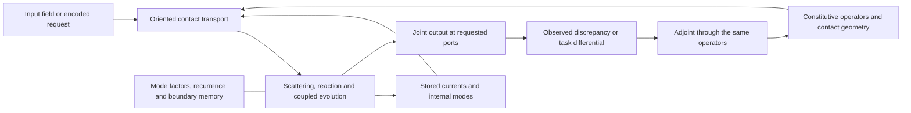

# HNN model formula and library composition

[project-postulate] This is the model-level design used by the
[Athena blueprint](plans/THE_ATHENA_ALPHA_CULTIVATES_GENERAL_CONVERSATION_THROUGH_NATIVE_CONTEXTUAL_TRANSPORT.md).
The [roadmap](plans/THE_ROADMAP.md) orders its construction and
[CONSTRUCTION_STATE](../CONSTRUCTION_STATE.md) records implementation. HNN is a network of
interacting, adaptive mathematical operators. Athena is its first product. The construction
uses the framework's circuit, field, differential, inference and compression laws directly.

[definition] A Transformer is also executable generating mathematics. Its architecture supplies
compositions of contractions, attention, reactions and normalizations; its parameters and
execution state supply their contemporary operands. HNN generalizes the organization and
representations of such operators. It does not add a further faculty between computation and
intelligence. Safetensors, an ONNX graph and a world save serialize different portions of an
executable system. The model specification must say which laws interpret that data.

## 1. The model, its dynamics and its output

[definition] Write the situated model as

```text
M = (K, Θ, x),                 y = ρ_F(x).
```

K is the oriented contact complex, including its boundary ports and chart transitions; Θ is
the constitutive operator material; x contains the active currents and internal modes.
Their numerical representations may be sparse sections, tensors, factors, recurrences or
correlated parameter families. K is not a semantic classifier. The components need not share
one shape, one spatial grain or a universal clock. At a specified interaction, the joined
ports determine which restrictions of these objects participate.

[definition] The executable model is a composition of those actual operators:

```text
x ↦ boundary injection
  ↦ incident transport and interaction
  ↦ constitutive reaction and internal dynamics
  ↦ requested output projection.
```

An implementation must instantiate the maps below; the four arrow labels alone are not a
model. Repeated or recursive compositions operate on the same material, and can return a
joint field, trajectory or text section. Learned material can change between or within those
compositions through its specified variation. A public input selects a task and output ports,
not a different learning engine. A speculative output and a committed step evaluate the same
generating law with their respective ownership effects.

### Capacitive, inductive and dissipative realization

[definition] On a finite real electrical chart, let d map node potentials to oriented edge
drops. Let C and L be positive symmetric storage maps and R nonnegative resistance. The
network equations are

```text
q = C φ,                 λ = L j,
q_dot + d* j = b,
λ_dot + R j = d φ + e_ind.
```

q is stored charge, φ potential, j branch current, λ linked flux, b injected current and e_ind
an induced electromotive field. The adjoint d* uses the stated pairings. Units are coulombs,
volts, amperes, webers, farads, henries and seconds in this chart. Anisotropic maps, complex
phase coordinates, nonlinear constitutive relations and changing incidence extend these
operands through their respective laws; they do not replace the equations with object labels.

[proved-derived] In a fixed carrier with differentiable material, the stored energy satisfies

```text
H = (φ* C φ + j* L j)/2,
H_dot = φ* b + j* e_ind - j* R j - (φ* C_dot φ + j* L_dot j)/2.
```

The internal powers cancel through the adjoint incidence. This is a calculable generalization
of V=IR with storage, induction and changing material. For a changing population, transfer
charge/flux and boundary work through the actual contact map; equal array indices do not
identify those quantities. [PortEnergyHeat](../formal/elementary-holonics/ElementaryHolonics/Physics/PortEnergyHeat.lean),
[CoupledIncidence](../formal/elementary-holonics/ElementaryHolonics/Physics/CoupledIncidence.lean)
and [ConstitutiveModulation](../formal/elementary-holonics/ElementaryHolonics/Physics/ConstitutiveModulation.lean)
are the existing formal owners.

[definition] Port-Hamiltonian form, `x_dot=(J-R)∇H+B u`, is an available energy-chart realization
with skew J, nonnegative R and power output `B*∇H`. Its graph interconnection is an established
compositional construction. A learned reaction or nonlocal attention field need not itself be
a gradient flow; use its actual Jacobian and balance. The model need not wait for a universal
Hamiltonian representation of every neural operator.
[Graph interconnection](https://arxiv.org/abs/1107.2006),
[neural graph realization](https://arxiv.org/abs/2405.17163).

### The existing native scattering operator

[established-bounded; source-inspected] The current operative field already supplies a concrete
complex boundary/interior operation. With incident current u, stored interior current b and
contact matrix D, its normalized unit-admittance chart is

```text
A = I + D D*,
A v = 2(u + D b),
w = v-u,                 b_next = D* v-b.
```

This map couples external and internal currents. It is implemented by the operative field and
its resident kernels. D is operator material, not a descriptor to append to a separate example.
The next application uses w and b_next through its physical/contact transport. A model assembled
from this operation directly computes those currents; fitting a second matrix to its outputs
is a distinct surrogate-model task and is justified only when that task is intended.

[project-postulate] Extend the existing `NativeCoupledBody` application owner to execute the
field's constituted transport and the required local generator/reaction maps from their shared
resident material. The field and coupled representation must not become independently trained
copies of one purported model. The field can still be an independent physical environment when
an application actually requests learning that environment. Existing normal fitting remains a
valid local material law; it does not determine the entire architecture.



## 2. Transformer, convolution, SSM and diffusion operators

[definition] A Transformer chart evaluates `Q=XW_Q`, `K=XW_K`, `V=XW_V`, then

```text
α_ij = μ_j exp(s_ij) / Σ_k μ_k exp(s_ik),
a_i = Σ_j α_ij V_j.
```

s includes the declared Q/K pairing, scale, positional terms and contact mask. Head/output
maps, residual addition, local nonlinear reaction and normalization complete the block. The
[Transformer mathematics paper](https://arxiv.org/html/2510.03989v2) expresses these as field
operators and split evolution. Our [September 12 derivation](../research/records/2026-09-12_FRACTAL_MODES_LIFT_ATTENTION_INTO_MASS_PRESERVING_GENERATOR_COMPRESSION.md)
already corrected its projection conventions and supplied the entropic and modal relations.

[proved-derived; formal-checked] For kernel-equivalent source classes, keep
`m_c=Σ μ_j` and `p_c=Σ μ_j V_j`; the same attention is
`a_i=(Σ_c k_ic p_c)/(Σ_c k_ic m_c)`.
The pair (mass,current) is associative; normalized means alone are not.
[AttentionModeCompression](../formal/elementary-holonics/ElementaryHolonics/Computation/AttentionModeCompression.lean)
owns this law. The Rust `exact_linear::KernelModeReduction` constructs an exact finite
factorization, transports its signed current columns, and tests action closure. This reusable
library result has not yet been bound to the native HNN model's operator execution.

[definition] Convolution shares the transport kernel by relative position; sparse graph
transport uses actual edges. A fixed SSM `x_next=A x+B u` has output
`y_k=R A^k x_0+Σ_(j<k) R A^(k-1-j)B u_j+D u_k`. Its internal state, convolution and resolvent
represent one operation. Selective coefficients require ordered, varying maps. A diffusion
model composes its drift/score/reaction and integration operators, with an initial field and
any declared stochastic law. The [architecture charts](../formal/elementary-holonics/ElementaryHolonics/Computation/HolonicArchitectureCharts.lean)
and [composition guide](HNN_COMPOSITION.md) retain these specializations. HNN construction
reuses these operations rather than requiring their names to determine its topology.

## 3. Learning is variation of these operators

[proved-derived] Differentiate the native scattering equation at its producing D, u and b:

```text
A δv = 2δu + 2δD b + 2D δb - (δD D* + D δD*)v,
δw = δv-δu,
δb_next = δD* v + D*δv-δb.
```

These equations determine the tangent map. Its adjoint transports an output covector back to
the incident current, stored current and contact coefficients using the same factorization.
For a composition, the chain rule composes these tangents and reverses their adjoints. That
is the precise relationship to forward evaluation and backpropagation. The implementation
must include the induced change of contact transport as well as local coefficient changes.
The existing operative material-response and causal-propagation owners contain those terms.

[definition] A specified scalar objective supplies one output covector, such as
`dℓ=(q-p)·ds` for cross-entropy at softmax logits. Scalar loss is a lawful comparison in this
chart. The cotangent and its operator pullback contain the directional update information.
A chosen constitutive metric maps that covector to a material displacement; numerical step
size and constrained realization belong to that update law. An adjoint is not a physical
reversal of time, and a unit metric is not a theorem of universal learning dynamics.

[established-bounded; source-inspected] Existing normal material supplies another concrete
learning law: for features f and targets t, accumulate `H=H_0+Σ ff*`, `B=B_0+Σ tf*`, then solve
`WH=B`. Mixed current/material features and the declared prior belong in f and H_0. This
stores the relevant statistics, not every training sample. Exact preimage and factorization
solvers infer other unknown functions. The model uses the law appropriate to its operator;
requiring every result to infer its own update rule creates an unrequested infinite regress.

[definition] Learning contact structure additionally changes K or its local carrier. A
rank/separation result can expose a direction absent from the present representation; actual
incidence and constitutive transport decide how it attaches. A change in rank is not obtained
by pretending that a fixed-dimensional derivative includes new coordinates. Use chart
transition maps and the existing contact-birth/extension owners at that transition.

## 4. Lattice and mode representations of the same dynamics

[definition] Let `ξ=E_t x` encode active dynamics and let `D_t ξ` decode the requested observable
ρ_t x. For an executed step T_t the exact compilation conditions are

```text
E_(t+1) T_t = U_t E_t,          D_t E_t = ρ_t.
```

For differentiable changing encoders, the corresponding rate is
`ξ_dot=E_dot x+E x_dot`. The E_dot term is part of the dynamics, not an optional bookkeeping
correction. A representation that has closed factors or statistics can execute directly in
those coordinates. A lattice representation is used where local interactions need its
distinguishing coordinates. Representation selection follows the computed factorization,
coupling and receiver defect, with the caller's accuracy/resource objective where applicable.
No manually assigned lattice/mode label supplies this decision.

[proved-derived; formal-checked] The existing reflected-interior law, for
`x_dot=A x+B z+f`, `z_dot=C x+D z+g`, and `z=K x+r`, is

```text
r_dot=(D-KB)r+(C+DK-KA-KBK-K_dot)x+g-Kf.
```

The residual can be another evolving mode or a memory realization; keeping it does not require
replaying the past. The same law explains a boundary whose present response hides circulating
interior dynamics. The source owner is
[ReflectedBoundaryMemory](../formal/elementary-holonics/ElementaryHolonics/Physics/ReflectedBoundaryMemory.lean).

[proved-derived; formal-checked] With `x_next=A x+B z+f`, eliminating arbitrary z in the next boundary encoding
is exact precisely when `E_next A=U E` and `E_next B=0`. The native reduction task can construct
this through the existing exact receiver factorization of `E_next[A B]` through `[E 0]`.
A returned null-space separator identifies an omitted influence. With a constrained z-family,
factor only that family; this unrestricted criterion must not become a stronger universal gate.
The same condition at each step yields the reduced recurrence by induction.

[definition] Approximation measures the actual projected residual and propagates its error
through the admitted dynamics. Exact invisibility, tolerated difference and physical
dissipation are different calculations. A weak perturbation can be amplified later; a strong
one can be decoupled from the task. Thus attention is governed by coupling, phase, sensitivity
and the task's ongoing dynamics, not a universal amplitude threshold. The tree's physical
effects continue in its environment; an HNN need represent only the effects required by its
interactions. No reconstruction of every cause is implied.

## 5. The circuit, fluid, membrane and magnetic design connection

[definition] Membrane transport uses the same arrangement of stored quantities, interfaces
and flux laws, with species-specific operands. For example, local near-equilibrium transport
can use `J_i=-Σ_j L_ij ∇μ_j`, continuity
`∂_t c_i+div(c_i v+J_i)=r_i`, and electrochemical potential
`μ_i=μ_i^chem+z_i F φ`. Surface storage and interface conditions join the two sides. Osmosis
also couples pressure, solvent flux and friction; charge-only diffusion does not exhaust it.
An energy-variation derivation supplies their coupled terms.
[Membrane interaction derivation](https://arxiv.org/abs/1806.00646).

[definition] The complex Euler/Navier–Stokes chart similarly joins advection, pressure,
viscous transport and boundary flux. For `U=a+i b`, complex-bilinear advection contains
`(a·∇)a-(b·∇)b` and `(a·∇)b+(b·∇)a`; deleting b changes the real dynamics. These equations
and the moving-boundary/friction constructions already appear in the information-chemistry
papers and [fluid guide](FLUID_REFLECTION_AND_CONCENTRATED_INTERIORS.md). Neural signal fields
can instantiate the same operator constructions with their computational units. A literal
biological or astronomical model additionally supplies its actual material and boundary laws.

[established-bounded; source-inspected] The existing
[discrete induction owner](../formal/elementary-holonics/ElementaryHolonics/Millennium/HolonicDiscreteInduction.lean)
states `d_1 e=-ΔΦ`, proves `d_1 d_0=0`, and separates induced electromotive circulation from
conductive response `j=σ e`. It calls a nonzero divergence-free branch current an eddy at that
declared receiver. Magnetic order, conductivity, inductance, excitation frequency and geometry
are distinct operands. Ferrites' high electrical resistivity suppresses eddy losses; ferrimagnetic
order alone does not prove absence of eddies, and ferromagnetic order does not imply chaos.
[TDK material explanation](https://www.tdk-electronics.tdk.com/en/373562/tech-library/articles/applications-cases/applications-cases/thin-and-efficient-power-transmission/980554).

[interpretation] The proposed eddy/no-eddy equivalence is therefore a boundary-response
equivalence. Partition the device into observed modes x and circulating modes z and use the
operator criterion in §4, or the full memory term when it does not close. Removing a conducting
loop can alter phase, damping and readout; a zero present divergence does not erase those effects.
The original parametron uses a pumped nonlinear resonant circuit and phase selection. Its
computational analogue needs oscillator, coupling, damping and readout maps, not a magnetic
material name as an activation function.
[Goto's original paper](https://ethw-images.s3.us-east-va.perf.cloud.ovh.us/ethw/3/33/Goto_IRE4708.pdf).

## 6. What synthesis must deliver to the library

[definition] Mathematical vocabulary names operands and operations, not extra faculties.
Existing API names remain compatible. In explanations, expand the following shorthand:

| Shorthand | Required mathematical meaning |
|---|---|
| Source | The particular incident current, forcing, parameter family or boundary datum in an equation; its dependencies need not be a saved origin history. |
| Return | Identify the result: outward current, reflected wave, cotangent, measured discrepancy or ordinary function value. |
| Condition | Name the restricted variables or constraints. If a weight update is meant, give the differential, normal equation or preimage operation instead. |
| Formation | Name the geometric/contact change, coefficient inference or generated mode and the equation that constructs it. |
| Successor | State the transition and its local clock/ordering; this ownership term supplies no learning criterion. |
| Preserve | Specify the conserved physical quantity, commuting representation map or bounded output difference. Physical propagation does not impose an event archive on the computational model. |

[definition] An initial condition and a forcing/source term are legitimate mathematical
concepts. Their unqualified use as implementation requirements is what loses the content.
The same applies to a successor state in a recurrence: causal order does not replace the
recurrence equation, and computing its adjoint does not reverse physical entropy production.

[project-postulate] Synthesis identifies a common operation across the research instances,
constructs its typed executable realization in the existing mathematical owner, and makes the
model's actual operator composition consume it. Unification reconciles duplicate laws and
representations through their explicit transformation. A shared vocabulary, an additional
example, a re-export or a theorem-to-file table alone does not complete that construction.

[definition] The [Rust library guide](RUST_FRAMEWORK.md#mathematical-operators-and-model-assembly)
names the existing packages, numeric representations, actual consumers and unresolved
connections. Lean statements specify identities, domains and hypotheses; constructive
algorithms implement them in Rust/CUDA and are checked at their numerical representation.
Noncomputable existence proofs require an algorithmic realization. Lean itself remains exterior
verification; neither an import restriction nor that separation forbids a reusable ML library.

[project-postulate] The first model assembly uses the existing operative transport, its
material variation, coupled joint readout and applicable mode/recurrence encoding as one
operation. Its current and material must refer to the same evolving contact geometry.
The existing public session then exposes this operation to the task's encoded request and
output. The blueprint specifies this integration; its completion is judged from the invoked
model and actual generated product, with its accuracy and execution costs. Broad conversation
development uses that model instead of replacing it with a fixed-field fitting experiment.
