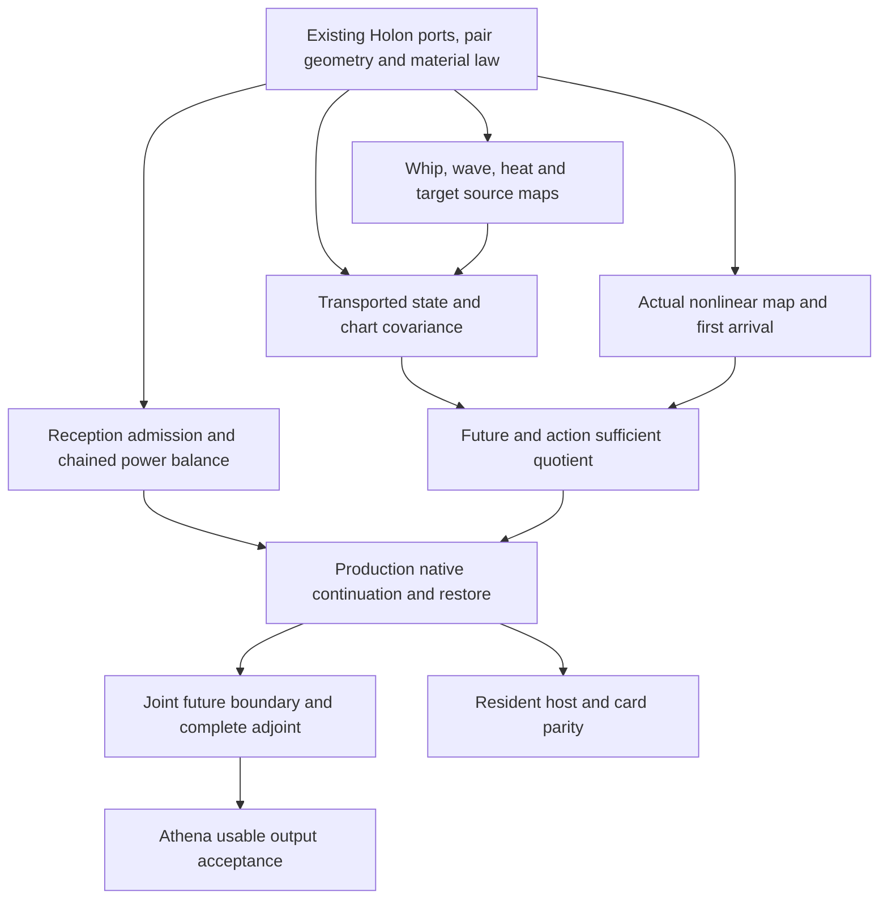

# HNN and Athena: the common foundation and its consuming joins

**Date:** October 4, 2026 (morning source reconciliation). **Disposition:** local consolidation; Claude paused;
no training, external issue mutation, push or merge. **Refs:** [#63](https://github.com/brandonrdug/holonics/issues/63),
[#73](https://github.com/brandonrdug/holonics/issues/73), [#62](https://github.com/brandonrdug/holonics/issues/62),
[#148](https://github.com/brandonrdug/holonics/issues/148).

[project-postulate] Brandon's October 3 request is to complete the common mathematical and
computational models, align HNN/Athena construction, and give Claude breadth for independent
derivations. This supplement supplies the operands, constructive reductions, consuming paths,
acceptance and reconciliation points. [THE_REBUILD](THE_REBUILD.md) remains the one construction
order; [ELEMENTARY_OBJECTS](../ELEMENTARY_OBJECTS.md) owns the definitions. The
[Typst manuscript](../../research/papers/source/papers/hnn-athena-foundation/main.typ) presents
the mathematics, rather than replacing the plan or its source owners.

## Morning architecture: geometry, asymmetric potential and changing navigators

Brandon's framing is **geometric dynamics on a network**, an **asymmetric potential
model**, and coupled changing “generators”: the elementary object's name for the latter
is **navigators**. Interacting motions change the constitution they subsequently meet,
while retaining enough state for a receiver to distinguish the consequences. HNN executes
part of this composition; Athena must turn it into useful autonomous conduct. The inspected
public source below is `9a62a685`. The reviewed geometry source is integrated once in
local `3a242c99` and in the reviewed single integration snapshot on public `9a62a685`.
The local root's runtime has not been promoted to that public base.

**Geometry supplies the actual relation between motions.** Parametron rings and
helical pair contacts carry configuration, momentum, phase and local clocks.
The pair's coframed slip and its derivative determine contact forces and material
forms ([helical pair owner](../../lean/Holonics/Transport/HelicalPairInteraction.lean)).
Frames and metrics determine what a receiver reads. Physical geometry changes keep
their work; coordinate changes transport state and metric together. A port selects
effort/flow exchange variables at a modelling
cut, with their pairing giving power. Collision and slip belong to contact relations;
resonance belongs to the mode/drive relation. Ports do not serve as an umbrella for
these interactions, and distributed coupling needs no device endpoint.

**The asymmetric potential is a concrete constitutive proposal.** Section 2 gives
`V(z)=κz²/2+αz³/3+βz⁴/4` on a declared coframed contact coordinate, with positive
κ,β and nonzero α. Its forces and curvature are explicit; its Hessian stays symmetric
despite `V(−z)≠V(z)`. Directed active force and asymmetric receiving comparison have
different laws and work. The native
[propagation owner](../../crates/holonics/src/hnn/propagation.rs) presently consumes
quadratic contact storage, stiffness and dissipation. The nonlinear potential,
changing geometry and incidence growth still need their actual native consumers.

**Coupled changing navigators mean continued dynamics with reached learning.**
The source enters as phase-carried moments. An actual ratio comparison returns its
covector through the operands that produced the motion, and certified deposition
changes the reached constitution. The existing
[continuation chain](../../crates/holonics/src/hnn/word/continuation.rs) carries a
contact-C change into the next exact propagation with momentum held. Pumps also supply
declared time-dependent material. General coefficient/geometry adaptation must extend
this same chain, including its work and adjoint. Existing
[clocked first arrival](../../lean/Holonics/Computation/HolonicRecurrentEcology.lean)
and [billiard Fold](../../lean/HolonicsResearch/Transport/Fold.lean) supply their stated
population and reconstruction laws. Native adaptive fractal evolution must consume
its actual family and restriction square. Retention identifies only differences no admitted future
receiver/action can distinguish, so a presently silent motion may still be retained.

**The nine selected formal results make two needed joins precise.** In the complete
patched Motion owner, `finite_work_form_rechart` and `affine_quadratic_work` transport
finite storage change and keep affine source cross/self work. In FrameTransport,
`tube_section_area_vector` and `tube_section_flux` supply the oriented receiving face;
`tube_section_hasFDerivAt`, `tube_section_fderiv_first`, `tube_section_fderiv_second`,
`tube_section_actual_area` and `tube_section_actual_flux` derive and consume its actual
polynomial section derivative. Complete-owner and combined-import checks passed in the
isolated snapshot; the canonical local sources now match those exact checked bytes and
remain imported by `Framework/Geometry`. These joins prevent a picture or coordinate
change from standing in for producing geometry or material work. Full moving-volume
continuity and a native physical receiving decoder remain separate consuming equations.

**The Claude takeover retains real improvements and fixes their remaining boundaries.**
Current reception carries motion by default, ChainedBalance prices the complete declared
chain, and the merged host passage owner restores material plus continuing passage.
The audit proposes restoring a temporary card opening before later fallible
reads; whole refusal-state atomicity remains wider. Cold continuation omits the one
Arrived comparison and the address reader's held contact kinds. An ingest can reach
close without another compare, so refusing only already-awaiting saves cannot fix the
admitted future. Reflected motion also needs its actual signed receiving participant
or a certified matched boundary. Two admitted development compile stages stopped
before a successful normal-library codegen artifact or test executable. A separately
bounded Rust static check then passed for the normal library and the original frozen
save-before-close fixture. The later cold-restore-v3 check passed for the normal host
library, cfg(test) host library and resident_cold_restore integration target, with zero
compiler errors and no fixture execution. V3 is joined with the reviewed geometry in
the same 9a source snapshot; its explicit atlas correction awaits independent review.
The original fixture and the V3 regressions have not run. Claude remains paused.

Athena advances when these relations support a source-conditioned joint release whose
transformation grain and keys were induced by the machine, followed by useful autonomous
continuation and durable state. Current text output remains incomplete/non-legible;
law checks and restore fixtures do not provide that output.

### Remaining gates and the next owned work

All coding below targets the single owned integration snapshot at
`.local/hnn-athena-foundation/public-forward-9a62a685/snapshot`, pinned to
`9a62a68515ebc824d583539e53b1a2d5973a82a3`. Forward09 review passed; its 36 outputs
were reused without a second application. Combined11 adds the nine V3 paths on the
same base, with all eight Rust outputs equal to the statically checked sources. The
45-path candidate preserves the public receiving-prior update and adds **three
record links plus three blank lines**. Its separate atlas correction replaces the
superseded hnn.resident-passage row instead of duplicating it and awaits independent
review. This is still a sparse source snapshot, not a complete Cargo source closure.
Add needed native owners verified from that same tree here before coding; frozen
native-ready and the old root remain preserved. Each owner then returns its exact
change and consumer receipt on this base.

| Gate | Current state and evidence limit | Next owned change and fixed acceptance |
|---|---|---|
| One source and a legitimate native check | Nine declarations have complete-owner/import checks and shared source bindings on 9a; cached dependencies were sealed, not rebuilt. The V3 normal host library, cfg(test) host library and resident_cold_restore integration target pass static checks on the exact candidate Rust bytes. Two full-codegen stages and the first V3 static stage stopped; no executable or fixture runtime is established. | Admission/pruning owner locates codegen cost and changes the lawful owner/check partition, retaining actual consuming calls. Changed source/cache/config and each selected check need their own sealed fixed cost read. No further codegen retry, borrowed executable or raised ceiling follows automatically. Complete the native source closure in this same 9a snapshot; static compilation does not pass the runtime acceptance. |
| Future-sufficient host save and cold card continuation | V3 sources carry bounded Arrived, held address-reader kinds, the declaring family, optional/no-moment state and chosen handles/readings. Exhausted host handles and invalid nonempty/empty-window cursors refuse in the checked source. Patch applicability and normal/cfg(test)/integration static validation pass; runtime equivalence remains open. Card ExposedResident::continuing remains unimplemented. | Existing restore owner consumes the prepared regressions at reference.rs, reference/passage.rs, pending.rs, receiving.rs, moment.rs and resident_cold_restore.rs under an independently admitted changed native partition, then extends the same state relation to the card. Immediate close, ingest→carry-out→close and no-moment/empty-family cold cases must match without live borrowing; checksum-valid malformed shape/rank/targets, exhausted handles and invalid cursors must refuse before publication. Preserve nonempty stimulus gates; the held-kind fixture proves serialization only until an actual production-deposition crossing runs. |
| Whole refusal-state publication | The opening-only card patch protects one operand projection. The finite model and prepared card fixture omit live chart/operator/store and landmark effects; they cannot certify whole Resident atomicity. | At card `port.rs`, `store.rs`, `tree.rs`, prepare detached candidate chart/operator buffers and landmark mirror, with actual capacity/copy residency accounted for. Publish all owners only after fallible reads succeed. Inject reread/refinement/tree/receipt refusals and preserve committed material, carry, charts/operators, arena and balance; report attempted exterior traffic/work. Preserve the mirror invariant; moving a fallible upload alone cannot prove it. |
| Signed phase return at the declared boundary | `word.rs` carries transmission but reads reflection through scalar energy. An energy-preserving sign change can alter the later phase face. The independent boundary Lean draft remains unelaborated. | Declare the actual reflected-wave receiver and consume the complex return, or certify its matched absorption relation. At `ReceptionCarry` and its next receiver, check oriented effort/flow and work plus an actual later phase reading. The existing sign/quarter-turn witness must separate the defective return; scalar energy alone cannot pass. |
| A reached storage change causes the next reading | Native carried/contact improvements and focused continuation exist. The new isolated fixture has not run; vanished adoption or a changed face caused by other loci cannot establish this causal chain. | Existing fixture owner rebases its actual `compare_contact_storage→Deposit→ContactCut::continue_deposited` consumer here. Require nonvanishing C adoption, held momentum, zero opening defect and independently computed `W_phys=(8/729)E_*(1/C'−1)`, followed by changed complete ReceivingPhases with remainder/fibre. Do not select C' or duplicate the fixture. |
| Actual adaptive nonlinear family and joint release | The section geometry is proved; the quartic potential is proposed. General nonlinear coefficient/geometry adaptation, native physical receiver decoding and the adaptive future quotient remain consuming joins. | Extend the existing forward/adjoint at its actual material locus with its reached work, family/restriction and receiver squares or residuals. Consume `qT=T̄q` and deposition/action descent for the admitted future. The same induced keys must release one compatible requested boundary and continue autonomously; a decorated linear motion or teacher-forced next face cannot establish this. |
| Useful, durable and affordable Athena | Text output remains incomplete/non-legible; the diagnostic evaluation split is closed. Restore/law receipts are not useful-output or power measurements. | Application owner shows the actual autonomous output whole, with truthful health, compatible fibre/keys, atomic transition and cold restore. Then measure the executing owner/partition against its passage budget. Text, image, acoustic and motor keep the same laws through boundary charts; no authored answers or new reading of the spent evaluation partition. |

The five compiler operations (two stopped full-codegen stages, the original static
pass, the stopped first V3 static stage and the completed V3 static check) consumed
cumulative dedicated-group CPU `72,568,518,000 = 2⁴·3·5³·11·1099523 ns` and summed
stage wall `74,256,992,229 = 3·7²·7993·63199 ns`, excluding review/preparation gaps.
Maximum sequential group peak was `1,574,481,920 = 2¹²·5·11·29·241 bytes`. These are
accumulated costs; individual ceilings stayed fixed, with no global-budget claim.
The completed V3 receipt is `9660d2c25161ea47dcfb689581a921d244d2de85af677eabe0cfad0fb99dcf26`;
its patch binding and all eight checked Rust source identities were independently
read and matched during source integration. Static success establishes Rust type
validation, not regression outcomes, retention correctness or product acceptance.
No fixture executable/runtime is established. V3 retains a declared physical future
and chosen state/handle readings; historical timing/tally equality and universal
malformed-input correctness are outside its contract. The detached-state card repair
remains a proposal. The Frame postcheck retains its recorded qualification: complete
metadata was checked under a CPU limit without an outer wall timeout. This source
integration/documentation step launched no compiler or product run. The static-check
result belongs to the admission owner's terminal receipt.

## 1. Evidence boundary and the existing construction

The local patch remains based on `3a242c990e2fc5bfd31fea7c194372168db8ba09`.
The latest inspected read-only public-main snapshot on October 4 is
[`9a62a68515ebc824d583539e53b1a2d5973a82a3`](https://github.com/brandonrdug/holonics/commit/9a62a68515ebc824d583539e53b1a2d5973a82a3).
The earlier October 3 public snapshot `5f6a1012` and PR #280 head `58981f60` remain
historical evidence, not current status. [PR #280](https://github.com/brandonrdug/holonics/pull/280)
merged at revised head `58e4707e2aa1744112d6ad7678e12fcbb4830bca`, merge `b3408831`.
Its earlier double-subtraction and held-out apparatus were revised before that merge.
This source refresh does not pull or replace the local checkout.

[executable, source-inspected] Current public
[`Reference::new`](https://github.com/brandonrdug/holonics/blob/9a62a68515ebc824d583539e53b1a2d5973a82a3/crates/holonics/src/hnn/reference.rs)
defaults to `Reception::Carry(Absorption::Nothing)`; rest is the complete-absorption limit.
[`ChainedBalance`](https://github.com/brandonrdug/holonics/blob/9a62a68515ebc824d583539e53b1a2d5973a82a3/crates/holonics/src/hnn/word.rs)
reads source absorption once, held-momentum deposition, emitted ingest, imposed source,
resonator storage, opening split and residual; its `closes` and `dissipative` predicates
have actual [host fixture consumers](https://github.com/brandonrdug/holonics/blob/9a62a68515ebc824d583539e53b1a2d5973a82a3/crates/holonics/src/hnn/tests/reference.rs).
[`mount_continued`](https://github.com/brandonrdug/holonics/blob/9a62a68515ebc824d583539e53b1a2d5973a82a3/crates/holonics/src/hnn/reference.rs)
mounts the saved constitution and carry, then restores its passage. The actual
[`reference/passage.rs`](https://github.com/brandonrdug/holonics/blob/9a62a68515ebc824d583539e53b1a2d5973a82a3/crates/holonics/src/hnn/reference/passage.rs)
consumer carries lift, open source moment, aeon, balance, charts, address and admitted ranks.
It refuses pending ratios/staged deposits, stopped deposition and more than one open moment.
The [saved-passage fixture](https://github.com/brandonrdug/holonics/blob/9a62a68515ebc824d583539e53b1a2d5973a82a3/crates/holonics/src/hnn/tests/reference.rs)
round-trips the exact text, mounts on the same declared founding field, and checks continuation
against the whole run across aeon close. Malformed moment text refuses. This is a real host
join; its admitted cut/window and refusal scope remain part of its claim. No fresh Rust
execution is claimed by this foundation step. PR #353 merged as `ec659feb`; its independently
inventoried local GPU receipt on `a1f6ec15` reports 40 (= 2³·5) passed and zero failed. The
[author report](https://github.com/brandonrdug/holonics/pull/353#issuecomment-5977171799)
of 988 (= 2²·13·19) host tests is separate evidence, without a raw local host receipt here.
The card `ExposedResident::continuing` defaults to `None`; that GPU receipt therefore does
not establish card resident-passage restore. Neither receipt establishes Athena acceptance.

[proved, existing Lean] Public
[`HNN/ChainedBalance`](https://github.com/brandonrdug/holonics/blob/9a62a68515ebc824d583539e53b1a2d5973a82a3/lean/Holonics/HNN/ChainedBalance.lean)
now owns `opening_one_baseline`, `reception_dissipative`, `chain_telescopes`,
`chain_dissipative_certified`, `ingest_emits`, `opening_split_eq` and the stated
singular-hold obligations it discharges. Its supply, positivity and residual hypotheses
remain part of each theorem. The original local source links below are pinned premises;
these explicitly current public joins supplement them. Motion and FrameTransport are
byte-identical between this public head and the local checkout. The public corrections to
authored chase planning and fixed-form text grading remain attached.

Evidence tags used here have precise meanings:

| Tag | Meaning in this supplement |
|---|---|
| **Proved, existing Lean** | The named statement exists with its stated proof and hypotheses; new isolated checks are identified separately. |
| **Executable, source-inspected** | The named Rust owner and consuming call exist. Earlier checks retain their own receipts; this documentation step reruns no training or native continuation. |
| **Derived, unformalized** | The displayed calculation proves the stated relation under its hypotheses; its consumer/formal bridge is not thereby built. |
| **Proposed** | An explicitly named construction or acceptance still requires a derivation or consuming implementation. |

Historical records, including the pre-reset tree `13f8c734`, locate mathematics and failures.
Their former applications are not restored by this supplement. Private target work and private
product outputs are outside the publication boundary. No unified physical theory or RH solution
is claimed.

The central existing consumer is
[`hnn/word/continuation.rs`](../../crates/holonics/src/hnn/word/continuation.rs):
`Word::open_source → compare_contact_storage → ContactCut::continue_deposited → Word::continuing`.
The source, current, producing constitution, comparison, reached deposit, end change, pump phase
and next clock are bound by the owner. The focused
[`reference/continuation.rs`](../../crates/holonics/src/hnn/reference/continuation.rs) consumer
changes contact **C**; K, D, coupling conductance, ring, pump and source/receiver declarations
remain fixed in that example. A later exact propagation responds; the lattice counterpart retains
changed solve remainders even when its next representative is unchanged. This is a real native
learning/continuation join, with bounded scope. It is not a fully adapting constitution or a
complete durable production `Resident` acceptance. The newer passage owner above supplies a
separate source-inspected host join rather than making complete-state restore absent.

The comparison keeps the producing operands: `ℓ=log R`, `R⁻¹dR`, and the declared
grain representative covector `p̃−q`; its negative is the descent covector. The real
cross-entropy face alone does not carry the phase branch. The source enters as phase-carried
moments `m_g=Σ_k Ĝ_g(τ_g(k))⁻¹ E_g(u_k)`, whose adjoint returns through the same producing
navigators without retaining a per-occurrence tape. Any deposition step also keeps its
certified admissible step, positive constitution and actual reached locus; a later comparison
is read through the contemporary constitution. These are the
[learning and retention contracts](../ELEMENTARY_OBJECTS.md#8-deposition), not additional
learner machinery.

## 2. The common constitution, geometry and interaction

[definition, existing guide] The law is
`H=(K,∂_A; Π; 𝒟; 𝓔; G_nav; π)`, not a vector of state. Its ket is an admitted motion.
A cut presents its current/storage coordinates `x`, contemporary constitution `Θ`, frame and
metric, incidence, lifted navigator phases/clocks and unresolved fibre. These operands define
one continuation; retaining a list of cuts would not establish retention. Here `G_nav` denotes
the navigators; `G_R` below denotes a receiver's metric. The distinct operands must not share an
unqualified `G` in an implementation brief.

**Geometric dynamics on a network** names this composition of complexes, parametrons, pair
contacts, tubes and receivers. **Asymmetric potential model** names a question about its
constitutive/receiving relations. These user-adopted names do not add object types or an alternative
ontology.

[definition; source-aligned clarification] A port is a selected effort/flow exchange
representation at a chosen modelling cut. It is not the name of every interaction. Distributed
coupling can remain an element relation on incidence and material. A receiver is the participating
Holon that reads; sensitivity is the derivative of that reading; coupling is the actual relation
that changes the motion; resonance is a declared mode/drive relation. In a linear receiving chart,
`|Σψ_i|²=Σ|ψ_i|²+2Σ_{i<j}Re(ψ_i*ψ_j)` reads phase interference. It does not assert
superposition of solutions of a nonlinear coupled evolution. Affinity needs its declared
receiving pairing or metric. A device endpoint is not required by these distributed relations.

For one positive quadratic storage chart, put

```text
E_Θ(x) = ½ x* Q_Θ x,         e = Q_Θ x,
ẋ = (J − R + L)e + B u,     J* = −J, R* = R ⪰ 0.
Ė_Θ = −e*R e + Re(e*L e) + Re(e*B u) + ½ x* Q̇_Θ x.
```

The skew effort-to-flow term cancels in this power pairing. The active relation `L`, input
port and changing material keep their work; passivity requires a bound on them. The existing
[`Holon/Deposition.learned_energy_balance`](../../lean/Holonics/Holon/Deposition.lean),
with [Holon ports and Dirac structure](../ELEMENTARY_OBJECTS.md#the-holon-as-one-object),
is proved for real matrices with transpose. The displayed Hermitian/real-part version is a
derived analytical extension; this supplement asserts no checked complex realification bridge.
Singular storage, nonlinear relations and discrete scattering have their own stated laws.
For a contact mechanical chart,
`E=½(w* C w + u* K u)` and `w=du/dτ`; C is inertia/inductance-like under that declared port
realization. It is not universally capacitance because a symbol was called C.

For the helical pair, preserve both navigators' initial configurations, clocks and frame:
`ξ=(ω,v)`, `V_ξ(x)=ω×x+v`, `Δ=x_a−x_b`,
`J_pair=[V_a | −V_b]`, `DQ=2 J_pair* Δ`, and
`M_contact=Σ_f w_f J_f* D_f J_f`. A positive contact form dissipates attainable slip; zero
dissipation implies zero slip only where the material is definite on that slip space.
Owners: [helical guide](../HELICAL_GEOMETRY.md),
[`Transport/HelicalPairInteraction`](../../lean/Holonics/Transport/HelicalPairInteraction.lean),
[`geometry/screw.rs`](../../crates/holonics/src/geometry/screw.rs),
[`holon/contact.rs`](../../crates/holonics/src/holon/contact.rs).

### Recharting changes components; deposition changes the law

For `ẋ=A x+s`, `E_R=½x*G_R x`, define
`Σ_R=A*G_R+G_R A+Ġ_R`. Under an invertible differentiable rechart `x'=P x`,

```text
A' = P A P⁻¹ + Ṗ P⁻¹,   s' = P s,   G_R' = P⁻* G_R P⁻¹,
Σ_R' = P⁻* Σ_R P⁻¹,     E_R'(x') = E_R(x).
```

[derived, existing record; partial Lean bridges] Differentiating `P⁻¹P=I` supplies the two
metric-derivative terms cancelling `ṖP⁻¹`. Hence the rate form's inertia is chart invariant:
its counts of negative, positive and zero directions, and instantaneous source-free energy-rate
signs, are preserved under the same transported receiver. This establishes neither long-time
contraction nor asymptotic neutrality nor persistent eigendirections. Changing a physical receiver or constitutive relation is
a different operation. The
[shadow/egg record §5](../../research/records/2026-09-26_THE_SHADOW_IS_THE_RECEIVERS_KERNEL_AND_THE_EGG_IS_TWO_RINGS_IN_RELATIVE_MOTION.md)
owns the full calculation; [`Geometry/Motion`](../../lean/Holonics/Geometry/Motion.lean) owns
the moving-metric energy reading and
[`Foundation/CausalChord`](../../lean/Holonics/Foundation/CausalChord.lean) its congruence bridge.

At a material change with unchanged physical state,
`W_dep=E_Θ'(x)−E_Θ(x)=½x*(Q_Θ'−Q_Θ)x`. At a simultaneous coordinate rechart use
`E_Θ'(P x)−E_Θ(x)` with the transformed material; a pure rechart has zero material work.
`ContinuationReceipt` already separates `before`, `committed`, `deposition_work`, `opening`
and `opening_difference`. Its exact identity is
`committed−before=deposition_work`. Broader ring/pump/source changes need transported state
and a new consumer; they cannot be silently admitted as contact changes.

### Finite endpoint work and an actual nonlinear tube chart

[proved-derived; formal-checked in isolated development] Two checked statements target
existing [`Geometry/Motion`](../../lean/Holonics/Geometry/Motion.lean):
`finite_work_form_rechart` and `affine_quadratic_work`. The isolated development module compiles
without warnings or `sorryAx`. The exact reviewed source is now inserted in the local owner;
its complete-owner and combined-import checks are recorded in the
[finite-work record](../../research/records/2026-10-04_FINITE_STEP_WORK_AND_GAIN_TRANSPORT_BETWEEN_ENDPOINT_CHARTS.md#complete-actual-owner-and-combined-import-checks-october-4).
For
`y0=P0 x0`, `y1=P1 x1`, `Vk=Pk⁻¹`, `x1=T x0+b`, and symmetric ending form G1:

```text
F = TᵀG1T−G0,         F_hat = V0ᵀ F V0,
2ΔE = x0ᵀ F x0 + 2x0ᵀ TᵀG1 b + bᵀG1 b.
```

The chart identity needs only the ending left inverse; symmetry belongs to the affine
cross-term equality. A real gain certificate transports by the same congruence, with
initial invertibility needed for its reverse implication. Material work, source work and
an unresolved opening residual remain separate operands. Seven exact rational fixtures
include a present-silent, future-visible quarter-turn: energy neutrality is not retention.

[derived; pointwise area/current algebra formal-checked in isolated development] A smooth
spatial tube can be constructed on a C3 unit-speed embedded spine c(s), with a proper C2
frame `(t,d1,d2)`, curvatures κ1,κ2 and normal-frame rate Ω. For the disk `u²+v²<1` set

```text
h=1+εu, q1=a u h, q2=b v h, X=c+q1 d1+q2 d2,
ν=1−κ1q1−κ2q2, p1=∂s q1−Ωq2, p2=∂s q2+Ωq1,
F = [t d1 d2] [[ν,0,0],[p1,a(1+2εu),0],[p2,bεv,bh]],
g=FᵀF, J=det F=ν ab(1+εu)(1+2εu),
∂uX×∂vX=ab(1+εu)(1+2εu)t.
```

Positive a,b, `2|ε|<1` and ν>0 make this chart locally regular; global embedding and
seam/gluing conditions remain additional hypotheses. Taper and twist remain in the
metric through p1,p2. The induced Euclidean interior metric is locally flat; boundary
curvature is a different reading. This chart supplies no stiffness, dissipation or pump.
The actual [`FrameTransport`](../../lean/Holonics/Geometry/FrameTransport.lean) source
compiled directly into isolated objects. The two checked new lemmas
`tube_section_area_vector` and `tube_section_flux` import that owner, without a second
frame proof. Five further accepted isolated declarations construct `tube_section_chart` and
its actual `HasFDerivAt`, identify both `fderiv` coordinate columns, and derive
`tube_section_actual_area` and `tube_section_actual_flux` by consuming those same columns.
The fixed-spine-position polynomial derivative needs no positivity, embedding or C2 spine
hypothesis; c, frame, a, b and ε are constant in that transverse proof. All five audits use
only `propext`, `Classical.choice`, `Quot.sound`, without warnings/errors/`sorryAx`. The exact
source hash is `0af342373beaff8bd637c23803180897b14a758e408beb4f76968b0967bdb66d`.
The longitudinal derivative, full 3D cofactor/Piola and moving continuity theorem remain
derived rather than formalized. Their existing analytic destination is
[`Transport/ChangingReceiver`](../../lean/Holonics/Transport/ChangingReceiver.lean), whose
current affine one-dimensional law retains its scope. For a moving chart w=∂τX and actual
continuity current j, the derived relative section flux is
`j_hat^s=ab(1+εu)(1+2εu)(j−ρw)·t`. An HNN consumer still owes its ring/contact-to-tube
decoder, material law and independently computed physical work.

### Exact dimensions and the decoder square

[derived and exact-witness checked; native decoder proposed] The authoritative dimensional
owner is [`Physics/HolonicTypedOriginDimensions`](../../lean/Holonics/Physics/HolonicTypedOriginDimensions.lean):
source and receiver time exponents remain distinct; their conventional time shadow is
noninjective. Unit agreement does not replace clock, branch, orientation, quantity role or family.
For physical `s:L` and dimensionless u,v, the derivative columns have units `(1,L,L)`,
`J:L²`, and `J ds du dv:L³`. Consequently `g_ss:1`, `g_su:L`, `g_uu:L²`.
For content Q, `ρ:Q/L³`, `j:Q/(L²T)`, `w:L/T`; pulled-back `Jρ:Q/L`,
longitudinal flux `Q/T`, transverse fluxes `Q/(LT)`. All four continuity terms have `Q/(LT)`.
These checks make the terms comparable; they do not prove a continuity equation.

For `X_phys(s,u,v)=ℓ_* X_num(s/ℓ_*,u,v)`,
`F_phys=ℓ_*F_num diag(1/ℓ_*,1,1)` and `J_phys=ℓ_*²J_num`.
Declare `ρ_phys=Q_*ρ_num/ℓ_*³`, `j_phys=Q_*j_num/(ℓ_*²T_*)`,
`w_phys=ℓ_*w_num/T_*`; the section flux scales by `Q_*/T_*`.
A differentiable addressed clock map `t_S(τ_R)` supplies `α=dt_S/dτ_R`;
`j_R=αj_S`, `σ_R=ασ_S`, `w_R=αw_S` must share that same pullback, so
`j_R−ρw_R=α(j_S−ρw_S)`. This is a derived clock map, not an implemented native join.

For the declared torsional realization, with energy E_* and time T_*, use
`u_phys=u_num`, `w_phys=w_num/T_*`, `h_phys=T_*h_num`,
`C_phys=E_*T_*²C_num`, `K_phys=E_*K_num`, `D_phys=E_*T_*D_num`,
`Gc_phys=Gc_num/(E_*T_*)`, and torque waves `a_phys=E_*a_num` (likewise b and outputs).
Then `E_phys=E_*E_num` and physical port work is `E_*` times native work.
For a general finite endpoint chart, `x_phys,k=S_kx_num,k`,
`G_phys,k=E_*S_k⁻ᵀG_num,kS_k⁻¹`, `T_phys=S_1T_numS_0⁻¹`, `b_phys=S_1b_num`.
The proposed consumer square is
`decode_1(T_num encode_0(x_phys)+b_num)=T_phys x_phys+b_phys`; it preserves affine
source cross/self work. No physical `encode/decode` consumer was found in `transit_solve`.

The small scratch checker uses exact rational exponents and `Fraction` witnesses outside HNN.
Its fixed 8-second receipt passes in 3,003,190 ns with peak RSS 16,276 KiB. It refuses floats,
wrong units/quantity roles, reversed area orientation, doubled C normalization, another
admissible family's area (`1` versus `45/32`), substituted source clock, phase branch and carry.
A same-dimension defect is caught by its actual operand equality or provenance, not by units
alone. Lean's accepted product/smul/ring derivative is the executed symbolic derivation;
optional SymPy is unexecuted and no package was installed. This checker introduces no native
machinery or competing dimension ontology.

### What asymmetry mathematically requires

[derived, unformalized] A scalar stored potential `V` may be asymmetric (`V(−u)≠V(u)`). Where
`V` is twice differentiable its Hessian is still symmetric. Conversely, a directed force field
`F` on a simply connected smooth chart is a gradient only if its cross derivatives agree.
For `F(u)=A u`, this requires `A=Aᵀ`. This force acts on configurations: its mechanical power
is `v·F(u)`, so a skew A is not generally power-neutral. For
`A=[[0,−1],[1,0]], u=(1,0), v=(0,1)`, it supplies power 1. A skew relation cancels power
when it maps an effort to its paired flow as in J above, or when a separately justified
gyroscopic force acts on its paired velocity. Thus three rival models remain distinct: an asymmetric stored potential;
a directed active relation; and an asymmetric receiving comparison. In the pair specialization
`V=Φ(Q)`, `∇V=Φ'(Q)∇Q` and
`∇²V=Φ''(Q)∇Q⊗∇Q+Φ'(Q)∇²Q`, as derived in the helical guide. Naming a learned directed
matrix a potential does not supply this integrability law.

### A concrete stateful coupled construction

[proposed constitutive specialization; derived variation] On a declared contact domain, compare
coframed configurations `Δ_ij=u_i−T_(i←j)u_j`, with the transport, incident support and clocks
actually matched. Select one typed contact face `z=bᵀΔ_ij` and constitution coefficients
κ,α,β. An explicit asymmetric storage is

```text
V_Θ(z)=κz²/2+αz³/3+βz⁴/4,       κ>0, β>0, α≠0,
V'_Θ(z)=κz+αz²+βz³,              V''_Θ(z)=κ+2αz+3βz².
```

The positive quartic makes V bounded below; α supplies actual asymmetry. Its Hessian is
symmetric and need not be positive everywhere. If `[z]=U`, coefficient units are
`κ:E/U²`, `α:E/U³`, `β:E/U⁴`. Contact forces are `−b V'(z)` and
`T_(i←j)ᵀb V'(z)` on the producing coordinates. Motion of b or transport supplies extra
work/variation; freezing them here is a stated hypothesis. These coefficients are material,
not an authored task solution. The current native quadratic contact owner does not implement
this quartic specialization.

For fixed Θ in canonical coordinates `(u,p)`, put
`E_Θ=½pᵀC⁻¹p+Σ_contacts V_Θ(z)` and compose the two exact shears
`u'=u+hC⁻¹p`, `p'=p−h∇V_Θ(u')`. Each is symplectic on its stated Euclidean domain;
the composition is nonlinear when α or β participates. It does not automatically conserve
E at finite h: retain `E_Θ(u',p')−E_Θ(u,p)` as its discrete defect, or use another certified
owner. The historical Hamiltonian-shear reference supplies inspiration and first-arrival
operations; it is not restored or counted as native HNN execution.

The stateful consumer is `Φ_Θ → participating comparison log R → paired return through
producing operands → reached certified Dep → Φ_Θ'`. At a material jump the retained state
and work are specified together. The current native focus holds contact momentum
`C'w'=Cw` and prices `W_dep=E_Θ'(u,w')−E_Θ(u,w)`; unchanged velocity would be another law.
Changing C is built in the focused consumer; general nonlinear coefficients, physical geometry
and incidence growth are proposed. Geometry parameters may change physically only through a
reached constitutive update with their work/decoder. A coordinate rechart alone changes no
material. Adding cells further owes interconnection/gluing with `∂²=0`, initial storage and a
future-sufficient retention map. A fixed current array layout is not the ontology of all evolution.

Fractal recursion additionally declares its navigator family, restrictions and scale square,
for example `G_(wa)=r_a∘G_w` on their admitted domains, with the clock/transport square or
its residual and actual first-arrival fibres. Contact-dependent Θ makes subsequent transforms
change. It does not make every nonlinear map fractal. Sensitivity, resonance and boundary
phase interference keep their distinct receiving laws while those transforms intersect.

## 3. Power, phase and the boundary passage

[executable, source-inspected] The scalar torsional realization of
[`hnn/propagation.rs`](../../crates/holonics/src/hnn/propagation.rs) has angle u, rate w,
inertia C, torsion stiffness K, damping D, step h and two oppositely oriented wave ports of
impedance `1/G_c`. For inputs a,b its exact midpoint law is

```text
M = 2C + 2h/G_c + hD + h²K/2,
ω = [h(a−b) + 2Cw − hKu]/M,
u⁺ = u+hω,     w⁺ = 2ω−w,
a_out = a−2ω/G_c,     b_out = b+2ω/G_c.
E⁺−E + hDω² = (hG_c/4)(a²+b²−a_out²−b_out²).
```

[derived, matching existing Lean] Since `w⁺+w=2ω` and `u⁺−u=hω`, the storage difference is
`hω[2C(ω−w)/h+K(u+hω/2)]`. The midpoint equation replaces the bracket by
`a−b−(2/G_c+D)ω`, which is exactly the right-hand wave difference less the damping term.
The vector law retains the actual solve/split defect. Owners:
[`HNN/Propagation.transit_balance`](../../lean/Holonics/HNN/Propagation.lean),
`transit_solve`, `transit_update`, `transit_defect`. A source-grounded exact-fraction C1/C4
demonstration compares configured inertia; it is neither learned material nor a new Rust run.
Display interpolation is not the exact continuous ODE solution.

The phase port also needs its own pairing. A complex nonzero channel carries amplitude,
phase and winding; for the target ratio,
`log(ψ_T/ψ_H)=½log(q/p)+i(φ_T−φ_H+2πn)`. A stationary lossless reflection changes phase while
preserving its power reading. The probability face alone forgets such phase distinctions.
The physical information join must supply units, common clock and effort/flow map rather than
equate code length, dissipated energy and heat. The tree and Bayesian population currently have
their own code/update identities; their power-preserving Holon join is still #62's obligation.

### Periplus and whip: a carried chart and an explicit return

The [July 15 chart record](../../research/records/2026-07-15_THE_CHART_REVOLVES_LOCALLY_TRANSPORT_INTEGRATES_THE_BODY.md)
defines the periplus as moving local charts joined by actual transport. The scalar Smith face
`Γ=(Z−Z₀)/(Z+Z₀)` is justified only at a declared impedance port; revolving it is a receiver
immersion, not an intrinsic spacetime metric. Keep port coupling, transverse orientation and
ordered holonomy beneath the rendering. The
[July 31 characteristic record](../../research/records/2026-07-31_THE_CHARACTERISTIC_CARRIES_THE_CURRENT_THE_EXPONENTIAL_RETURNS_AS_RECEIVER_PHASE.md)
joins the whip's taper, tension, impedance and returning characteristic. The laboratory's
`src/holobrochos/THEORY/18_THE_HOURGLASS.md` asks how stored handle gyration launches a tip
current and how its acoustic return reaches the ear. Its historical engine claims do not certify
today's HNN. `src/soma/PERIPLUS.md` retains the later regrade: an uncalibrated null establishes
only that no effect was resolved by that reading.

[derived, unformalized] One explicit continuum specialization is a smooth Cosserat rod.
Let r(s,t) be its centreline, Q(s,t) its material frame, `v=r_t`,
`Q_t Qᵀ=hat(Ω)`. Keep material mass and body inertia fixed, and the objective stored strain
energy time-independent. Let n and m be total force/couple stresses, elastic plus dissipative.
With constitutive dissipation accounted in d, spatial balances
`p_t=n_s+f` and `l_t=m_s+r_s×n+c`, and an objective stored strain energy, the compatible
strain kinematics give

```text
∂_t e = ∂_s(n·v + m·Ω) + f·v + c·Ω − d,
∂_t ∫ e ds = [n·v+m·Ω]_handle^tip + ∫(f·v+c·Ω−d) ds.
```

Here kinetic energy has the actual density and rotational inertia, d is the constituted
nonnegative strain-rate dissipation, and positive boundary work uses the displayed orientation.
The proof pairs the two balances with v and Ω. With elastic stresses n_el,m_el, stored strain
power is `n_el·(v_s−Ω×r_s)+m_el·Ω_s`, equal to the total stress power
`n·(v_s−Ω×r_s)+m·Ω_s−d`. The two triple-product terms cancel, leaving the derivative of wrench
power. Explicitly time-varying mass, inertia or constitutive energy requires its additional
material-work terms; the displayed specialization does not omit them by assuming a taper.
Spatially varying mass/stiffness/tension changes characteristic transport. A still, unloaded
body with no supplied energy cannot manufacture a crack. Initial storage, handle work, tip
transfer to air and acoustic reception all remain in the joined balance. Slow taper may give a
low-reflection approximation under a stated scale separation; it does not give exactly zero
reflection. An HNN consumer needs the explicit rod-to-contact/tube map, not only a drawn taper.

### Compose reception energy without subtracting the source twice

[derived, unformalized] At each admitted cut let x_j be the arrived state in Θ_j. Define the
three terms on their actual operands:

```text
d_j = E_(Θ_(j+1))(x_j) − E_(Θ_j)(x_j),
z_j = P_j x_j + s_j,
a_j = E_(Θ_(j+1))(z_j) − E_(Θ_(j+1))(x_j),
f_j = E_(Θ_(j+1))(x_(j+1)) − E_(Θ_(j+1))(z_j).
E_(Θ_N)(x_N) − E_(Θ_0)(x_0) = Σ_(j<N)(d_j+a_j+f_j).
```

The proof is direct cancellation of adjacent endpoint readings. At quadratic storage Q,
`a_j=½x_j*(P_j*Q P_j−Q)x_j+Re(x_j*P_j*Q s_j)+½s_j*Q s_j`.
Only when P_source is a Q-orthogonal projection, `P_j=I−P_source`, and s_j lies in its range
does this reduce to `E(s_j)−E(P_source x_j)`. The old source energy is removed **once**.
For the scalar overwrite `x=1,s=2,Q=1,P=0`, admission work is `3/2`; subtracting the old
`1/2` again gives the false result 1. That is the earlier PR #280 draft's failure,
preserved in its revised record. Current public source has the one-baseline chained
balance, host carry and saved-carry mounting described in §1; the synthetic held-out
apparatus was removed. The stronger `deposition+ingest≤loss` reading has its own
hypotheses and is not a universal passivity law. Teacher-forced next-cell readings remain
narrower than autonomous eight-step continuation. Full device parity, independent physical
flux and autonomous useful output still require their own consumers and acceptance;
a large run cannot discharge those joins.

This endpoint telescope is an accounting identity, not an implementation test by itself.
The consumer must independently compute port input/output work, pump work, dissipation,
material work and any chart/solve defect from its actual trace, and equate those terms to
the endpoint readings. An intentionally perturbed flux term must make that checker fail.

## 4. The receiver kernel, natural grain and retained continuation

For a declared receiver R, present linear shadow is `ker R`; for a nonlinear receiver it is
the fibre relation `R(x)=R(y)`. Vacuum/null contrast in this discussion is relative to that
receiver, not empty spacetime, zero storage, or no future action.

[proved, existing Lean] For constant finite-dimensional A,R, the unobservable subspace is
`𝒩=⋂_(k≥0)ker(R A^k)=⋂_(0≤k<n)ker(R A^k)`, n the state dimension. Cayley–Hamilton closes
this specific horizon. For ordered, changing material or actions use the full admitted future:

```text
x ~ y  ⇔  ∀ admitted action words w and future receivers R_w,
               R_w(T_w x) = R_w(T_w y).
q T_a = T̄_a q,      D q = R,      q Dep_a = Dep̄_a q.
```

The deposition square is an additional requirement where reached material changes are admitted
actions. Retain the admission policy and its determining state as part of the situated future;
states with different permitted action words cannot silently share this quotient. In the nonautonomous linear chart the blind set is
`⋂_t ker(R_t U(t,0))`, not the kernel of one frozen matrix. A finite-dimensional state alone
does not bound the first reveal under arbitrary time-varying dynamics. With
`R(x,h)=x`, `T_u(x,h)=(x+u h,h)`, the two states `(0,1),(0,−1)` agree now and separate at
u=1. Discarding h from present silence fails action-sufficient retention.

Owners: [`Foundation/CausalRelevance`](../../lean/Holonics/Foundation/CausalRelevance.lean),
[`Foundation/Standing`](../../lean/Holonics/Foundation/Standing.lean),
[`Objects/RelativeCompleteness`](../../lean/Holonics/Objects/RelativeCompleteness.lean),
[`Holarchy/Hearing`](../../lean/Holonics/Holarchy/Hearing.lean). The
[natural-grain record](../../research/records/2026-09-25_THE_NATURAL_GRAIN_IS_THE_FUTURE_QUOTIENT_AND_REFLECTION_INTEGRATES_A_FRACTAL_PACKING.md)
joins this to compression. A finite grain reports carry, phase class and unresolved fibre;
a nonzero reading below its declared resolution is not exact kernel membership.

Time parity has the actual
[Typst chain definition](../../research/papers/source/mathematics/definitions/causal-time-parity.typ):
`∂E_j=Σ_(j+1)−Σ_j+Γ_j`. Adjacent grains share one time face with opposite induced
orientations, so interior faces cancel in their composed boundary. This requires matched
occurrence/frame/clock data at the selected grain; it is not time reversal. The receiver's
epoch is section flux, its cycle a closed return, and its aeon the causal container. Software
iteration counts do not become epochs or cycles by renaming them.

## 5. Actual billiard, fractal and spectral transport

[proved, existing Lean] For a fixed specular wall with normal n, the velocity return is
`v⁺=v−2⟨n,v⟩n/⟨n,n⟩`. Normal motion reverses; tangential motion and speed squared persist.
[`HolonicsResearch/Transport/Fold`](../../lean/HolonicsResearch/Transport/Fold.lean),
`Crease.fold_segment_after` and `Crease.bounce_direction`, supply the exact folded-segment
law. Fold plus side residual reconstructs the incoming point. Its `2^k` side words count
restriction fibres, not optical beams or energy divisions. A moving wall, absorption, frequency
change or rotor-driven optical surface requires the corresponding port-work/material law.

The [outer-billiards record](../../research/records/2026-09-29_OUTER_BILLIARDS_A_TANGENT_STEP_IS_A_SWING_AND_THE_PENTAGONS_WEB_IS_A_GOLDEN_TOWER.md)
separates ordinary tangent outer billiards, outer length billiards and digital filters. Ordinary
outer ellipse invariant curves are homothetic; inner elliptic billiard caustics are a different
construction. Polygonal branches, singular boundaries, golden restrictions and first-arrival
populations require the actual map. Their named outer/pentagon formal obligations remain in
that record.

[proved, existing Lean; executable historical reference] For the actual clocked nonlinear
recurrence Φ and moving receiver sets A_j, first arrival at n is
`F_n=Φ_(n,0)⁻¹(A_n) ∖ ⋃_(k<n)Φ_(k,0)⁻¹(A_k)`.
[`Computation/HolonicRecurrentEcology`](../../lean/Holonics/Computation/HolonicRecurrentEcology.lean)
owns `ClockedFirstArrival.mem_population_iff` for moving receivers, with
`FirstArrival.mem_population_iff` the autonomous fixed-set statement.
`FirstArrival.chart_covariant` supplies autonomous chart covariance; for a time-dependent
rechart apply that theorem to the clock-augmented state. The
[September 14 record](../../research/records/2026-09-14_FRACTAL_GEOMETRY_BELONGS_TO_THE_INTERACTING_FIELD.md)
gives an actual nonlinear Hamiltonian-shear reference with first-arrival basins and a stated
finite observation horizon. It rejects a tiled IFS placed around an unrelated linear field.
It does not establish native Athena integration or an infinite-scale fractal dimension.

The physical/spectral joins keep the same source discipline. In normalized Maxwell coordinates
`X=√ε E`, `Y=B/√μ`, `u=(|X|²+|Y|²)/2`, `S=c X×Y`,

```text
c²u² − |S|² = c²[(|X|²−|Y|²)²/4 + (X·Y)²] ⪰ 0.
```

[`Physics/MaxwellEnergyCone`](../../lean/Holonics/Physics/MaxwellEnergyCone.lean) proves that
algebraic cone; a PDE domain-of-dependence theorem requires the Maxwell evolution and boundary
hypotheses too. [`Physics/TemporalHodgeResidue`](../../lean/Holonics/Physics/TemporalHodgeResidue.lean)
proves harmonic/residue/class transport for its supplied evolution and exact-residue hypothesis;
its explicit Euler heat step does not assert stability for arbitrary steps. The scalar Gaussian
Fourier identity in
[`Zeta/FlowedGamma.gaussian_fourier`](../../lean/HolonicsResearch/Zeta/FlowedGamma.lean)
has `t>0` and real u. A finite self-adjoint operator extension additionally uses a spectral
decomposition; an unbounded source-to-Mellin intertwiner needs its domain and tail control.

RH's actual-source priority is the
[zero-gas record](../../research/records/2026-09-26_THE_ZERO_GAS_IS_A_COMPLEX_BURGERS_FLOW_AND_RH_NEEDS_A_SOURCE_LAW_AT_TIME_ZERO.md):
collision rates do not prove no off-seam pairs at source time. The source sign/causal intertwiner
remains open. The egg's scalar modular identities, its real oval/exterior components and its
complex elliptic torus are different receiving constructions; they do not construct Hodge
algebraic cycles. Hodge, complex-fluid continuation and BSD remain attached to the same object
operations with their own unresolved source/consumer joins. Independent briefs below contain
only public premises, with no private proof files or fresh private claims.

## 6. Consumer dependencies and exact acceptance

These dependencies refine U1/U2/U3/U6/U7/U8; they do not create a competing step sequence.



| Join | Existing owner → consuming path | Concrete missing term and acceptance |
|---|---|---|
| General transported material return | `word::continuation::ContactCut` → `Word::continuing`; Lean `Holon/Deposition`, `Geometry/Motion` | General state transport for ring/pump/source-map changes, with same-state/material/chart work separated; exact rechart has zero work, material change has the declared work, stale/foreign producer refuses atomically. |
| Reception chain | `word.rs`, `pending.rs`, `reference.rs`; current `ChainedBalance` | One telescoping admission/flow/deposition balance with cross terms, pump phase and clock carried, then cold restore of the complete admitted continuing state. Independently computed physical trace terms must close and reject a perturbed flux. Overwrite example above must return `3/2`; reset must be a declared dissipative/absorption action. |
| Adaptive retention | `HNN/ModeQuotient`, `HNN/Retention`, `Foundation/CausalRelevance` → aeon-boundary collapse | `qT=T̄q`, source and receiver squares, deposition/action square or a concrete separator. Present-null witness must survive until its future is admitted or excluded. |
| Statistical power port | `receiving::receiving_population`, `receiver::population::port` → `Field::holarchy` | Storage, units, clock, element and interface map with power-preserving join or exact defect. A Bayes/code telescope alone cannot pass. |
| Intrinsic nonlinear dynamics | `FirstArrival` and current ring/contact laws → actual native evolution | A native recurrence whose nonlinear term participates in the same forward and complete pullback; moving receiving family and branch/first-arrival consumer. A fixed linear recurrence with decorated fractal display fails. |
| Joint release | `hnn::prediction`, `hnn::executed`, `hnn::ratio`, `receiver::release` | One compatible source fibre for the whole requested boundary, complete producing-operand adjoint and certified deposition; autonomous continuation read from that state. Teacher forcing cannot pass joint release. |
| Resident continuation | Host `reference/passage.rs` and `ContinuingState` → `mount_continued`; card `ExposedResident::continuing` → execution port | Review saved state for its admitted future, boundary/refusal and cold-mount relation; implement actual card passage restore (the default returns None), then parity for that same relation. Preserve certified commuting region partition and capacity-derived launch. A generic GPU pass is not that restore join. |
| Physical source maps | `MaxwellEnergyCone`, `TemporalHodgeResidue`, `FlowedGamma`, `Fold` → U7 consumers | Explicit source/receiver intertwiner with remainder and domain; preserve moving-boundary work, harmonic class or actual tail as applicable. No spectral analogy or finite surrogate is accepted as the actual source. |

Athena requirements remain F0/F4/F5's product acceptance: source-conditioned context, induced
transformation grain, legible/useful actual output, complete compatible fibre and producing keys,
native health receipts, atomic transition and cold restore. Text, image, acoustic and motor
requests all receive this same composition; boundary codecs supply only their media's ingress
and release maps. The 20 W consumer-hardware ambition is a target, not a measured property of
the present implementation. A source lookup, grammar, planner, copier or hand-authored solution
cannot substitute for induced conduct. Every product loop shows its actual output in the
conversation, with private data kept out of the repository.

### Morning source-to-plan reconciliation and the next bounded consumer

[agent-inferred; source-grounded order] The takeover inventory and exact `9a62a685` source
change the concrete owed term, while THE_REBUILD remains the order. Saved **whole material
plus passage** now has a host consumer and same-cut continuation fixture; review future
sufficiency/refusals rather than proposing it from scratch. Releasing collapse now releases the
held motion whose contact storage was released; earlier shared-refusal fixtures remain historical,
not the current failing result. The broad valid-refusal/atomic-publication question remains.
The card is an execution port; comparison/deposition and stated collapse owners remain host
owned. The narrow passed GPU fixtures are evidence for their declared heads and operations.

The next bounded native deliverable is the existing source-only minimal-contact deposit fixture:
actual comparison → reached nonzero C covector → certified adoption → held-momentum work →
changed next native receiving response. Couple its admitted continuation to the saved-passage
consumer, retaining same family/frame/clock, and reject a stale/foreign producer, changed phase
and a perturbed independently computed flux. The boundary circulation/phase-return/held-deposit
proof lane remains disjoint, source-only and unelaborated under its current import contract.
No expensive run substitutes for this invariant, and no inactive queue authorizes a run.
Source integration and exact runner admission are required before execution; this morning step
launches none. The five new geometry lemmas supply the actual derivative-to-area relation, with
the native physical decoder and full moving-volume theorem still owed.

Athena's current public F4 output remains incomplete/non-legible and F5's diagnostic split is
spent. F2's field gate reports a shorter charged code but `107 rem 21` ms per window, 46 times
its passage budget: the field stays dormant for text. These are inherited source measurements,
not new timings or a ceiling on adaptive dynamics. Efficiency work must first identify the
actual owner/partition/reduction and retain exact residuals; the 20 W ideal is still a target.
No fresh evaluation family is read, no authored routine supplies an answer, and no product
acceptance is inferred from restore or law fixtures.

## 7. Independent derivation briefs for Claude

Claude remains paused by the latest direction. These six briefs are retained for future
independent review; no launch, send, resume or external acknowledgment is required. Every brief reads
`AGENTS.md`/`CLAUDE.md`, THE_MACHINE, ELEMENTARY_OBJECTS, CONSTRUCTION_STATE, THE_REBUILD,
[the September 24 lessons](../../research/records/2026-09-24_LESSONS_FROM_THE_WORKBENCH_AND_ATHENA_PROTOTYPES.md)
and [the September 29 lessons](../../research/records/2026-09-29_LESSONS_THE_FAILURES_THAT_REPEATED_AFTER_THEY_WERE_RECORDED.md).
Each works in the elementary objects and the helical pair interaction; the six objects of
[the winding guide](../WINDING_CARRY_AND_PLACEMENT.md) stay attached. No brief requires agreement
with the reductions above. Return a rival derivation or counterexample when its premises fail.

1. **Constitution, geometry and asymmetric potential.** Premises: §§2–3; `Holon/Deposition`,
   `Geometry/Motion`, `HelicalPairInteraction`, `hnn::field`, `hnn::constitution` and the actual
   `ContactCut` consumer. Touches helix, pair, faces/placement and cell holonomy. Compare an
   objective stored potential, a directed active relation and a receiver comparison as rival
   models; also compare canonical energy coordinates with changing receiver coordinates.
   Deliver an explicit state/material transport, integrability/power hypotheses, complete
   variation and the consumer equation. Falsify with a pure moving rechart, the skew
   configuration-force power witness above, a nonintegrable directed force, a passive null
   mode and a pump doing work. Accept only if every term has its
   actual operand and no chart change is charged as material work. Reconcile at the general
   `ContactCut → Word` interface, without changing the existing focused claim.

2. **Periplus, whip and boundary power.** Premises: §3 and the July 15/31 records; read the
   laboratory AGENTS before `18_THE_HOURGLASS.md` and `PERIPLUS.md`. Touches helix, pair,
   cell holonomy, tube and tower. Compare a Cosserat rod, its stated torsional reduction and
   ordered wave-port transfer; derive the reduction rather than identifying them by name.
   Deliver initial storage, handle wrench power, taper/constitutive terms, terminal transfer
   and receiving return as one balance, with an explicit rod-to-contact map or its residual.
   Falsify a zero-energy launch, an unmatched branch, a rapidly varying taper and a moving tip.
   Accept exact work closure at the supplied boundary and a declared approximation regime
   wherever used. Reconcile with `transit_balance`; no rotor/optical coupling is presumed.

3. **Future observability, natural grain and adaptive retention.** Premises: §4;
   `Standing`, `CausalRelevance`, `RelativeCompleteness`, `Hearing`, `HNN/ModeQuotient` and
   the September 25/26 records. Touches faces/placement, cell holonomy, tube and tower.
   Compare invariant-kernel reduction, nonlinear future-equivalence and an exact fibre
   construction under changing material. Deliver decoder, transition, source, receiver and
   deposition/action squares, or a separating admitted future. Falsify with the dormant h
   witness, delayed observation, changed receiving map and a quotient that loses a later probe.
   Accept only future/action sufficiency at the declared grain; never infer exact null from
   resolution. Reconcile at aeon-boundary collapse and the full-state restore contract.

4. **Actual billiards, nonlinear recurrence and fractal navigation.** Premises: §5; `Fold`,
   `HolonicRecurrentEcology.FirstArrival`, `FractalPacking`, the September 14 and outer-billiard
   records. Touches pair, faces/placement, cell holonomy, tube and tower. Compare specular
   folding, tangent outer billiards and a native nonlinear ring/contact recurrence without
   claiming their laws identical. Deliver the actual map, branch/singular domain, receiving
   populations, chart-conjugacy square and complete adjoint for the proposed native consumer.
   Falsify with a wall crossing, grazing/branch ambiguity, a moving receiver and a decorated
   linear control. Accept intrinsic first-arrival geometry from the actual recurrence; a
   finite basin image establishes only its stated horizon. Reconcile at native evolution,
   retention and residual-founded continuation, not an authored task solver.

5. **HNN continuation and Athena's joint boundary.** Premises: §§1,3,6; actual word/pending/
   reference, ratio and release paths; current public reception-carry owners and
   `HNN/ChainedBalance`, `reference/passage.rs` and the exact saved-passage consumer from §1,
   with the earlier failure preserved as a falsifier. Touches
   all six winding objects. Independently compare carried motion with declared absorption,
   passive/active source admission and the joint future fibre. Deliver an independent derivation of the telescoping
   invariant against physical trace terms, with a perturbed-flux rejection,
   atomic complete-state restore, complete comparison pullback and an autonomous
   boundary acceptance that cannot be passed by teacher-forced next-cell reads. Falsify with
   source overwrite, stale deposit, restart during a pending comparison, changed pump phase
   and off-policy continuation. Reconcile only after invariants close; no expensive exposure
   run substitutes for them and no consumer-hardware usefulness is inferred from fixture parity.

6. **Physical and mathematical source joins.** Premises: §5, MASS_ENERGY_AND_CAUSAL_TRANSPORT,
   the named public Maxwell/Hodge/Gaussian/Fold owners, and the zero-gas record. Touches all
   six objects. Compare finite spectral decomposition, causal port transfer and the actual
   infinite-source operator; derive the map each would require. Deliver one source-qualified
   intertwiner with its domain/remainder or a precise counterexample, keeping Hodge cycle
   sources, fluid continuation and RH source sign distinct. Falsify any proposed zero-source
   law against its public negative controls and any heat claim against an unstable Euler step.
   Reconcile with each target owner; do not request, reproduce or publish private proof files.

Each return supplies: exact owned paths and consuming call; hypotheses and equation; source
premises; independent conclusion with rival route/counterexample; status and validation receipt;
the concrete reconciliation interface. Source-only work comes first. Any later compile/run
uses the coordinator's existing lease/caps and shared-slot authorization, declares threads and
resident set, measures a development unit, fixes the projection/deadline once, launches work
past 60 s in the background, stops on slower-than-projected evidence, never raises a limit,
and isolates scratch. Receipts retain exact wall time, peak resident set and measured/projected
ratio. These briefs contain no training, paid compute, installs or biology assignment.

The failure checks are explicit: briefs 1/2 prevent the unnamed constitutive join and uncaught
work term; brief 3 prevents archive retention and premature loss of dormant modes; brief 4
prevents decorative fractals and authored routines; brief 5 prevents recitation, codec-defined
machinery, uncertified deposition and seen-as-unseen acceptance; brief 6 prevents a surrogate
or conditional target statement being promoted to an actual-source theorem. All prevent a
refusal being answered with larger limits and a local pass being reported as product success.

## 8. Issue/index reconciliation and code ownership

The inspected October 4 issue snapshot confirms #63, #73, #62 and #148 are **open**. #73 has milestone 6,
#148 milestone 9; #63 and #62 have no milestone. Their bodies begin with October 3 source
reconciliation and retain older ledgers. In that snapshot #73 calls PR #280 an open proposal, although
the live PR is merged at a revised head; that sentence is now stale. #62 was updated on
October 4. These reads verify routing and the stated discrepancy, not every historical
comment. No external post has been made by this step.

The proposed reconciliation is concrete: #63 links this foundation and the accepted order;
#73 separates the focused local contact-C path, the merged/current host reception carry,
complete device Resident parity and actual autonomous acceptance; #62 retains each row in §6 until its
named theorem and consuming square close; #148 links the unchanged F0/F4/F5 product gates and
requires actual useful output and restore. #76/#147 retain hardware/curation scope. The parent
integrates the current public-main corrections before posting a single reconciled update;
this supplement does not independently edit those issues.

### Proposed issue/index update, unposted

Reconcile one exact current-body prefix per existing issue, preserving the full historical ledger,
labels, milestones and every unresolved checkbox. Re-read public HEAD and body immediately before
any later authorized write. The morning drafts are:

- **#63:** retain U0–U8; record takeover with Claude paused, host passage review, boundary/refusal,
  reached nonzero contact-deposit consumer, canonical geometric integration and Athena gates.
- **#73:** credit current carried reception and `reference/passage.rs`, separate exact fixture
  evidence from complete comparison/adjoint and autonomous product acceptance, and retire the
  stale PR #280 opening-proposal sentence without deleting its failure evidence.
- **#76:** retain the verified 40/0 GPU receipt on `a1f6ec15` and its doc-only final delta to
  `eba6b7ad`; state that default `ExposedResident::continuing=None` leaves card passage restore
  unimplemented. Host's 988-test author report remains a separate grade.
- **#62:** retain complete word sensitivity/counterfactual bounds, concrete loaded tick/diamond,
  mode quotient, key-survivor fibre, moment capacity and receiving/solved-chart residuals.
  The nine geometry declarations now have local owner/atlas/record integration and a checked
  importing consumer; reconcile these obligations against newer public source before posting.
  the native decoder/work square and full 3D changing-receiver theorem remain owed.
- **#148:** preserve useful actual output, compatible fibre/keys, truthful native health,
  atomic transition and independent cold restore; current incomplete text and closed evaluation
  boundary remain explicit. **#147** retains curation and checked build exposure.

No public issue or index mutation occurred. Old queues and archive-citation PR #279 remain
historical intent/evidence rather than new run authorization.

Streamlining follows existing owners, not a new foundational library. Preserve each law once
in Lean or its owning guide, with its consuming Rust path and atlas rows. Before any deletion,
inspect imports, exports, callers, fixtures and the source that keeps its unformalized law.
Remove an unconsumed superseded realization together with those registrations; retain failed
attempts and receipts needed by the present audit. Do not use compatibility aliases to reopen
retired saves or wholesale restore pre-reset crates. The separate cleanup work owns actual
retirement patches; this foundation adds no parallel Rust learner, new proof axiom or code owner.

The October 3 cleanup audit supplies a concrete keep/adapt/remove boundary. All 216 Rust source
modules are reachable (155 normal, 61 test-only); reachability is not a proof that every declaration
is consumed. The default Lean closure has 396 modules and the research umbrella reaches 1,571
of its 1,578 modules, while its glob target has 1,176. The four observer-current modules
`Holonics/Physics/ObserverBoundaryCurrent/{Field,Slab,TiltedCut,TiltedCut/Integral}` remain attached
to source/atlas consumers despite being outside umbrella imports; adapt their checked build
exposure rather than delete their proofs. The test `hnn::tests::contact_residual::ContactCut`
and native `hnn::word::continuation::ContactCut` keep different constructor/provenance contracts
and actual consumers; migration must close those contracts before retiring either. Release laws,
refusal/storage fixtures, the landmark tree and population likewise keep live consumers.

The only authorized concrete retirement in this local loop is the six-line unused private
`is_zero` helper in `crates/holonics-cuda/src/hnn/readout.rs`, owned by the cleanup worker.
Its narrow Rust formatting/parse check and scoped patch checks passed; Cargo integration still
needs the shared lease. This helper states no separate law and owns no atlas row. The audit
receipt is local `.local/lean-rust-pruning/README.md`; it is not a completed broad pruning claim.

**Readiness:** the shared premises, rival derivation routes, exact deliverables and reconciliation
interfaces are prepared. The actual open construction blockers are the general transported
material/source return in general charts, independent native flux joins, adaptive
action-sufficient quotient, statistical power-port map, native nonlinear first-arrival consumer,
joint autonomous release and full device carry/restore parity. The public host chain and
whole-material and saved-passage owners are source-inspected existing joins, rather than missing machinery. Their concrete acceptance is §6, not a demand that Brandon first read a report.
