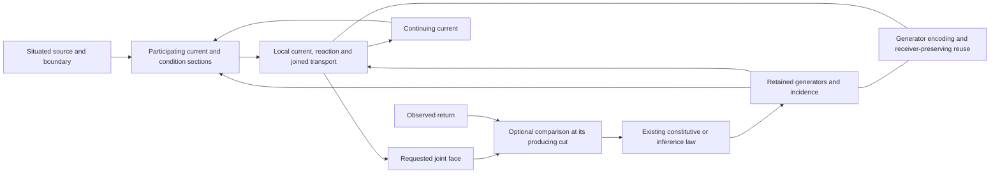

# HNN construction: mathematical network, encoding and prediction release

[definition] This is the active native implementation specification. [The roadmap](THE_ROADMAP.md)
alone orders construction; [CONSTRUCTION_STATE](../../CONSTRUCTION_STATE.md) alone records the
position. September 11 consolidates the old AC responsibility labels into named work phases.
The file path, source names and existing wire identifiers remain stable.

[project-postulate] HNN names the machinery; Athena is its first intended product. Automata
label HNN-based solvers and traversal constructions. Product labels introduce no mechanisms or
separate implementation tracks. The [roadmap](THE_ROADMAP.md#sustained-objective-and-construction-rhythm)
orders the shared construction. Mathematics supplies generating relations, receiver/phase
transport and bounds; native failures refine their realization. This blueprint owns the network
and implementation contracts. Available results and the current step belong in CONSTRUCTION_STATE.

## Product and evidence

[project-postulate] HNN conducts situated Holons through a continuing ecology. Athena and
Hephaestus label its products/uses; Eros names composition and formation at every nested scope.
Those names introduce no internal machinery boundary. The product goal is useful conversation, code, mathematics and
other modalities on consumer hardware. Hephaestus labels tools and utility models, including
code generators and mathematical solvers. Its factor/recurrence/generator inference is
already mathematical learning/reasoning in this programme. Report its supplied target and
constraints, derived executable representation, applicable consequences and relevant costs.
Exact search and supplied inference rules do not create a boundary outside intelligence.

[definition] The local operation remains
`occurrence -> local current -> reaction -> emission + successor ecology -> next occurrence`.
This governs execution and ownership. A completed mathematical inference requires no separate
state-mutation demonstration. Its resulting generator, equation family or prediction supplies
the substantive result; use the applicable evidence and receiver scope in the roadmap.

## Complete implementation contract

[project-postulate] The September 14 complete plan uses the seven delivery milestones in
[the roadmap](THE_ROADMAP.md#athena-construction-order). This file specifies their consuming
operations. Its older numbered sections retain mathematical/source responsibilities and
compatibility evidence, not a second implementation order. A completed small example does
not replace the public model and actual generated product described here.

### The public model operation

[definition] Use the existing `holonics::{structure,geometry,engine,hna}` library boundaries.
`NativeCoupledBody` owns the active model; its operative-field-backed representation owns
the field and local reaction under that same move owner. Reuse the current field, local
generator neighborhood, resident section/family, constitutive material and receiver types. A Holon operation retains
the source/target charts, incidence and shared parameters; it is not an untyped buffer wrapper.
Its initial constructor specifies K, material and receiver configuration explicitly.

[definition] The initial model law is an explicit composition of admitted contact/phase
transport, normalized participation, constituted boundary/interior scattering and local
learned reaction. The composition order is part of the model, including its finite integration
step and residual when a continuum interpretation is claimed. The neighborhood's normal or
bilinear law may parameterize a local reaction; it does not learn a separate imitation of the
entire scattering field. Those operators all act on the continuing field or joined source
family and expose their actual differential to the model's update.

[definition] A public generation request supplies a resident partial/source field, its known
boundary constraints, admissible source/latent family and requested receiver/extent. It returns
the generated joint section or its requested presentation and the applicable source/defect
information. A continuing call publishes the corresponding endpoint once. A forecast evaluates
the same declared operation without installing that endpoint. The numerical field API now
exposes `preview_field` and `generate_field`; `observe_field` consumes the retained comparison. The field-session stream now consumes these APIs with a declared symbol section, ordered
context tensor and joint basis receiver. Broader partial/context/support families extend this
existing consumer.

[definition] The refinement coordinate advances the whole participating state. Image/acoustic
coordinates and textual symbols label output faces, not mandatory evolution ticks. Extent can
be caller-declared initially and later supplied by the model's learned support/boundary action.
An unfinished global reconstruction or plural source fibre does not prohibit a lawful requested
face. Conversely independent coordinate selections cannot invent a joint output absent from
the retained source family.

[definition] A training request supplies an actual observed/target section and the required
producing handle. It forms the declared receiver residual and returns the covector through
projection, refinement, reaction, participation, transport and scattering into the material
that generated the prediction. It also retains source/internal/receiver variations where those
are operands. Receiver plates can carry their own state, storage and motion inside this joint
operation. A frozen readout is one explicit restriction, not the general receiver ontology.

[definition] The training law is concrete at each constituent: normal statistics solve `WH=B`
where that is the parameter inference; the existing contact response solves its stated
Frobenius/constitutive variation; a normalized receiver uses its actual KL/squared-probability
or current derivative. Sign, metric, step and admissible coefficient realization are declared.
A finite update must be checked through the actual nonlinear forward operator and its mixed
terms. An infinitesimal gradient identity alone does not prove that every full-size step lowers
loss. No new universal optimizer or qualitative definition of intelligence is required.

### First implementation increment

[established-bounded; source-inspected; measured] The field/reaction core, current publication,
producing D/M target response, public Rust invocation and local trained rest have returned in
[the model experiment](../../research/experiments/athena_field/README.md). The 48-target repair
continues that same core. This section retains its mathematical contract and responsibility
map, with the actual invoked owners and the application responsibilities they now serve.
Its shared field-session request/stream exposure now returns the bounded contextual text
application below. The initially supplied condition has an ordered native tensor realization
there; broader contextual representation and source populations continue through that consumer.

[project-postulate] Deliver one public **train → generate → observed update → generate again**
operation on joint sections, using the actual operative field and local learned reaction.
Inference on held-out inputs is part of this same return. The first aperture has explicit
finite incidence and a modest complete section; these supplied dimensions do not become
intrinsic semantic limits. This is the first model increment, not the whole Athena release.

[definition] **Chosen initial composition.** At each refinement cut let q join the field's
actual boundary/current and operative interior with the prepared external boundary/input.
Use declared resident port maps `P_s`, `P_h`
to obtain the reaction source and condition before seeing a target. The initial split is

```text
s=P_s q,           h=P_h q,
r=R_M(s,h),        u=E_B input + r,
(w,b_next)=S_D(u,b),
y=P_R w.
```

`R_M` is the existing local conditional/bilinear action; its output codomain is the operative
boundary-input chart of D. `E_B` is the declared external-boundary injection. D and M are
model parameters, not fitted copies of one another. Repeated refinements consume the returned
state. The first aperture holds material fixed within a generation and develops it on the
actual observed return; later constitutive/material evolution is an explicit extension.
This reaction-before-scattering split is an implementation choice within the formula, not
a claim that every physical/HNN interaction has this universal order.

[definition] **Resident ports and publication.** The existing `advance_current_resident` in
`field/resident_input.rs` already admits a generated point current without a host numerical
round-trip; preserve its actual input chart. `NativeFieldCurrentSource` joins the outgoing
report and operative b with owner, producing sections and contact births. Its `enclosure()`
is an outer receiver of those retained finer operands, not their replacement.
`NativeFieldCurrentSource::reflect` applies the actual D to an enclosed joint `(u,b)` without
mutation. `NativeConstitutiveField::commit_reflection` validates the producing cut/material
and publishes the computed w/b once, retaining its qualified common image. A new occurrence
must not silently compute a different operator or invent an observed target. Ordinary external/observed occurrences
continue through the existing field ingress and source/anchor contracts.

[definition] **Reaction attachment.** Bind `P_s/P_h` to declared blocks/transport maps of that
same joined field/input source and to the neighborhood action's domain. Repeated uses of an
input retain its shared parameters rather than independent copies. Use the existing action and
prepared-condition machinery to read `R_M(s,h)` without changing condition or material during
a forecast; expose a narrowly scoped staged read if the needed port is crate-private. The
first fixed-incidence aperture fixes these port maps explicitly. Born contacts later extend
their actual domains and adjoints using the birth/source-overlap maps, not padding based only
on equal widths. The composed pullback returns `P_R*` through `S_D`, then through `R_M` and
`P_s/P_h`, to the actual pre-generation D/M/current. Holding two owners side by side is not
this binding.

[definition] **First receiver.** The numerical application initially returns the identity
receiver on the complete requested outward block, with an optional declared `P_R` projection.
Use the staged reflection's `output()` or committed `read_current_source().enclosure()` with
its retained source witness; select the boundary block explicitly and keep b in the body.
The public section return must retain the owner-qualified generating source and the complete
joint output, not only a detached report. Host readout occurs at the requested delivery boundary.
Later text/image/acoustic codecs consume that same receiver contract. A coordinate envelope
must not be promoted to the Cartesian product of independent possible outputs.

[definition] **Producing-handle order.** The field body retains its immutable producing
source, reaction condition/material and joint input/output under the comparison identifier.
`observe_field` receives an actual target for that handle, stages the paired D and local M
responses, publishes both after successful preparation, and consumes the handle once. This
path does not fabricate an ordinary historical observation or route through a second wave
predictor. `respond_to_material_observation` remains a different available field operation:
when a caller uses it, its latest-receiving-cut precondition and internal commit apply.
Those preconditions are not retroactively imposed on the direct producing-target API.

| Responsibility | Mathematical/native owner | Application obligation |
|---|---|---|
| Own the field model | `A/coupled_wave/body/field.rs::FieldModel`; `NativeCoupledBody::from_field` | Keep one live owner through the shared request/session interface. |
| Execute the forward composition | `FieldModel::prepare`; reaction `apply_joint_current`; field `reflect`/`commit_reflection` | Bind the application's source/context and receiver maps to this operator; expose actual joint output. |
| Retain the joint section | `NativeFieldCurrentSource`, `NativeFieldGeneratedSection`, resident enclosures | Keep the common current and producing relation through text/other section receivers; never substitute independent marginal selections or a point seal. |
| Train the same D/M | `FieldModel::observe`; paired `compare_target`/`apply_reflection_target`; neighborhood staged reaction target | Carry an actual application target back through its producing receiver and model material. |
| Consume the producing handle | `FieldModel::pending`, `observe_field`, comparison release | Bind session responses to the model handle; preserve its scope and single incorporation across the admitted session lifecycle. |
| Expose and retain the result | Public Rust field API; field/body rest, `NativeFieldSession` and `HnaStream::pump_field` | The joint text receiver and pending/delivery payload now serve the bounded application; extend its complete source/support representation through these same owners. |

[definition] In this table C is `crates/holonic-engine/src/native_ecology/constitutive_fibre`
and A is `crates/holonics-hna/src/native`. The field's ordinary occurrence capabilities,
direct generated-section comparisons and older wave prediction handles have different source
contracts. Reuse each at its actual consumer; a common application interface does not identify
them merely because they all have integer identifiers.

[definition] The first data task is a declared joint field transformation/reconstruction
within the configured operators' applicable family. Examples and target sections are external
data; the field's D/Θ is trained directly. Include an unseen input combination and a conditional
case with its condition supplied before the target. Report supplied initial K/material, the
learned relation, exact/enclosed outputs, target error and cost. The task may use a small
controlled source to expose the learning equation; it does not become a permanent intelligence
gate or substitute for the later conversation/code product.

[definition] Start with an ordinary immediate observation to close the direct path, then
exercise a delayed observation when the producing-handle join is implemented. Reuse existing
native checks for the unchanged local arithmetic. Add checks for the actual new composed
forward/adjoint, family output and ownership joins. Do not count a CUDA-ignored test as executed,
or a public wrapper compilation as a model output. Measure setup, resident work and delivery
separately on the actual requested section.

### Next consuming application

[interpretation] **Diffusion and embroidery govern this construction reading.** Apply Brandon's
September 15 correction by grounding the application in how an interacting field forms a
received pattern. An incoming difference participates through the existing medium, incidence,
material, current, phase and boundary constraints. Refinement can propagate between coupled
regions and scales; local formation can alter subsequent admissible transport. A request can
specify constraints and a receiving boundary without first becoming a semantic task class.
The word-correction experiment measures one consequence of these operators; its template of
request/context/target does not define HNN's ontology or the organization of general generation.

[definition] The embroidery comparison retains crossings, orientation, tension/material response
and the dependence of the visible pattern on the receiving face. The
[July 17 mechanical correspondence](../../research/records/2026-07-17_THE_DUALITY_IS_THE_SITUATED_TRANSITION_THE_NET_HAS_NO_OUTSIDE.md#iv--string-sheet-and-volume-are-orders-of-carried-history)
and current [joint-field generation law](../HNN_FORMULA.md#generation-as-field-refinement-and-boundary-radiation)
supply this connection. Historical terminology does not prescribe an event archive or a new
weave subsystem. Dependencies may be carried by existing incidence, constraints, modes and
generators sufficient for the admitted operations.

[definition] Compact representation must preserve the interacting construction: shared
occurrences/crossings, causal transport, phase, relevant internal modes and the ability to
continue/re-express the pattern through its receivers. Independent component summaries can
lose those relations. Factoring a separable input is one exact case; factor the actual coupled
operator and its response where the relation admits it, or retain the separating mode/residual.
Diffusion does not require independent noise, and a zero value does not stand for unresolved
structure. Complete output concerns the jointly supported construction; streaming and local
refinement follow its dependencies. A single compiled generating operation may express such
an evolution; neither an arbitrary pass count nor a next-symbol clock defines generation.

[established-bounded; source-inspected] The [partial-region implementation](../../research/records/2026-09-15_PARTIAL_FIELDS_FORM_JOINT_PATTERNS_THROUGH_THEIR_RECEIVERS.md)
now supplies the concrete affine receiver and its target pullback, actual neighboring context
currents and variable receiving extent. Its separate activity/observation maps distinguish
unresolved regions from zero-valued observations. The single fixed-mask reaction/scattering
step is affine; composition with the existing content-dependent field/current variations is
further construction through this same application, not a claim already supplied by the mask.

[project-postulate] Build the first field-backed Athena contextual correction/continuation
session through the existing Workbench/request stream. Consume a complete prepared request and
its relevant preceding parts, generate the response as a joint section, expose its actual text
presentation, receive a supplied comparison through the producing model, and save/reopen that
same session's trained state. Inspect held-out episodes/combinations and preserve failed outputs.
The first scoped application does not claim general conversation or code competence merely
because the adapter runs.

[established-bounded; source-inspected; measured] The
[September 15 field session](../../research/experiments/athena_field/session/README.md) connects
`A/field_session.rs`, `HnaStream::pump_field` and Workbench `hna field-session` to the existing
field APIs. `SymbolCurrentChart` supplies the exterior unit-basis source; native ordered tensor
products form context; `read_basis_sections` receives all output positions together. The source
port is declared as incoming or continuing boundary and persists with the model. Outstanding
producing D/M and stream output also persist and resume. The bounded three-word/two-position
control returns actual contextual edits. This is the reusable application path to extend.

[definition] `FieldSectionRequest::from_exposures` reads complete shared visible parts and
checks the supplied recorded prior-parent chain. `ExposureReader` supplies validated source
families. The current session's fixed section and explicitly materialized tensor are exact at
their declared finite source chart; their growth makes a factored/local representation and
appropriate response support concrete requirements of broader complete inputs. Resolve those
at this same application call using existing section, factor, condition and receiver owners.

[definition] Keep the complete section and relevant preceding parts as source operands.
`P_s/P_h/E_B` restrict or transport that situated input into the existing reaction/scattering
law; `P_R` and the declared codec receive its jointly generated response. Their domains,
units/phase, known/unknown regions and producing parameters must be explicit. A source path,
episode label or target answer cannot substitute for those relations. Reuse the current
condition/contact, receiver and joint-family owners before adding an interface or representation.

[definition] Contextual and receiver development is part of this application construction.
Where the receiving chart/material moves, use its actual variation together with the source,
reaction, scattering and interior variations. Active plates and physical relative motion remain
in the model construction; a stand-alone geometry experiment is not the application's delivered
response. Unresolved broader receiver physics does not prevent using an already-admitted
receiver in an application.

[project-postulate] A callable adapter alone is an intermediate result. Close the increment with
actual generated response sections/text, an actual D/M comparison/update, held-out contextual
outputs, trained reopen and measured quality/cost. Keep pending comparisons across restart when
the admitted session requires them, through the existing rest owner. The [training data](#training-data-and-generalization),
[context](#context-morphology-and-active-interfaces), [durability](#encoding-memory-and-durability)
and [application](#application-and-release-contract) contracts below govern this one construction.

[project-postulate] Brandon's September 15 continuation standard is the unified Eros/HNN
construction: conscious-experience motivation, face/conservation laws, active plates/media,
coarse graining and spectral/cycle/fluid objects govern the elementary operations. The
[landmark receiver construction](../RECEIVER_HOLARCHY.md#landmarks-constrain-one-continuing-interior)
shows how available observations constrain one common evolving interior. Recover and implement
the corresponding operators at this consumer; preserve their phase, source correlations,
applicability and producing variations. The benchmark apparatus measures those consequences.

### Training data and generalization

[project-postulate] The [shared evaluation contract](../ATHENA_EVALUATION.md) fixes the questions
about supplied conditions, inferred relation, complete output, future reuse and cost. Its
conversation/repository episode adapter reuses the existing refined source package and keeps
historical assessment outside the model input. Mathematical solver results count at their
actual domain; field integration is a different consumer obligation, not a higher definition
of intelligence. Add a source family to answer a concrete application question rather than
replacing the benchmark each time an owner changes.

[definition] Reuse `applications/conversation-data`, `alpha::exposure::ExposureReader` and
the prepared source/part/return stream. User, assistant and tool messages retain their actual
roles and chronological relationships. The native input is a situated section and its relevant
conditions, not a source path, row number or document ID as semantic identity. Raw files remain
at the exterior preparation/evidence boundary; retain native distinctions needed by the law
through material, constraints, phase, modes and pending cuts rather than an input archive.

[definition] Use three distinguishable evidence scopes: development exposures that update
material; validation comparisons used to diagnose/tune the declared construction; and held-out
episodes/combinations whose targets do not enter material or source preparation. Separate by
whole source episode/relationship where necessary, not merely by shuffled adjacent text rows.
Record which exposure constructs which relation. A source presentation can be masked or partly
observed under a declared corruption/restriction chart; noise is an available exterior choice,
not the definition of native uncertainty or a required source of generation.

[definition] Begin contextual product work with complete requests/responses or requested
sections, including corrections, dependencies and relevant earlier turns. Train joint
reconstruction/continuation through the same field dynamics. Test changed conditions and
unseen combinations rather than only replaying a stored span. Text tokenization, if used by
an exterior codec, does not set the latent topology, default memory architecture or refinement
clock. Source/target leakage, an authored decoder answer and self-output mislabeled as human
feedback are incorrect constructions to repair.

[definition] Grow the data aperture when the operation has returned a useful result at its
current scope and the next exposure answers an actual learning/capacity question. If outputs
fail, inspect the source distinction, material law, adjoint, representation and receiver before
increasing volume. The goal is empirical reach from one model, not completion of a data-ingest
campaign. Existing exact mathematical solver inference remains independently useful.

### Context, morphology and active interfaces

[definition] Extend the first model by giving its actual neighboring/receiving regions their
state, internal storage, phase, transport and relevant material response. Source/condition ports
are restrictions of that coupled situation; an appended context label is not that relation.
The forward and adjoint include changing participation and changing transported values.
Learned topology uses source-conditioned incidence/constitutive variation and the existing
contact birth/transport owners. A fixed-shape derivative does not account for a new coordinate.

[definition] A retained residual, preimage or rank/separation result identifies a distinction
the current local constituent cannot express. Construct or refine the corresponding constituent
through its actual source map, then update its callers and representation together. Preserve
newborn zero-input constraints, source overlap, relevant sign/phase and existing pending
producing material. Do not make a semantic classifier, scalar priority queue or content hash
the general law of contact/navigation.

[definition] The model may use lattice, mode, sparse factor, tensor, recursive or analytic
representations of the same operation. Toroidal cycles and fractal/preimage geometry enter
through actual incidence, transport and recurrence; their illustrated count does not prescribe
network depth. A physical law supplies its unit/constitutive chart, not a requirement to
simulate an entire organism before delivering an HNN application.

### Encoding, memory and durability

[definition] Bind `E_next T=U E` and `D_dec E=ρ` to the repeated operator actually executed,
including its interior and required future receivers. Reuse the existing mode/observable
reducers, native factors and condensed operative programmes. When an eliminated mode can
affect a future receiver, retain its dynamics or explicit memory/residual; do not discard it
because the present scalar reading agrees. Declared approximate encoding retains its bound.

[definition] Distinguish the model's dynamic memory from replay required by a current
implementation. Remove repeated full-prefix execution where a sufficient generator, local
statistic or state realization already closes the action. Keep the relevant pending source
relations; branch states share immutable material and own their differences. Measure resident
work, allocations, transfers, representation size and exact bit growth before claiming savings.

[definition] Extend the rest belonging to the actual field-backed body and its application.
Payload includes K/transport, material, current/interior, codec/receiver configuration,
encoded programme or residual, pending producing comparisons and the continuation/cursor
needed by the admitted resume. Use existing field/operative rest and `SavedCoupledBody`
versioning; native ecology and inherited HNP rest are different existing payloads and cannot
be interchanged by name. A new process must generate a new section and incorporate a retained
pending observation consistently with uninterrupted execution.

### Application and release contract

[definition] Use the existing Workbench stream boundary and public SDK. Callers should mount
a prepared source, invoke the model, receive its generated artifact and continue/update/rest
without manually wiring internal arithmetic. The current native wave/coupled codec ports are
reusable boundaries; older `text_session.rs` uses `AthenaTokenApplication`/HNP model semantics
and must not silently restore a next-token engine or inherited model dependency.

[definition] The first usable Athena release covers held-out contextual conversation,
correction/continuation, mathematical use and code/tool tasks through this same model. Inspect
the actual outputs, changed-context behavior and execution of generated code/tool arguments.
Existing exact mathematical operators are callable functions within the product; a code
printer remains an export/application of a constructed generator, not its definition. Tool
results enter as actual source observations under the application's explicit tool contract.

[definition] The initial text receiver can reuse `A/section_input.rs::SymbolCurrentChart`
as a declared symbol/current codec over a complete requested section. Encode known and
unknown regions and their constraints; let the model refine them jointly. Any symbol-basis,
embedding or support/end-marker map has a stated supplied/learned role. Decode from the same
joint realized field or supported family through its actual receiver, not independent choices
from marginal enclosures. Extending the output region follows the model's support/boundary
operation and dependencies. It does not revert to feeding one selected next symbol back as
the definition of generation. Existing wave text readers are codec/reference consumers to
adapt, not the new field model's hidden scheduler.

[definition] Optical/acoustic support uses the same joint-section/request/update contract.
Recover `membrane_optical` and `membrane_acoustic` receiver laws at their existing source-neutral
scopes, then bind the current emitted fields through the actual phase/axis maps. Their historical
source-neutral morphology types are not automatically the new body's types. Image/PCM encoding
is exterior; a multimodal receiver does not create a separate learning engine.

[definition] Harden interruption, unsuccessful-operation ownership, malformed input/artifact,
pending return and remount at the actual process boundaries. Expand throughput and useful
capacity under measured consumer resources. Native exact arithmetic and GPU residence apply
to the assembled hot operation. A float-based observer statistic is not forbidden; a host
semantic replay or float-derived committed coefficient is not a lawful shortcut.

[definition] Executable export follows `INTEROPERABILITY`: actual target graph, parameters,
state, chronology, numeric conversion and receiver comparison. The existing Safetensors/custom
ONNX package is a container capability. Broader GPU/CPU/Metal parity and optional Soulkiller
material require their own operation/source correspondence, not the reinstatement of a
retired inherited-first campaign.

### Completion and continuation

[project-postulate] Each increment returns the generated product and the actual invoked
consumer, supplied versus inferred material, relevant checks and measured cost. A local
training task establishes that task; the first usable Athena release additionally owes its
conversation/code/application evidence. Frontier-level usefulness remains the empirical
ambition. None adds a vague state-mutation or universal-intelligence admission test.

[definition] “Continue Athena” resumes the active brief's next unclosed operation under the
roadmap. Carry the human objective, governing corrections, equation/unknown, source/receiver,
owner, next edit and completion evidence across compaction. Completed evidence becomes concise
links. Keep research and code corrections coupled to their consumers, preserve useful unrelated
work, and finish the authorized increment without returning another plan or permission loop.

## The HNN network and its mathematical contract

[project-postulate] The [HNN model formula](../HNN_FORMULA.md) governs this assembly. It gives
the constituted circuit/field equations, native scattering action, tangent/adjoint, classical
learning instances and dynamic mode reduction. The relationships below specialize that formula;
they must not be read as an architecture consisting only of lifecycle obligations. The
[library composition table](../RUST_FRAMEWORK.md#mathematical-operators-and-model-assembly)
distinguishes implemented mathematical operators from their present model consumers.

[definition] The model is the retained network of generating functions, current and their
situated composition. Its context is the [causal boundary over intersecting event histories](../HNN_COMPOSITION.md#context-names-a-situated-causal-boundary),
including stored interior response, actual flux, constitutive material and local clocks.
At a contemporary cut let q denote its situated current, Theta its constitutive/generating
material, and I its admitted oriented incidence. These are
mathematical operands already represented by the field, relation and coupled owners, not a new
universal state wrapper. An occurrence enters through its actual boundary map. Relevant local
restrictions expose `s_e=S_e(q,o)` and `h_e=C_e(q,o)` at a contact e before its target is observed.
The domain and source of S_e and C_e must be stated. They are restrictions at this boundary;
the local port h does not stand for its entire context. Their formation and use belong to
the evolving current/material/incidence assembly, with no universal context-extraction stage.

[definition] In an attachment change, name the body carriers actually read and how the
restriction refers to their incidence and current chart. Applying supplied A and C computes
their output sections; it does not infer A and C. Existing resident condition formation can
supply h without relearning that mechanism. If h or the source is a joint family, preserve its
shared parameters through the consuming law; a point-current API requires its stated point
domain. Merely adding a method that transfers a predictor handle does not settle these operands.

[definition] In the finite homogeneous additive chart of
[FiniteLocalCurrentEcology](../../formal/elementary-holonics/ElementaryHolonics/Computation/HolonicNeuralEcology.lean),
with the occurrence interpreted in its declared generator chart, a complete local step is

`j_v = sum_u J_Theta(q,o,v,u)`,
`q_next(v) = R_Theta(o,v,q(v),j_v)`,
`y = rho_F(q_next)`.

The local current J carries the actual incidence and source/condition dependence; co-presence
does not imply contact. R receives both prior local standing and arriving current. The graph,
attention and recurrent charts in
[HolonicArchitectureCharts](../../formal/elementary-holonics/ElementaryHolonics/Computation/HolonicArchitectureCharts.lean)
and [HolonicRecurrentEcology](../../formal/elementary-holonics/ElementaryHolonics/Computation/HolonicRecurrentEcology.lean)
instantiate parts of this account. Heterogeneous ports use their
actual transport/join maps rather than a universal scalar sum. These signatures specify
operands and composition; they do not construct J, R or their learned organization merely by
declaring functions with those types.

[definition] In the present coupled-wave realization, the source action instead uses the
explicit chart `a=(c-p,c,p)`, `eta in L_j(a,h)`, `v=c+eta`, with successor `(c,v)`.
The normal specialization fits a declared feature action with `WH=B`; the bilinear relation
and contextual-section owners retain compatible source/condition products and their fibres.
These are available local laws, not a definition that every HNN generator is a fixed bilinear
regression over the last two symbols. The network construction must carry their participating
source restrictions, condition formation, composition and requested receiver through the same
continuing owner. A new adapter that supplies those choices externally leaves that work undone.



[definition] Formation determines reusable functions, parameters or incidence through the
admitted inference/update law and actual returned differences. For an empirical comparison,
[SituatedMachineLearning](../../formal/elementary-holonics/ElementaryHolonics/Computation/SituatedMachineLearning.lean)
retains its producer and comparison; the native
condition-contact, normal and adjoint owners realize their stated laws. For an exact solver,
preimage/factor construction can infer its requested function directly. Neither mode needs an
extra event whose only purpose is to demonstrate causality. A new independent contrast can
require a new constituent direction; repeated occurrence alone does not define one.

[conditional] Compression and navigation share the resulting generator when an executable
encoding E and retained action U satisfy `E_next T=U E`, and the requested receiver factors as
`D E=rho`. Ordered application then produces the same requested faces through the encoded
state. [JointReceiverDescent](../../formal/elementary-holonics/ElementaryHolonics/Foundation/JointReceiverDescent.lean)
supplies the additive invariant-kernel criterion;
[receiver_history_compression](../../crates/holonic-engine/src/receiver_history_compression)
supplies executable reference constructions at its own domain.
Changing material, incidence or pending-return receivers belongs in T and the family to which
these equations apply. A set-theoretic quotient alone supplies no executable decoder or cost
claim. Approximation retains the actual defect and its bound at the declared receiver.

[definition] The assembled HNN requirement is to make these operations consume each other's
returned mathematical objects. The [source map](#exact-source-map) names the current owners;
sections 1–4 specify their attachment, formation and representation obligations. Model requests
use that assembly through the public session. A component experiment is evidence for its
particular equation; the product claim additionally needs the consuming call and its returned
consequence. Preview, commit and observation each retain the operation contract below.

## The shared mathematical-to-native construction

### Boundary and interior assembly contract

[definition] The September 14 [engine blueprint](../ATHENA_ENGINE_BLUEPRINT.md) is the
illustrated source-level reading of this contract. The direct path is the existing operative
field, paired material response and local learned reaction under `NativeCoupledBody`.
Its diagram distinguishes existing operators from the unbound application join. No field-to-W
surrogate wrapper is substituted for this same-material forward/training operation.

[project-postulate] The next assembly executes the actual constitutive operators as the HNN
model. In the existing scattering chart, `A=I+DD*`, `A v=2(u+D b)`, `w=v-u`,
`b_next=D*v-b`. Compose the incident boundary transport, these internal dynamics and the local
learned reaction through `NativeCoupledBody` and the operative field's resident material.
The forecast and committed step must evaluate this same composition. Normal fitting is used
where its coefficients are the inferred model; an independent field fitted as a target source
does not stand in for this assembly. That distinction supersedes the draft's surrogate-first
interpretation, while retaining its valid normal/enclosure and delayed-observation code.

[project-postulate] The consuming implementation uses the [Holon object](../HOLON.md) and the
[whole-field generation law](../HNN_FORMULA.md#generation-as-field-refinement-and-boundary-radiation).
Its operator acts on a resident section or joint family; successive refinements change that
field, while image pixels, waveform samples and text symbols are output coordinates.
Boundary activity can stimulate another internal region without a deliberate message.
The public codec observes this operation and does not reduce it to next-token steps.

[definition] The consuming implementation has three joined obligations:

1. **Evaluate and learn the composed model.** Transfer resident currents through the actual
   contact charts; use the existing scattering/reaction operators for joint output. Pull the
   requested differential through their tangent/adjoint into those same coefficients, including
   the current/material interaction terms. Reuse condition/preimage and normal laws where they
   occur in this model; do not require a synthetic observation after every output.
2. **Execute its modal representation.** Factor the repeated full boundary/interior action,
   with its initial internal modes and pending comparisons. For changing geometry use
   `E_next T=U E`; where it fails, retain the exposed mode or its dynamic memory. The exact
   reducer is an algorithmic starting point to lower to resident execution, not a new host loop.
3. **Expose the same model to Athena requests.** Keep input encoding and requested output
   projection on the existing public session. Inspect the actual correction, continuation or
   mathematical product from the composed body, including its error and work. Derive the next
   repair from that operation rather than introducing a different example to obtain a pass.

[project-postulate] This is one integration assignment. Supporting numerical and ownership
repairs stay part of it. Existing wrappers and separate prepared predictors are implementation
choices to reconcile, not mathematical boundaries to perpetuate. The current draft is not
discarded and no unrelated physical environment or solver API is removed.

[definition] The consuming operation binds actual participating boundary and retained interior
currents to local generating material, then returns the requested joint face and the successor
specified by the call. Its pre-return source is the admitted event-boundary section, including
incidence, storage, clocks and the represented source fibre. A local restriction S/C is one
map within that operation. The existing field/junction current and condition owners supply
source constructions; `ResidentGeneratorNeighborhood` and `NativeCoupledBody` supply the
returned conditional-generation and joint-release consumer. Their source types, shared
parameters and ownership transfer must agree at the consuming call.

| Deliverable | Equation or concrete completion evidence |
|---|---|
| Resident boundary/interior binding | Name the native carriers and restrictions used before the observed target; execute the local interaction on their joined source family. The consumer retains the actual interior response, rather than reading a cold inspection as a production operand. |
| Generated joint product | Inspect the requested multi-face section from the shared producing family and reuse the returned body for its next admitted call. Include the observed-return contract only when requested by the application. Text, numerical fields and mathematical actions use their respective receiver charts. |
| Encoded repeated conduct | For the repeated segment actually encountered, construct E/U/D with `E_next T=U E` and `D E=rho`, or retain the explicit dynamic residual and its receiver bound. Include material/incidence changes and pending producing cuts. A full expanded word does not establish reduced execution work. |
| Integrated verification and maintenance | Compare the actual outputs, shared-source constraints and needed delayed returns. Measure setup, repeated execution, delivery and retained representation separately; consolidate affected owners and run the relevant native/formal checks. |

[project-postulate] These deliverables apply the existing assembly, formation and encoding
responsibilities together. The [orchestrated cycle](../DEVELOPMENT.md#orchestrated-construction-cycles)
keeps one primary integration owner and bounded Luna support. Source-domain mismatches are
resolved at their equation and port; they do not launch another independent model adapter.
The roadmap supplies order and CONSTRUCTION_STATE records the current returned dependency.

[interpretation] A reusable machine can support a family of admitted orientations before a
contemporary application selects source ports, held conditions and receiver. The non-orientable
surface picture motivates retaining transition maps and route differences; it is not a claim
that every function's parameter space is a non-orientable manifold. Reverse use returns a
preimage family or obstruction, not an assumed inverse. Items 1–4 below are interacting aspects
of this complete application/return cycle, with no imposed serial completion order.

[definition] The target is one continuing ecology of applicable generators. A mathematical
operator request, a text occurrence, an acoustic event and a kinetic observation enter through
their source/receiver charts. The HNN ecology carries the available organization; Eros names
its composition and formation through actual returned constraints. Hephaestus labels an
operator-scoped tool, code or mathematical use, while Athena labels general wisdom/model uses. Their names do not introduce separate
inference, compression or formative laws.

| Shared formal construction | Existing executable owner | Required Athena/Eros consequence |
|---|---|---|
| Addressed holon, joint future receiver and Preimage Fibre | Coupled current families, source arrivals, pending producing comparison | Retain actual joins and correlated conditions behind an emitted face; later observations constrain the producing relation at its saved cut. |
| Exact generator factorization and ordered recurrence words | `exact_linear` polynomial/preimage/factor owners, `derived_factor_cover`, public `native/mathematical.rs` | Reuse callable factors, changed receivers and fixed-operator powers. Extend their actual source/action maps to developing material; the public workshop is already returned. |
| Receiver-history compression and generator equivariance | `receiver_history_compression`, observable-form closure, existing native relation and rest owners | Preserve the complete required future under encoding, including changed conditions, emission and the current material; retain or reopen a separating source fibre. |
| Swing, clock–ruler and phase-lift transport | Exact receiver atlas, coupled/analytic phase and internal-mode owners | Keep source clock, winding, orientation and within-cycle residue across changed receiving conditions. Source and receiver must travel together. |
| Situated information and addressed code-cost bounds | `surprisal`, `exact_work`, native comparison/inspection | Measure surprise/code length, full residual, work and residency at the same declared cut. Carry endpoint/normalization terms; use cost to compare admissible realizations, not to replace causal relevance. |
| Adjoint, finite differences, mixed energy and constitutive reaction | Producing material return, local relation/contact, field and wave owners | A returned difference acts through its actual producing morphology and changes the appropriate law/contact/material in one successor. |
| Sequence/fold, catalytic current, fluid memory and world-tube sections | Existing physical/kinetic and Schur/internal-mode realizations | Retain joint occupancy/contact and hidden continuation when equal present faces have different futures. Reuse those mechanics wherever the native source domains match. |
| Encoding-anchored causal length and target correspondence | Public native session, exact primitive/device and interoperability owners | Relate claimed savings to executed work and actual decoded outputs; eventually emit useful executable algorithms with their domain, numeric and state correspondence. |

[definition] This table states the intended consumers; it does not claim all those bindings are
already complete. Formal definitions and theorem names remain exterior. Native implementations
realize the relations in their admitted exact representations, with kernel/consumer verification.
No runtime Lean invocation is part of Eros or Athena.

[definition] The reusable mathematical representation retains domain, input/output action,
conditions, source occurrence, receiver/decoder, ordered clock, compatible coefficient family,
residual and available work account. Extend those fields in their existing cohesive owners as
needed; this is not a new universal wrapper or a source-name registry. A public operator request
must return executable structured material, not require later consumers to recover it from a
printed example. Serial composition checks the actual joining/domain relation; changing a
receiver requires a factorization or an explicit separating obstruction.

[definition] Native incorporation consumes the actual producing comparison and restricts/forms
the joint source/condition/material relation it establishes. Compatible alternatives remain
alternatives; no chosen centre or invented measure is substituted. When an affine family cannot
carry a needed mixed product, represent that product through existing richer section/factor
owners or return the exact missing relation and construct it. This mathematical derivation and
its native transaction proceed together. Phase 2 below gives the atomic publication boundary.

[definition] Emergent organization is inspected through actual constituent domains, active
contacts, retained factors and changed future conduct. These may appear as hierarchical layers
or overlapping regions; layer counts do not define them. The observation surface shows which
objects participated, their received current/phase, output and subsequent return. Prediction
branches share immutable standing and own their differences rather than cloning the ecology.
Probability/cross-entropy applies only to the declared normalized receiver; retain unresolved
source alternatives and oriented defects before that scalar reading.

[definition] A mathematical request can return an inferred executable relation in that operation.
Show the requested target, supplied constraints, returned factors/word or solution family, and
their useful consequence and cost. When the task develops a continuing body, bind its actual
return and retained representation through the same public owner. A delayed empirical correction
or another state-mutation assay is not an additional prerequisite to a completed solver result.
Persistence checks apply to newly claimed durable relations; source and formal checks establish
their particular mathematical and executable contracts.

<a id="next-implementation-packets"></a>

## Existing generation and implementation responsibilities

[definition] The following source/receiver and wave/normal constructions remain reusable
mathematical contracts and bounded evidence. The September 14 complete contract above and
the [roadmap](THE_ROADMAP.md#athena-construction-order) select the direct field-backed model
assembly. These older local applications do not schedule another predictor-first increment.

### Generated faces: reconfiguration, correction and continuation

[project-postulate] Brandon's subsequent September 13 correction resolves the ambiguity in the
earlier plan pickup: prediction, release and output are not separate intelligent faculties or
completion gates. Specify the generating relation and its concrete use before implementation.
The [message/plan review](../../research/records/2026-09-13_DIRECT_MESSAGES_CONFIRM_THE_ATHENA_CONSTRUCTION_ORDER.md#prediction-and-output-correction)
retains the correction.

[definition] For source s, carried conditions c, generator G_Theta, requested receiver rho_F
and codec D_F, the operation returns

`y = rho_F(G_Theta(s,c))`,   `output = D_F(y)`.

[project-postulate] The September 14 intrinsic-fractal correction governs the representation
of this generator: heads and local charts operate inside the same interacting field; layer
indices are a composition chart. Its toroidal cycles, simplicial/higher-cell joins, connection,
nonlinear recurrence and full preimages must be recovered together. A separated-copy IFS,
a fixed affine contraction or an exterior skin cannot define the general HNN topology or
its recursive dynamics. The [intrinsic field formula](../HNN_FORMULA.md#one-object-its-charts-and-its-recursive-geometry)
provides the operational source route and the precise first-arrival/rebase relation.

[definition] G_Theta is the mathematical generating operation. Its constituent functions,
parameters, morphology and source-conditioned composition are the objects being formed and
reused, including recursive/fractal realizations. A code-generating model specializes the
requested output domain. A Rust printer represents an already-constructed operation at an
exterior boundary. These three roles remain distinct in the deliverables below.

Prediction describes the generated consequence y under the source conditions. Release/output
is that same face presented across the receiving boundary. The codec changes its presentation,
not whether it is a prediction. A face may be a number, text chunk, graph/section, action or
requested family. An emitted reading does not require its source fibre to become a singleton.
A later observation can be compared and incorporated; it is not required to make the preceding
output a prediction.

[established-bounded; source-inspected] `next_symbol` and `predict_symbol` already call the same
`emit_symbol`; the latter retains a comparison handle. `predict_continuation` constructs and
returns generated text from a joint receiver. Its read-only status means the continuing native
body is not advanced by that forecast call; it does not mean the call produces no output.
Emission counters, source re-entry, pending comparisons and rest are operation/state contracts,
not additional definitions of generation or criteria for intelligence.

[definition] **Text reconfiguration:** represent three chunk embeddings as the rows of X.
`P=[[1,0,0],[0,0,1],[0,1,0]]` gives `Y=P X`, preserving the chunks and changing their order.
For the characters `teh` it returns `the`. P states the local transformation; source and
correction examples determine its applicability. This is a worked transposition case, not a
claim of a trained general autocorrect model or a rule to transpose every word.

[definition] **Correction and continuation:** correction examples pair a received chunk with
its corrected presentation; continuation examples pair the available source with its further
face. Reordering, filling missing coordinates and replacing conflicting coordinates change
the known/unknown parts of the conditional relation. The same generator/receiver returns the
revised chunk or the further chunk, without a new kind of generating machinery.

[proved-derived] In the finite linear comparison owned by `exact_linear/contextual.rs`, columns
S,C,Y encode source, carried conditions and returned targets from the same occurrences. Solve
`W [S;C]=Y`. A solution exists exactly when `ker S intersect ker C` is contained in `ker Y`;
preimage reduction returns all W or a separating vector d. If `S d=0` but `Y d!=0`, S alone
cannot reproduce those targets. C supplies a distinction when the stacked source removes that
obstruction. This specifies the context question by an equation and witness. The existing
bilinear contact includes its declared source/condition products when their interaction is read.

[proved-derived] For fixed encoded features u_i and target increments v_i, the normal
construction retains `H=sum u_i u_i*`, `B=sum v_i u_i*`; its least-squares equation is `W H=B`.
A new pair updates `H+=u u*`, `B+=v u*`. The sum identities show why these statistics preserve
this solve without rereading earlier pairs. For an invertible feature rebase A, `H'=A H A*`,
`B'=B A*` and `W'=W A^-1` preserve the predicted face. A different change needs its corresponding
transport. This is a sufficient
representation for a specified feature/target law, not an undefined requirement on all conduct.

[proved-derived] For fixed linear conduct, `G^d=sum_(j<d) a_j G^j` lets reduced coefficients
represent later powers, as the existing minimal-polynomial owner implements. For a sequence of
chunk permutations, their composite permutation represents its endpoint action. Requested
intermediate sections require their corresponding reconstruction maps. These named identities
replace the phrase "sufficient continuation" with the representation and receiver being checked.

[definition] Specify a requested chunk/section source, its correction or continuation target,
the coefficient/conditional relation inferred from their comparisons, and the receiver returning
the generated face. The examples above make the mathematics explicit; they do not prescribe a
separate autocorrect product stage or a mandatory transposition probe. Returning that face is output. Use the existing
normal, contextual, factor and receiver owners. Update the body through its established operation
when the use includes subsequent interaction. Report the transformation and its text/mathematical
result; a separate "complete feedback", "learning" or "intelligence" test is not a prerequisite.

### Release, continuation and comparison contracts

[definition] Let X contain the participating current, condition, material and live source cuts.
For an admitted passage T and receiver rho, a release returns `y=rho(T(x))` and its presentation.
A continuing operation also installs `x_next=T(x)`. A forecast evaluates that same relation
without replacing the continuing owner. Neither operation requires a later target. A comparison
uses an observed o and the retained producing cut to form the oriented difference `(o,y)` and its
declared residual; incorporation applies the existing return law to the contemporary body.
This notation describes existing owners, not a proposed universal X wrapper.

[definition] A compound output retains one joint source:

`x_i=T_i(x_(i-1))`, `J_F={(rho_1(x_1),...,rho_k(x_k)) : x_0 in F}`.

All components use the same source parameters and joining equalities. The output can present a
chosen declared receiver of J_F or J_F itself; independent coordinate choices do not in general
belong to J_F. Length, requested region, endpoint or termination are receiver/boundary conditions.
A caller's finite aperture is reported as such. It is not a discovered intrinsic extent or a
universal token clock. Execution may stream a section while retaining its joint dependencies.

[definition] Self-emission changes the composed law when it is admitted between passages.
If I re-enters the generated face, the step is `H(x)=I(T(x),rho(T(x)))`; a k-step continuation
then composes H, rather than T. I must include the appropriate source/codec map and returned
body. In particular, `rho(T^k(x))` does not generally predict `rho(H^k(x))`. Intermediate
re-entry and a single reception at the section boundary are different admitted compositions.
Neither is silently substituted for the other.

[established-bounded; source-inspected] At `ec410c7b`, the public bindings implement:

| Operation | Returned output and body contract |
|---|---|
| `coupled_wave.rs::predict_continuation` | Decoded joint forecast for a caller-declared member word, with no intervening reception or successor publication. The dependent body evaluates its standing parameter section. |
| `next_symbol` / `predict_symbol` | Both call `emit_symbol`, advance the body and decode a face; the second retains a producing comparison. Adjacent emitted symbols also enter the existing source-actuation path. |
| `compare_symbol` / `incorporate_symbol` | Read an actual producing comparison / consume its observation through the existing Base/Programme return. These do not turn the earlier face into output. |
| Mathematical `PredictRelation` / `PredictCondition` | Return a joined condition/output family, with optional retained comparison. Operator application and changed receivers also return generated mathematical faces. |
| `ReleasePrediction` / `release_symbol_comparison` | Dispose of a comparison handle. Here the API verb means resource disposal, not prediction output; existing wire names remain stable. |

[definition] The first committed compound binding executes the preview's **transport-only word**
and publishes its endpoint once. It returns the joint output from that same prepared source,
with optional retained receiver cuts for later observations. It adds no intervening self-re-entry.
A later source occurrence consumes the published endpoint. If an application requests boundary
self-reception or interleaved self-emission, compose that source action explicitly; its forecast
must include it. This fixes one concrete consuming contract without requiring a new release engine.

[definition] Shared family/section and decoder owners retain one producing cut per required
comparison, rather than manufacturing independent observations from each projected coordinate.
One observed component restricts the joint relation; a delayed return uses its original source
maps even after later passages. Disposing of an unneeded comparison requires no fabricated target.
Read-only forecasts remain available without this continuing-use binding.

### Deliverables and discriminating checks

[established-bounded; implemented-exact; measured] The
[first active-goal return](../../research/records/2026-09-13_RESIDENT_CONTEXT_FEATURES_RETURN_PREDICTIONS_AND_FACTORS_RELEASE_EXECUTABLE_CODE.md)
binds arbitrary-width resident source/condition features to the shared normal material and
public mathematical predictor. It also returns executed Rust functions from retained factor
graphs. The preparation restrictions in that trial are supplied maps; the next coupled
source/field attachment remains in section 3 below. Exact-function code does not discharge
the broader parameter-family, contextual editing or whole-session persistence rows.

[definition] These are artifacts and checks for the roadmap's existing packets. Their names
do not create another phase scheme. The source abbreviations are defined in the source map below.
Each row specifies a bounded application consequence; no finite row certifies general Athena.

| Deliverable | Implementation artifact and consuming owner | Check that determines the result |
|---|---|---|
| **Context-conditioned generated section** | Replace the production h=1 calibration at the section-input/coupled attachment with resident source/condition restrictions at the producing cut. Join normal/conditional formation in `C/resident/neighborhood.rs`, contextual-section and normal owners; expose the result through the existing coupled stream. Infer `W[S;C]=Y` or the declared feature law `WH=B`; keep non-affine products in their joint owner. | Developmental observations contain a source-null contrast separated by carried conditions. Generate the corresponding whole chunk on new admitted inputs, including the same visible input under those distinct preparations. Report S/C/Y, actual output and the separator for an unsupported contrast. Evaluation targets cannot choose C, contact or decoder. |
| **Committed joint release** | Extend `W/coupled/dependent.rs`, the existing prospective/family owners, `A/coupled_wave/body.rs`, `A/coupled_wave.rs` and `stream.rs` with the transport-only contract above. Stage the word and receiver cuts, return the prepared joint face and publish one successor; preserve the existing forecast command. | Compare forecast and commit from equivalent initial rests at the same section, including every requested joint component and endpoint. With shared parameter theta, a `(theta,theta)` output must retain the equality, not admit independently selected coordinates. A later component observation constrains that same source. Exercise a delayed return and a rejected final join without partial publication or a whole-body clone. |
| **Compiled continuing action** | Replace the repeated portion of `ConstitutiveSourcePassage` execution with an existing factor/recurrence or closed-statistic representation. Bind `E_next T=U E` and `D E=rho` to current, conditions, material and required pending cuts. The public fixed-linear `Power` is an available specialization, not a compiler for arbitrary changing material. | Exact/enclosed joint outputs, endpoint and delayed return agree with the standing programme on the declared family. Include a receiver exposing an omitted direction and a new formation step. Repeated calls with no new independent structure cease appending one executable-history item per call; report contractions, stored representation and integer bit growth. |
| **HNN solver and tool output** | Use the contextual formation and retained operator/constituent owners to construct and execute the mathematical function for the requested utility consequence. Bind its source, conditions, composed action and receiver through the shared session. The existing `emit-rust` receiver remains available when an exterior source representation is requested. | Inspect what relation was inferred, its retained realization and its returned faces under new inputs or admitted compositions. State supplied charts and constraints separately from formed material. Code-model output is checked at its requested behavior; an exported operator is checked against native execution. A plural inferred law retains its family. A printed supplied graph alone does not establish contextual generator formation. |
| **Athena task episode** | Use the repaired section/formation/release path through the public session for contextual correction/continuation and a short explanatory reply; use the same constructions for a code edit or function request. Source parts and genuine returned observations enter the standing owners. | Publish the development/evaluation split, exact requested outputs and representative successes/failures. A correction preserves the requested unaffected region; a continuation answers its context; code executes the requested behavior. Inspect these products before enlarging exposure. A state change, nonempty response or loss decrease cannot substitute for them. |
| **Durable reusable products** | Extend existing coupled rest only for the new section/encoding cuts. Attach mathematical-session checkpointing to its retained relations, operators, products, pending predictions and resumable construction frontiers, plus stream state. Reuse existing codecs/rest owners; wire IDs remain stable. | In a new process, apply a retained operator to a new input, change its receiver, continue a declared release and consume a pre-rest pending comparison exactly once. Compare returned faces and successor with uninterrupted execution. A construction interrupted inside its admitted search resumes its frontier and work account. |

[definition] Formation, joint release and compilation can be developed together through their
shared source contract. Here compilation means constructing an executable representation of
the retained mathematical action; it need not emit source text. An exterior function receiver
can use returned operators for a requested export. Durable serialization follows its payload; it does
not hold up live-session output. The first field-backed increment above now binds the actual
source/condition, constituted action and generated section, reusing the callable workshop.

[definition] Measure each artifact with the [standing performance conventions](../DEVELOPMENT.md#performance-and-information-measurements):
construction/setup, resident passage, decoding/delivery, target compilation/execution and
checkpoint costs have separate intervals. A frame is a completed delivery at a named section
receiver; a tick is an admitted passage at a named owner/clock. Report both populations and
elapsed intervals, chunk extent, latency distribution, device/host memory and transfers on the
Ryzen 9 7900X / 32 GB / RTX 4080 Super 16 GB apparatus. A forecast delivery counts as a frame
without falsely incrementing committed-body ticks. Longer sections do not become faster by
changing the frame definition. Bits per face require a declared code/probability receiver;
cross-entropy additionally requires an actual target distribution or observation. Keep signed
residuals and phase before scalar readings. The sub-five-minute working scale motivates these
measurements; it is not an unconditional runtime promise or a mathematical cutoff.

### Callable mathematical workshop: the first delivered increment

[established-bounded; source-inspected] `A/mathematical.rs::NativeMathematicalSession` already
exposes exact linear/bilinear construction, resident application, changed receivers, composition,
fixed-linear powers and condition-family inference. The
[returned workshop](../../research/records/2026-09-12_CALLER_CONTROLLED_NATIVE_MATHEMATICS_RETURNS_FACTORS_AND_PARAMETER_FAMILIES.md)
and [current public interface](../NATIVE_HNA.md) own its request details and measured evidence.
This is an available consumer of mathematical constructions, not a packet to implement again.

[definition] Keep its actual port/domain and factor/preimage contracts when composing it with
native formation. Partly constrained laws retain their parameter families; a chosen coefficient
representative is not automatically unique. Different receiver widths use the rectangular map
through the retained product. A real returned observation uses the existing producing comparison;
a pure exact application needs no fabricated observation. The shared source/condition attachment
and developing-action encoding are specified in sections 3–4; session durability follows the
payload it actually retains. The Rust printer remains an exterior representation adapter.

### How the research enters these packets

[project-postulate] Brandon's later September 12 clarification makes **next-holon prediction**
the product object: a source-conditioned prospective configuration, coupled graph/section or
released action, with its continuing consequences. The character adapter is an exterior
receiver of that object. The bounded next-current and addressed text trials do not implement
this whole binding and must not silently become the construction programme.

[definition] For one compatible source family F and admitted prepared transport Φ, a finite
joint future receiver reads `{(R₁Φ₁(z), …, RₖΦₖ(z)) : z∈F}`. The same z and shared conditions
occur in every component; replacing this with the Cartesian product of marginal readings
loses their relation. Graph incidence and joined intermediate conditions specify legal
composition. The prospective generator/family and its declared composition/update rule describe that
relation without recording a realized trajectory. A scalar request remains a legitimate
receiver; the interface must not impose scalar or character-by-character prediction on all
products.

[definition] The generated-face equation composes the joint source/family and generator with
its receiver and codec. `CompiledCoupledJoint` evaluates source/condition constraints at a shared
parameter occurrence; the existing joint-preview path already returns a decoded forecast for a
specified learned word. Use the block/factor and receiver owners to express the requested face,
and the normal/adjoint owners when a new observation is supplied. Mode exclusion and rebase
preserve the stated joint receiver through their explicit identities. Code/loss measures compare
the resulting faces. There is no separately named next-holon engine or additional release faculty
to construct; a changed request or subsequent-use contract specifies which existing maps to join.

[definition] The returned mathematics has concrete implementation roles:

| Recovered construction | Binding decision |
|---|---|
| Addressed differences and joint Preimage Fibre | Source, condition and target share actual parameters and producing cuts; ambiguity is represented before a scalar choice. |
| Contextual factorization and source-null contrast | Derive the condition distinctions needed by observed returns; an exhibited unsupported contrast identifies the source/port refinement needed next. |
| Gibbs/KL, code cost and normal/adjoint laws | Separate admissibility from empirical prediction, learn the declared predictive receiver through its actual loss/adjoint, and compare executable representations with decoder/work costs. |
| Mode exclusion, Hodge complement and section rebase | Eliminate redundant coordinates while carrying amplitudes, phase, complementary residues and the required future receiver. |
| Fractal generators, ordered words and Gamma/π/e blocks | Compile reusable recursive/analytic actions with clocks and tails; do not store an occurrence sequence as their required representation. |
| Mass–energy, Maxwell and boundary-current laws | Preserve complete current/energy forms, constitutive response and source/receiver orientation in physical models; use the corresponding algebraic stability and flux structure in admitted native charts. |
| Predictive release and deterministic measure transport | Produce prospective outcomes from the conditioned generator; probability measures unresolved source conditions when a measure is supplied. |
| Lorentzian coefficient bounds and affine quotients | When the source family is Lorentzian, use balanced coefficient ratios and their boundedness/sharp-constant certificates for mathematical constraint inference and representation comparison; retain the coefficient convention and actual family. |

[definition] The last row refers to the
[September 8 v2 bounded-ratio paper](../../research/records/2026-09-12_BOUNDED_LORENTZIAN_RATIOS_JOIN_COEFFICIENT_GAUGES_AND_HODGE_BOUNDS.md).
It supplies a concrete mathematical application source, not a required new HNN architecture
or a universal constraint on signed/complex currents. Its bounded-ratio cone comparison is
not an assertion that every Lorentzian polynomial factors into linear forms.

[definition] The physical and information correspondences supply computational structure,
not a requirement to simulate a whole organism or solve the full Einstein field before using
the local laws. Their scientific scope is stated affirmatively by their actual equations.
RH, Hodge and NS sources remain available for specific closure, realization or stability
questions; a new endpoint campaign is not the critical path to HNN outputs.

## Exact source map

[definition] In the paths below, **C** is
`crates/holonic-engine/src/native_ecology/constitutive_fibre/`, and **W** is
`C/field/material_transport/normal/direct/wave/`. **A** is
`crates/holonics-hna/src/native/`. These abbreviations are navigation only.

<a id="field-session-source-map"></a>

### Field-session source map

[established-bounded; source-inspected] This map incorporates the Wave 11 ports at `76234843`,
the September 20 audit, and the [geometric campaign](../../research/records/2026-09-20_THE_GEOMETRIC_FIELD_REFINES_AND_RETURNS_ITS_COMPLETE_PAIRED_CURRENT.md). **K** is `crates/holonic-engine/kernels/`. The
[owner-network record](../../research/records/2026-09-20_THE_FIELD_SESSION_JOIN_HAS_ITS_OWNER_NETWORK_AND_NAMED_ABSENCES.md)
retains the pre-port search and equations; the
[Wave 11 record](../../research/records/2026-09-20_WAVE_ELEVEN_RETURNS_THE_SECTION_PORTS_AND_ITS_BASELINE_SHOWS_A_TEXT_WINDOW_ON_ONE_LANE.md)
retains its original execution. Current position is in the state, order in the roadmap.

| Operation at the consuming call | Available owner / return | Remaining composition |
|---|---|---|
| Pre-target source and condition (#17) | `A/field_session/{incidence,native_source}.rs`; actual field width, analytic incoming phases, common factored restriction `s=x_r`, `c_i=U_i x_i−x_r` | The exact-current selected-junction attachment is returned. Connect it to normalized whole-field refinement and actual Athena source/receiver preparation |
| Generator formation and condition-family continuation (#17/#16) | `A/coupled_wave/body/field/formation.rs`; `receive_reaction_observation_at`; `contextual_section` and `field_condition_image` | Exact inferred helical bracket, regularized joint field and reusable contextual section are [returned](../../research/records/2026-09-20_NATIVE_INCIDENCE_FORMS_AND_REUSES_THE_HELICAL_GENERATOR.md); dense normal factor adaptation remains #18 |
| Participation `a_FG[Ψ]` (#17) | `A/field_geometry.rs` compiles validated analytic incidence/U; `C/field/receiver/normalized/phase.rs` consumes the existing normalized receiver for `s_j=β Re⟨q,U_j k_j⟩` | Broader source and participating-receiver formation through the same field; supplied U/geometry are explicit operands |
| `δa·UΨ`, return to the condition (#17) | `A/coupled_wave/body/field/geometric.rs` retains query, transported neighbors, normalized report and reaction at each stage; both phase and bilinear covectors return through M* and fixed-D reflection | Changing geometry/U/D requires their additional variation; current fixed-operand derivative is implemented |
| Source⊗condition and enclosure refinement (#17) | `C/field/material_transport/normal/direct/section/composition.rs`; `K/enclosure_composition.cuh`; `A/field_session/geometric.rs` | Finite whole-field held refinement is returned. A committed continuing global current and nonlinear word compression remain distinct work |
| Section-scale change of D (#19) | Single-row operative reflection target/input cotangent and staged contact; both shared and geometric section observations supply fixed-D scattering | Derive and consume multi-row D/contact changes with their producing operands |
| Exposure → request and recorded response (#16/#59) | `ExposureReader::recorded_context` indexes the verified prior prefix; `FieldSectionRequest::from_exposures`, `ExposureAperture`, `examples/athena_exposure_field.rs` | Grow episode/task breadth from actual generated consequences; support wider/partial source and receiving apertures without invented targets |
| Saved comparison and source cursor (#59) | Shared/geometric retained requests, `ExposureCursor`, captured-event aliases and original response extent; context lookup rebuilds from the immutable source | Legacy comparisons without pairing metadata remain preserved but cannot be auto-associated. Observations use current material; a saved old-material gradient needs its own operands |
| Normal statistics at the measured width (#18) | `NormalLayout::for_sources`, resident normal factor/solve; geometric nibble example has 75 complex features and 18 targets. Immutable native rest no longer repeats the child source-energy proof | Exact untrusted trained-rest validation remains CPU work; factor/locality adaptation responds to this measured cost and wider charts |
| Repeated refinement word (milestone 3) | `HelicalMomentReuse` now binds situated finite pair actions to `ObservableMomentReceiverHistoryCompression`; `compile_source_action` and `MathematicalRequest::Power` remain available | The helical moment restriction is returned; a content-dependent HNN word still needs its induced action/decoder or retained nonlinear defect |

[definition] Enclosure rows seal their encoded words while carrying a separate radius. The
Wave 11 APIs propagate nonzero radii; `source == source_hi` validates the packet, not a zero
physical radius. Read the carrier layout and existing positive-radius tests before narrowing a
port's domain. The mathematical source is a family; a chosen centre does not erase it.

#### The embedding and decoding objects are the linked toroidal field

[established-bounded; source-inspected] The September 20 caller still places one unit-basis
codec symbol at each declared slot and trains against the same symbol basis. Its output selects
nibbles and packs bytes; `HelicalMomentReuse` is not connected to this path. The
[campaign correction](../../research/records/2026-09-20_THE_GEOMETRIC_FIELD_REFINES_AND_RETURNS_ITS_COMPLETE_PAIRED_CURRENT.md#correction-the-nibble-control-is-not-holonic-encoding)
therefore retains this as a numerical control. The next consuming work is the existing
transformation/receiver encoding composition, not enlargement or Unicode repair of that chart.

[project-postulate] Brandon's September 14–19 direct messages (private extract:
`.local/message-recovery-2026-09-20/`) fix what is being embedded and decoded. The embedding
object is a chain of interlinked tori/knots: circulating phase modes on overlapping field domains
whose shared cells carry declared contact/material interactions, with heads and layers as charts of that one
object and fractal geometry in its recurrence. Attention is a situated comparison on admitted
contact; generation is refinement of the whole field released at a boundary, never a
token-by-token prediction; decoding is an integration read by a participating receiver Holon
whose frame moves relative to the field. The repository's statement of it is
[one object, its charts and its recursive geometry](../HNN_FORMULA.md#one-object-its-charts-and-its-recursive-geometry),
[one connected tensor computation](../HNN_FORMULA.md#one-connected-tensor-computation) and
[the computational Holon](../HOLON.md).

| Part of the object | Existing realization | At the field session |
|---|---|---|
| Linked toroidal carrier, shared contact cells, material advection | [`intrinsic_holonic_flow`](../../research/experiments/intrinsic_holonic_flow/README.md): six linked tori, 240 multiply-owned cells, exact incompressible flow; `simplicial`, `algebraic::GradedCausalComplex`, `analytic_field` torus charts, `HolonicTorusKnots.lean`, `traversible_chain::BandReading` | `GeometricRegions` binds existing analytic longitude arcs and their shared junction to complex field rows. Full volume/advection/contact dynamics remain the intrinsic reference’s separate specialization |
| Phase attention on admitted incidence | `s^h_ij=β_h cos(2π(q_i−q_j−φ_ij))`, `a^h=softmax(s^h)`, sigmoid reaction, complete `∂V` with inbound and outbound participation (same reference); `NormalizedKernel`; Wave 11's row-sectioned receiver and pullback | `geometric_word` computes amplitude/phase logits, calls the existing normalized receiver, and returns both participation and transported-current covectors. `SharedRegions` remains the fixed-condition legacy chart |
| Whole-field refinement | Symplectic split step `q'=q+κ sin 2πp`, `p'=p−∇V(q')`; resolvent `(I−λL²)x*=(1−λ)h` and its sensitivity in [`connected_holonic_field`](../../research/experiments/connected_holonic_field/README.md); `Holon.ofEvolution` | A declared finite held relaxation of the whole analytic boundary network. Its complete paired return is implemented; symplectic/implicit variants retain their own laws |
| Contact faces and exchange | Phase-sensitive dissipative contact with its energy identity; `contact_receiver_faces`, `ReceiverStressEnergy`, [active faces](../CONSTRAINT_MODES_AND_RECEIVER_FACES.md#the-overlap-has-stress-bearing-faces) | The D-reflection only |
| Decoding by a participating receiver | Geometric decoder `A(x)=Σψ_iφ_i(x)` in the toroidal basis; [receiving Holon](../RECEIVER_HOLARCHY.md); first-arrival populations | A supplied slot-to-junction receiver selects the emitted symbol basis. Its physical motion/material and learned encoding are not yet formed by this caller |

[definition; agent-inferred] #17 composes currents on linked toroidal phase channels,
geometrically admitted incidence and connection φ, phase-sensitive participation, whole-field
refinement and a participating boundary receiver. This follows the direct geometric objective
and the available owners above. A text nibble/word/scalar chart supplies one exterior source and
receiver; its storage type does not decide the internal topology. The intrinsic nonlinear phase
reference and the older connected linear solve are controls for their respective equations,
not interchangeable specifications of the whole model. Symplectic split steps preserve their
stated structure; they do not automatically conserve the unsplit energy or prove convergence.

#### The section's causal decomposition determines its hardware placement

[definition] For a fixed source cut, immutable source/M/D reads and disjoint staged centre
outputs offer a candidate independent row population. Certify the **complete** read/write,
lineage, obstruction and logical-resource effects before asserting `Λ_eΛ_f=Λ_fΛ_e`. Repeated
refinement introduces dependencies between steps; material accumulation needs its own reduction
law. Contact is the declared interaction, and is distinct from the independence of an execution
partition. #61 implements this realization inside the #17 join, from its actual operands.

| Realization relation | Existing owner | Consuming obligation |
|---|---|---|
| Complete region partition and shared reads | `section_partition::{SectionRegion,SectionPartition,certify,CellReceipt::is_interchangeable,SharedRead}` | `field_geometry/placement.rs` certifies forward/reverse staged rows and admitted source reads, with conservative reverse support and complete row receipts |
| Independence licensing placement | `interchange::certify_footprints`; `hardware_cover::{CoverDecomposition::of,independence,work}` | Mounted device-only cover and immutable D/M ports gate the actual geometric word; normal fitting is one joined update |
| Gather → shared operator → scatter | `holonics-cuda::section_layout::SectionLayout::generate`; `Foundation/SectionLayout.lean`; `section_layout_adoption` | Phased gather/transpose and enclosed local features run resident. The logical row certificate and hand-written packet kernels share the compiled chart; a fully generated/fused schedule remains open |
| Lawful launch | `holonics-cuda::launch_law`; `Foundation/DeviceLaunchLaw.lean` | Row blocks use the mounted launch limits. Refinement stages and shared-material reduction remain ordered dependencies |
| Cost at that cover | `receiver_current::ExactReceiverCurrentLaw`; `SectionPartition::SpeciesPressure` | Measure operation work, occupied/idle lanes, service rounds, transfer, memory and end-to-end time on the same source |

[established-bounded; source-inspected] Applied-condition and field-reflection sections now
launch separate row blocks with row-owned work, complete lineage receipts and a final status
union. The geometric bilinear/phase ports also place rows independently; the normalized owner
retains its existing row blocks. Within-row arithmetic remains largely serial, and the normal
factor/update remains a shared reduction. The current certificate describes logical staged
rows and cover-derived placement, not observed lane occupancy or a fully generated schedule.

[established-bounded; measured] The shared-chart baseline records median generation of 110 s
and update of 196 s on its bounded source population. Those historical clocks measure that entire
path; they do not isolate normal statistics, prove one cause of the cost, or measure the joined
geometric model. Reuse the [same recorded inputs and baseline](../../research/experiments/athena_field/shared/README.md)
when comparing a realization change.

[definition; agent-inferred] An injective centre scatter can use disjoint writes without the
integer-add device reduction (#13); re-check that property when the output/geometry changes.
The current field normal factor/solve is already resident. General modular exact elimination
(#50) serves separate structural-library consumers and is outside the active HNN order.

### Coupled-wave source map (September 13)

[established-bounded; source-inspected] The September 13 pickup checks this source map against
`eee6ab9d`. The earlier [pickup review](../../research/records/2026-09-12_THE_RETURN_CYCLE_STANDS_AND_THE_PICKUP_FOLLOWS_SOURCE_APPLICABILITY.md)
retains its original consuming-path audit. The joint preview, public fixed-operator Power and
exterior acknowledgement repair are now available dependencies at their recorded scopes:

| Existing owner | Actual return | Remaining work |
|---|---|---|
| `alpha::exposure::{ExposureReader,ExposureCursor}` and prepared source records | Source/part relationships, partitions and resumable delivery; the contextual driver acknowledges selected occurrences after complete native use | Bind relevant source/part relationships to the producing native relation; exterior cursor correctness and report metadata alone do not supply contextual incidence |
| `A/section_input.rs::SymbolCurrentChart` | Supplied symbol basis, exact mount, device-selected symbol decoding | Keep as exterior codec; bind a changing internal encoded carrier through an actual receiver map |
| `W/receive.rs` and normal producing-return owners | Actual next-current and normal addressed material return | Preserve these distinct meanings when composing the family operation |
| `W/coupled/comparison.rs::{predict_contact,compare_coupled_prediction}` and `comparison/constitutive.rs` | Retained producing cut, joint source/observed-difference sections and dependent contact/formation evaluator | Bind broader source applicability through the consuming generator; preserve read-only comparison |
| `C/resident/neighborhood.rs` and `W/coupled/dependent.rs` | Pointwise condition preimage/contact and staged member formation within the complete dependent generator | Extend actual source/contact constraints without casting a family centre to a point |
| `C/resident/{preimage,condition_contact}.rs` | Compatible conditions and actual contact over shared source parameters | Preserve their source dependence when extending applicability |
| `C/resident/wave_relation/{source,observation}.rs` | Complete source arrivals, affine source action and actual-next observation on the continuing body | Preserve source actuation, next-current observation and producing correction as distinct operations |
| `W/coupled.rs`, `W/family/` and `W/coupled/dependent.rs` | One owner, joined source/current continuation and complete returned condition/material/current successor | Reuse this body for source/contact applicability and economical encoding |
| `A/coupled_wave.rs::NativeCoupledWaveSession` and `coupled_wave/body.rs` | Prediction, emission/re-entry, read-only comparison, consuming `incorporate_symbol`, release and rest | Actual source-part association and full-cycle product observation |
| `W/rest.rs`, `W/coupled/rest.rs`, `W/coupled/dependent/rest.rs`, `C/resident/neighborhood/rest.rs` | Versioned normal/coupled persistence; dependent v4 retains Base/Programme frames and reads predecessors | Extend only for newly committed source/encoding payloads; preserve pending cuts and compatibility |
| `receiver_history_compression/{observable,compression}.rs` | Exact quotient, receiver decoder, fibres and ordered-word conduct | Bind the actual continuing coupled-wave generators, conditions and emission; general ownership is not that binding |
| `field/internal_mode.rs`, leader/scale and diffusion owners | Existing local mode, restriction and reduced-boundary constructions | Compose where domains match, retaining source/memory and actual complete successor |

[established-bounded; source-inspected] `compare_symbol` explicitly reports
`material_deposited: false`. Its output is a comparison, not a completed material return.
The distinct `incorporate_symbol`/`observe-symbol` path consumes the comparison and publishes
the returned body at its declared section receiver. Emission and pending rest already exist;
these owners and their scoped implementation evidence remain standing.

## Mathematical contract at the immediate boundary

[established-bounded; implemented-exact] The
[reusable mathematical return](../../research/records/2026-09-11_REUSABLE_GENERATORS_REACH_RESIDENT_RECEIVERS.md)
now provides public bilinear target/core/receiver/search owners and a pure resident rational
binding. `ResidentBilinearMap::read_product` consumes the same retained product under a new
receiver. `BilinearOperator::left_family_preimage` supplies the fixed-port affine-family
reference. The dependent generator and consuming session in phase 2 now bind the developing
return at its declared source-family and section-receiver scope. Preserve mixed-product
consistency when both source and condition vary; the pure bilinear binding remains separately usable.

[definition] With complex current pair z=(p,c), retained condition h and actual contact j,

\[
a=\phi(z)=(c-p,c,p),\quad \eta\in L_j(a,h),\quad v=c+\eta,\quad z^+=(c,v).
\]

For n current components and k condition components, the existing bilinear chart derives
`source_complex=3n`, `condition_complex=k`, `target_complex=n`, and
`2(3nk+3n+k)` real feature coordinates. These are chart dimensions, not a fixed semantic capacity.
The normal-only response `v=c+Mφ(z)` remains a separate admitted operation. Do not add both
responses or deposit one observation into both laws without its explicit mathematical relation.

[definition] An actual next-current observation uses `(p,c)->(c,v)`. A correction addressed to
an earlier prediction compares against its retained `p_s,c_s,h_s` and receiver cut, even if the
contemporary ecology has advanced. Unpaired incoming material acts through its actual source
section. A parent link alone is not a target, and two message positions are not zipped into
semantic pairs. Self-emission is an ordinary source occurrence, not fabricated human testimony.

[definition] For a point normal observation, η=v−c_s and the existing moment increments are
`H+=φφ†`, `B+=ηφ†`, `E+=η†η`. Applied M, normal-reference minimizer P, numeric enclosure,
source-family uncertainty and observation discrepancy remain distinct. A full intervention on
material also changes the source action when applicable:

\[
\delta\widehat v=\delta c_s+\delta M\phi(z_s)
+M^+\bigl(\phi(z_s^+)-\phi(z_s)\bigr).
\]

The local moment increment is not a claim to have computed that complete dependency return.
An adjoint uses the actual producing morphology, including retained overlays.

[definition] `NativeCoupledBody::observe` now exposes empirical normal formation at a retained
prediction. Its input is a point or enclosed observed state y; its source is the producing
family, with target increment `eta=y-c_s` and comparison `delta=y-v_s`. Whole-family bounds
enter the common moment law, and the full source/produced relation remains retained. Formation
increments the local material observation count while the held current keeps its original map
and wave clock. A later action uses the returned material. Constitutive `incorporate` remains
the operation that additionally develops the source/condition/law relation and transports its
specified successor.

[definition] In a dependent return, an earlier source must be joined to the current parameter
section through the saved word before moment formation. Reuse the complete pullback and retain
its supported source, original predicted target and joining constraints; the new y does not
select an unknown source coordinate. A normal-only change to another member is a difference
over its immutable base material, evaluated at each parameter assignment. The
[empirical construction](../../research/records/2026-09-13_EMPIRICAL_RETURNS_KEEP_SOURCE_FIBRES_AND_FORM_THE_NEXT_PREDICTION.md)
supplies the source-qualified field return and the two-member separating case for this law.

[definition] The family incorporation law states what an observation constrains. For a source
family x(θ), observation v and condition h, retain the joint relation among θ, h and the local
law yielding v−c(θ). Existential compatibility, imposing a law on every family member, and
averaging over a supplied measure are different operations. Do not deposit every compatible
source as if each were actually observed, or invent a probability measure to pick one. The
first dependent generator applies the existing contact pointwise over the retained source
domain. Further returns must preserve their joined source parameters under that same law.

[established-bounded; implemented-exact; formal-checked] The
[joint parameter return](../../research/records/2026-09-11_JOINT_SOURCE_CONDITION_AND_MATERIAL_KEEP_THEIR_PRODUCT_CONSTRAINTS.md)
now supplies `JointBilinearFibre` and `JointBilinearSystem`. They retain true parameter products
and affine joining coordinates: `z=x*h` and `m*z=v` can be stored and evaluated together.
Their native evaluator reads the same parameter packet through all participating ports.
A parameter restriction is handed to the affine solver only after every quadratic term cancels.
The actual pending compiler in phase 2 retains the normal anchor bound and source/condition/
material cuts alongside these equations. Its dependent contact/formation consumer supplies the
update law; the generic equality fibre alone does not select that law.

[definition] In the affine specialization, use existing coefficient-image and preimage owners
with their shared parameters. If both source and condition vary and the required product is
not affine in those parameters, retain the mixed terms in an admitted richer family or return
that precise representation obstruction. The family may still support projected generation;
an unavailable point conversion is not a universal certainty gate.

## 1. Situated reception and visible cycles

[definition] Source delivery, emission/re-entry and Base/Programme pending returns are
returned dependencies. Extend them only for the actual mathematical-request or contextual
source binding below. This section is not a new prerequisite campaign before those products.

[definition] Extend the public coupled session and exposure attachment, using actual visible
source parts and their many-to-many associations. Retain source occurrence, part/view, chart,
producing handle and observation relation. Preserve the distinction between serial delivery,
source chronology and the local native clock. An alphabet row never creates a new native clock
or permanent constituent merely because it occupies a position in a file.

[definition] Inspect the requested operation through existing terminal readers: source relation,
producing current/condition and encoding cut, applied function and returned face. A preview
reports its unchanged continuing owner; a committed passage reports its successor; an actual
observation reports its producing comparison and update. Include only the operands and effects
of that operation. Keep intermediate sections resident. This creates neither a trace archive
nor a mandatory observation/commit test for every prediction.

[definition] **Expected outcome:** a reader can see the generating relation and its returned
face, and any actual observation or successor change admitted by that request. Inspect actual text alongside
its receiver. Report projected choice, exact ties and optional robust-choice evidence separately.
The existing smeared/tied output is a failure observation, not a baseline to repeatedly rerun
without a new diagnostic question.

[definition] **Checks:** source/part and producing-address integrity; unpaired vs next-current
vs correction semantics; delayed comparison after intervening occurrences; output and cursor
recovery. Extend `A/coupled_wave/tests.rs` and the actual exposure integration tests only where
these bindings change. Preserve evaluation material outside developmental selection.

## 2. Conditional relations and complete return

[established-bounded; implemented-exact; formal-checked] The generic native consuming return
is implemented. Its [complete return record](../../research/records/2026-09-12_OLD_AND_NEW_PENDING_SOURCES_RETURN_THROUGH_ONE_GENERATOR.md)
joins the pending source, original bound/frame, current continuation, condition/material
formation, one staged successor and exactly-once consumption. Base and Programme sources,
repeated/out-of-order observations, source-section receivers and rest compatibility are
returned dependencies, not new implementation packets.

[definition] The exact owners remain `W/coupled/comparison.rs`,
`comparison/constitutive.rs`, `W/coupled/dependent.rs`,
`dependent/continuation.rs`, `C/resident/neighborhood.rs`, condition preimage/contact,
and `A/coupled_wave/body.rs`. The public `NativeCoupledBody::incorporate` already calls
`ResidentCoupledConstitutive::incorporate_prediction` after entering the dependent form.
Inspection remains read-only; a consuming observation uses that existing return path.

[definition] Preserve the producing source parameters and the actual joining relation to
contemporary current. Recorded h_s and proposed successor condition are different operands.
The dependent family is a function of its shared source parameters; neither a selected centre
nor the span of alternatives is silently its whole-family replacement. A compatibility
witness is not a material weight or an additional observed sample.

[definition] The current source-section receiver has its own contract and is not silently
identified with the earlier projected-family receiver. Source actuation, actual next-current
observation and an addressed correction also retain their existing meanings. An application
chooses its intended mathematical relation explicitly.

[definition] The new work in this phase is the **consumer binding**: a caller-controlled
mathematical instance and the contextual assembly provide their actual source, condition,
receiver and observation to this return. They must then use the corresponding inferred law
or prediction on a new request. Do not invent a state-change assay for a pure exact synthesis
request that has no observational update.

[definition] Stage the changed local material/condition, current and pending disposition
before publication; share immutable standing and preserve the one move owner. Extend tests
only when the new source/encoding payload changes a contract: a pending cut crossing rebase,
a new port domain, another affected material section or a new decoder family. The existing
Base/Programme and restart checks are regression dependencies, not a campaign to rerun
unchanged before useful work.

[historical] The actual pending compiler, dependent evaluator, first consuming owner,
stream binding, repeated return and original-base completion remain documented in the
dated September 11–12 records linked by the complete return. Their former detailed progress
narrative is preserved in Git at c4dff43c.

## 3. Applicable organization and constituent formation

[established-bounded; source-inspected] The current calibration in
`crates/holonics-hna/examples/conversation_coupled.rs` creates one bilinear law with
source width 3n, condition width one and target width n. It mounts h=(1,0), supplies that
same condition for every local observation, then places the law in a one-member neighborhood.
The exact recorded span contains the entire zero-sum target subspace. Its nonempty prediction
fibre is consequently the full target mass hyperplane, whose minimum-norm projection is
uniform. The observed tie is an algebraic consequence of this source/law, not a missing codec.

[definition] Preserve that construction as a counterexample/reference, not as the production
founding recipe. The replacement is a contextual predictive assembly:

`(resident preparation state, actual source incidence) -> source/condition current -> local generator -> predictive receiver -> observed return -> formed condition/material`.

The preparation state is the continuing native current and its admitted local context, not
a raw token window, source ID, authored topic label or copied history. A static alphabet can
remain the final codec; the present generator already advances before it is decoded.

### The source and condition construction

<a id="the-machine-in-the-elementary-objects"></a>

## The machine in the elementary objects

[project-postulate] Governing statement of the HNN machine in the
[elementary objects](../ELEMENTARY_OBJECTS.md), September 22. Where the sections below use older
vocabulary, this section fixes their reading; their equations remain valid at their stated scope.

| Object | In the machine | Implemented | Owed |
|---|---|---|---|
| Complex | rings (sites), contacts (admitted pair arcs), cells (closed menu loops) | `field_geometry/machine.rs` sites, arcs, cells | — |
| Ring = complex parametron | each generator is a ring: phase carrier with winding/carry (its helix), storage `C_g`, flow `L_g`, mode `ω_g`, optional pump; its **initial configuration is its key** | phase/lift/clock and affine current charts only | storage/flow/mode per ring, pump; tick as clock (`Objects/Parametron`) |
| Contact = helical pair | slip `J`, `Q`, `DQ`, dissipation `D`, amplitude `ρ_a`, Farey lock address | `holonic_interaction/helical.rs`, `machine_factor.rs`, positive `ρ_a` | lock-address inference |
| Holon (source) | a source passage enters at boundary ports; its moment is its **address** under the rings' generator powers | closed-form accumulation, tape-free adjoint (`machine_episode.rs`, `SourceMoment`) | phase-weighted condition/offset ports (A3); per-ring clocks in `SourceMoment` |
| Coholon (receiver) | receiving phases read the joint field; a face is a pairing | tagged phase receiver | complex receiving potential (Im currently zero) |
| Ratio = loss | `ℓ_j=log Ĝ_(T←H)` at each receiving phase, target Holon through the same maps, winding as branch; covector `R⁻¹dR`; its jet as the reading of progress | `p−q` real part only | complex face, phase covector, jet readings (`Objects/Ratio`) |
| Deposition | each ring's and contact's constitution (`C`, `L`, `D`, `ρ_a`, reaction `M`, `E/R`) changes only from covectors that reached it | normal law, `ρ_a` publication | locality by region; reaction `M` factorization |
| Retention | the constitution as a future-sufficient quotient (`Objects/Deposition.constitutionStanding`) | body pending state fixed in N | session pending fixed (A1); one-cut comparison (A2) |
| Relative completeness | the machine's ring interior relative to its receiving boundary; a dormant ring is interior motion in the fibre of the receiver | — | receiver-family choice; `Objects/RelativeCompleteness` criterion on the machine's linear chart |
| Tube / tower | multi-rate rings give grains glued by carry; the source/response are longitudinal spans | — | `grain_tower`/`continuing_tower` binding |
| Receipt | per-ring/per-region fields over their own ticks: variability, interface flux, bits, work | exterior bit readings (global) | per-region fields in local clocks; energy/erasure axes |
| Keys / navigation | learning locates ring configurations and contact gauges by loop closure over the menu (Bombe) | — | packet 4: configuration/clock inference |

[definition] **Campaign order in these objects.**

1. **Ratio and one cut** (was campaign 2): complex receiving potential; target Holon through the
   same accumulation; `ℓ=log R` with winding branch and `R⁻¹dR` into the adjoint, including the
   phase part; one-cut delayed comparison; session pending fixed (A1/A2); phase-weighted
   condition/offset ports (A3–A6); one face for selection, comparison and readings (B1/B2);
   receipts as per-ring fields over local ticks.
2. **Rings gain storage and flow**: each generator becomes a complex parametron with `C_g`, `L_g`
   and its mode; the contact remains the dissipative link; the tick of each ring is its clock;
   the reaction material `M` is factored through the bilinear product cores and mode quotient.
3. **Keys**: configuration and clock inference by loop closure over the menu, Farey lock
   addresses, dormant rings bound through standing/release; multi-rate towers.
4. **Motor chart**: `SerialScrewChain` words as source and receiver on the same machine.

[definition] **Every owed formal item has a campaign** (formal work lands with its consumer):

| Owed item | Campaign |
|---|---|
| phase part of the loss covector; continuous-lift existence; block ratio `log det = tr log` / matrix log; Schwarzian | 1 (ratio) |
| exact minimal retention quotient; `β` joined to membrane faces; `Λ_DN`/Schur join; `JunctionLaw` reversing-loop replacement | 1 (one cut, receiver boundary) |
| `SourceMoment`: per-ring clocks, `Ĝ⁻¹` form, general offsets, `StandingLaw` statement, `CausalChord` transfer, `FractalPacking` address link | 1 (source Holon) |
| pump/Floquet locking; continuous crossing equal to the micro-step ring | 2 (rings) |
| approximate recurrence; the full relative completeness theorem (Einstein lifts × complex Euler/NS); relevance-theorem join | 3 (keys, dormant rings) |
| receipt energy/erasure axes | 1 (receipts) |

<a id="situated-generator-and-receiving-composition"></a>

#### Shared generator and receiving composition

[project-postulate] The September 21 direction makes
[situated generator/action inference](../HOLON.md#situated-generator-inference-dormant-modes-and-action)
the consuming operation across communication, optics/acoustics, navigation and motor action.
Known source and receiving constraints infer an admissible generating condition/control or
family; actual observations develop that relation; admitted future action determines retained
standing. The incident implementation below remains useful constituted machinery. Its current
text/support receiver is one application of the shared law.

[definition] The computational object is the
[helical pair interaction unit](../HOLON.md#the-helical-pair-interaction-unit): a
`HolonicInteraction` over a `ScrewPair`, with the contact slip map derived from the pair jet.
Generators with initial configurations are the field's sites, admitted pairs its arcs and their
phases its context. The [design record](../../research/records/2026-09-21_THE_HELICAL_PAIR_INTERACTION_IS_THE_HNN_SITE_AND_PHASE_CARRIES_CONTEXT.md)
holds the source audit behind this contract.

[established-bounded; source-inspected] The returned incident field executes the zero-advance,
unit-radius collapse of that unit. Its participation score is bilinear and its reaction
already forms `Δ_i=U_i q_i−q_r`. Its geometry, `examples/support/linked_torus_field.rs`,
assigns one `TorusLongitude` junction to each source cell on two rings joined at one junction.
Site count, resident state, the support statistic and checkpoint size therefore grow with source
length (76,599 sites in the development run). `IncidentEncoder` is a one-hot column per
exterior symbol and `IncidentTextReceiver` a per-slot alphabet face with a length-class support
face. `holonics-hna/src/` imports none of `screw`, `holonic_interaction`, `holonic_chain`,
`standing`, `receiver_release` or `HelicalMomentReuse`. Existing
`field_session/native_source.rs::{prepare_native,form_native_reaction,contextual_section,condition_family_image}`
and `body/field/formation.rs` supply original-condition formation and a reusable compatibility
family; `IncidentFieldModel::evaluate` applies its normal M directly through the q/Delta word.
The global D/b action, normal law, complete producing return, atomic publication, frozen
cuts, rest/remount and hardware receipts are returned machinery and carry over unchanged.

[definition; agent-inferred] **Machine declaration and coordinate maps.** A finite family of
`SituatedScrew` sites and admitted pair contacts forms the machine; generator count is a model
choice independent of source/response length. A site retains its generator, configuration,
phase transport and lift, material and internal modes. An arc retains its endpoints, common
frame, slip map, material and clock. The field also declares oriented cells where a cell
receiver is used. `GeometricFieldSpec` gains a versioned generator-machine binding; the legacy
ring layout and its saved slot binding keep their recorded meaning.

The pair's two parameter coordinates, its three spatial slip coordinates and the resident
complex current are distinct types. The declaration supplies the configuration chart
`κ_g(q,Θ)` and its differential, plus a representation `Ĝ_g` of each admitted geometric action
on the site's current space. For an affine spatial action this can use the existing homogeneous
lift at the declared spatial port; any additional current coordinates need their own action.
The realization is `κ_g(U_g q,Θ')=T_g(κ_g(q,Θ))`, or a retained defect. Relative phase supplies
`ExactWavePhaseTransport` only on its unit-circle complex mode; it does not by itself construct
the axial/current action or identify a field difference `Uq−q` with spatial separation.

A pair face acts on **rates** `u=(ṡ,ṫ)` with `J u=ṡv_a−ṫv_b`. `MediumContact` embeds its two
columns into the two named media blocks, retaining orientation and parameter units. The
linear medium supplies a rate-port map `C_f`, so `u_f=C_f Gz`,
`M_medium=Σ_f w_f C_f*J_f*D_f J_f C_f`, and `ż=(Ω−M_medium)Gz+Bu`. Its storage rate
reads `−2Σ_f w_f⟨J_f C_f Gz,D_f J_f C_f Gz⟩` plus the drive term. This is not automatically
dissipation at physical configuration velocity. A physical instance exhibits that rate map
and its adjoint; a configured
pair contact is otherwise a local linearization. Retain `D_f⪰0`, `w_f>0`; zero dissipation
means `D_f J u=0`, and means synchronized no-slip only when `D_f` is definite on `im J`.

[definition; agent-inferred] **Clocks, lift and closure.** Source occurrence `k`, physical or
model clock `τ_g(k)`, and the whole-field refinement coordinate remain distinct. Each site
supplies its clock map and actual finite action. `RationalPhase.parameter` is the Cayley
half-angle coordinate, not a rational turn rate. `Odometer` is used for a declared finite
period with its closure witness; nonclosing exact actions retain their endpoint/lift and
are admitted. `PairFiniteMotion::with_phase` currently binds only its documented z-axis
Cayley/identity-partner specialization; a general pair requires the action/phase correspondence.
A Farey address applies to a nonzero positive rate ratio; stationary, opposite-sign and
higher-dimensional lock kernels retain their actual directions. An instantaneous lock,
periodic closure and attraction to a locked trajectory are separate returns. A tolerance
interval selects a cheapest rational; a finite search additionally declares a denominator or
word bound and carries the approximation's receiving error over its engagement horizon.

[definition; agent-inferred] **Ordered source and its statistic.** Known data are the ordered
source cells `u_k`, part/reply/provenance relations, source charts `E_g`, clocks `τ_g`, held
boundary, initial standing and the requested receiving scope. The receiving target never
supplies a source condition. A source occurrence enters the same fixed machine through its
admitted helical transport: the generator advances by its declared action and the encoded
increment is injected, `q_k⁺ = U_step(q_k) + I E(u_k)` (`machine_source.rs`). Unrolled, that
is the moment `m_g` below; the phase carries order and the state is O(generators). The
nonlinear incident word acts **once** on the accumulated joint field,
`(q,b)=F_Θ(q₀+I m, b₀; c)`, not once per occurrence. The earlier statement of a streaming
recurrence `z_(k+1)=T_(u_k,δτ_k;Θ)(z_k)` with the full incident word between occurrences is
retracted by the [retention audit](../../research/records/2026-09-22_RETENTION_IS_A_QUOTIENT_NOT_A_TAPE_AND_THE_SOURCE_ENTERS_AS_PHASE_CARRIED_MOMENTS.md):
it turned "a current changes the standing a later current meets" into a state chain whose
adjoint needs a tape, and that tape is the causal-history archive the standing law excludes.

The source statistic on the declared transported source chart is

```text
m_g(n) = Σ_(0≤k<n) Ĝ_g(τ_g(k))⁻¹ E_g(u_k)
m_g(n+1) = m_g(n) + Ĝ_g(τ_g(n))⁻¹ E_g(u_n)
C_gh(δ) = Σ_(0≤k,k+δ<n) v_g(k) ⊗ v_h(k+δ)*,  v_g(k)=Ĝ_g(τ_g(k))E_g(u_k)
M_gh(δ) = contraction of C_gh(δ) by the declared pair receiver.
```

The finite offset set, ordering/orientation, boundary terms, common frame and pairing are
part of this statistic. If a future pair receiver can change, retain its required tensor
span rather than only one scalar contraction. Equal first/second moments retain a plural
source fibre: with identity phases and one-hot `E(a),E(b)`, `[a,b]` and `[b,a]` have equal
first moments and scalar offset correlations, while an ordered receiver distinguishes them.
An oriented cross moment distinguishes this example; no fixed list of offsets thereby
reconstructs every passage. Retain future-distinguishing directions or the source-qualified
remainder where the requested operation does not descend.

`HelicalMomentReuse` currently lifts **one pair configuration** to a symmetric homogeneous
moment and descends its supplied finite actions. `HolonicQuadraticMomentCondensation` owns
weighted second-moment contractions. Neither already implements this source-passage encoder.
Packet 3 constructs that binding; packet 6 reduces it only with a declared source family,
encoder `E_c`, decoder `D_R` and induced actions satisfying

```text
D_R E_c = ρ_R,             E_c,next T_a = U_a E_c
a includes source injection (u,δτ), refinement, changed receivers and admitted continuation
```

on the admitted domain, including order, clocks and incident restrictions. The statistic
state includes the necessary clock, offset boundary buffers, provenance restrictions and
retained remainder. Where a nonlinear receiving operation does not factor through the moment,
retain the **separating direction or source-qualified remainder** in the moment fibre — not an
executable replay of the source passage. Physical realizability remains a constraint on the moment fibre. The fixed-material
identity `(P S⁻¹)ⁿ Sⁿ` compresses its **repeated P, uniform-step** word. Different input-dependent
`P(u_k)` or nonuniform steps require their ordered product or a proved descended recurrence;
an exponent containing only the source length cannot replace their source content.

[definition; agent-inferred] **Receiving and complete return.** A response position is a
receiving phase, `y_j=ρ_R(Ĝ_R(τ_R(j))q)`. A new tagged phase binding serializes receiver/site
identity, phase origin and lift, clock, requested aperture and termination receiver. The
existing `response_port_start` remains a slot index for old models; it is not silently cast to
a phase. Generation, comparison, delayed return and rest consume the same producing binding.
The termination face is shared material evaluated along the receiving phase/axial chart;
its parameters do not grow by assigning a fresh row per requested output position.

The full pair score is a declared function of its geometric receiver; the first quadrance
chart uses `s_gh=−β_g Q_gh/2`, with a shared β within each receiving row and inverse-quadrance
units in the mapped spatial metric. It agrees with the old bilinear unit-radius score up to a receiving-row constant only
on that equal-self-energy, shared-β chart. For pair-dependent β the omitted β-weighted
self-energy sum must itself be row-constant or explicitly retained. General radii/advances retain their self-energy terms when
comparing with the old score. `κ` connects this geometry to the resident source; it is included
in the derivative. Normalized participation still returns both `δa·Uq` and `a·δ(Uq)`.

For pair features `f=(Δ,Q,DQ)` at fixed generators and parameter vector `θ=(s,t)`,

```text
δΔ = J δθ,     δQ = DQ·δθ,     δ(DQ) = D²Q δθ
(D_θ f)* (λ_Δ,λ_Q,λ_DQ) = J*λ_Δ + λ_Q DQ + (D²Q)*λ_DQ.
```

`PairQuadranceJet::pullback` implements only the middle summand. Learned generators,
configurations, clocks, weights, material and charts receive their separate derivatives;
compose through `κ` and `Ĝ`, keeping the geometric/prestress Hessian term. The normal equation
solves for W at supplied feature rows; it does not infer nonlinear geometry parameters merely
because those parameters generated the rows. Their update uses the complete producing
covector and an explicitly declared constrained proposal, revalidated before publication.

A group return `A⁻¹FA` is a conjugated physical passage. A cotangent pullback is the adjoint
of the derivative in the declared pairing; it uses `A*` for a linear forward A. Inverse and
adjoint coincide for an isometry, including permutation matrices in their standard pairing.
The nonlinear incident word uses its existing complete adjoint, not a substituted group
inverse. Whole-section refinement and one global D/b remain over machine sites; producing
maps and compatible material changes are frozen/staged as in the returned implementation.
Rational finite differences test the jet exactly on polynomial/translation controls and by a
convergent difference with its remainder on general finite helical motion; a local two-jet is
not an exact finite displacement formula.

[definition; agent-inferred] **Inference, cells and standing.** Supplied geometry, observations
and priors constrain the unknown rates/advances, initial configurations, relative phases,
admitted pairs, `D_f`, M/D and E/R. Loop closure yields constraints on a *shared* configuration
and boundary map; all observed edges, frame equations, domains and retained fibres must be
satisfied together. A loop fixed point or a sampled identity is not by itself existence or
uniqueness of a globally compatible source. Use the existing identity/normal/conditional
owners at their actual scopes, with the full nonlinear residual retained.

With source observation o, held boundary h, producing law `F_Θ`, receiver R and requested
face family Y, the admitted family satisfies

```text
O(z_0)=o,  held(z_j)=h_j,
c_j=Π_K(z_j),  z_(j+1)=F_Θ(z_j,c_j;h_j),  ρ_R(z_N) ∈ Y.
```

`Π_K` includes `Delta_i=U_i q_i−q_r`; copies of one source do not vary independently.
`form_native_reaction` accepts an observed pre-reflection reaction. A final text, mathematical
or motor consequence constrains its actual producing maps, not an invented hidden target.

For the declared positive weighted additive complex, a harmonic class is silent to node
and cell receivers and can be read by a cycle receiver. This is one concrete standing/release
control. General dormant availability uses `StandingLaw` for all admitted future actions and
receivers, retaining other directions when needed. A multiplicative cell holonomy and this
additive complex require an explicit representation/linearization. Conserved site trace faces
belong to a supplied material block and unchanged frame carriage; learning can change that
material. The block-diagonal factor product and Newton identities check spectral faces;
`D_R E_c=ρ_R` and the action square above certify functionality.

[established-bounded; source-inspected] **First implementation return.**
The [pair/serial and resident-score increment](../../research/records/2026-09-21_PAIR_CONTACT_SERIAL_KINEMATICS_AND_THE_RESIDENT_QUADRANCE_RETURN.md)
returns packet 1's local adapter, packet 2's supported Cayley/prismatic kinematics and full link
contact, and their finite/algebraic formal laws. `NativePairParticipation` now supplies the
resident score/return required by packet 3; `QuadranceCurrent` consumes its explicit shared
current chart in the old incident geometry. Generator-family geometry, source accumulation and
phase receiving are still packet 3's consuming work, not discharged by that current chart.

[definition] **Fixed-machine consuming return.**
`NativeCoupledBody::found_generator_field` now connects validated `GeneratorMachineSpec`
to the same global incident word through a certified sparse pair factor, separate resident
spatial/value affine maps and six-coordinate realification. Producing phase reception is
an explicit boundary of its output. The
[current-chart record](../../research/records/2026-09-21_THE_FIXED_GENERATOR_MACHINE_CONSUMES_ITS_AFFINE_CURRENT_CHART.md)
states projection, adjoint, factor-error, unit and declared-material scopes. The
[ordered source/session return](../../research/records/2026-09-21_ORDERED_SOURCE_AND_PHASE_RECEIVING_ENTER_THE_PUBLIC_GENERATOR_SESSION.md)
now advances the machine, supplies current increments and kind-specific directed conditions,
and reads shared phase text/termination material. Its per-occurrence nonlinear episode tape and
frozen-cut replay are the objects the
[retention audit](../../research/records/2026-09-22_RETENTION_IS_A_QUOTIENT_NOT_A_TAPE_AND_THE_SOURCE_ENTERS_AS_PHASE_CARRIED_MOMENTS.md)
retires: the source return is the transposed moment accumulation, and a delayed comparison
owns its producing operands, not earlier material versions. Geometry is still declared: packet
4 must supply its constrained proposal, not silently publish an unconstrained global D update.

[definition; agent-inferred] **Constrained arc-amplitude publication.** The
[rectangular factor return](../../research/records/2026-09-21_THE_PAIR_RESPONSE_RETURNS_ITS_RECTANGULAR_FACTOR_COTANGENT.md)
supplies the first parameter derivative. Write an arc's rectangular coupling as
`D_a(rho_a)=rho_a B_a`, with fixed pair template B_a and positive rho_a. For an old comparison,
keep its producing cotangent G_old, but contract against the contemporary amplitude basis
when proposing a relative update: `g_now=Re<G_old,D_a(rho_now)>`. Equivalently,
`g_now=(rho_now/rho_old) g_old` when rho_old is nonzero and both cuts have the same template.
The implemented gradient API accepts distinct source-qualified producing and basis cuts;
the HNN proposal getter now reports the contemporary relative basis of its old producing
cotangent. Geometry changes require
their own chart derivative and cannot use this scalar rebase identity.

A first admitted proposal uses `alpha_a=1+eta_a g_now,a`, with eta dyadic no larger than
the requested step. Halve until `eta (|g_centre|+r_g) <= 1/2`. The selected alpha centre
truncates the scaled gradient toward zero at the native grain; its lower bound is still 1/2.
The new rho is the upward dyadic projection of `alpha_centre rho_now`, so even the smallest
positive word cannot become zero. This point defines the next material. Its deviation from
the unrounded source-gradient proposal is a separate reference bound, not uncertainty in
the selected amplitude. This certifies positivity and family membership; it does not assert
objective improvement for an arbitrary finite step.

The continuing representation is one fixed template B and the current positive rho vector.
Reconstruct the CSR rows and corresponding transpose entries from `rho_next B` at each update,
preserving topology and the three structural columns per pair. Its coefficient-family error
is bounded by the upward-rounded `max_a rho_next,a r_template` plus `r_projection`; it does not accumulate a separate
rounding debt for every prior update. The chosen parameter and that decoder define the
continuing material, so no product-of-updates ledger or sequence of past gradients is needed.
The accepted step and reference bound are available on the staged proposal for inspection;
completed proposals are not appended to model state.

Stage refreshed operator bounds and current moments before atomic field publication.
The current q/b and any still-open comparison's producing operands remain valid. Source-only
pure-CSR current commits also need no journal of already applied deltas: subsequent actions
read their complete current factor and q/b, while an open comparison owns its own producing
source. Historical fields with an actual occurrence decoder keep that distinct contract.
Rest records the fixed template/current parameters and only outstanding comparisons.
The source episode's reverse tape is not working data to be reduced later; it is the state
chain the [retention audit](../../research/records/2026-09-22_RETENTION_IS_A_QUOTIENT_NOT_A_TAPE_AND_THE_SOURCE_ENTERS_AS_PHASE_CARRIED_MOMENTS.md)
removes in favour of the moment, whose adjoint needs no tape. `Transport/ContactAmplitudeState.lean`
is a fold tautology and does not discharge the standing binding of #17. The [implemented return](../../research/records/2026-09-22_PAIR_MATERIAL_LEARNS_WITHOUT_A_COMPLETED_UPDATE_ARCHIVE.md)
is a session target comparison that changes pair amplitudes and the same-input pair action,
with bounded completed-update storage and a reopened outstanding comparison.

[definition; agent-inferred] **Packets and dependencies.** Paths below are relative to `crates/`
except the formal row. Ownership is split per dispatch; rows listing the same file are
sequential, not promises of disjoint edits.

| Packet | Owner paths | Return | Issue |
|---|---|---|---|
| 1. Pair contact | `holonic-engine/src/holonic_interaction.rs` with a helical submodule; existing `relational-geometry/src/screw.rs` | Pair-derived face, two-media embedding, PSD material kernel, definite no-slip specialization, frame/rate/clock correspondence | #28, #48 |
| 2. Serial chain | `holonic-engine/src/holonic_chain.rs` and a serial-screw submodule | Ordered proper rigid motions, their generator/parameter compatibility, recharted spatial Jacobian columns, revolute/prismatic limits; contact integration consumes packet 1 | #27 |
| 3. Machine geometry, source and receiver | `holonics-hna/src/native/field_geometry.rs`, `field_session/{incidence,incident_preparation,incident_application}.rs`, a machine spec beside `examples/support/linked_torus_field.rs` | Declared chart/action maps, clock/lift and cell incidence; source-driven machine and scoped moment binding; tagged phase receiver; full pair participation/return; old model semantics retained | #17 |
| 4. Material and closure inference | `body/field/{formation,incident}.rs`, `field_session/native_source.rs`, actual `identity_atlas`/`GeneratorInference` consumers | Pair-feature and material derivatives, constrained geometry proposals and jointly compatible closure families through the public invocation | #17, #49 |
| 5. Standing and release | HNA binding of `standing.rs` and `receiver_release.rs` | Retained dormant generator with later-phase separator; harmonic-cycle control for the declared complex; changing receiver/transport defect retained | #17 |
| 6. Economy | `receiver_history_compression`, source accumulation, `hardware_cover`, `section_partition` | Source/receiver descent or separating remainder; fixed machine/moment coordinate counts where lawful; ingestion, bit growth, buffers and resident refinement measured separately | #18, #61 |
| 7. Episodes | `alpha/exposure.rs`, `examples/athena_exposure_field.rs` | Recorded Athena, mathematical and code episodes; a motor-chart control inferring chain phases for a requested face, without a simulator | #16 |
| 8. Formal | `formal/elementary-holonics/ElementaryHolonics/{Geometry,Transport,Foundation,Computation,Millennium}` | Matching laws and concrete remaining obligations in #62, consumed alongside their native packets | #62 |

Packet 1 and the kinematic part of 2 can start independently; 2's contact integration and 3
consume 1. Packets 4–6 consume 3 and share any HNA paths sequentially; 7 uses their required
returns and 2 for its motor chart. Packet 8 accompanies each law; it is not a blanket proof
campaign before native work. The [winding operands](../WINDING_CARRY_AND_PLACEMENT.md#8-using-the-picture-in-a-design)
remain attached: actual phase/lift, admitted lock relation/address, represented material faces,
cell transports and retained class, tube map/pairing with its duality, and continuation with
its unresolved fibre. Generalized carry towers, Farey-word correspondence, the next Foster
population identity, signature placement and rigid affine holonomy retain their scoped #62
obligations; their arithmetic endpoints do not gate the machine.

[definition] The return uses the same generating material at a changed phase, source and
receiver, retains an inactive generator needed later, and exposes the complete residual and
actual episode results. Model topology and the admitted statistic's coordinate count are
independent of source length; reading n source cells still costs at least n cell accesses,
output costs its requested extent, and winding/coefficient bit lengths can grow. Report those
costs, moment rank, offset buffers, pending producing cuts and retained remainder separately.
A fixed finite carrier does not promise exact recall of arbitrary unbounded text. A supported
rebase/factor/restriction keeps its decoder and error; failures to descend retain the separating
information. The two recorded text failures remain open in #16.

[definition] Robotics supplies observation/actuation units, partial state, held commands,
physical/control clocks and reset/return semantics through the
[simulator boundary](../HARDWARE_AND_MODALITY_BOUNDARIES.md#robotics-and-simulation-boundary).
These constrain the shared interface now. Simulator installation/execution and a particular
RL learner are outside the next native composition.

#### Returned incident specialization

<a id="holonic-loss-is-the-logarithm-of-a-holon-ratio"></a>

[definition] **Holonic loss is the logarithm of a Holon ratio.** Brandon, September 22: loss is
the most abstract difference between Holons, and ratios of Holons carry its calculus; classical
cross-entropy is insufficient. Operands, in the machine's objects:

```text
target        |T⟩_j : target cells through the same E_g and Ĝ_g(τ_g), received at phase j    (a moment, like the source)
ratio         R_j = Ĝ_(T←H)                         the relative transport carrying the produced Holon to the target
  face          ψ_T/ψ_H per class                     amplitude ratio on the normalized receiving face
  block         A_H⁻¹ A_T                             material/covariance block
  pair          g_H⁻¹ g_T ∈ SE(3)                     relative screw of produced and target configurations
loss          ℓ_j = log R_j                         additive chart; exp/softmax is the chart transition (exponentiated_ratio)
  face          log(ψ_T/ψ_H) = ½ log(q/p) + i(φ_T − φ_H + 2πn)   magnitude in bits after /ln2, phase with its winding branch n
  pair          log(g_H⁻¹ g_T) = twist (ω rad, v m)
calculus      dℓ = R⁻¹ dR                           logarithmic derivative (Maurer–Cartan form): the learning covector
  face, real    reduces to p − e_t at the logits       the current cross-entropy covector, one component only
  face, phase   −(2/ln2) p_i dφ_i                      returns through the phase receiver's clock/winding adjoint
readings      E_p[ℓ] = lifted cross-entropy (KL bits, phase excess)      InformationDifference.liftedCrossEntropy_excess
              tr log R = log det R                   conserved under frame carriage (GeneratorTraceFaces)
              cell: log of the holonomy class of source→machine→receiver→target   CellHolonomy
              ℓ_(n+1) − ℓ_n per observation; B_state per bit of ℓ reduced
```

[definition] **Descent reads the magnitude of `ℓ`.** `Re ℓ` is KL, a nonnegative cost. `Im ℓ` is an oriented
displacement; its cost is `½Σ_c q_c Δ_c²` with `Δ_c=φ^T_c−φ^H_c+2πn`. The phase covector is therefore the
target-weighted phase gap, which vanishes at alignment and reverses with the gap. The signed phase excess
is a reading only.

A scalar is a limit reading of `R`: an expectation, trace, determinant, norm or rate. It is a
valid measurement with units and is reported. The adjoint pulls back the full `R⁻¹dR`, and the
retained state is the machine, not a scalar. A common rechart of both Holons cancels from `ℓ`
(`liftedCrossEntropy_commonPhase`); conjugating the lift negates only the phase part.
Dissipation `⟨Jv,DJv⟩` and stored energy are reported beside `ℓ` and joined only through a
declared constitutive law.

**Existing owners this construction composes (survey of September 22).** The ratio's primary
carrier is the undivided numerator–denominator pair (`Geometry/CrossRatio.lean`); division is
one chart and requires a unit denominator, otherwise `R` is returned as a lift fibre
(`Foundation/TransportLift.lean`). A zero produced amplitude or coherent cancellation lies
outside the logarithmic chart and uses `surprisal::cross_entropy_fiber`'s supported/partial/
unsupported split. The branch is the deleted winding (`Millennium/Turn.lean`,
`Geometry/PhaseCarry.lean` carry cocycle, `RH/Winding.lean` argument principle). `R⁻¹dR` is the
pure-gauge term `g∂g⁻¹` of `Millennium/HolonicGaugeCovariance.lean`, discretely
`Transport/CellHolonomy.lean`. The phase part of a two-Holon comparison is the antisymmetric
cross-current `Im(conj z_T·z_H)` (`Millennium/HolonicEntropyHeatCurrent.lean`,
`HolonicEntropyActionInduction.lean`). Coherent class amplitudes add before the logarithm (the
September 12 complex receiver). The native face is an extension of
`normalized_section_return`/`NativeNormalizedFaceMeasure` and of `phase_participation`, whose
imaginary slot is currently written as zero; exact references are `NormalizedKernel`,
`complex_log_point` and `ComplexJet2::logarithmic_current`. An information rate is not a
projective Swing (`SituatedInformationRate`); the loss ratio is not identified with a cross-ratio.

Required implementation: encode the target as a moment on the same machine; compute `ℓ_j` at
each receiving phase with the machine's actual winding; pull back the complete logarithmic
derivative, including its phase part through the phase receiver's clock/winding adjoint; report
the readings above. Lean counterpart: the face and block logarithms, `E_p[log R]` as the lifted
cross-entropy, the real part's logarithmic derivative equal to `p−e_t`, `tr log = log det` for the
block, and invariance under a common rechart.

<a id="executable-field-campaign"></a>

<a id="measured-return-in-bits"></a>

[definition] **The measured return, in bits.** These are exterior observer readings of a
completed return — the same kind of reading as a timing or a byte count — taken from owners
the framework already has. They are not a rule, a gate, a refusal or a loss: nothing in the
machine reads them, nothing blocks on them, and the paired adjoint remains the learning law.
They answer "what did this return compress, and along which word" where a coefficient
change, matched string count, checkpoint size or enclosure radius answers only its own
question. Per request/observe, with the exterior codec alphabet `A` and the model's
normalized receiving face `p` (`Foundation/InformationReceiver`, native `receiver/normalized`):

| Quantity | Definition | Owner |
|---|---|---|
| `H_src` | source code length seen so far: `Σ_k log₂\|A\|` or the actual exterior codec bits for `N` cells | codec |
| `L_target\|model` | target code length under the model: `Σ_j −log₂ p_j(t_j)` plus the stop term; report the uniform baseline `log₂\|A\|` per position and the order-0/order-1 empirical baseline of the exposure stream; the gain is their difference, in bits and bits/position | `InformationReceiver.crossEntropy`; native `p−q` is its gradient |
| `B_state` | exact bit length of the continuing chart — `rho`, `E`, `M`, `R`, `q`, `b`, phases/windings — countable because arithmetic is exact dyadic/rational; `B_pending` separately for outstanding comparisons | `PresentationCost.CostReceipt.bytes`, `winding_inertia` bit growth |
| compression | `B_state / Σ H_src` over the exposure, **and** the future-exact test: the quotient's admitted receiving faces versus the full state's, as KL in bits at the declared receiver (`E_next T=U E` residual) | `ReceiverHistoryCompression`, `ReceiverCodeCost` |
| navigation | the generator word that reaches the receiving face: step count, lock-address depth (Farey word in `⟨step, inversion⟩`) and winding, versus the shortest admitted word; for a motor chart the screw-chain word in rad/m and wrench–twist power in W | `winding::LockAddress`, `SerialScrewChain` |
| cost | `CostReceipt{bytes, decodeWork, updateWork, certificateWork, residual}` with provenance | `PresentationCost` |

Units are stated with each number. The six-cycle amplitude control (`ab`/`ba`, `\|A\|=2`, aperture 2) has `H_src=2`
bits per request and a target of `2·log₂2+log₂3≈3.58` bits; its `L_target|model` was not
recorded, which is the defect this row repairs.

[definition; agent-inferred] This is the implemented incident-field specialization used by the current campaign.
The [implementation return](../../research/records/2026-09-21_THE_INCIDENT_FIELD_JOINS_ITS_GENERATOR_RECEIVER_AND_FROZEN_RETURN.md)
connects its returned owners and measured application scope. The object is one continuing field with its source and receiving interfaces. The deliverable is
its public invocation under the shared generator/receiving contract above, with recorded Athena
episodes as application evidence, including generation, delayed learning, continuation and
executable reuse. The existing geometric iteration, incident restriction,
normal law, receiver family and helical constructions are implementation inputs. This section
records the reaction chart, state, boundary maps and transactions; the roadmap supplies order.

#### 1. Separate transported drive from the constitutive source

[definition; agent-inferred] At receiving site r, use the standing current q_r as the reaction
source and its actual incident differences as the condition. Participation determines the incoming
drive. The selected operator is

```text
u_ri = U_(r←i) q_i,                  Δ_ri = u_ri − q_r,
ell_ri = β Re⟨q_r,u_ri⟩,            p_r = softmax(ell_r),
y_r = Σ_i p_ri u_ri,                f_r = Φ(q_r,Δ_r),
eta_r = M_r f_r,                    a_r = y_r + eta_r.
```

[proved-derived] This is the existing separation enacted by
`FieldReactionEnclosure::apply_joint_current` and `NativeFieldReactionPort::ContinuingBoundary`:
the field's standing source produces the reaction, while an independently supplied drive enters
with it. Here the drive is the already-implemented participation operator T[Ψ]. No conversion
between p and Δ is asserted. `Φ(q,Δ)=q⊕Δ⊕(Δ⊗q)` remains the existing constitutive feature law.

[definition] Each local port chart records its current basis, oriented incoming arcs and the
component restriction used for Δ. Identity self comparison may participate in p but contributes
no Δ coordinate. Actual arc addresses determine these restrictions; missing contacts are not
unknown zero-valued observations. Initialize one material owner per declared template port chart; every instance supplies its
port isomorphism to that chart. A nonisomorphic site receives its own material owner. Share M
and accumulate observations together only through those declared bindings; grouping equal-degree
rows for execution does not itself license parameter sharing. Homogeneous material groups use the existing neighborhood and normal
section owners; heterogeneous groups remain constituents of the same field, with explicit local
source/condition restrictions. A site with only identity self-drive has p=1 and no nonzero
incident condition; use the existing linear-material specialization there rather than inventing
a constant contextual observation.

[definition] The former geometric `Φ(y,p)` is retained under its legacy chart tag. Its checkpoints
remain readable and its tested operation remains callable. It is not relabeled as `Φ(q,Δ)`.
Transfer existing native incident material when its source, condition, target, units and frames
match. For unitary port maps P,Q and target map V, the feature map is
`F=diag(P,Q,Q⊗P)` and `M'=V M F*`, `H'=F H F*`, `B'=V B F*`; the unit prior and target energy
are preserved. A different feature law is a different material domain, not a reshape operation.
The existing helical material retains its admitted mathematical interface; old alphabet-control
weights supply a baseline at their original scope.

[counterexample] There is no general fixed linear conversion from the old features to the new
ones: with u=(1,−1), q=0 and q=i both give y=0 and p=(1/2,1/2) for any fixed beta,
while q and Delta=(1−q,−1−q) differ. A reaction eta=q therefore distinguishes preparations
collapsed by the old local features. This settles
why the new law needs its actual source port rather than a renamed old condition vector.

#### 2. One global current and one internal branch

[definition; agent-inferred] Let the declared geometry have N receiving sites and local boundary
width d complex coordinates. The global boundary is q∈C^(N d); the internal current is one
b∈C^k in the operative contact-birth chart. Found the global field with N times the local junction
population. `FieldModel` must distinguish local reaction width from global field width. Local
reaction evaluation produces rows a_r; flatten them once and apply the one global D:

```text
A = I + D D*,       A v = 2(a + D b),
w = v − a,          b_ref = D* v − b.
```

Do not append the same b independently to every site. `reflect_section`'s existing independent
rows remain a batch/reference interface; they are not the continuing global state.

[definition] Preserve the existing held relaxation, extended to its full joint operand. At a
request's producing cut, let `z_anchor=(q_anchor,b_pre)` with supplied source coordinates installed
through their boundary map and free coordinates inherited from standing. H̄ holds only supplied
boundary coordinates; its internal block is zero. For μ=2^(-relaxation_bits), execute

```text
z_t = (q_t,b_t),
z_(t+1) = H̄ z_anchor + (I−H̄)((1−μ) z_anchor + μ (w_t,b_ref_t)).
```

Thus b evolves in every stage. The anchor is fixed for that invocation; the next request starts
from the committed endpoint and its own newly supplied boundary. Retain the full joint enclosure
as canonical, with row restrictions as views. Rejoining independent row radii must not replace
that common enclosure. The finite stage count is the declared integration aperture; output
positions are not integration steps. Scattering's norm identity and the source/relaxation energy
change are reported separately.

[definition; agent-inferred] For a new geometric field, let B_U q collect the declared oriented
arc differences `U_e q_from−q_to`, with one component per current channel. Found
`D_0=B_U* Gamma`, where Gamma contains the model's supplied nonnegative contact amplitudes
(default unit amplitude). If an interface supplies admittance g instead, Gamma uses its positive
square-root enclosure, retaining that distinction. A supplied existing D keeps its actual material.
Extend the existing constructor/rest origin to carry declared contact columns as well as observation-born
columns; initialize their b to the declared current, zero for newly founded unexcited modes.
Do not manufacture source observations to create these columns. The frame, contact identities,
D representation and initial material belong to the model declaration. K/U and the birth chart
are fixed during a producing word; changes between words require their existing source-qualified
transport and retained pending chart, never index-based reassignment.

#### 3. Execute global reflection through its retained factors

[definition; agent-inferred] Global reflection uses D and D* actions, not a mandatory dense
(Nd)² covariance. Extend the current operative map/program owner with resident action forms:
`apply_d`, `apply_d_adjoint`, and the composition `x+D(D*x)`. Preserve the incidence anchor and
low-rank/source-overlap increments already represented by `OperativeMapProgram` and operative
return factors. A sparse declared incidence anchor and these factors remain one map owner.
The existing dense source factor is the small-width reference and an admitted cached factor,
not the only executable global representation.

[proved-derived] For A=I+DD*, A≥I. Obtain a certified L≥||D||² from the retained factors or tighter
source geometry. Choose the dyadic omega=2^(-ceil(log2(1+L))). Resident iteration

```text
v_0 = 0,        r_n = rhs − (v_n + D(D* v_n)),
v_(n+1) = v_n + omega r_n
```

has exact-arithmetic contraction at most 1−omega. It also has the independent certificate
`||v−A^(-1)rhs||≤||rhs−Av||`. Use the outward residual, including operator/source and arithmetic
uncertainty, to bound the returned reflection. The requested grain determines the solve tolerance;
the mounted resource allowance bounds work. If rounding dominates, rebase/refine the existing
representation and retry from its resident candidate. A refused carrier/work request leaves the
live field unchanged and returns that concrete residual. The same action/certificate implements
the implicit adjoint of the declared scattering equation, with its residual included in the
covector enclosure. This does not claim an exact derivative of an unrolled rounded iteration;
forward and reverse certify the stated S_D and its variation. This extends `source/reflection.rs`, its surface binder and existing reflection
kernels; it does not create another solver or field subsystem.

[established-bounded; measured] Learning changed the certified D norm enough that a fixed
Richardson count no longer resolved this reflection. The
[same-material diagnosis and repair](../../research/records/2026-09-21_THE_INCIDENT_FIELD_JOINS_ITS_GENERATOR_RECEIVER_AND_FROZEN_RETURN.md#following-the-failed-response-through-its-actual-producing-material)
now supplies the resident `IncidentFieldSolver::Chebyshev` proposal under the same final
residual certificate. The solver and work count are persisted numerical choices. An existing
saved word without the new choice keeps Richardson; a new choice requires completed/released
comparisons and is captured by subsequent words, including their implicit pullbacks. These
inner solve iterations do not become field-refinement ticks or output-symbol positions.

[definition] Compile and reuse the source-qualified factor/action and norm bound while D's
identity is unchanged. New D invalidates only its derived execution cache; pending producers
retain theirs. The current-factor and factored-moment owners compact actual repeated factor
expressions with their decoder/residual. Native action reads factors directly; it does not
reconstruct historical dense maps on each iteration. #61 owns placement/action realization;
#18 owns sufficient-statistic and factor representation at this actual operation.

#### 4. The source and receiving material maps

[definition; agent-inferred] Keep `SymbolCurrentChart` as the exterior Unicode-scalar source
basis and renderer. For m admitted codec faces, x=e_s∈C^m. Its ordinal is an address. The field's
local width d comes from its declared junction/mode basis, never m or a Unicode bit count.
The boundary material is

```text
E_in : C^m → C^d,                   q_given = E_in x,
R_text : C^(d+1) → C^m,             logits_j = Re R_text [q_j;1],
probabilities_j = softmax(logits_j).
```

E_in and R_text are learned constitutive maps within the same body/material transaction. They
are not a second learning engine, and neither is the whole Holonic Encoding construction.
Their source/receiver port maps carry the actual geometry frame; transport to the common codec
frame precedes the receiving contraction. Input source order, part boundaries and verified
reply/context incidence remain in the prepared section and its port bindings. The driver does
not invent a semantic alignment between positions in a request and a response.

[definition] Replace the flat context-string preparation with source regions carrying ordered
codec cells, exposed part ports and the actual recorded joins. `prepare_source_regions` first
binds each part to its declared source-region ports, then compiles its ordered intra-part and
recorded parent/reply incidence into the input contact restrictions. These restrictions participate
in the native gathers and operative boundary map; they are not a sidecar ignored by the operator.
Do not connect two inscriptions merely because their buffers are adjacent. The model declaration
provides the finite source/receiving interface ports; contact-mode identities belong to those
physical/declared ports, not to a newly accumulated event archive. Rebinding an interface transports
its current and producing maps explicitly. K and its source bindings are captured before the target
and remain fixed within the word. Field aperture may be enlarged through an explicit field/chart
construction before use; it is not enlarged by silently multiplying a glyph count into local width.

[definition; agent-inferred] The incident text interface records `response_port_start` in its
model declaration. Its receiving slots are that fixed start through start+A_out; source slots
occupy the admitted prefix before it. A fresh default reserves the final A_out declared slots.
Changing input length changes the held source population, not the receiving port identities.
The same binding is consumed by generation, delayed comparison and pending reconstruction.
Earlier saved incident models without this field retain their recorded source-relative binding;
their learned material is not silently moved into the corrected chart.

[definition] Use a persisted material seed, independent of glyph values and source identifiers,
to initialize distinct nonzero dyadic columns e_s of E_in. Choose their numerical precision so
their squared norms are carried at the declared grain. Initialize receiving row s to
`R_s=(2 e_s*,−||e_s||²)`. These are explicit untrained material priors, not discovered meanings.
Store the constructed maps and the codec revision. Under a codec permutation P, transport
`E_in'=E_in P*`, `R_text'=P R_text`, including the bias. No Hamming/ordinal geometry is supplied
as a semantic source relation.

[proved-derived] At q=e_t, the initial potential margin of t over s is
`||e_t−e_s||²>0`. Thus the finite source chart has an initial receiving correspondence and the
all-zero encoder/decoder gradient trap is avoided. Native score uncertainty retains its actual
margin/fibre; the constructor must realize the given finite chart, not perturb symbols using
their labels to break an arithmetic tie.

[definition] Extend the normal owner with an explicit immutable coefficient prior:
`H_0=I`, `B_0=W_0`, `C_0=||W_0||²_F`. Keep the existing `target_energy` as observed/proxy-target
energy Q_data, initialized to zero. Total H/B include the prior; data checks use
`H_data=H−H_0`, `B_data=B−B_0` and Q_data. The objective is
`(tr(W H W*)−2 Re tr(B W*)+Q_data+C_0)/2`. Its initial value is
`||W−W_0||²_F/2`. Prior energy is never reported as observed data, and old zero-mean-prior rests
retain their current meaning. Kernel, objective, residual certificate and rest carry this prior
explicitly; an unchanged legacy validator cannot be used on an unmarked new prior. Update the
energy-based coefficient-reference bound too: the augmented normal source gives
`||W_reference||_F <= sqrt(Q_data+C_0)` under the unit prior. Using only sqrt(Q_data) would give
a false zero bound at a nonzero prior with no observations. Source/target uncertainty and the
normal residual retain their separate contributions.

[definition] E_in's one-hot feature Gram is diagonal, so store counts and cross-source columns
in the existing normal representation (#18). R_text has small source width d+1 and exterior
class rows. Receiver rows can share H only if they have the same admitted observation set.
New class rows start with their own unit-prior statistic block; they do not inherit old rows'
historical H with an invented zero target. Concatenate the blocks' applied potentials for one
receiver/softmax. This is statistic storage, not a new semantic class hierarchy. Reuse normal
applied-map/section/pullback operations and add the actual prior/diagonal/block rest variants.

[definition] The receiving aperture is explicit. Read character potentials from all requested
receiving ports after the joint generation. A support receiver, another normal material map
from `[q_boundary;1]` at the declared response-boundary junction, has A_out+1 potentials for
lengths 0…A_out. It selects the exposed prefix of the already generated section. Its target is
the actual response extent. This is a boundary/support face, not a token-generation loop or an
end-marker injected into the native current. The full generated section and its uncertainty
remain available. Held source text is exhibited through its original known boundary; free text
is produced solely by the native receiving map and the exterior scalar codec.

[definition] Establish the initial finite codec from the pinned development material; evaluation
targets do not choose it. Actual incoming inscriptions may extend its source/receiver declaration
with newly seeded prior columns/rows before preparation, leaving native width unchanged. Pending
returns retain their old codec/E/R cuts. A development target outside its old receiving domain
is recorded as an unsupported old face, then admits a successor receiver from that actual new
material; it is not scored as if the old prediction already contained that row. Its new receiving
comparison is explicitly `R_retro ∘ T_producing` on the retained latent output. R_retro extends
the frozen producing decoder by the newly admitted prior rows (with their frame transport), not
by an arbitrary target-authored answer map. Its gradient belongs to this new receiving comparison.
The original unsupported prediction remains recorded, and its field generation is not replayed.
Evaluation targets never perform this admission.

<a id="compatibility-prediction-and-formation-are-different-operands"></a>

#### 5. One complete learning return

[definition] A recorded agent response is observed conduct, not a gold answer. Its predictive
comparison retains that scope. Later human returns and tool outcomes keep their actual links
and constrain the corresponding later interaction; they are not converted into automatic scalar
approval/reward labels. Actual usefulness is judged against the supplied request and its relevant
outcomes through the existing evaluation receiver, separately from fitting historical conduct.

[definition] For actual response length L≤A_out, use unit-weight cross-entropy on its supplied
characters and the support face. The source reconstruction comparison `R_text[E_in x;1]` versus
its known source face anchors the codec maps; it updates E_in/R_text and is reported separately
from response usefulness. Its covector is not inserted into an unrelated field occurrence.
Only actual target positions enter the response comparison. Target length and text do not enter
the forward preparation, held mask or iteration aperture.

[definition] Use descending covectors throughout: the normalized CE return is `target−p`, not
`J_p(target−p)`. The latter is the squared-probability return. Receiver pullback is `R_q* g`;
its material covector is `g [q;1]*`. Phase remains in these complex covectors even though the
receiver potentials are real. Propagate the response covector through the final joint relaxation,
then every producing global reflection and local operation in reverse order.

[proved-derived] For joint output covectors (g_w,g_bref), let

```text
lambda = (I+D D*)^(-1)(g_w+D g_bref),
g_a = 2 lambda − g_w,       g_b = 2 D*lambda − g_bref,
G_D = lambda (b−b_ref)* + v (g_bref−D*lambda)*.
```

Accumulate the two outer-product factors of G_D over every stage; do not form a dense gradient
or update D partway through the return. Use the existing unit-Frobenius contact metric:
`delta D = sigma * sum_t G_D,t`, with sigma=2^(-step_bits) applied once. Stage its
`DyadicDeposit` realization and retain the difference from the complete enclosed covector,
as the existing contact-return owner does. “Unit-Frobenius” specifies the metric; it is not
an instruction to clip or normalize every gradient to norm one. For the relaxation, send
`mu (I−H̄)g` through reflection and accumulate
`[H̄+(1−mu)(I−H̄)]g` at the anchor. This includes the internal coordinates.

[proved-derived] The existing bilinear pullback gives `(g_q^Phi,g_Delta)` from `M* g_a`.
Let `h_i=Re⟨g_a,u_i⟩`, `k=(diag(p)−p p*)h`. The remaining local return is

```text
g_q += g_q^Phi − Σ_i g_Delta_i + beta Σ_i k_i u_i,
g_u_i = p_i g_a + beta k_i q + g_Delta_i,
g_(neighbor i) += U_i* g_u_i.
```

Scatter these through actual incidence, including repeated endpoints. This retains both
participation variation and the negative query arm of every incident difference. There is no
extra condition-to-p pullback as in the legacy `Phi(y,p)` chart. Source anchor covectors finally
return through E_in, with material covector `g_q x*`.

[definition; agent-inferred] For M, E_in and the receivers, use the existing normal law with an
explicit derived-covector staging operation. Given producing feature f and descending g, stage
at contemporary W using target `W_now f + sigma g_producing` and the declared unit observation
weight. This is a proximal training operand, not an externally measured local reaction:

```text
H_next = H_now + f f*,
B_next = B_now + (W_now f + sigma g_producing) f*,
W_next H_next = B_next.
```

The operands are map-specific: for M use `f=Phi(q,Delta)` and its descended reaction covector;
for R_text use `f=[q_generated;1]` and its real CE covector; for support use its boundary feature
and length CE covector; for E_in use `f=x=e_s` and the full returned anchor covector. E_in never
receives the raw m-dimensional character CE vector. Its response covector has already traversed
R and the whole field; reconstruction contributes its separate direct R pullback.

[definition] Transport a delayed codec return by its recorded permutation/append injection J:
old decoder covectors occupy the corresponding current rows; E features use `x_current=J x_old`.
Update only the receiver rows admitted by that producing comparison. A newly added row is skipped,
not fed a zero-covector proxy that would falsely accumulate confidence/history. A deliberate
R_retro comparison explicitly admits its new rows. Current source/receiver frame maps transport
features and dual covectors together. This is also why receiver statistic blocks have their own
observation scopes.

Retain the normal-reference and rounding residuals. Stage all occurrences of each shared material
jointly before one publication. Actual supplied local `(s,c,eta)` constraints instead use their
actual eta and `receive_reaction_observation_at`; compatibility formation uses the original c.
Never deposit a CE-derived proxy into the exact compatibility relation as an observed fact.
Natural-language replies supply an exterior receiving comparison, not individual internal eta
observations. Pure structured solver requests may supply constraints directly without fabricating
a prediction event.

[definition] A local condition preimage is a derived family, not independently assignable values
for globally shared neighbors. To install it, pull it back through the actual global restrictions:
`{z' : A_r z'=s, C_r z' in F_c}`. Use existing affine preimage/condition-image/contact owners and
the declared pairing, retaining free directions and obstruction. This source-qualified contact
can affect a requested successor, never its own earlier forecast. Standalone mathematical
receivers can return the full local family without committing a field change.

#### 6. Publication, delayed returns and rest

[definition] A generation transaction captures its geometry/layout, D/birth chart, local material,
E/R/support receiver, source, anchor and masks. It evaluates the whole word and prepares the
complete endpoint publication through `reflection_commit.rs`. Add a staged full-output commit
because a relaxed endpoint is generally not a raw `NativeFieldReflection::output`. All numerical
work, receiver formation and pending-handle allocation complete before the body publishes one
new `(q,b)` and its output handle. Preview leaves field current and learned material unchanged;
if requested, it may retain an immutable producing comparison. Retaining that receipt does not
assert a physical/current commit or require a fabricated observation.

[definition] A later observation reads the retained producing maps and state for its full
covector. It stages updates to contemporary D/M/E/R and consumes the comparison once. It never
commits the old generated current again. Refactor `apply_reflection_target`'s existing preparation
into a prepared material return; combine all material successors before infallible publication.
Do not sequence several fallible mutations and call that atomic. Preserve the contemporary q/b;
changed constitutive material acts on the next invocation. Preserve the canonical joint image
when the material stage allocates new internal storage: rebind its ownership witness only after
proving zero current change, rather than repacking independent q/b marginals and losing their
correlation. Transport old contact factors by their
birth/frame map when that chart changes, retaining the original producer until its consumers end.

[definition] A pending rest retains the producing source/map witness, birth/layout identity,
anchor/masks, material and decoder revisions, and completed forward operands or an executable
word over those immutable operands. Recompute only under that producing cut, never current M/D.
Persist the current global joint state separately. The existing E/R-independent legacy payloads
remain readable; a new version identifies the incident chart, global layout and boundary material.
Release pending preparations, comparisons and derived caches after their final actual consumer.
Completed episodes retain sufficient material/current/fibre, not a mandatory event replay archive.

<a id="local-constituents-and-shape"></a>

#### 7. Encoding and reuse are part of this invocation

[definition] Source ports, local reactions, global scattering and receiving faces form one
ported passage with its decoder and retained interior. E_in alone is an initial learned boundary
chart. Native repeated-action reuse compiles the actual admitted operation, source/condition cut
and receiver: fixed-source contextual sections, the shared normal statistics, operative-map
factors, and the existing factor/mode/moment/recurrence owners. Mathematical operator handles
from the existing workshop can enter at their declared native current ports; code printers and
keyword dispatch do not replace that operation.

[definition] Use `factor_receiver`/`ReceiverHistoryCompression` and the observable-moment/helical
specializations when their actual operator and receiver satisfy `D_dec E=ρ`, `E_next T=U E`.
The execution representation is a compiled applicable portion plus its still-needed native
remainder. A failed descent retains the separating direction and executes that remainder; it
does not stop the campaign or license an approximate equality claim. A current zero M is not
a reason to discard source directions needed by future learning. Codecs, changing material,
source boundaries and pending receiving cuts remain operands of that retained representation.

#### 8. Owned implementation packets and public calls

[definition] The table names the implementing owners and public joins. IncidentField is the
new tagged layout; old point, text/control and wave methods retain their original contracts.
The implementation return and live state distinguish verified components from the remaining
full application evidence.

| Packet | Owned implementation and source law | Concrete return / dependency |
|---|---|---|
| Global field action and current | Engine `field/junction/operative/{source.rs,map_source.rs,source/reflection.rs,source/reflection_commit.rs}`, their existing surface binders/kernels; `NativeFieldDeclaredIncidence`, `action_matrix_free_auto`, `prepare_joint_current_commit_from_action` and the existing commit owner | One global current/source owner; full joint endpoint publication; used by the word below. The dense reflection remains its small exact/reference comparison. |
| Local reaction and full word | HNA `coupled_wave/body/field{,/geometric,/formation}.rs`, `field_geometry.rs` and placement; `IncidentFieldSpec` and `field/incident.rs` carry global/local widths, contact restrictions and explicit material bindings | The selected q/Delta reaction, independent drive y, full z recurrence and arbitrary joint-covector pullback. Existing point and legacy participation-chart methods remain distinct. |
| Boundary material | Engine `field/material_transport/normal/direct{,.rs}` and normal layout/kernel/rest, HNA `field_session` boundary adapter; `NativeNormalPrior`, diagonal one-hot source columns, receiver cohorts and `stage_covector_return` | E_in, R_text and support receiver use the same normal law and complete producing derivatives; no alphabet-dependent body width. Can be built alongside global field action. |
| Atomic learning and rest | Engine `source/reflection_target.rs`, HNA field model/session rest and shared material owners; `prepare_incident_material_return`, composed publication and tagged incident pending/rest payloads | Full-word D factors plus M/E/R proposals publish together on contemporary material. Original current is not recommitted; preview comparisons and changed receivers retain their actual scope. |
| Athena source/receiver application | `field_session{,/geometric,/native_source}.rs`, `alpha/exposure.rs`, `examples/athena_exposure_field.rs`, workbench field-session dispatch, `field_session/mathematical_port.rs` and `HnaStream` | One public request → native generation → code/structured face → actual comparison → successor/reopen. The same data reader and evaluation kit consume this mode. |
| In-operation reuse and assessment | Existing contextual/factor/normal/current-mode owners; `native_performance_benchmark/{episode,quality}.py` | Measured reused constituent plus native remainder, actual episode judgments and same-source restart. This closes the composition, not a separate demonstration campaign. |

[definition] The model declaration supplies `geometry`, `local_roots`, source and receiving port
bindings, material-group identities, beta/mu/stage aperture, grain and material seed. Local width
is `local_complex=3*local_roots`. The actual native packet dimensions are
`global_boundary_components=2*N*local_complex`, `internal_components=2*k`, and
`joint_components=global_boundary_components+internal_components`; the existing `components()`
APIs count real interleaved components. Codec revision
and m determine only the boundary material's exterior dimensions. Existing aperture arguments
select admitted source/receiver ports; they do not derive local width or a new topology from the
spelling. `request`, `observe`, `checkpoint` and `HnaStream::pump_field` must dispatch this tagged
mode through `NativeFieldSession`/`NativeCoupledBody`. The public incident mode is the default for
the campaign; explicit legacy configuration remains available to reproduce its evidence.

[definition] At each boundary return, expose the generated native section/support and rendered
face, source/receiver/codec revisions, producing/current material cuts, comparison identity and
uncertainty. A structured mathematical result may use its existing numerical/factor receiver and
native current without traversing the text codec. The existing mathematical workshop supplies
those operators; it is not rebuilt and no keyword-to-answer route is introduced.

#### 9. Actual Athena caller and completion

[definition] `athena_exposure_field`, `FieldSectionRequest::from_exposures`, `ExposureReader` and
`HnaStream` remain the application owners. Add the declared incident-field mode to these callers,
using E_in and receiving maps instead of alphabet-sized native channels. Use the complete held
request, verified preceding context and requested response aperture; preserve masks, recorded
reply/capture-event pairing and cursor semantics. A larger source than the declared aperture
returns its exact extent and is rerun with an admitted source/receiver declaration; it is not
silently trimmed or replaced by a smaller artificial task. A native target/update succeeds before
its recorded source is acknowledged. A delivery failure retains the already-generated face.
Extend the existing stream `field-request` value with the tagged incident mode, codec revision,
source/receiver bindings, requested aperture and emitted support, text or structured face,
producing/current cuts, comparison identity and native uncertainty/placement receipt.
`quality.py episode` must read that mode's Unicode/support receiver directly while preserving the
legacy nibble assessment branch for its recorded outputs. It must not apply the old two-symbols-
per-byte check to the new field. The existing result identity and source/assessment separation
continue to bind each judgment to the actual emitted artifact.

[definition] Complete this campaign on the existing recorded development/evaluation episode
consumer, including a contextual request, a mathematical/structured-operator request and a code
request. Inspect actual returned content and source use, not merely symbol validity or material
change. The executable return includes generated support/text or structured face, original and
current material cuts, delayed update, resumed next request, time/memory/transfer and reused
operation. Reuse the pinned exposure stream and already prepared source episodes. The September 20
773–776 development cut is the paired-return/restart control; event 3406683 / source sequence
36095 and the existing event-3398355 repository-backed episode remain full-source retrospective
application cases, with their original assessment files outside input. The existing consequence
kit supplies structured mathematical/code receiver checks. These controls do not by themselves
close application usefulness: development uses the admitted development families, and the new
responses must satisfy their actual source constraints. The helical inference and prior controls
supply regression dependencies; another isolated demonstration cannot replace these callers.

[definition] Formal ownership is explicit: extend
`Computation/HolonicConstitutiveCirculation.lean` at its graph-projection/scattering law for the
separate drive and whole-joint step; `Computation/HolonicAdjointNormalization.lean` for the
participation/incident-difference composition; `Physics/AccumulatedNormalResponse.lean` for the
nonzero prior, data-vs-prior energy and covector-prox normal identity; and
`Computation/HolonicCultivationCharts.lean` for the finite boundary-map/decoder correspondence.
`Foundation/Holon.lean::ofEvolution`, `ReceiverHistoryCompression` and
`Physics/ReflectedBoundaryMemory.lean` supply generation, reuse and retained-interior statements.
These are targeted continuations of existing owners; their hypotheses and new proof scope stay
with the implementing packet, while Lean remains outside native inference.

[definition] The decisive implementation checks are the complete directional return through
E/R, p/Delta, M, global D and b; one internal branch across several rows; reflection residual
against the small exact reference; generation/observation publication separation; producing-cut
reopen and release; codec rechart/bootstrap; and the actual episode results. Existing unchanged
receipts remain usable. Lean checks target the new drive/condition and global-joint composition
lemmas at the existing Framework owners. No universal theorem, new rule checker or standalone
encoding project precedes this implementation.

## 4. Holonic Encoding and compressed continuation

[definition] This packet begins on the first repeated admitted workshop/conditional action
and accompanies the formation repair; it is not deferred until large-scale conversation.
Its task is to execute a compact generative representation, not just to memoize replay.

[definition] Public fixed-linear `Power` is already a consuming example of exact recurrence
construction. It does not replace the changing `ConstitutiveSourcePassage` programme below.
Transfer its representation only after the actual condition/material action and required
pending/source receivers satisfy the corresponding closure law.

[established-bounded; source-inspected] `ResidentCoupledConstitutive::append_operation`
currently evaluates the whole candidate operations vector before publication.
`evaluate_programme` starts from the base/comparison and walks that vector; pending and
returned source cuts refer to its prefixes. Repeated Base/Programme incorporation is already
implemented. The representation is correct for its checked source-section contract, but it
makes continued work depend on a growing programme. Readout/observation can trigger the
same reevaluation again.

### Compile current conduct and retain only required source dependencies

[definition] Partition the actual programme by mathematical composition, not arbitrary
clock-sized chunks. Exact linear/affine actions compose through matrices; bilinear actions
retain their factor cores; indexed recurrences retain their block law and clock. Construct
the corresponding resident action using the existing factor/section owners. There is no
already-general compiler implied by that phrase: identify the actual reduction and executable
binding for the selected segment in `ConstitutiveSourcePassage`/`evaluate_programme`. The
segment must be a source-to-current or source-to-receiver action consumed by the application.

[definition] Formation is a different case from fixed-material execution. Normal-statistic
increments can close in sufficient statistics; a dependent condition/material return can
be nonlinear in its retained source parameters. Include those actual functions/constraints
in the compiled representation. Do not flatten a nonlinear return into an affine hull, choose
a source centre, or assume that an arbitrary sequence has a finite exact normal form.
A factored recurrence, constraint family, retained flux/memory state or declared bounded
residual is an available representation according to the actual law.

[definition] Live pending predictions keep the source maps/frames and immutable material
needed for their admitted return. Retire a prefix only when its effect has a constructed
replacement and all required pending/source receivers factor through that replacement.
Disposed handles do not by themselves prove that the earlier constraints are irrelevant.
Conversely no requirement to reproduce every past occurrence is imposed. Keep the source
fibre by its equations/generators, not by retaining the old vector just in case.

[definition] Use mode/receiver factorization to derive the retained coordinates. Bind
`E_next T=U E` and `D E=rho` for the actual source, condition, emitted face and successor.
`KernelModeReduction` provides an exact reference for mass/current-preserving kernels;
the observable-form closure and field/internal-mode owners supply other existing domains.
Construct the matching resident primitive where a consuming map is absent, rather than
calling the host reduction in the hot recurrence. Rebase current, decoder and measuring
form together.

[definition] The inherited full-operator `operative_reuse::DependencyIndex` has different
operation/carrier types from the dependent constitutive programme. It is not a drop-in
compiler or proof of generative compression. Reuse its mathematics only after an actual
type/semantic map is constructed; do not begin an inherited-model cache campaign to avoid
compiling the current native action.

### Product and cost check

[definition] **Delivered outcome:** new calls and emitted continuations use the compiled
current/factor representation. Compare the complete mathematical output and appropriate
source-return semantics with the standing programme reference, while measuring actual
resident contractions, intermediate readouts, latency and retained material.

[definition] Test repeated fixed-material use, independent new formation, a changed receiver,
a source that exposes an omitted direction, and a live pending return crossing the encoding
change. Repeated use with no new independent structure should not add one model coordinate
or source packet per use. Required counters/numerical precision and genuinely new modes have
their own reported cost; “constant bytes forever” is not silently assumed.

[definition] The output/cost comparison distinguishes source archive, executable operation
history, memoized history, factored generator and current state. Only the last two fulfill the
new continuation target where their sufficient law is established. Preserve the former
implementation/evidence recoverably while replacing its productive representation.

## 5. Useful conversation and durable operation

[definition] This packet starts with the first repaired contextual generator, while the
workshop remains available. Use a small declared development source and independently held-out
tasks: contextual continuation with the same wording under changed preparations, application
of a supplied mathematical relation to new values, a code request checked by execution, and
an ordinary explanatory reply. These are product questions, not a hand-authored answer grammar
or a universal intelligence checklist. The driver's output may not be an exterior model's
answer attributed to HNN.

[definition] Inspect actual replies and mathematical returns after the first representative
case. A contextual condition that moves while replies remain repetitions is a failure of
this product packet, not successful qualitative learning. Use source/condition, objective,
generator and decoder comparisons to locate the error; change that owner before expanding
corpus exposure. The exact scalar/phase family and loss receivers support this diagnosis,
but do not replace the requested output.

[definition] Use actual prepared English, code and mathematics material through the public
session as soon as phases 1–2 permit useful returns. Keep development/evaluation separation and
source lineage. Ordinary later user interaction can form material through its admitted relation;
held-out evaluation is not used to choose morphology or targets during development.

[definition] Assess complete replies and useful tasks: contextual continuation, application of
an exposed relation to a new case, comparison/explanation of alternatives, code that serves its
request and mathematical work that can be checked externally. Report substantive failures as
well as successes. A fluent explanation is not automatically a faithful account of internal
conduct; use actual intervened source/condition comparisons for that stronger claim.

[definition] Probability and loss are declared receivers. Preserve full candidate faces/branches
and common parameters before normalization or scalar loss. Cross-entropy requires an admitted
normalized predictive distribution and an actual target; symbol score ordering alone does not
supply one. Separate arithmetic enclosure, source ambiguity, relation misfit and product error.
No invented scalar “comprehension” score or fixed universal passing threshold is prescribed.

[definition] **Expected outcome:** demonstrably useful output at measured latency, resident/host
standing, decoder cost and transfer; the continuing model and unresolved comparisons survive
rest/remount. If the output remains nonsensical, locate the actual source, conditional relation,
encoded action or decoder mismatch and repair it rather than increasing exposure blindly.

## 6. Shared modality and physical applications

[definition] Extend the same owner through actual optical/acoustic, motor and other source/receiver
maps. Existing `mathematical_source`, optical hierarchy/formation, acoustic potential and
world-tube owners retain their exact codec and physical scopes. A raster pixel, PCM sample or
character is an exterior chart unit. It does not dictate intrinsic grain or local clock.

[definition] Compare a shared admitted passage under transported charts first; then inspect its
actual image/audio/interaction product. Semantic association between modalities needs a supplied
or recovered source relation. Simultaneity is not universal contact, and an intensity-only
observation does not reveal every coherent phase. Retain compatible alternatives and actual
source timing. The [situated generator contract](../HOLON.md#situated-generator-inference-dormant-modes-and-action)
defines the shared action inference; the medium supplies its interaction and receiving law.

[definition] The Complex Parametron retains quadrature and incidence before phase/sign/intensity
readout. `ConstitutiveWorldTube`/`FourTorusParametronCurrent` retain `(q,z,r,clock)` and their
actual input/material law. General coherent wave, phase-lock, dissipative, quantum and physical
LC realizations keep their constitutive differences. A character is not assigned a pump frequency
merely to draw it on a torus.

[definition] **Expected outcome:** inspectable modality products, demonstrated cross-modal
conditional relations and lawful receiver reorientation. Physical claims additionally supply
units, source/boundary laws, calibration and the actual force/current response. Robotics and
simulation are intended HNN capabilities; their [interface contract](../HARDWARE_AND_MODALITY_BOUNDARIES.md#robotics-and-simulation-boundary)
informs current source/action/receiver design. A simulator run remains a later concrete application,
while shared generative machinery is developed through the active consumer now.

## Historical crosswalk and preserved requirements

| Old responsibility label | Current location |
|---|---|
| AC0: prepared source | Situated reception; maintained source/evaluation boundary throughout |
| AC1–AC2: current and development | Conditional relations and complete return; applicable organization |
| AC3: continuing source and output | Visible cycles and useful conversation; emission already exists |
| AC4: formation/reuse | Applicable organization and Holonic Encoding |
| AC5: persistence/product | Durable operation throughout each changed boundary |

[definition] Preserve one move owner, resident intermediate sections, exact semantic arithmetic,
versioned rest and actual occurrence lineage. Parallel execution requires complete independence,
not equal counts. Lean remains exterior verification. Run checks of changed Rust/native/Lean
relations and inspect the requested output; no blanket census or new general release gate.

[historical] The detailed previous blueprint at `9f237c9d` and its dated implementation records
retain the normal-update counterexample, emitted-current receiver and kernel history. Those
returned mechanics are not rescheduled here. This specification replaces their stale remaining-work
claims and names the new source/family/encoding/product obligations.
