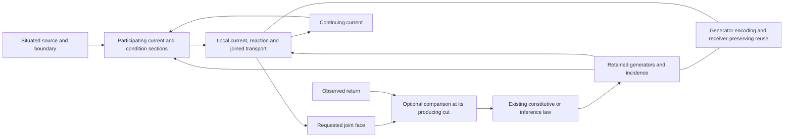

# HNN construction: mathematical network, encoding and prediction release

[definition] This is the active native implementation specification. [The roadmap](THE_ROADMAP.md)
alone orders construction; [CONSTRUCTION_STATE](../../CONSTRUCTION_STATE.md) alone records the
position. September 11 consolidates the old AC responsibility labels into named work phases.
The file path, source names and existing wire identifiers remain stable.

[project-postulate] HNN names the machinery; Athena is its first intended product. Automata
label HNN-based solvers and traversal constructions. Product labels introduce no mechanisms or
separate implementation tracks. The [roadmap](THE_ROADMAP.md#sustained-objective-and-construction-rhythm)
orders the shared construction. Mathematics supplies generating relations, receiver/phase
transport and bounds; native failures refine their realization. This blueprint owns the network
and implementation contracts. Available results and the current step belong in CONSTRUCTION_STATE.

## Product and evidence

[project-postulate] HNN conducts situated Holons through a continuing ecology. Athena and
Hephaestus label its products/uses; Eros names composition and formation at every nested scope.
Those names introduce no internal machinery boundary. The product goal is useful conversation, code, mathematics and
other modalities on consumer hardware. Hephaestus labels tools and utility models, including
code generators and mathematical solvers. Its factor/recurrence/generator inference is
already mathematical learning/reasoning in this programme. Report its supplied target and
constraints, derived executable representation, applicable consequences and relevant costs.
Exact search and supplied inference rules do not create a boundary outside intelligence.

[definition] The local operation remains
`occurrence -> local current -> reaction -> emission + successor ecology -> next occurrence`.
This governs execution and ownership. A completed mathematical inference requires no separate
state-mutation demonstration. Its resulting generator, equation family or prediction supplies
the substantive result; use the applicable evidence and receiver scope in the roadmap.

## Complete implementation contract

[project-postulate] The September 14 complete plan uses the seven delivery milestones in
[the roadmap](THE_ROADMAP.md#athena-construction-order). This file specifies their consuming
operations. Its older numbered sections retain mathematical/source responsibilities and
compatibility evidence, not a second implementation order. A completed small example does
not replace the public model and actual generated product described here.

### The public model operation

[definition] Use the existing `holonics::{structure,geometry,engine,hna}` library boundaries.
`NativeCoupledBody` owns the active model; its operative-field-backed representation owns
the field and local reaction under that same move owner. Reuse the current field, local
generator neighborhood, resident section/family, constitutive material and receiver types. A Holon operation retains
the source/target charts, incidence and shared parameters; it is not an untyped buffer wrapper.
Its initial constructor specifies K, material and receiver configuration explicitly.

[definition] The initial model law is an explicit composition of admitted contact/phase
transport, normalized participation, constituted boundary/interior scattering and local
learned reaction. The composition order is part of the model, including its finite integration
step and residual when a continuum interpretation is claimed. The neighborhood's normal or
bilinear law may parameterize a local reaction; it does not learn a separate imitation of the
entire scattering field. Those operators all act on the continuing field or joined source
family and expose their actual differential to the model's update.

[definition] A public generation request supplies a resident partial/source field, its known
boundary constraints, admissible source/latent family and requested receiver/extent. It returns
the generated joint section or its requested presentation and the applicable source/defect
information. A continuing call publishes the corresponding endpoint once. A forecast evaluates
the same declared operation without installing that endpoint. The numerical field API now
exposes `preview_field` and `generate_field`; `observe_field` consumes the retained comparison. The field-session stream now consumes these APIs with a declared symbol section, ordered
context tensor and joint basis receiver. Broader partial/context/support families extend this
existing consumer.

[definition] The refinement coordinate advances the whole participating state. Image/acoustic
coordinates and textual symbols label output faces, not mandatory evolution ticks. Extent can
be caller-declared initially and later supplied by the model's learned support/boundary action.
An unfinished global reconstruction or plural source fibre does not prohibit a lawful requested
face. Conversely independent coordinate selections cannot invent a joint output absent from
the retained source family.

[definition] A training request supplies an actual observed/target section and the required
producing handle. It forms the declared receiver residual and returns the covector through
projection, refinement, reaction, participation, transport and scattering into the material
that generated the prediction. It also retains source/internal/receiver variations where those
are operands. Receiver plates can carry their own state, storage and motion inside this joint
operation. A frozen readout is one explicit restriction, not the general receiver ontology.

[definition] The training law is concrete at each constituent: normal statistics solve `WH=B`
where that is the parameter inference; the existing contact response solves its stated
Frobenius/constitutive variation; a normalized receiver uses its actual KL/squared-probability
or current derivative. Sign, metric, step and admissible coefficient realization are declared.
A finite update must be checked through the actual nonlinear forward operator and its mixed
terms. An infinitesimal gradient identity alone does not prove that every full-size step lowers
loss. No new universal optimizer or qualitative definition of intelligence is required.

### First implementation increment

[established-bounded; source-inspected; measured] The field/reaction core, current publication,
producing D/M target response, public Rust invocation and local trained rest have returned in
[the model experiment](../../research/experiments/athena_field/README.md). The 48-target repair
continues that same core. This section retains its mathematical contract and responsibility
map, with the actual invoked owners and the application responsibilities they now serve.
Its shared field-session request/stream exposure now returns the bounded contextual text
application below. The initially supplied condition has an ordered native tensor realization
there; broader contextual representation and source populations continue through that consumer.

[project-postulate] Deliver one public **train → generate → observed update → generate again**
operation on joint sections, using the actual operative field and local learned reaction.
Inference on held-out inputs is part of this same return. The first aperture has explicit
finite incidence and a modest complete section; these supplied dimensions do not become
intrinsic semantic limits. This is the first model increment, not the whole Athena release.

[definition] **Chosen initial composition.** At each refinement cut let q join the field's
actual boundary/current and operative interior with the prepared external boundary/input.
Use declared resident port maps `P_s`, `P_h`
to obtain the reaction source and condition before seeing a target. The initial split is

```text
s=P_s q,           h=P_h q,
r=R_M(s,h),        u=E_B input + r,
(w,b_next)=S_D(u,b),
y=P_R w.
```

`R_M` is the existing local conditional/bilinear action; its output codomain is the operative
boundary-input chart of D. `E_B` is the declared external-boundary injection. D and M are
model parameters, not fitted copies of one another. Repeated refinements consume the returned
state. The first aperture holds material fixed within a generation and develops it on the
actual observed return; later constitutive/material evolution is an explicit extension.
This reaction-before-scattering split is an implementation choice within the formula, not
a claim that every physical/HNN interaction has this universal order.

[definition] **Resident ports and publication.** The existing `advance_current_resident` in
`field/resident_input.rs` already admits a generated point current without a host numerical
round-trip; preserve its actual input chart. `NativeFieldCurrentSource` joins the outgoing
report and operative b with owner, producing sections and contact births. Its `enclosure()`
is an outer receiver of those retained finer operands, not their replacement.
`NativeFieldCurrentSource::reflect` applies the actual D to an enclosed joint `(u,b)` without
mutation. `NativeConstitutiveField::commit_reflection` validates the producing cut/material
and publishes the computed w/b once, retaining its qualified common image. A new occurrence
must not silently compute a different operator or invent an observed target. Ordinary external/observed occurrences
continue through the existing field ingress and source/anchor contracts.

[definition] **Reaction attachment.** Bind `P_s/P_h` to declared blocks/transport maps of that
same joined field/input source and to the neighborhood action's domain. Repeated uses of an
input retain its shared parameters rather than independent copies. Use the existing action and
prepared-condition machinery to read `R_M(s,h)` without changing condition or material during
a forecast; expose a narrowly scoped staged read if the needed port is crate-private. The
first fixed-incidence aperture fixes these port maps explicitly. Born contacts later extend
their actual domains and adjoints using the birth/source-overlap maps, not padding based only
on equal widths. The composed pullback returns `P_R*` through `S_D`, then through `R_M` and
`P_s/P_h`, to the actual pre-generation D/M/current. Holding two owners side by side is not
this binding.

[definition] **First receiver.** The numerical application initially returns the identity
receiver on the complete requested outward block, with an optional declared `P_R` projection.
Use the staged reflection's `output()` or committed `read_current_source().enclosure()` with
its retained source witness; select the boundary block explicitly and keep b in the body.
The public section return must retain the owner-qualified generating source and the complete
joint output, not only a detached report. Host readout occurs at the requested delivery boundary.
Later text/image/acoustic codecs consume that same receiver contract. A coordinate envelope
must not be promoted to the Cartesian product of independent possible outputs.

[definition] **Producing-handle order.** The field body retains its immutable producing
source, reaction condition/material and joint input/output under the comparison identifier.
`observe_field` receives an actual target for that handle, stages the paired D and local M
responses, publishes both after successful preparation, and consumes the handle once. This
path does not fabricate an ordinary historical observation or route through a second wave
predictor. `respond_to_material_observation` remains a different available field operation:
when a caller uses it, its latest-receiving-cut precondition and internal commit apply.
Those preconditions are not retroactively imposed on the direct producing-target API.

| Responsibility | Mathematical/native owner | Application obligation |
|---|---|---|
| Own the field model | `A/coupled_wave/body/field.rs::FieldModel`; `NativeCoupledBody::from_field` | Keep one live owner through the shared request/session interface. |
| Execute the forward composition | `FieldModel::prepare`; reaction `apply_joint_current`; field `reflect`/`commit_reflection` | Bind the application's source/context and receiver maps to this operator; expose actual joint output. |
| Retain the joint section | `NativeFieldCurrentSource`, `NativeFieldGeneratedSection`, resident enclosures | Keep the common current and producing relation through text/other section receivers; never substitute independent marginal selections or a point seal. |
| Train the same D/M | `FieldModel::observe`; paired `compare_target`/`apply_reflection_target`; neighborhood staged reaction target | Carry an actual application target back through its producing receiver and model material. |
| Consume the producing handle | `FieldModel::pending`, `observe_field`, comparison release | Bind session responses to the model handle; preserve its scope and single incorporation across the admitted session lifecycle. |
| Expose and retain the result | Public Rust field API; field/body rest, `NativeFieldSession` and `HnaStream::pump_field` | The joint text receiver and pending/delivery payload now serve the bounded application; extend its complete source/support representation through these same owners. |

[definition] In this table C is `crates/holonic-engine/src/native_ecology/constitutive_fibre`
and A is `crates/holonics-hna/src/native`. The field's ordinary occurrence capabilities,
direct generated-section comparisons and older wave prediction handles have different source
contracts. Reuse each at its actual consumer; a common application interface does not identify
them merely because they all have integer identifiers.

[definition] The first data task is a declared joint field transformation/reconstruction
within the configured operators' applicable family. Examples and target sections are external
data; the field's D/Θ is trained directly. Include an unseen input combination and a conditional
case with its condition supplied before the target. Report supplied initial K/material, the
learned relation, exact/enclosed outputs, target error and cost. The task may use a small
controlled source to expose the learning equation; it does not become a permanent intelligence
gate or substitute for the later conversation/code product.

[definition] Start with an ordinary immediate observation to close the direct path, then
exercise a delayed observation when the producing-handle join is implemented. Reuse existing
native checks for the unchanged local arithmetic. Add checks for the actual new composed
forward/adjoint, family output and ownership joins. Do not count a CUDA-ignored test as executed,
or a public wrapper compilation as a model output. Measure setup, resident work and delivery
separately on the actual requested section.

### Next consuming application

[interpretation] **Diffusion and embroidery govern this construction reading.** Apply Brandon's
September 15 correction by grounding the application in how an interacting field forms a
received pattern. An incoming difference participates through the existing medium, incidence,
material, current, phase and boundary constraints. Refinement can propagate between coupled
regions and scales; local formation can alter subsequent admissible transport. A request can
specify constraints and a receiving boundary without first becoming a semantic task class.
The word-correction experiment measures one consequence of these operators; its template of
request/context/target does not define HNN's ontology or the organization of general generation.

[definition] The embroidery comparison retains crossings, orientation, tension/material response
and the dependence of the visible pattern on the receiving face. The
[July 17 mechanical correspondence](../../research/records/2026-07-17_THE_DUALITY_IS_THE_SITUATED_TRANSITION_THE_NET_HAS_NO_OUTSIDE.md#iv--string-sheet-and-volume-are-orders-of-carried-history)
and current [joint-field generation law](../HNN_FORMULA.md#generation-as-field-refinement-and-boundary-radiation)
supply this connection. Historical terminology does not prescribe an event archive or a new
weave subsystem. Dependencies may be carried by existing incidence, constraints, modes and
generators sufficient for the admitted operations.

[definition] Compact representation must preserve the interacting construction: shared
occurrences/crossings, causal transport, phase, relevant internal modes and the ability to
continue/re-express the pattern through its receivers. Independent component summaries can
lose those relations. Factoring a separable input is one exact case; factor the actual coupled
operator and its response where the relation admits it, or retain the separating mode/residual.
Diffusion does not require independent noise, and a zero value does not stand for unresolved
structure. Complete output concerns the jointly supported construction; streaming and local
refinement follow its dependencies. A single compiled generating operation may express such
an evolution; neither an arbitrary pass count nor a next-symbol clock defines generation.

[established-bounded; source-inspected] The [partial-region implementation](../../research/records/2026-09-15_PARTIAL_FIELDS_FORM_JOINT_PATTERNS_THROUGH_THEIR_RECEIVERS.md)
now supplies the concrete affine receiver and its target pullback, actual neighboring context
currents and variable receiving extent. Its separate activity/observation maps distinguish
unresolved regions from zero-valued observations. The single fixed-mask reaction/scattering
step is affine; composition with the existing content-dependent field/current variations is
further construction through this same application, not a claim already supplied by the mask.

[project-postulate] Build the first field-backed Athena contextual correction/continuation
session through the existing Workbench/request stream. Consume a complete prepared request and
its relevant preceding parts, generate the response as a joint section, expose its actual text
presentation, receive a supplied comparison through the producing model, and save/reopen that
same session's trained state. Inspect held-out episodes/combinations and preserve failed outputs.
The first scoped application does not claim general conversation or code competence merely
because the adapter runs.

[established-bounded; source-inspected; measured] The
[September 15 field session](../../research/experiments/athena_field/session/README.md) connects
`A/field_session.rs`, `HnaStream::pump_field` and Workbench `hna field-session` to the existing
field APIs. `SymbolCurrentChart` supplies the exterior unit-basis source; native ordered tensor
products form context; `read_basis_sections` receives all output positions together. The source
port is declared as incoming or continuing boundary and persists with the model. Outstanding
producing D/M and stream output also persist and resume. The bounded three-word/two-position
control returns actual contextual edits. This is the reusable application path to extend.

[definition] `FieldSectionRequest::from_exposures` reads complete shared visible parts and
checks the supplied recorded prior-parent chain. `ExposureReader` supplies validated source
families. The current session's fixed section and explicitly materialized tensor are exact at
their declared finite source chart; their growth makes a factored/local representation and
appropriate response support concrete requirements of broader complete inputs. Resolve those
at this same application call using existing section, factor, condition and receiver owners.

[definition] Keep the complete section and relevant preceding parts as source operands.
`P_s/P_h/E_B` restrict or transport that situated input into the existing reaction/scattering
law; `P_R` and the declared codec receive its jointly generated response. Their domains,
units/phase, known/unknown regions and producing parameters must be explicit. A source path,
episode label or target answer cannot substitute for those relations. Reuse the current
condition/contact, receiver and joint-family owners before adding an interface or representation.

[definition] Contextual and receiver development is part of this application construction.
Where the receiving chart/material moves, use its actual variation together with the source,
reaction, scattering and interior variations. Active plates and physical relative motion remain
in the model construction; a stand-alone geometry experiment is not the application's delivered
response. Unresolved broader receiver physics does not prevent using an already-admitted
receiver in an application.

[project-postulate] A callable adapter alone is an intermediate result. Close the increment with
actual generated response sections/text, an actual D/M comparison/update, held-out contextual
outputs, trained reopen and measured quality/cost. Keep pending comparisons across restart when
the admitted session requires them, through the existing rest owner. The [training data](#training-data-and-generalization),
[context](#context-morphology-and-active-interfaces), [durability](#encoding-memory-and-durability)
and [application](#application-and-release-contract) contracts below govern this one construction.

[project-postulate] Brandon's September 15 continuation standard is the unified Eros/HNN
construction: conscious-experience motivation, face/conservation laws, active plates/media,
coarse graining and spectral/cycle/fluid objects govern the elementary operations. The
[landmark receiver construction](../RECEIVER_HOLARCHY.md#landmarks-constrain-one-continuing-interior)
shows how available observations constrain one common evolving interior. Recover and implement
the corresponding operators at this consumer; preserve their phase, source correlations,
applicability and producing variations. The benchmark apparatus measures those consequences.

### Training data and generalization

[project-postulate] The [shared evaluation contract](../ATHENA_EVALUATION.md) fixes the questions
about supplied conditions, inferred relation, complete output, future reuse and cost. Its
conversation/repository episode adapter reuses the existing refined source package and keeps
historical assessment outside the model input. Mathematical solver results count at their
actual domain; field integration is a different consumer obligation, not a higher definition
of intelligence. Add a source family to answer a concrete application question rather than
replacing the benchmark each time an owner changes.

[definition] Reuse `applications/conversation-data`, `alpha::exposure::ExposureReader` and
the prepared source/part/return stream. User, assistant and tool messages retain their actual
roles and chronological relationships. The native input is a situated section and its relevant
conditions, not a source path, row number or document ID as semantic identity. Raw files remain
at the exterior preparation/evidence boundary; retain native distinctions needed by the law
through material, constraints, phase, modes and pending cuts rather than an input archive.

[definition] Use three distinguishable evidence scopes: development exposures that update
material; validation comparisons used to diagnose/tune the declared construction; and held-out
episodes/combinations whose targets do not enter material or source preparation. Separate by
whole source episode/relationship where necessary, not merely by shuffled adjacent text rows.
Record which exposure constructs which relation. A source presentation can be masked or partly
observed under a declared corruption/restriction chart; noise is an available exterior choice,
not the definition of native uncertainty or a required source of generation.

[definition] Begin contextual product work with complete requests/responses or requested
sections, including corrections, dependencies and relevant earlier turns. Train joint
reconstruction/continuation through the same field dynamics. Test changed conditions and
unseen combinations rather than only replaying a stored span. Text tokenization, if used by
an exterior codec, does not set the latent topology, default memory architecture or refinement
clock. Source/target leakage, an authored decoder answer and self-output mislabeled as human
feedback are incorrect constructions to repair.

[definition] Grow the data aperture when the operation has returned a useful result at its
current scope and the next exposure answers an actual learning/capacity question. If outputs
fail, inspect the source distinction, material law, adjoint, representation and receiver before
increasing volume. The goal is empirical reach from one model, not completion of a data-ingest
campaign. Existing exact mathematical solver inference remains independently useful.

### Context, morphology and active interfaces

[definition] Extend the first model by giving its actual neighboring/receiving regions their
state, internal storage, phase, transport and relevant material response. Source/condition ports
are restrictions of that coupled situation; an appended context label is not that relation.
The forward and adjoint include changing participation and changing transported values.
Learned topology uses source-conditioned incidence/constitutive variation and the existing
contact birth/transport owners. A fixed-shape derivative does not account for a new coordinate.

[definition] A retained residual, preimage or rank/separation result identifies a distinction
the current local constituent cannot express. Construct or refine the corresponding constituent
through its actual source map, then update its callers and representation together. Preserve
newborn zero-input constraints, source overlap, relevant sign/phase and existing pending
producing material. Do not make a semantic classifier, scalar priority queue or content hash
the general law of contact/navigation.

[definition] The model may use lattice, mode, sparse factor, tensor, recursive or analytic
representations of the same operation. Toroidal cycles and fractal/preimage geometry enter
through actual incidence, transport and recurrence; their illustrated count does not prescribe
network depth. A physical law supplies its unit/constitutive chart, not a requirement to
simulate an entire organism before delivering an HNN application.

### Encoding, memory and durability

[definition] Bind `E_next T=U E` and `D_dec E=ρ` to the repeated operator actually executed,
including its interior and required future receivers. Reuse the existing mode/observable
reducers, native factors and condensed operative programmes. When an eliminated mode can
affect a future receiver, retain its dynamics or explicit memory/residual; do not discard it
because the present scalar reading agrees. Declared approximate encoding retains its bound.

[definition] Distinguish the model's dynamic memory from replay required by a current
implementation. Remove repeated full-prefix execution where a sufficient generator, local
statistic or state realization already closes the action. Keep the relevant pending source
relations; branch states share immutable material and own their differences. Measure resident
work, allocations, transfers, representation size and exact bit growth before claiming savings.

[definition] Extend the rest belonging to the actual field-backed body and its application.
Payload includes K/transport, material, current/interior, codec/receiver configuration,
encoded programme or residual, pending producing comparisons and the continuation/cursor
needed by the admitted resume. Use existing field/operative rest and `SavedCoupledBody`
versioning; native ecology and inherited HNP rest are different existing payloads and cannot
be interchanged by name. A new process must generate a new section and incorporate a retained
pending observation consistently with uninterrupted execution.

### Application and release contract

[definition] Use the existing Workbench stream boundary and public SDK. Callers should mount
a prepared source, invoke the model, receive its generated artifact and continue/update/rest
without manually wiring internal arithmetic. The current native wave/coupled codec ports are
reusable boundaries; older `text_session.rs` uses `AthenaTokenApplication`/HNP model semantics
and must not silently restore a next-token engine or inherited model dependency.

[definition] The first usable Athena release covers held-out contextual conversation,
correction/continuation, mathematical use and code/tool tasks through this same model. Inspect
the actual outputs, changed-context behavior and execution of generated code/tool arguments.
Existing exact mathematical operators are callable functions within the product; a code
printer remains an export/application of a constructed generator, not its definition. Tool
results enter as actual source observations under the application's explicit tool contract.

[definition] The initial text receiver can reuse `A/section_input.rs::SymbolCurrentChart`
as a declared symbol/current codec over a complete requested section. Encode known and
unknown regions and their constraints; let the model refine them jointly. Any symbol-basis,
embedding or support/end-marker map has a stated supplied/learned role. Decode from the same
joint realized field or supported family through its actual receiver, not independent choices
from marginal enclosures. Extending the output region follows the model's support/boundary
operation and dependencies. It does not revert to feeding one selected next symbol back as
the definition of generation. Existing wave text readers are codec/reference consumers to
adapt, not the new field model's hidden scheduler.

[definition] Optical/acoustic support uses the same joint-section/request/update contract.
Recover `membrane_optical` and `membrane_acoustic` receiver laws at their existing source-neutral
scopes, then bind the current emitted fields through the actual phase/axis maps. Their historical
source-neutral morphology types are not automatically the new body's types. Image/PCM encoding
is exterior; a multimodal receiver does not create a separate learning engine.

[definition] Harden interruption, unsuccessful-operation ownership, malformed input/artifact,
pending return and remount at the actual process boundaries. Expand throughput and useful
capacity under measured consumer resources. Native exact arithmetic and GPU residence apply
to the assembled hot operation. A float-based observer statistic is not forbidden; a host
semantic replay or float-derived committed coefficient is not a lawful shortcut.

[definition] Executable export follows `INTEROPERABILITY`: actual target graph, parameters,
state, chronology, numeric conversion and receiver comparison. The existing Safetensors/custom
ONNX package is a container capability. Broader GPU/CPU/Metal parity and optional Soulkiller
material require their own operation/source correspondence, not the reinstatement of a
retired inherited-first campaign.

### Completion and continuation

[project-postulate] Each increment returns the generated product and the actual invoked
consumer, supplied versus inferred material, relevant checks and measured cost. A local
training task establishes that task; the first usable Athena release additionally owes its
conversation/code/application evidence. Frontier-level usefulness remains the empirical
ambition. None adds a vague state-mutation or universal-intelligence admission test.

[definition] “Continue Athena” resumes the active brief's next unclosed operation under the
roadmap. Carry the human objective, governing corrections, equation/unknown, source/receiver,
owner, next edit and completion evidence across compaction. Completed evidence becomes concise
links. Keep research and code corrections coupled to their consumers, preserve useful unrelated
work, and finish the authorized increment without returning another plan or permission loop.

## The HNN network and its mathematical contract

[project-postulate] The [HNN model formula](../HNN_FORMULA.md) governs this assembly. It gives
the constituted circuit/field equations, native scattering action, tangent/adjoint, classical
learning instances and dynamic mode reduction. The relationships below specialize that formula;
they must not be read as an architecture consisting only of lifecycle obligations. The
[library composition table](../RUST_FRAMEWORK.md#mathematical-operators-and-model-assembly)
distinguishes implemented mathematical operators from their present model consumers.

[definition] The model is the retained network of generating functions, current and their
situated composition. Its context is the [causal boundary over intersecting event histories](../HNN_COMPOSITION.md#context-names-a-situated-causal-boundary),
including stored interior response, actual flux, constitutive material and local clocks.
At a contemporary cut let q denote its situated current, Theta its constitutive/generating
material, and I its admitted oriented incidence. These are
mathematical operands already represented by the field, relation and coupled owners, not a new
universal state wrapper. An occurrence enters through its actual boundary map. Relevant local
restrictions expose `s_e=S_e(q,o)` and `h_e=C_e(q,o)` at a contact e before its target is observed.
The domain and source of S_e and C_e must be stated. They are restrictions at this boundary;
the local port h does not stand for its entire context. Their formation and use belong to
the evolving current/material/incidence assembly, with no universal context-extraction stage.

[definition] In an attachment change, name the body carriers actually read and how the
restriction refers to their incidence and current chart. Applying supplied A and C computes
their output sections; it does not infer A and C. Existing resident condition formation can
supply h without relearning that mechanism. If h or the source is a joint family, preserve its
shared parameters through the consuming law; a point-current API requires its stated point
domain. Merely adding a method that transfers a predictor handle does not settle these operands.

[definition] In the finite homogeneous additive chart of
[FiniteLocalCurrentEcology](../../formal/elementary-holonics/ElementaryHolonics/Computation/HolonicNeuralEcology.lean),
with the occurrence interpreted in its declared generator chart, a complete local step is

`j_v = sum_u J_Theta(q,o,v,u)`,
`q_next(v) = R_Theta(o,v,q(v),j_v)`,
`y = rho_F(q_next)`.

The local current J carries the actual incidence and source/condition dependence; co-presence
does not imply contact. R receives both prior local standing and arriving current. The graph,
attention and recurrent charts in
[HolonicArchitectureCharts](../../formal/elementary-holonics/ElementaryHolonics/Computation/HolonicArchitectureCharts.lean)
and [HolonicRecurrentEcology](../../formal/elementary-holonics/ElementaryHolonics/Computation/HolonicRecurrentEcology.lean)
instantiate parts of this account. Heterogeneous ports use their
actual transport/join maps rather than a universal scalar sum. These signatures specify
operands and composition; they do not construct J, R or their learned organization merely by
declaring functions with those types.

[definition] In the present coupled-wave realization, the source action instead uses the
explicit chart `a=(c-p,c,p)`, `eta in L_j(a,h)`, `v=c+eta`, with successor `(c,v)`.
The normal specialization fits a declared feature action with `WH=B`; the bilinear relation
and contextual-section owners retain compatible source/condition products and their fibres.
These are available local laws, not a definition that every HNN generator is a fixed bilinear
regression over the last two symbols. The network construction must carry their participating
source restrictions, condition formation, composition and requested receiver through the same
continuing owner. A new adapter that supplies those choices externally leaves that work undone.



[definition] Formation determines reusable functions, parameters or incidence through the
admitted inference/update law and actual returned differences. For an empirical comparison,
[SituatedMachineLearning](../../formal/elementary-holonics/ElementaryHolonics/Computation/SituatedMachineLearning.lean)
retains its producer and comparison; the native
condition-contact, normal and adjoint owners realize their stated laws. For an exact solver,
preimage/factor construction can infer its requested function directly. Neither mode needs an
extra event whose only purpose is to demonstrate causality. A new independent contrast can
require a new constituent direction; repeated occurrence alone does not define one.

[conditional] Compression and navigation share the resulting generator when an executable
encoding E and retained action U satisfy `E_next T=U E`, and the requested receiver factors as
`D E=rho`. Ordered application then produces the same requested faces through the encoded
state. [JointReceiverDescent](../../formal/elementary-holonics/ElementaryHolonics/Foundation/JointReceiverDescent.lean)
supplies the additive invariant-kernel criterion;
[receiver_history_compression](../../crates/holonic-engine/src/receiver_history_compression)
supplies executable reference constructions at its own domain.
Changing material, incidence or pending-return receivers belongs in T and the family to which
these equations apply. A set-theoretic quotient alone supplies no executable decoder or cost
claim. Approximation retains the actual defect and its bound at the declared receiver.

[definition] The assembled HNN requirement is to make these operations consume each other's
returned mathematical objects. The [source map](#exact-source-map) names the current owners;
sections 1–4 specify their attachment, formation and representation obligations. Model requests
use that assembly through the public session. A component experiment is evidence for its
particular equation; the product claim additionally needs the consuming call and its returned
consequence. Preview, commit and observation each retain the operation contract below.

## The shared mathematical-to-native construction

### Boundary and interior assembly contract

[definition] The September 14 [engine blueprint](../ATHENA_ENGINE_BLUEPRINT.md) is the
illustrated source-level reading of this contract. The direct path is the existing operative
field, paired material response and local learned reaction under `NativeCoupledBody`.
Its diagram distinguishes existing operators from the unbound application join. No field-to-W
surrogate wrapper is substituted for this same-material forward/training operation.

[project-postulate] The next assembly executes the actual constitutive operators as the HNN
model. In the existing scattering chart, `A=I+DD*`, `A v=2(u+D b)`, `w=v-u`,
`b_next=D*v-b`. Compose the incident boundary transport, these internal dynamics and the local
learned reaction through `NativeCoupledBody` and the operative field's resident material.
The forecast and committed step must evaluate this same composition. Normal fitting is used
where its coefficients are the inferred model; an independent field fitted as a target source
does not stand in for this assembly. That distinction supersedes the draft's surrogate-first
interpretation, while retaining its valid normal/enclosure and delayed-observation code.

[project-postulate] The consuming implementation uses the [Holon object](../HOLON.md) and the
[whole-field generation law](../HNN_FORMULA.md#generation-as-field-refinement-and-boundary-radiation).
Its operator acts on a resident section or joint family; successive refinements change that
field, while image pixels, waveform samples and text symbols are output coordinates.
Boundary activity can stimulate another internal region without a deliberate message.
The public codec observes this operation and does not reduce it to next-token steps.

[definition] The consuming implementation has three joined obligations:

1. **Evaluate and learn the composed model.** Transfer resident currents through the actual
   contact charts; use the existing scattering/reaction operators for joint output. Pull the
   requested differential through their tangent/adjoint into those same coefficients, including
   the current/material interaction terms. Reuse condition/preimage and normal laws where they
   occur in this model; do not require a synthetic observation after every output.
2. **Execute its modal representation.** Factor the repeated full boundary/interior action,
   with its initial internal modes and pending comparisons. For changing geometry use
   `E_next T=U E`; where it fails, retain the exposed mode or its dynamic memory. The exact
   reducer is an algorithmic starting point to lower to resident execution, not a new host loop.
3. **Expose the same model to Athena requests.** Keep input encoding and requested output
   projection on the existing public session. Inspect the actual correction, continuation or
   mathematical product from the composed body, including its error and work. Derive the next
   repair from that operation rather than introducing a different example to obtain a pass.

[project-postulate] This is one integration assignment. Supporting numerical and ownership
repairs stay part of it. Existing wrappers and separate prepared predictors are implementation
choices to reconcile, not mathematical boundaries to perpetuate. The current draft is not
discarded and no unrelated physical environment or solver API is removed.

[definition] The consuming operation binds actual participating boundary and retained interior
currents to local generating material, then returns the requested joint face and the successor
specified by the call. Its pre-return source is the admitted event-boundary section, including
incidence, storage, clocks and the represented source fibre. A local restriction S/C is one
map within that operation. The existing field/junction current and condition owners supply
source constructions; `ResidentGeneratorNeighborhood` and `NativeCoupledBody` supply the
returned conditional-generation and joint-release consumer. Their source types, shared
parameters and ownership transfer must agree at the consuming call.

| Deliverable | Equation or concrete completion evidence |
|---|---|
| Resident boundary/interior binding | Name the native carriers and restrictions used before the observed target; execute the local interaction on their joined source family. The consumer retains the actual interior response, rather than reading a cold inspection as a production operand. |
| Generated joint product | Inspect the requested multi-face section from the shared producing family and reuse the returned body for its next admitted call. Include the observed-return contract only when requested by the application. Text, numerical fields and mathematical actions use their respective receiver charts. |
| Encoded repeated conduct | For the repeated segment actually encountered, construct E/U/D with `E_next T=U E` and `D E=rho`, or retain the explicit dynamic residual and its receiver bound. Include material/incidence changes and pending producing cuts. A full expanded word does not establish reduced execution work. |
| Integrated verification and maintenance | Compare the actual outputs, shared-source constraints and needed delayed returns. Measure setup, repeated execution, delivery and retained representation separately; consolidate affected owners and run the relevant native/formal checks. |

[project-postulate] These deliverables apply the existing assembly, formation and encoding
responsibilities together. The [orchestrated cycle](../DEVELOPMENT.md#orchestrated-construction-cycles)
keeps one primary integration owner and bounded Luna support. Source-domain mismatches are
resolved at their equation and port; they do not launch another independent model adapter.
The roadmap supplies order and CONSTRUCTION_STATE records the current returned dependency.

[interpretation] A reusable machine can support a family of admitted orientations before a
contemporary application selects source ports, held conditions and receiver. The non-orientable
surface picture motivates retaining transition maps and route differences; it is not a claim
that every function's parameter space is a non-orientable manifold. Reverse use returns a
preimage family or obstruction, not an assumed inverse. Items 1–4 below are interacting aspects
of this complete application/return cycle, with no imposed serial completion order.

[definition] The target is one continuing ecology of applicable generators. A mathematical
operator request, a text occurrence, an acoustic event and a kinetic observation enter through
their source/receiver charts. The HNN ecology carries the available organization; Eros names
its composition and formation through actual returned constraints. Hephaestus labels an
operator-scoped tool, code or mathematical use, while Athena labels general wisdom/model uses. Their names do not introduce separate
inference, compression or formative laws.

| Shared formal construction | Existing executable owner | Required Athena/Eros consequence |
|---|---|---|
| Addressed holon, joint future receiver and Preimage Fibre | Coupled current families, source arrivals, pending producing comparison | Retain actual joins and correlated conditions behind an emitted face; later observations constrain the producing relation at its saved cut. |
| Exact generator factorization and ordered recurrence words | `exact_linear` polynomial/preimage/factor owners, `derived_factor_cover`, public `native/mathematical.rs` | Reuse callable factors, changed receivers and fixed-operator powers. Extend their actual source/action maps to developing material; the public workshop is already returned. |
| Receiver-history compression and generator equivariance | `receiver_history_compression`, observable-form closure, existing native relation and rest owners | Preserve the complete required future under encoding, including changed conditions, emission and the current material; retain or reopen a separating source fibre. |
| Swing, clock–ruler and phase-lift transport | Exact receiver atlas, coupled/analytic phase and internal-mode owners | Keep source clock, winding, orientation and within-cycle residue across changed receiving conditions. Source and receiver must travel together. |
| Situated information and addressed code-cost bounds | `surprisal`, `exact_work`, native comparison/inspection | Measure surprise/code length, full residual, work and residency at the same declared cut. Carry endpoint/normalization terms; use cost to compare admissible realizations, not to replace causal relevance. |
| Adjoint, finite differences, mixed energy and constitutive reaction | Producing material return, local relation/contact, field and wave owners | A returned difference acts through its actual producing morphology and changes the appropriate law/contact/material in one successor. |
| Sequence/fold, catalytic current, fluid memory and world-tube sections | Existing physical/kinetic and Schur/internal-mode realizations | Retain joint occupancy/contact and hidden continuation when equal present faces have different futures. Reuse those mechanics wherever the native source domains match. |
| Encoding-anchored causal length and target correspondence | Public native session, exact primitive/device and interoperability owners | Relate claimed savings to executed work and actual decoded outputs; eventually emit useful executable algorithms with their domain, numeric and state correspondence. |

[definition] This table states the intended consumers; it does not claim all those bindings are
already complete. Formal definitions and theorem names remain exterior. Native implementations
realize the relations in their admitted exact representations, with kernel/consumer verification.
No runtime Lean invocation is part of Eros or Athena.

[definition] The reusable mathematical representation retains domain, input/output action,
conditions, source occurrence, receiver/decoder, ordered clock, compatible coefficient family,
residual and available work account. Extend those fields in their existing cohesive owners as
needed; this is not a new universal wrapper or a source-name registry. A public operator request
must return executable structured material, not require later consumers to recover it from a
printed example. Serial composition checks the actual joining/domain relation; changing a
receiver requires a factorization or an explicit separating obstruction.

[definition] Native incorporation consumes the actual producing comparison and restricts/forms
the joint source/condition/material relation it establishes. Compatible alternatives remain
alternatives; no chosen centre or invented measure is substituted. When an affine family cannot
carry a needed mixed product, represent that product through existing richer section/factor
owners or return the exact missing relation and construct it. This mathematical derivation and
its native transaction proceed together. Phase 2 below gives the atomic publication boundary.

[definition] Emergent organization is inspected through actual constituent domains, active
contacts, retained factors and changed future conduct. These may appear as hierarchical layers
or overlapping regions; layer counts do not define them. The observation surface shows which
objects participated, their received current/phase, output and subsequent return. Prediction
branches share immutable standing and own their differences rather than cloning the ecology.
Probability/cross-entropy applies only to the declared normalized receiver; retain unresolved
source alternatives and oriented defects before that scalar reading.

[definition] A mathematical request can return an inferred executable relation in that operation.
Show the requested target, supplied constraints, returned factors/word or solution family, and
their useful consequence and cost. When the task develops a continuing body, bind its actual
return and retained representation through the same public owner. A delayed empirical correction
or another state-mutation assay is not an additional prerequisite to a completed solver result.
Persistence checks apply to newly claimed durable relations; source and formal checks establish
their particular mathematical and executable contracts.

<a id="next-implementation-packets"></a>

## Existing generation and implementation responsibilities

[definition] The following source/receiver and wave/normal constructions remain reusable
mathematical contracts and bounded evidence. The September 14 complete contract above and
the [roadmap](THE_ROADMAP.md#athena-construction-order) select the direct field-backed model
assembly. These older local applications do not schedule another predictor-first increment.

### Generated faces: reconfiguration, correction and continuation

[project-postulate] Brandon's subsequent September 13 correction resolves the ambiguity in the
earlier plan pickup: prediction, release and output are not separate intelligent faculties or
completion gates. Specify the generating relation and its concrete use before implementation.
The [message/plan review](../../research/records/2026-09-13_DIRECT_MESSAGES_CONFIRM_THE_ATHENA_CONSTRUCTION_ORDER.md#prediction-and-output-correction)
retains the correction.

[definition] For source s, carried conditions c, generator G_Theta, requested receiver rho_F
and codec D_F, the operation returns

`y = rho_F(G_Theta(s,c))`,   `output = D_F(y)`.

[project-postulate] The September 14 intrinsic-fractal correction governs the representation
of this generator: heads and local charts operate inside the same interacting field; layer
indices are a composition chart. Its toroidal cycles, simplicial/higher-cell joins, connection,
nonlinear recurrence and full preimages must be recovered together. A separated-copy IFS,
a fixed affine contraction or an exterior skin cannot define the general HNN topology or
its recursive dynamics. The [intrinsic field formula](../HNN_FORMULA.md#one-object-its-charts-and-its-recursive-geometry)
provides the operational source route and the precise first-arrival/rebase relation.

[definition] G_Theta is the mathematical generating operation. Its constituent functions,
parameters, morphology and source-conditioned composition are the objects being formed and
reused, including recursive/fractal realizations. A code-generating model specializes the
requested output domain. A Rust printer represents an already-constructed operation at an
exterior boundary. These three roles remain distinct in the deliverables below.

Prediction describes the generated consequence y under the source conditions. Release/output
is that same face presented across the receiving boundary. The codec changes its presentation,
not whether it is a prediction. A face may be a number, text chunk, graph/section, action or
requested family. An emitted reading does not require its source fibre to become a singleton.
A later observation can be compared and incorporated; it is not required to make the preceding
output a prediction.

[established-bounded; source-inspected] `next_symbol` and `predict_symbol` already call the same
`emit_symbol`; the latter retains a comparison handle. `predict_continuation` constructs and
returns generated text from a joint receiver. Its read-only status means the continuing native
body is not advanced by that forecast call; it does not mean the call produces no output.
Emission counters, source re-entry, pending comparisons and rest are operation/state contracts,
not additional definitions of generation or criteria for intelligence.

[definition] **Text reconfiguration:** represent three chunk embeddings as the rows of X.
`P=[[1,0,0],[0,0,1],[0,1,0]]` gives `Y=P X`, preserving the chunks and changing their order.
For the characters `teh` it returns `the`. P states the local transformation; source and
correction examples determine its applicability. This is a worked transposition case, not a
claim of a trained general autocorrect model or a rule to transpose every word.

[definition] **Correction and continuation:** correction examples pair a received chunk with
its corrected presentation; continuation examples pair the available source with its further
face. Reordering, filling missing coordinates and replacing conflicting coordinates change
the known/unknown parts of the conditional relation. The same generator/receiver returns the
revised chunk or the further chunk, without a new kind of generating machinery.

[proved-derived] In the finite linear comparison owned by `exact_linear/contextual.rs`, columns
S,C,Y encode source, carried conditions and returned targets from the same occurrences. Solve
`W [S;C]=Y`. A solution exists exactly when `ker S intersect ker C` is contained in `ker Y`;
preimage reduction returns all W or a separating vector d. If `S d=0` but `Y d!=0`, S alone
cannot reproduce those targets. C supplies a distinction when the stacked source removes that
obstruction. This specifies the context question by an equation and witness. The existing
bilinear contact includes its declared source/condition products when their interaction is read.

[proved-derived] For fixed encoded features u_i and target increments v_i, the normal
construction retains `H=sum u_i u_i*`, `B=sum v_i u_i*`; its least-squares equation is `W H=B`.
A new pair updates `H+=u u*`, `B+=v u*`. The sum identities show why these statistics preserve
this solve without rereading earlier pairs. For an invertible feature rebase A, `H'=A H A*`,
`B'=B A*` and `W'=W A^-1` preserve the predicted face. A different change needs its corresponding
transport. This is a sufficient
representation for a specified feature/target law, not an undefined requirement on all conduct.

[proved-derived] For fixed linear conduct, `G^d=sum_(j<d) a_j G^j` lets reduced coefficients
represent later powers, as the existing minimal-polynomial owner implements. For a sequence of
chunk permutations, their composite permutation represents its endpoint action. Requested
intermediate sections require their corresponding reconstruction maps. These named identities
replace the phrase "sufficient continuation" with the representation and receiver being checked.

[definition] Specify a requested chunk/section source, its correction or continuation target,
the coefficient/conditional relation inferred from their comparisons, and the receiver returning
the generated face. The examples above make the mathematics explicit; they do not prescribe a
separate autocorrect product stage or a mandatory transposition probe. Returning that face is output. Use the existing
normal, contextual, factor and receiver owners. Update the body through its established operation
when the use includes subsequent interaction. Report the transformation and its text/mathematical
result; a separate "complete feedback", "learning" or "intelligence" test is not a prerequisite.

### Release, continuation and comparison contracts

[definition] Let X contain the participating current, condition, material and live source cuts.
For an admitted passage T and receiver rho, a release returns `y=rho(T(x))` and its presentation.
A continuing operation also installs `x_next=T(x)`. A forecast evaluates that same relation
without replacing the continuing owner. Neither operation requires a later target. A comparison
uses an observed o and the retained producing cut to form the oriented difference `(o,y)` and its
declared residual; incorporation applies the existing return law to the contemporary body.
This notation describes existing owners, not a proposed universal X wrapper.

[definition] A compound output retains one joint source:

`x_i=T_i(x_(i-1))`, `J_F={(rho_1(x_1),...,rho_k(x_k)) : x_0 in F}`.

All components use the same source parameters and joining equalities. The output can present a
chosen declared receiver of J_F or J_F itself; independent coordinate choices do not in general
belong to J_F. Length, requested region, endpoint or termination are receiver/boundary conditions.
A caller's finite aperture is reported as such. It is not a discovered intrinsic extent or a
universal token clock. Execution may stream a section while retaining its joint dependencies.

[definition] Self-emission changes the composed law when it is admitted between passages.
If I re-enters the generated face, the step is `H(x)=I(T(x),rho(T(x)))`; a k-step continuation
then composes H, rather than T. I must include the appropriate source/codec map and returned
body. In particular, `rho(T^k(x))` does not generally predict `rho(H^k(x))`. Intermediate
re-entry and a single reception at the section boundary are different admitted compositions.
Neither is silently substituted for the other.

[established-bounded; source-inspected] At `ec410c7b`, the public bindings implement:

| Operation | Returned output and body contract |
|---|---|
| `coupled_wave.rs::predict_continuation` | Decoded joint forecast for a caller-declared member word, with no intervening reception or successor publication. The dependent body evaluates its standing parameter section. |
| `next_symbol` / `predict_symbol` | Both call `emit_symbol`, advance the body and decode a face; the second retains a producing comparison. Adjacent emitted symbols also enter the existing source-actuation path. |
| `compare_symbol` / `incorporate_symbol` | Read an actual producing comparison / consume its observation through the existing Base/Programme return. These do not turn the earlier face into output. |
| Mathematical `PredictRelation` / `PredictCondition` | Return a joined condition/output family, with optional retained comparison. Operator application and changed receivers also return generated mathematical faces. |
| `ReleasePrediction` / `release_symbol_comparison` | Dispose of a comparison handle. Here the API verb means resource disposal, not prediction output; existing wire names remain stable. |

[definition] The first committed compound binding executes the preview's **transport-only word**
and publishes its endpoint once. It returns the joint output from that same prepared source,
with optional retained receiver cuts for later observations. It adds no intervening self-re-entry.
A later source occurrence consumes the published endpoint. If an application requests boundary
self-reception or interleaved self-emission, compose that source action explicitly; its forecast
must include it. This fixes one concrete consuming contract without requiring a new release engine.

[definition] Shared family/section and decoder owners retain one producing cut per required
comparison, rather than manufacturing independent observations from each projected coordinate.
One observed component restricts the joint relation; a delayed return uses its original source
maps even after later passages. Disposing of an unneeded comparison requires no fabricated target.
Read-only forecasts remain available without this continuing-use binding.

### Deliverables and discriminating checks

[established-bounded; implemented-exact; measured] The
[first active-goal return](../../research/records/2026-09-13_RESIDENT_CONTEXT_FEATURES_RETURN_PREDICTIONS_AND_FACTORS_RELEASE_EXECUTABLE_CODE.md)
binds arbitrary-width resident source/condition features to the shared normal material and
public mathematical predictor. It also returns executed Rust functions from retained factor
graphs. The preparation restrictions in that trial are supplied maps; the next coupled
source/field attachment remains in section 3 below. Exact-function code does not discharge
the broader parameter-family, contextual editing or whole-session persistence rows.

[definition] These are artifacts and checks for the roadmap's existing packets. Their names
do not create another phase scheme. The source abbreviations are defined in the source map below.
Each row specifies a bounded application consequence; no finite row certifies general Athena.

| Deliverable | Implementation artifact and consuming owner | Check that determines the result |
|---|---|---|
| **Context-conditioned generated section** | Replace the production h=1 calibration at the section-input/coupled attachment with resident source/condition restrictions at the producing cut. Join normal/conditional formation in `C/resident/neighborhood.rs`, contextual-section and normal owners; expose the result through the existing coupled stream. Infer `W[S;C]=Y` or the declared feature law `WH=B`; keep non-affine products in their joint owner. | Developmental observations contain a source-null contrast separated by carried conditions. Generate the corresponding whole chunk on new admitted inputs, including the same visible input under those distinct preparations. Report S/C/Y, actual output and the separator for an unsupported contrast. Evaluation targets cannot choose C, contact or decoder. |
| **Committed joint release** | Extend `W/coupled/dependent.rs`, the existing prospective/family owners, `A/coupled_wave/body.rs`, `A/coupled_wave.rs` and `stream.rs` with the transport-only contract above. Stage the word and receiver cuts, return the prepared joint face and publish one successor; preserve the existing forecast command. | Compare forecast and commit from equivalent initial rests at the same section, including every requested joint component and endpoint. With shared parameter theta, a `(theta,theta)` output must retain the equality, not admit independently selected coordinates. A later component observation constrains that same source. Exercise a delayed return and a rejected final join without partial publication or a whole-body clone. |
| **Compiled continuing action** | Replace the repeated portion of `ConstitutiveSourcePassage` execution with an existing factor/recurrence or closed-statistic representation. Bind `E_next T=U E` and `D E=rho` to current, conditions, material and required pending cuts. The public fixed-linear `Power` is an available specialization, not a compiler for arbitrary changing material. | Exact/enclosed joint outputs, endpoint and delayed return agree with the standing programme on the declared family. Include a receiver exposing an omitted direction and a new formation step. Repeated calls with no new independent structure cease appending one executable-history item per call; report contractions, stored representation and integer bit growth. |
| **HNN solver and tool output** | Use the contextual formation and retained operator/constituent owners to construct and execute the mathematical function for the requested utility consequence. Bind its source, conditions, composed action and receiver through the shared session. The existing `emit-rust` receiver remains available when an exterior source representation is requested. | Inspect what relation was inferred, its retained realization and its returned faces under new inputs or admitted compositions. State supplied charts and constraints separately from formed material. Code-model output is checked at its requested behavior; an exported operator is checked against native execution. A plural inferred law retains its family. A printed supplied graph alone does not establish contextual generator formation. |
| **Athena task episode** | Use the repaired section/formation/release path through the public session for contextual correction/continuation and a short explanatory reply; use the same constructions for a code edit or function request. Source parts and genuine returned observations enter the standing owners. | Publish the development/evaluation split, exact requested outputs and representative successes/failures. A correction preserves the requested unaffected region; a continuation answers its context; code executes the requested behavior. Inspect these products before enlarging exposure. A state change, nonempty response or loss decrease cannot substitute for them. |
| **Durable reusable products** | Extend existing coupled rest only for the new section/encoding cuts. Attach mathematical-session checkpointing to its retained relations, operators, products, pending predictions and resumable construction frontiers, plus stream state. Reuse existing codecs/rest owners; wire IDs remain stable. | In a new process, apply a retained operator to a new input, change its receiver, continue a declared release and consume a pre-rest pending comparison exactly once. Compare returned faces and successor with uninterrupted execution. A construction interrupted inside its admitted search resumes its frontier and work account. |

[definition] Formation, joint release and compilation can be developed together through their
shared source contract. Here compilation means constructing an executable representation of
the retained mathematical action; it need not emit source text. An exterior function receiver
can use returned operators for a requested export. Durable serialization follows its payload; it does
not hold up live-session output. The first field-backed increment above now binds the actual
source/condition, constituted action and generated section, reusing the callable workshop.

[definition] Measure each artifact with the [standing performance conventions](../DEVELOPMENT.md#performance-and-information-measurements):
construction/setup, resident passage, decoding/delivery, target compilation/execution and
checkpoint costs have separate intervals. A frame is a completed delivery at a named section
receiver; a tick is an admitted passage at a named owner/clock. Report both populations and
elapsed intervals, chunk extent, latency distribution, device/host memory and transfers on the
Ryzen 9 7900X / 32 GB / RTX 4080 Super 16 GB apparatus. A forecast delivery counts as a frame
without falsely incrementing committed-body ticks. Longer sections do not become faster by
changing the frame definition. Bits per face require a declared code/probability receiver;
cross-entropy additionally requires an actual target distribution or observation. Keep signed
residuals and phase before scalar readings. The sub-five-minute working scale motivates these
measurements; it is not an unconditional runtime promise or a mathematical cutoff.

### Callable mathematical workshop: the first delivered increment

[established-bounded; source-inspected] `A/mathematical.rs::NativeMathematicalSession` already
exposes exact linear/bilinear construction, resident application, changed receivers, composition,
fixed-linear powers and condition-family inference. The
[returned workshop](../../research/records/2026-09-12_CALLER_CONTROLLED_NATIVE_MATHEMATICS_RETURNS_FACTORS_AND_PARAMETER_FAMILIES.md)
and [current public interface](../NATIVE_HNA.md) own its request details and measured evidence.
This is an available consumer of mathematical constructions, not a packet to implement again.

[definition] Keep its actual port/domain and factor/preimage contracts when composing it with
native formation. Partly constrained laws retain their parameter families; a chosen coefficient
representative is not automatically unique. Different receiver widths use the rectangular map
through the retained product. A real returned observation uses the existing producing comparison;
a pure exact application needs no fabricated observation. The shared source/condition attachment
and developing-action encoding are specified in sections 3–4; session durability follows the
payload it actually retains. The Rust printer remains an exterior representation adapter.

### How the research enters these packets

[project-postulate] Brandon's later September 12 clarification makes **next-holon prediction**
the product object: a source-conditioned prospective configuration, coupled graph/section or
released action, with its continuing consequences. The character adapter is an exterior
receiver of that object. The bounded next-current and addressed text trials do not implement
this whole binding and must not silently become the construction programme.

[definition] For one compatible source family F and admitted prepared transport Φ, a finite
joint future receiver reads `{(R₁Φ₁(z), …, RₖΦₖ(z)) : z∈F}`. The same z and shared conditions
occur in every component; replacing this with the Cartesian product of marginal readings
loses their relation. Graph incidence and joined intermediate conditions specify legal
composition. The prospective generator/family and its declared composition/update rule describe that
relation without recording a realized trajectory. A scalar request remains a legitimate
receiver; the interface must not impose scalar or character-by-character prediction on all
products.

[definition] The generated-face equation composes the joint source/family and generator with
its receiver and codec. `CompiledCoupledJoint` evaluates source/condition constraints at a shared
parameter occurrence; the existing joint-preview path already returns a decoded forecast for a
specified learned word. Use the block/factor and receiver owners to express the requested face,
and the normal/adjoint owners when a new observation is supplied. Mode exclusion and rebase
preserve the stated joint receiver through their explicit identities. Code/loss measures compare
the resulting faces. There is no separately named next-holon engine or additional release faculty
to construct; a changed request or subsequent-use contract specifies which existing maps to join.

[definition] The returned mathematics has concrete implementation roles:

| Recovered construction | Binding decision |
|---|---|
| Addressed differences and joint Preimage Fibre | Source, condition and target share actual parameters and producing cuts; ambiguity is represented before a scalar choice. |
| Contextual factorization and source-null contrast | Derive the condition distinctions needed by observed returns; an exhibited unsupported contrast identifies the source/port refinement needed next. |
| Gibbs/KL, code cost and normal/adjoint laws | Separate admissibility from empirical prediction, learn the declared predictive receiver through its actual loss/adjoint, and compare executable representations with decoder/work costs. |
| Mode exclusion, Hodge complement and section rebase | Eliminate redundant coordinates while carrying amplitudes, phase, complementary residues and the required future receiver. |
| Fractal generators, ordered words and Gamma/π/e blocks | Compile reusable recursive/analytic actions with clocks and tails; do not store an occurrence sequence as their required representation. |
| Mass–energy, Maxwell and boundary-current laws | Preserve complete current/energy forms, constitutive response and source/receiver orientation in physical models; use the corresponding algebraic stability and flux structure in admitted native charts. |
| Predictive release and deterministic measure transport | Produce prospective outcomes from the conditioned generator; probability measures unresolved source conditions when a measure is supplied. |
| Lorentzian coefficient bounds and affine quotients | When the source family is Lorentzian, use balanced coefficient ratios and their boundedness/sharp-constant certificates for mathematical constraint inference and representation comparison; retain the coefficient convention and actual family. |

[definition] The last row refers to the
[September 8 v2 bounded-ratio paper](../../research/records/2026-09-12_BOUNDED_LORENTZIAN_RATIOS_JOIN_COEFFICIENT_GAUGES_AND_HODGE_BOUNDS.md).
It supplies a concrete mathematical application source, not a required new HNN architecture
or a universal constraint on signed/complex currents. Its bounded-ratio cone comparison is
not an assertion that every Lorentzian polynomial factors into linear forms.

[definition] The physical and information correspondences supply computational structure,
not a requirement to simulate a whole organism or solve the full Einstein field before using
the local laws. Their scientific scope is stated affirmatively by their actual equations.
RH, Hodge and NS sources remain available for specific closure, realization or stability
questions; a new endpoint campaign is not the critical path to HNN outputs.

## Exact source map

[definition] In the paths below, **C** is
`crates/holonic-engine/src/native_ecology/constitutive_fibre/`, and **W** is
`C/field/material_transport/normal/direct/wave/`. **A** is
`crates/holonics-hna/src/native/`. These abbreviations are navigation only.

<a id="field-session-source-map"></a>

### Field-session source map

[established-bounded; source-inspected] This is the map for the active consumer (#16–#19),
checked against `1dc61373`. **K** is `crates/holonic-engine/kernels/`. The
[owner-network record](../../research/records/2026-09-20_THE_FIELD_SESSION_JOIN_HAS_ITS_OWNER_NETWORK_AND_NAMED_ABSENCES.md)
holds every owner, test and governing record per relation; this table holds the call, the
machinery to start from and the object that does not exist yet. An implementer begins here.

| Operation at the consuming call | Start from | Does not exist yet |
|---|---|---|
| Participation `a_FG[Ψ]` over a row's gathered region currents (#17) | Resident `C/field/receiver/normalized.rs` and `K/field_normalized_receiver.cuh::normalized_compare_faces`; exact reference `exponentiated_ratio/transport.rs::NormalizedKernel`; whole calculation `examples/connected_holonic_field.rs` | A **row-sectioned** normalized receiver: both resident entries refuse `rows != 1` and are keyed on field-history occurrences |
| `δa·UΨ`: the return to the condition operand (#17) | `C/field/receiver/normalized/pullback.rs`, `K/field_material_pullback.cuh`; `NormalizedKernel::{differential,pullback}`; the derived response `w=(2I+JG⁻¹J*)⁻¹r`, `δM=wΨ*`, `z=G⁻¹J*w` in the [cotangent record](../../research/records/2026-09-08_AC1_THE_MATERIAL_RETURN_HAS_A_CONTEXT_COTANGENT.md) | An **adjoint of `section_constitutive_bilinear_source`**: no owner returns a covector to the condition port |
| Source⊗condition reaction with a content-valued condition (#17) | `C/resident/section/bilinear_features.rs`; `C/…/normal/direct/section.rs::read_applied_bilinear_section`; point form `direct.rs::read_applied_bilinear_joint` with `K/normal_applied_condition.cuh` | An enclosure-source **section** form; and the condition chart is pinned to one coordinate at founding (`shared_extents`, `found_bilinear_contact`, `found_features`), M's width being `s(1+k)+k` |
| Refinement by re-entry of the generated section (#17) | `…/direct/section.rs::{from_points,sum_same_shape,restrict_components,scatter_components}`, `ResidentHeldSection`; point re-entry `C/field/resident_input.rs::advance_current_resident`; public, uncalled `NativeCoupledBody::receive_condition` | The **enclosure-section → next-source port** (`from_points` has no inverse); a section-level caller of the layer composition and iteration |
| Section-scale change of D (#19) | Single-row `C/field/junction/operative/source/reflection_target.rs::apply_reflection_target` (used by `body/field.rs::observe`); `operative.rs` contact staging; `propagation.rs::propagate_causal_contacts`; `resident/condition_contact.rs` | Multi-row `section_field_reflection_target`/`_input_cotangent`; `observe_rows` is fixed-D by construction |
| Source episode → request (#16) | `alpha/exposure.rs::ExposureReader` with `validate`/`development_parts`; `A/field_session.rs::from_exposures`; private exposure stream and the prepared, unexecuted `.local/evaluations/athena-shared-source-2026-09-15/` | **Any exposure→field-session driver**; a request/response aperture (`partial`, `output_symbols`) and the partition/role gates in `from_exposures` |
| Recorded comparison, save, reopen (#16) | Field rest pending kinds 1–3, session wire v2, `observe_source` | A producing comparison in the shared chart (`prepare_shared` refuses `commit`/`retain_comparison`); an `ExposureCursor` in `NativeFieldSavedSession`; a shared-chart baseline and README |
| Normal statistics at the measured width (#18) | `C/…/normal/layout.rs::NormalLayout::for_sources` (the explicit cost); resident factor/solve `K/field_normal_material.cuh`; host `factored_moment`, `derived_factor_cover`, `exact_linear/kernel_modes.rs`; resident `C/field/internal_mode.rs` | A factored variant of `NormalSourceChart`/`NormalLayout` and a resident adapter for any factored owner |
| Repeated refinement word reused economically (milestone 3) | `receiver_history_compression/observable.rs::ObservableMomentReceiverHistoryCompression`, `exact_linear/kernel_modes.rs::compile_source_action`, `MathematicalRequest::Power` | A repeated-word compiler: `ResidentCoupledConstitutive::append_operation` re-evaluates the whole programme |

[definition; agent-inferred] Regions couple through each row's gathered neighbour currents and
their participation; the centre-window scatter remains injective, so the device arm of
`AccumulationLaw::IntegerAdd` (#13) is not a dependency of this join. Resident exact elimination
(#50) has no consumer on this path: the normal factor/solve is already resident and every
`exact_linear` call here is below the certified-path crossover.

### Coupled-wave source map (September 13)

[established-bounded; source-inspected] The September 13 pickup checks this source map against
`eee6ab9d`. The earlier [pickup review](../../research/records/2026-09-12_THE_RETURN_CYCLE_STANDS_AND_THE_PICKUP_FOLLOWS_SOURCE_APPLICABILITY.md)
retains its original consuming-path audit. The joint preview, public fixed-operator Power and
exterior acknowledgement repair are now available dependencies at their recorded scopes:

| Existing owner | Actual return | Remaining work |
|---|---|---|
| `alpha::exposure::{ExposureReader,ExposureCursor}` and prepared source records | Source/part relationships, partitions and resumable delivery; the contextual driver acknowledges selected occurrences after complete native use | Bind relevant source/part relationships to the producing native relation; exterior cursor correctness and report metadata alone do not supply contextual incidence |
| `A/section_input.rs::SymbolCurrentChart` | Supplied symbol basis, exact mount, device-selected symbol decoding | Keep as exterior codec; bind a changing internal encoded carrier through an actual receiver map |
| `W/receive.rs` and normal producing-return owners | Actual next-current and normal addressed material return | Preserve these distinct meanings when composing the family operation |
| `W/coupled/comparison.rs::{predict_contact,compare_coupled_prediction}` and `comparison/constitutive.rs` | Retained producing cut, joint source/observed-difference sections and dependent contact/formation evaluator | Bind broader source applicability through the consuming generator; preserve read-only comparison |
| `C/resident/neighborhood.rs` and `W/coupled/dependent.rs` | Pointwise condition preimage/contact and staged member formation within the complete dependent generator | Extend actual source/contact constraints without casting a family centre to a point |
| `C/resident/{preimage,condition_contact}.rs` | Compatible conditions and actual contact over shared source parameters | Preserve their source dependence when extending applicability |
| `C/resident/wave_relation/{source,observation}.rs` | Complete source arrivals, affine source action and actual-next observation on the continuing body | Preserve source actuation, next-current observation and producing correction as distinct operations |
| `W/coupled.rs`, `W/family/` and `W/coupled/dependent.rs` | One owner, joined source/current continuation and complete returned condition/material/current successor | Reuse this body for source/contact applicability and economical encoding |
| `A/coupled_wave.rs::NativeCoupledWaveSession` and `coupled_wave/body.rs` | Prediction, emission/re-entry, read-only comparison, consuming `incorporate_symbol`, release and rest | Actual source-part association and full-cycle product observation |
| `W/rest.rs`, `W/coupled/rest.rs`, `W/coupled/dependent/rest.rs`, `C/resident/neighborhood/rest.rs` | Versioned normal/coupled persistence; dependent v4 retains Base/Programme frames and reads predecessors | Extend only for newly committed source/encoding payloads; preserve pending cuts and compatibility |
| `receiver_history_compression/{observable,compression}.rs` | Exact quotient, receiver decoder, fibres and ordered-word conduct | Bind the actual continuing coupled-wave generators, conditions and emission; general ownership is not that binding |
| `field/internal_mode.rs`, leader/scale and diffusion owners | Existing local mode, restriction and reduced-boundary constructions | Compose where domains match, retaining source/memory and actual complete successor |

[established-bounded; source-inspected] `compare_symbol` explicitly reports
`material_deposited: false`. Its output is a comparison, not a completed material return.
The distinct `incorporate_symbol`/`observe-symbol` path consumes the comparison and publishes
the returned body at its declared section receiver. Emission and pending rest already exist;
these owners and their scoped implementation evidence remain standing.

## Mathematical contract at the immediate boundary

[established-bounded; implemented-exact] The
[reusable mathematical return](../../research/records/2026-09-11_REUSABLE_GENERATORS_REACH_RESIDENT_RECEIVERS.md)
now provides public bilinear target/core/receiver/search owners and a pure resident rational
binding. `ResidentBilinearMap::read_product` consumes the same retained product under a new
receiver. `BilinearOperator::left_family_preimage` supplies the fixed-port affine-family
reference. The dependent generator and consuming session in phase 2 now bind the developing
return at its declared source-family and section-receiver scope. Preserve mixed-product
consistency when both source and condition vary; the pure bilinear binding remains separately usable.

[definition] With complex current pair z=(p,c), retained condition h and actual contact j,

\[
a=\phi(z)=(c-p,c,p),\quad \eta\in L_j(a,h),\quad v=c+\eta,\quad z^+=(c,v).
\]

For n current components and k condition components, the existing bilinear chart derives
`source_complex=3n`, `condition_complex=k`, `target_complex=n`, and
`2(3nk+3n+k)` real feature coordinates. These are chart dimensions, not a fixed semantic capacity.
The normal-only response `v=c+Mφ(z)` remains a separate admitted operation. Do not add both
responses or deposit one observation into both laws without its explicit mathematical relation.

[definition] An actual next-current observation uses `(p,c)->(c,v)`. A correction addressed to
an earlier prediction compares against its retained `p_s,c_s,h_s` and receiver cut, even if the
contemporary ecology has advanced. Unpaired incoming material acts through its actual source
section. A parent link alone is not a target, and two message positions are not zipped into
semantic pairs. Self-emission is an ordinary source occurrence, not fabricated human testimony.

[definition] For a point normal observation, η=v−c_s and the existing moment increments are
`H+=φφ†`, `B+=ηφ†`, `E+=η†η`. Applied M, normal-reference minimizer P, numeric enclosure,
source-family uncertainty and observation discrepancy remain distinct. A full intervention on
material also changes the source action when applicable:

\[
\delta\widehat v=\delta c_s+\delta M\phi(z_s)
+M^+\bigl(\phi(z_s^+)-\phi(z_s)\bigr).
\]

The local moment increment is not a claim to have computed that complete dependency return.
An adjoint uses the actual producing morphology, including retained overlays.

[definition] `NativeCoupledBody::observe` now exposes empirical normal formation at a retained
prediction. Its input is a point or enclosed observed state y; its source is the producing
family, with target increment `eta=y-c_s` and comparison `delta=y-v_s`. Whole-family bounds
enter the common moment law, and the full source/produced relation remains retained. Formation
increments the local material observation count while the held current keeps its original map
and wave clock. A later action uses the returned material. Constitutive `incorporate` remains
the operation that additionally develops the source/condition/law relation and transports its
specified successor.

[definition] In a dependent return, an earlier source must be joined to the current parameter
section through the saved word before moment formation. Reuse the complete pullback and retain
its supported source, original predicted target and joining constraints; the new y does not
select an unknown source coordinate. A normal-only change to another member is a difference
over its immutable base material, evaluated at each parameter assignment. The
[empirical construction](../../research/records/2026-09-13_EMPIRICAL_RETURNS_KEEP_SOURCE_FIBRES_AND_FORM_THE_NEXT_PREDICTION.md)
supplies the source-qualified field return and the two-member separating case for this law.

[definition] The family incorporation law states what an observation constrains. For a source
family x(θ), observation v and condition h, retain the joint relation among θ, h and the local
law yielding v−c(θ). Existential compatibility, imposing a law on every family member, and
averaging over a supplied measure are different operations. Do not deposit every compatible
source as if each were actually observed, or invent a probability measure to pick one. The
first dependent generator applies the existing contact pointwise over the retained source
domain. Further returns must preserve their joined source parameters under that same law.

[established-bounded; implemented-exact; formal-checked] The
[joint parameter return](../../research/records/2026-09-11_JOINT_SOURCE_CONDITION_AND_MATERIAL_KEEP_THEIR_PRODUCT_CONSTRAINTS.md)
now supplies `JointBilinearFibre` and `JointBilinearSystem`. They retain true parameter products
and affine joining coordinates: `z=x*h` and `m*z=v` can be stored and evaluated together.
Their native evaluator reads the same parameter packet through all participating ports.
A parameter restriction is handed to the affine solver only after every quadratic term cancels.
The actual pending compiler in phase 2 retains the normal anchor bound and source/condition/
material cuts alongside these equations. Its dependent contact/formation consumer supplies the
update law; the generic equality fibre alone does not select that law.

[definition] In the affine specialization, use existing coefficient-image and preimage owners
with their shared parameters. If both source and condition vary and the required product is
not affine in those parameters, retain the mixed terms in an admitted richer family or return
that precise representation obstruction. The family may still support projected generation;
an unavailable point conversion is not a universal certainty gate.

## 1. Situated reception and visible cycles

[definition] Source delivery, emission/re-entry and Base/Programme pending returns are
returned dependencies. Extend them only for the actual mathematical-request or contextual
source binding below. This section is not a new prerequisite campaign before those products.

[definition] Extend the public coupled session and exposure attachment, using actual visible
source parts and their many-to-many associations. Retain source occurrence, part/view, chart,
producing handle and observation relation. Preserve the distinction between serial delivery,
source chronology and the local native clock. An alphabet row never creates a new native clock
or permanent constituent merely because it occupies a position in a file.

[definition] Inspect the requested operation through existing terminal readers: source relation,
producing current/condition and encoding cut, applied function and returned face. A preview
reports its unchanged continuing owner; a committed passage reports its successor; an actual
observation reports its producing comparison and update. Include only the operands and effects
of that operation. Keep intermediate sections resident. This creates neither a trace archive
nor a mandatory observation/commit test for every prediction.

[definition] **Expected outcome:** a reader can see the generating relation and its returned
face, and any actual observation or successor change admitted by that request. Inspect actual text alongside
its receiver. Report projected choice, exact ties and optional robust-choice evidence separately.
The existing smeared/tied output is a failure observation, not a baseline to repeatedly rerun
without a new diagnostic question.

[definition] **Checks:** source/part and producing-address integrity; unpaired vs next-current
vs correction semantics; delayed comparison after intervening occurrences; output and cursor
recovery. Extend `A/coupled_wave/tests.rs` and the actual exposure integration tests only where
these bindings change. Preserve evaluation material outside developmental selection.

## 2. Conditional relations and complete return

[established-bounded; implemented-exact; formal-checked] The generic native consuming return
is implemented. Its [complete return record](../../research/records/2026-09-12_OLD_AND_NEW_PENDING_SOURCES_RETURN_THROUGH_ONE_GENERATOR.md)
joins the pending source, original bound/frame, current continuation, condition/material
formation, one staged successor and exactly-once consumption. Base and Programme sources,
repeated/out-of-order observations, source-section receivers and rest compatibility are
returned dependencies, not new implementation packets.

[definition] The exact owners remain `W/coupled/comparison.rs`,
`comparison/constitutive.rs`, `W/coupled/dependent.rs`,
`dependent/continuation.rs`, `C/resident/neighborhood.rs`, condition preimage/contact,
and `A/coupled_wave/body.rs`. The public `NativeCoupledBody::incorporate` already calls
`ResidentCoupledConstitutive::incorporate_prediction` after entering the dependent form.
Inspection remains read-only; a consuming observation uses that existing return path.

[definition] Preserve the producing source parameters and the actual joining relation to
contemporary current. Recorded h_s and proposed successor condition are different operands.
The dependent family is a function of its shared source parameters; neither a selected centre
nor the span of alternatives is silently its whole-family replacement. A compatibility
witness is not a material weight or an additional observed sample.

[definition] The current source-section receiver has its own contract and is not silently
identified with the earlier projected-family receiver. Source actuation, actual next-current
observation and an addressed correction also retain their existing meanings. An application
chooses its intended mathematical relation explicitly.

[definition] The new work in this phase is the **consumer binding**: a caller-controlled
mathematical instance and the contextual assembly provide their actual source, condition,
receiver and observation to this return. They must then use the corresponding inferred law
or prediction on a new request. Do not invent a state-change assay for a pure exact synthesis
request that has no observational update.

[definition] Stage the changed local material/condition, current and pending disposition
before publication; share immutable standing and preserve the one move owner. Extend tests
only when the new source/encoding payload changes a contract: a pending cut crossing rebase,
a new port domain, another affected material section or a new decoder family. The existing
Base/Programme and restart checks are regression dependencies, not a campaign to rerun
unchanged before useful work.

[historical] The actual pending compiler, dependent evaluator, first consuming owner,
stream binding, repeated return and original-base completion remain documented in the
dated September 11–12 records linked by the complete return. Their former detailed progress
narrative is preserved in Git at c4dff43c.

## 3. Applicable organization and constituent formation

[established-bounded; source-inspected] The current calibration in
`crates/holonics-hna/examples/conversation_coupled.rs` creates one bilinear law with
source width 3n, condition width one and target width n. It mounts h=(1,0), supplies that
same condition for every local observation, then places the law in a one-member neighborhood.
The exact recorded span contains the entire zero-sum target subspace. Its nonempty prediction
fibre is consequently the full target mass hyperplane, whose minimum-norm projection is
uniform. The observed tie is an algebraic consequence of this source/law, not a missing codec.

[definition] Preserve that construction as a counterexample/reference, not as the production
founding recipe. The replacement is a contextual predictive assembly:

`(resident preparation state, actual source incidence) -> source/condition current -> local generator -> predictive receiver -> observed return -> formed condition/material`.

The preparation state is the continuing native current and its admitted local context, not
a raw token window, source ID, authored topic label or copied history. A static alphabet can
remain the final codec; the present generator already advances before it is decoded.

### The source and condition construction

[project-postulate] This section implements local restrictions of the whole causal situation
specified above. Source-null contrasts diagnose a declared receiver's lost distinctions; they
do not define context as a classification of text preparations. Compose available current,
capacitance/storage, topology and interior-return owners before adding a new extraction or
fitting stage. A whole-field diffusion product, an SSM trajectory and a joint future section
are applicable output constructions through the same source/receiver contract.

[definition] Consume the returned fitted material through
`eta=M_s a+M_h h+M_mix(h tensor a)`, with `a=(c-p,c,p)` and `v=c+eta`.
At fixed h this is an affine source action with its retained numerical/material family.
The existing neighborhood owns the compatibility relation, normal material and its applied-M
graph together. Its wave/joint action reads the standing resident h and actual source restriction;
normal observation formation uses h from the producing cut, including delayed returns, while
condition contact changes contemporary standing. `found_features` supplies the feature width;
the applied graph consumes those features through the existing bilinear/wave relation owner.
The stored dyadic action and its normal-reference enclosure remain different readings.
Current validation belongs in CONSTRUCTION_STATE and its linked cycle record.

[definition] Build the actual pre-return context exposure in the coupled/section-input
attachment and the native local source owners. Reuse `ResidentGeneratorNeighborhood`,
`ResidentContextualSection`, condition preimage/contact, normal material and current/field
transport. `NativeCoupledBody::incorporate` already uses the returned dependent body; another
package carrying the same handle does not add this source distinction.

[definition] For each admitted developmental comparison, preserve S (coarse source), C
(available resident contextual state) and Y (the actual returned difference) at the same
producing cut. The existing contextual factorization asks whether Y on ker S factors through
C. Use the source-null contrast, not equal spelling, to identify missing conditions. If
ker S intersect ker C contains a direction exposed by Y, return that actual contrast and
refine the source/condition representation through admitted incidence or additional native
state. Increasing a scalar condition dimension without such a relation is not the repair.

[definition] Scope the reused contextual owners correctly. The field-contrast constructor
currently realizes one observed real ray with retained context expressions; it is not a
general learned context space merely because it records an ambient width. The bilinear
contextual-section owner can expose the declared condition chart. Compose independent
contrasts and the required native restriction/formation map at that owner, and retire borrowed
developmental source sections when their sufficient relation is formed. An exterior contextual
inspection must not become a host semantic update or a per-observation context archive.

[established-bounded; source-inspected] The existing restriction is concrete:
`ResidentConstitutiveFibre::contextual_section(s)` constructs
`D_s={(dc,dy) : (0,dc,s tensor dc,dy) in R}` in the source/condition/mixed/target relation.
It retains vertical directions and the fixed source. Its `retain_condition_current` accepts
an explicit current in that context chart. `ResidentGeneratorNeighborhood::prepare_consequence`
already predicts using `prior_condition.current()` before receiving an observed target;
only afterward does condition preimage/contact prepare the successor. In
`read_wave_relation_in_chart(..., None)`, None reads the standing resident condition; it does
not mean an unconditioned generator or a missing forecast argument.

[definition] The first attachment must supply resident maps `s=A x_pre`, `c=C x_pre`, with
x_pre the participating source/preparation state before the target arrives. A and C are the
declared source/context restrictions constructed from admitted incidence and developmental
contrasts. Their rows, reference offsets and widths enter the existing current/section ports.
At fixed s, contextual differences pass through D_s; a chosen lawful section may give
`dy=L_s dc`, while the full fibre remains available. The needed binding is from those resident
preparation carriers to the existing condition chart, not from the unknown target to c. An
observation-derived `PreparedConditionContact::successor()` belongs to the returned body and
later predictions. Passing it into that observation's own prior forecast would leak the target.
Check the condition/current at the producing cut explicitly, including its chart reference.

[definition] Observations used to form the context map belong to development. Evaluation
targets may not choose the source representation, contact graph, candidate material or
decoder. During a source section's passage, context is computed from the available prefix/
source state before its corresponding next-current target is supplied. The exterior driver
mounts actual source parts and their relations; it does not implement a private learner.
Intra-section sequencing is a declared transport, not a new native clock or parameter per
character. Reply-to/part links constrain association but do not make two messages pointwise
semantic pairs.

### Compatibility, prediction and formation are different operands

[definition] A linear span of compatible observations describes possible relations; it is
not automatically an empirical conditional predictor. Keep three roles explicit:
the source/law fibre, a predictive vector or normalized measure for the requested task, and
the final emitted receiver. In particular the full signed mass hyperplane is not a learned
probability distribution. Repetition can alter statistical weight without creating a new
independent constraint; a new conflicting observation need not assert that every linear
combination is an equally supported target.

[definition] Compose existing normal sufficient statistics for a vector prediction and
the native normalized-exponential/adjoint receiver where the task asks for a predictive
distribution. The next-symbol task has an actual observed codec target, so its normalized
prediction and cross-entropy comparison can be differentiated through the producing native
material. Retain phase/oriented current and source ambiguity before that statistical reading.
The normalized output score does not supply contact incidence or replace contextual transport.
Use the already-derived Gibbs/KL, source-fibre aggregation and production-frame adjoint laws;
do not introduce a host score, handwritten language rule or second loss-driven update engine.

[definition] An immutable fixed-condition relation remains valid for its producing cut.
Construct subsequent contact from contemporary condition/material with the matching source
map; do not mutate an old cut or reuse h=1 as a universal contextual law. Merely switching the
session to its dependent variant is insufficient if the underlying source constraints still
force that same condition.

### Local constituents and shape

[definition] The current neighborhood requires homogeneous member source charts and the
session selects a member. Use actual source/condition restriction and receiver maps to give
local generators their appropriate domains. First bind a task-local family; generalize the
existing member/port attachment when a required composition has different widths. Preserve
the shared continuing ecology and immutable constituent material. The older heterogeneous
digest/nominal-boundary apparatus is not substituted for this mathematical port relation.

[definition] Form or refine a constituent when an actual residual/condition contrast requires
an independent generating direction; reuse it when the declared future factors through its
existing modes. Existing leader, restriction/rebase, field/local-relation and mode owners
supply the elementary constructions. Overlapping constituents retain their actual shared
currents and joins. Neither a scalar loss threshold nor an authored semantic class determines
universal morphology.

[definition] **Delivered outcome:** a source-conditioned mathematical relation is inferred
from actual supplied examples/constraints and used on new values and a new admitted composition.
The same repaired source/condition path produces a short held-out contextual text continuation
that can be inspected as text. These are the first product checks, not a claim that one finite
case establishes general conversation.

[definition] **Checks and disposition:** use the recorded fixed-condition collapse as the
control; compare same visible input under distinct actual preparations, changed source
presentations, new admitted inputs and unavailable conditions. Inspect full source/condition
and predictive receiver, not only entropy, rank or state change. If new context is present but
the target family still collapses, inspect the relation/objective assembly; if native predicted
currents are useful but decoded text is wrong, inspect the existing receiver/codec mapping.
Repair the identified owner before lengthening the exposure. Native context-section,
neighborhood, normal/normalized and coupled-session tests cover only their changed claims.

## 4. Holonic Encoding and compressed continuation

[definition] This packet begins on the first repeated admitted workshop/conditional action
and accompanies the formation repair; it is not deferred until large-scale conversation.
Its task is to execute a compact generative representation, not just to memoize replay.

[definition] Public fixed-linear `Power` is already a consuming example of exact recurrence
construction. It does not replace the changing `ConstitutiveSourcePassage` programme below.
Transfer its representation only after the actual condition/material action and required
pending/source receivers satisfy the corresponding closure law.

[established-bounded; source-inspected] `ResidentCoupledConstitutive::append_operation`
currently evaluates the whole candidate operations vector before publication.
`evaluate_programme` starts from the base/comparison and walks that vector; pending and
returned source cuts refer to its prefixes. Repeated Base/Programme incorporation is already
implemented. The representation is correct for its checked source-section contract, but it
makes continued work depend on a growing programme. Readout/observation can trigger the
same reevaluation again.

### Compile current conduct and retain only required source dependencies

[definition] Partition the actual programme by mathematical composition, not arbitrary
clock-sized chunks. Exact linear/affine actions compose through matrices; bilinear actions
retain their factor cores; indexed recurrences retain their block law and clock. Construct
the corresponding resident action using the existing factor/section owners. There is no
already-general compiler implied by that phrase: identify the actual reduction and executable
binding for the selected segment in `ConstitutiveSourcePassage`/`evaluate_programme`. The
segment must be a source-to-current or source-to-receiver action consumed by the application.

[definition] Formation is a different case from fixed-material execution. Normal-statistic
increments can close in sufficient statistics; a dependent condition/material return can
be nonlinear in its retained source parameters. Include those actual functions/constraints
in the compiled representation. Do not flatten a nonlinear return into an affine hull, choose
a source centre, or assume that an arbitrary sequence has a finite exact normal form.
A factored recurrence, constraint family, retained flux/memory state or declared bounded
residual is an available representation according to the actual law.

[definition] Live pending predictions keep the source maps/frames and immutable material
needed for their admitted return. Retire a prefix only when its effect has a constructed
replacement and all required pending/source receivers factor through that replacement.
Disposed handles do not by themselves prove that the earlier constraints are irrelevant.
Conversely no requirement to reproduce every past occurrence is imposed. Keep the source
fibre by its equations/generators, not by retaining the old vector just in case.

[definition] Use mode/receiver factorization to derive the retained coordinates. Bind
`E_next T=U E` and `D E=rho` for the actual source, condition, emitted face and successor.
`KernelModeReduction` provides an exact reference for mass/current-preserving kernels;
the observable-form closure and field/internal-mode owners supply other existing domains.
Construct the matching resident primitive where a consuming map is absent, rather than
calling the host reduction in the hot recurrence. Rebase current, decoder and measuring
form together.

[definition] The inherited full-operator `operative_reuse::DependencyIndex` has different
operation/carrier types from the dependent constitutive programme. It is not a drop-in
compiler or proof of generative compression. Reuse its mathematics only after an actual
type/semantic map is constructed; do not begin an inherited-model cache campaign to avoid
compiling the current native action.

### Product and cost check

[definition] **Delivered outcome:** new calls and emitted continuations use the compiled
current/factor representation. Compare the complete mathematical output and appropriate
source-return semantics with the standing programme reference, while measuring actual
resident contractions, intermediate readouts, latency and retained material.

[definition] Test repeated fixed-material use, independent new formation, a changed receiver,
a source that exposes an omitted direction, and a live pending return crossing the encoding
change. Repeated use with no new independent structure should not add one model coordinate
or source packet per use. Required counters/numerical precision and genuinely new modes have
their own reported cost; “constant bytes forever” is not silently assumed.

[definition] The output/cost comparison distinguishes source archive, executable operation
history, memoized history, factored generator and current state. Only the last two fulfill the
new continuation target where their sufficient law is established. Preserve the former
implementation/evidence recoverably while replacing its productive representation.

## 5. Useful conversation and durable operation

[definition] This packet starts with the first repaired contextual generator, while the
workshop remains available. Use a small declared development source and independently held-out
tasks: contextual continuation with the same wording under changed preparations, application
of a supplied mathematical relation to new values, a code request checked by execution, and
an ordinary explanatory reply. These are product questions, not a hand-authored answer grammar
or a universal intelligence checklist. The driver's output may not be an exterior model's
answer attributed to HNN.

[definition] Inspect actual replies and mathematical returns after the first representative
case. A contextual condition that moves while replies remain repetitions is a failure of
this product packet, not successful qualitative learning. Use source/condition, objective,
generator and decoder comparisons to locate the error; change that owner before expanding
corpus exposure. The exact scalar/phase family and loss receivers support this diagnosis,
but do not replace the requested output.

[definition] Use actual prepared English, code and mathematics material through the public
session as soon as phases 1–2 permit useful returns. Keep development/evaluation separation and
source lineage. Ordinary later user interaction can form material through its admitted relation;
held-out evaluation is not used to choose morphology or targets during development.

[definition] Assess complete replies and useful tasks: contextual continuation, application of
an exposed relation to a new case, comparison/explanation of alternatives, code that serves its
request and mathematical work that can be checked externally. Report substantive failures as
well as successes. A fluent explanation is not automatically a faithful account of internal
conduct; use actual intervened source/condition comparisons for that stronger claim.

[definition] Probability and loss are declared receivers. Preserve full candidate faces/branches
and common parameters before normalization or scalar loss. Cross-entropy requires an admitted
normalized predictive distribution and an actual target; symbol score ordering alone does not
supply one. Separate arithmetic enclosure, source ambiguity, relation misfit and product error.
No invented scalar “comprehension” score or fixed universal passing threshold is prescribed.

[definition] **Expected outcome:** demonstrably useful output at measured latency, resident/host
standing, decoder cost and transfer; the continuing model and unresolved comparisons survive
rest/remount. If the output remains nonsensical, locate the actual source, conditional relation,
encoded action or decoder mismatch and repair it rather than increasing exposure blindly.

## 6. Shared modality and physical applications

[definition] Extend the same owner through actual optical/acoustic and other source/receiver
maps. Existing `mathematical_source`, optical hierarchy/formation, acoustic potential and
world-tube owners retain their exact codec and physical scopes. A raster pixel, PCM sample or
character is an exterior chart unit. It does not dictate intrinsic grain or local clock.

[definition] Compare a shared admitted passage under transported charts first; then inspect its
actual image/audio/interaction product. Semantic association between modalities needs a supplied
or recovered source relation. Simultaneity is not universal contact, and an intensity-only
observation does not reveal every coherent phase. Retain compatible alternatives and actual
source timing. Text need not pass through a protein or fluid simulator to use their shared laws.

[definition] The Complex Parametron retains quadrature and incidence before phase/sign/intensity
readout. `ConstitutiveWorldTube`/`FourTorusParametronCurrent` retain `(q,z,r,clock)` and their
actual input/material law. General coherent wave, phase-lock, dissipative, quantum and physical
LC realizations keep their constitutive differences. A character is not assigned a pump frequency
merely to draw it on a torus.

[definition] **Expected outcome:** inspectable modality products, demonstrated cross-modal
conditional relations and lawful receiver reorientation. Physical claims additionally supply
units, source/boundary laws, calibration and the actual force/current response. These applications
can inform earlier phases without becoming prerequisites for the next useful text increment.

## Historical crosswalk and preserved requirements

| Old responsibility label | Current location |
|---|---|
| AC0: prepared source | Situated reception; maintained source/evaluation boundary throughout |
| AC1–AC2: current and development | Conditional relations and complete return; applicable organization |
| AC3: continuing source and output | Visible cycles and useful conversation; emission already exists |
| AC4: formation/reuse | Applicable organization and Holonic Encoding |
| AC5: persistence/product | Durable operation throughout each changed boundary |

[definition] Preserve one move owner, resident intermediate sections, exact semantic arithmetic,
versioned rest and actual occurrence lineage. Parallel execution requires complete independence,
not equal counts. Lean remains exterior verification. Run checks of changed Rust/native/Lean
relations and inspect the requested output; no blanket census or new general release gate.

[historical] The detailed previous blueprint at `9f237c9d` and its dated implementation records
retain the normal-update counterexample, emitted-current receiver and kernel history. Those
returned mechanics are not rescheduled here. This specification replaces their stale remaining-work
claims and names the new source/family/encoding/product obligations.
