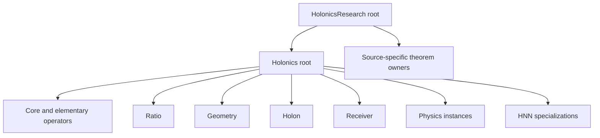

# M2 Lean root curation: source-backed map

This is the M2 preparation snapshot from `codex/restructure-r3-geometry` at `b8a03688` (R3
Geometry stacked over the R3 Physics and Dynamics cuts). It records static in-package source import
closures; it does not report Lake artifacts or a successful new-root build. Facet closures overlap,
so their row counts must not be added.

The authoritative target boundary is restructure-plan §3.2: one Lake package with public
`Holonics` and dependent `HolonicsResearch`; `Holonics` must not import research. These names and
root files are targets, not current Lean modules.

## Target import direction

`HolonicsResearch` imports `Holonics` and then the retained theorem and source-instance owners.
Core does not import the legacy `ElementaryHolonics` umbrella, a `Framework.*` facade with mixed
research imports, or `HolonicsResearch`. The proposed Holarchy is a later construction campaign;
M2 adds no empty module for it. HNN is a formal specialization in `Holonics`; its native host
reference remains a later construction.

## Measured source roots

The current subject facades are import bundles, not declaration owners. `Framework.Core` is clean,
but composing all current Framework facades does not produce a public Holonics root: several
facades still import Millennium theorem owners transitively.

| Current source closure | Modules / lines | Millennium | RH | Root implication |
|---|---:|---:|---:|---|
| `Framework.Core` | 26 / 8,742 | 0 | 0 | Clean core base, but too small to be the completed Holonics library. |
| `Framework.Geometry` | 62 / 17,118 | 18 | 0 | Includes mixed phase, Farey, swing and composition research paths. |
| `Framework.Dynamics` | 89 / 28,662 | 21 | 0 | Directed passage, difference calculus and clocked swing still enter through research owners. |
| `Framework.Information` | 155 / 55,833 | 107 | 0 | Main ingress is physical realization and entropy/action induction. |
| `Framework.Physics` | 408 / 153,769 | 274 | 0 | Largest mixed subject closure; fluid, stress-energy, Hodge and four-torus charts still reach research. |
| `Framework.Computation` | 188 / 65,072 | 108 | 0 | HNN-related owners share imports with Millennium applications. |
| `Framework.Objects` | 110 / 41,755 | 24 | 0 | Elementary objects still inherit several research transport and physical imports. |
| `Framework.HolonObject` | 98 / 34,341 | 23 | 0 | Port, material, generator and Holon laws still cross research boundaries. |
| `Framework` | 473 / 172,596 | 279 | 0 | Current all-subject bundle; unsuitable as `Holonics` without further cuts. |
| Legacy `ElementaryHolonics` | 1,387 / 484,980 | 987 | 150 | Existing broad proof umbrella; not a proposed root for either new library. |
| Legacy umbrella minus Framework | 914 / 312,384 | 708 | 150 | Initial source-difference set for `HolonicsResearch`, before root-specific cuts. |

The formal package has 1,412 Lean source modules. Twenty-five are not in the legacy umbrella's
import closure and need explicit M2 disposition; an umbrella build alone does not cover them. The
current `Framework` closure also reaches six Mathematics modules. The broad-root import difference
contains nineteen additional Mathematics modules.

## Candidate operator owners and remaining cuts

| Target owner | Current source evidence | Smallest source-backed boundary before root creation |
|---|---|---|
| `Holonics.Ratio` | `Objects/{Ratio,RatioPhase,RatioBlock}` closure: 18 / 5,379 lines, including `Millennium.Turn` and `Millennium.SituatedReturnedDifference`. | Ratio uses `Turn.theWholeTurnIsWhatTheExponentialDeletes` for winding/log branches. `HolonicAdjointNormalization`, used by Ratio, consumes `AddressedLinearizedPassage`, `AddressedTwoStepWord`, and the two-step adjoint return from `SituatedReturnedDifference`. Move those generic phase/adjoint declarations to Ratio/Geometry/Transport owners; leave turn calibration and full situated-fibre theorems in Research. |
| `Holonics.Geometry` | The current facade is 62 / 17,118 lines / 18 Millennium modules. The union of the eight direct geometry owners (ConnectionCalculus, CrossRatio, Gyrogroup, SwingPotential, ExteriorBoundary, ScrewGeometry, PhaseCarry, PairResonance) is 29 / 5,755 / 10 Millennium modules. | Connection calculus is already in `Geometry.ConnectionCalculus`; do not restore the removed curvature edge. `PhaseCarry`/`PairResonance` reach Farey, Turn, DifferenceCalculus, Swing and Snell owners; separate the exact carry/lock operators consumed by Geometry. `HolonicComposition` and the standalone bar-framework `Rigidity` example are facade re-exports, not declarations used inside `Framework.Geometry`; keep them in Research until a core consumer is named. |
| `Holonics.Holon` | `Framework.HolonObject`: 98 / 34,341 / 23 Millennium modules. | Keep the direct `Holon/{Port,Dirac,Complex,Element,Generator,Restriction,Law}` operators together; extract their generic declarations from `HolonicComposition`, clocked swing, reflection, Ricci and lineage source owners. Preserve each physical/theorem instance in Research. |
| `Holonics.Receiver` | Static union of `Foundation.Receiver`, `Transport.ChangingReceiver`, `Objects.Pairing`, and `Foundation.Holon`: 33 / 9,141 / 11 Millennium modules. No single current `Framework.Receiver` root exists. | Assemble the intended participating receiver and receipt from those owner declarations; extract generic pair/face laws from CellHolonomy, Hodge and addressed-passage imports. Keep the receiver-relative scope and unresolved fibre. |
| `Holonics.Physics` | `Framework.Physics`: 408 / 153,769 / 274 Millennium modules, including its direct `Framework.Dynamics` import. Its direct research and computation edges are catalogued in the [R3 edge audit](LEAN_CORE_R3_EDGES.md#physics-facade-curation-audit). | This is not a standalone Physics closure. Build from finite constitutive and receiver operators, not the import bundle. Separate generic mass-shell, typed-origin, entropy/current and Hodge laws from named Einstein, cosmology, Navier–Stokes, four-force and Maxwell instances. Keep the Einstein/observer source map and thermal clocks/hypotheses on the core side only when their generic law has an independent owner. |
| `Holonics.HNN` | `Framework.Computation`: 188 / 65,072 / 108 Millennium modules. A broader HNN candidate union with quantum-transport and four-torus parameteron owners is 204 / 69,585 / 109 Millennium / 3 Mathematics modules. | Split HNN's reusable operator and execution interfaces from research applications. Keep the complex parametron in this specialization. The host reference and full HNN return are later construction work, not M2 requirements. |

The existing Ratio, Physics and Geometry cuts are recorded in the [R3 source audit](LEAN_CORE_R3_EDGES.md).
Other concrete mixed-source cuts to finish before these roots can build include:

- `Millennium.HolonicTypedOriginDimensions`: move the two addressed time-origin axes, `OriginDim`,
  and `symmetrizeDimension` into a typed-unit/geometry owner; leave Einstein/cosmological
  dimensional instances and tensor-versus-wedge examples in Research.
- `Millennium.HolonicMassShellFace`: move the reusable `FourMomentum` carrier and Lorentz pairing
  to a spacetime Physics owner; keep arc/fork coupling interpretations and named mass-shell
  consequences in Research.
- `Millennium.HolonicEntropyActionInduction`: split generic `SuccessorCurrent`, `CurrentBalance`,
  `EntropyCurrentBalance`, `SkewDissipativeTurnLaw`, and `ThermalConstitution`/`freeEnergy` laws
  from Faraday, four-torus entropy-current and relativistic thermal instances.
- `Millennium.PhysicalRealization`: move the generic `PhysicalRealizationCore`, `RealizationSpan`
  and zero-defect passage operations to Holon/Receiver owners; keep source-specific lineage and
  realization examples in Research.
- `Millennium.HolonicDifferenceCalculus` and `HolonicDirectedPassage`: reuse the current
  `Foundation.HigherDifferenceTransport` and `Foundation.SuccessorWitnessSystem` owners; extract
  only the discrete difference and addressed-passage declarations consumed by PhaseCarry,
  PairResonance, WorldTube and Dynamics. Keep research-specific current/limit results in Research.

The source graph shows two useful controls: `Holonics.Ratio` is close to a root once its two
remaining imports are split; `Framework.Physics` is still a very large research closure even after
its documented small direct cuts. Root curation therefore requires declaration-level cuts, not
import-list edits alone.

## Research preservation and root acceptance

Build `HolonicsResearch` from the retained source-specific theorem owners and import `Holonics`
first. Seed its module set from the old broad closure minus the final Holonics closure, then
resolve these 25 source files outside that legacy umbrella closure individually:

| Current module (line count) | Project imports | Current source importers | First-pass M2 disposition |
|---|---|---|---|
| `DerivationAtlas` (462) | none | none | Keep as standalone Lean analysis tooling; do not place in either library root without checking Lake executable ownership. |
| `Computation.GeneratorObservationScope` (94) | none | none | Keep; candidate for `Holonics.HNN` because it states finite generator observation, but it has no current consumer. Root it only with the HNN operation it serves. |
| `Computation.HolonicConstitutiveFibreCollapse` (117) | `Computation.HolonicConstitutiveFibre` | none | Keep; HNN/computation candidate, no duplicate evidenced. Inspect its fibre consumer before making it a public root import. |
| `Mathematics.MachinPhaseConstraint` (27) | none | none | Keep the unique exact phase constraint; candidate Geometry/Ratio owner, not a duplicate. |
| `Mathematics.PiIterationConstraint` (100) | none | none | Keep as a named exact-iteration result in Research pending a public landmark consumer. |
| `Mathematics.RadixWindowReceiver` (89) | none | none | Keep; candidate Ratio/Receiver law for exact scaled windows and residues. It currently has no consumer. |
| `Millennium.FamilyTunnellHeckeCorrespondence` (230) | `Millennium.FamilyTunnellHeckeIntertwining` | none | Keep as a Research theorem family; no duplicate identified. |
| `Millennium.HodgeCausalLengthBridge` (172) | `Millennium.HolonStagedCausalLength`; `Millennium.HodgeHolonicCutFalsifier` | none | Keep as a Research bridge; no duplicate identified. |
| `Millennium.HodgeOfficialReceiver` (116) | `Millennium.HodgeSmoothProjectiveReceiver` | `Millennium.OfficialFinishLines` | Keep in Research; preserve its official-endpoint consumer. |
| `Millennium.HolonStagedCausalLength` (222) | `Millennium.ReceiverIndexedCausalLengthTower` | `Millennium.HodgeCausalLengthBridge` | Keep in Research; preserve the causal-length bridge. |
| `Millennium.HolonicCausalFluxTime` (556) | `Millennium.HolonicClockedPantographicSwingApparatus` | none | Keep as a source-specific physical clock/flux result; no duplicate identified. |
| `Millennium.HolonicClockedPantographicSwingApparatus` (298) | `Millennium.HolonicClockedPantographicSwing`; `Millennium.HolonicFiniteCausalAperture`; `Millennium.PVersusNP` | `Millennium.HolonicCausalFluxTime` | Keep as a Research apparatus theorem; preserve its clock/causal-flux consumer. |
| `Millennium.HolonicStateAddressedQuadratic` (186) | `Millennium.HolonicQuadraticMomentCondensation` | none | Keep the source-addressed result; when re-rooting, check whether its generic moment use can retarget to `Holon.QuadraticMoment`. No duplicate established. |
| `Millennium.MestreCompletedSquare` (245) | `Millennium.MestreForcedSectionIncidence` | none | Keep as a Research result; no duplicate identified. |
| `Millennium.MestreForcedSectionIncidence` (217) | `Foundation.Holon` | `Millennium.MestreCompletedSquare` | Keep as Research; it depends on a core owner and has a concrete theorem consumer. |
| `Millennium.NavierStokesOpenCompactWeightedTower` (121) | `Millennium.NavierStokesOpenCompactWeightedPath` | none | Keep as a Research fluid theorem; no duplicate identified. |
| `Millennium.NavierStokesPhysicalH2QuarticSourceEnvelope` (187) | `Millennium.NavierStokesCalibratedTriadicFaceBound`; `Millennium.NavierStokesPhysicalH2ClockedQuarticInteractionPullback`; `Millennium.NavierStokesWeightedSmoothPathTower` | none | Keep as a Research fluid theorem; no duplicate identified. |
| `Millennium.OfficialBSDReceiver` (310) | `Millennium.BirchSwinnertonDyer` | `Millennium.OfficialFinishLines` | Keep in Research; preserve its official-endpoint consumer. |
| `Millennium.OfficialFinishLines` (44) | `RH.GlobalWeilFinishLine`; `Millennium.{OfficialBSDReceiver,HodgeOfficialReceiver,NavierStokesOfficialBridge,YangMillsOfficialReceiver,PVersusNPOfficialBridge,PoincareOfficialBridge}` | none | Keep as the Research-root aggregator for the official endpoint declarations. |
| `Millennium.PVersusNPCausalLengthBridge` (252) | `Millennium.PVersusNPOfficialBridge`; `Millennium.ReceiverIndexedCausalLengthTower` | none | Keep as a Research bridge; no duplicate identified. |
| `Millennium.PVersusNPOfficialBridge` (148) | `Millennium.PVersusNP` | `Millennium.OfficialFinishLines`; `Millennium.PVersusNPCausalLengthBridge` | Keep in Research; preserve both endpoint and bridge consumers. |
| `Millennium.PoincareOfficialBridge` (164) | `Millennium.PoincareConjecture` | `Millennium.OfficialFinishLines` | Keep in Research; preserve its official-endpoint consumer. |
| `Millennium.YangMillsOfficialReceiver` (290) | `Millennium.HilbertTransportRefinement`; `Millennium.YangMillsLimit` | `Millennium.OfficialFinishLines` | Keep in Research; preserve its official-endpoint consumer. |
| `Transport.GenerativeTransport` (85) | none | none | Keep as an HNN/transport candidate; it has no current consumer, so do not root until its generation operation is specified. |
| `M6CausalReturn` (366) | Lean elaborator/server, Mathlib geometry and tactics | none | Keep as standalone analysis tooling outside both library roots; audit its executable target during the path move. |

This import/consumer audit supports no duplicate-based fold or retirement for any of these 25
files. “No source importer” means the old umbrella does not cover the module; it does not prove the
theorem is unused or checked. Confirm the source owner, issue/record citation and verification
scope before classifying each file. Do not silently drop a theorem because the old umbrella misses
it or claim it was built only because it is listed in a future root.

The final root source audit checks (1) `Holonics` transitively imports no `HolonicsResearch`,
`Millennium` or `RH` module; (2) `HolonicsResearch` imports `Holonics` and has no path back into
the legacy `Framework` or `ElementaryHolonics` umbrellas; (3) every retained declaration has one
owner and all source theorem imports are retargeted; and (4) both `lake build Holonics` and
`lake build HolonicsResearch` pass after the path move. Namespace migration from
`Soma.Holonics.*` remains a later mechanical phase.
