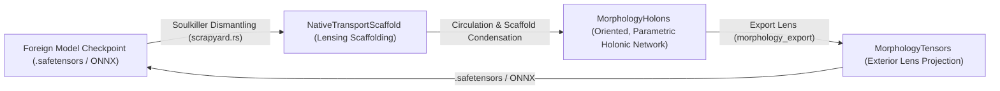

# Weight matrices are flux cross-sections in motion, and morphology packages are morphology holons

**Date:** 2026-09-02
**Truth status:** `interpretation` (for the semantic, physical, and architectural unification); `proved-derived` for the cited Lean theorems; `established-bounded` for the cited Rust owners.
**Evidence:** `source-inspected` (`Computation/HolonicNeuralEcology.lean`, `Computation/MachineLearningChart.lean`, `NavierStokesCellCurrentLaw.lean`, `HolonicConnectionCurvature.lean`, `soma/life/src/native_intelligence/morphology_package.rs`, `crates/holonic-engine/src/native_spool/scaffold.rs`); `formal-checked` (Lean `v4.33.0` proofs in `ElementaryHolonics`).
**Provenance:** Brandon, 2026-09-02: *"Regarding the local current, we do use physics to describe these things as you noted, and I think the separation between weight matrices and calling them 'currents' is apt, but there's no reason we can't reconcile the semantics. Fluid dynamics have curvature and weight, we have a ton of Lean foundations in Euler and Navier-Stokes, and I would prefer to unify the idea of weight matrices with cross-sections in motion (flux, currents, divergence theorem, eddy currents). Same idea goes for the model checkpoint as safetensors -> NativeTransportScaffold / MorphologyPackage; I had settled on 'Scaffold' with Sol, which is valid for lensing-like temporary scaffolding, but the morphology 'package' itself is more like the holonic encoding of the model. A holon is mathematically like a tensor, but it's like the object itself is inherently oriented and linked to other holons; I would prefer MorphologyTensors for tensors or MorphologyHolons for oriented and parametric encoding of holons. I'd want you to analyze the ideas and then submit a research report so that I can then have Sol most likely update the naming and intentions of the objects."*
**Band:** LOCAL CURRENT UNIFIED WITH FLUX CROSS-SECTIONS / INCOMPRESSIBILITY AS ZERO-STORAGE CELL BALANCE / VORTICITY AND COMMUTATOR AS EDDY FLOW / SCAFFOLD AS TEMPORARY LENSING APPARATUS / MORPHOLOGY TENSORS AS EXTERIOR PROJECTION / MORPHOLOGY HOLONS AS NATIVE ORIENTED PARAMETRIC ENCODING

---

## 0. Executive thesis

[interpretation] Two persistent semantic divides have introduced unnecessary friction between classical machine learning intuition and pure holonic physics:
1. **Weights vs. Currents:** Classical deep learning views a weight matrix $W \in \mathbb{R}^{m \times n}$ as a static rectangular table of inert coefficients. Holonics describes inter-site transport as "Addressed Local Current". These are not contradictory descriptions of two different things; they are **static vs. dynamical readings of the same physical object**. In fluid dynamics and continuum transport, a coupling matrix across a boundary is a **flux cross-section**. When currents flow through that cross-section, the divergence theorem governs face balance, incompressibility enforces zero storage (Kirchhoff's current law), and anti-symmetric/off-diagonal transport manifests as vorticity and eddy currents.
2. **Model Checkpoints vs. Holonic Ecology:** A classical `.safetensors` checkpoint is an unoriented collection of named multidimensional arrays. A `NativeTransportScaffold` is correctly understood as **lensing-like temporary scaffolding** (an inherited geometric apparatus that guides initial circulation before being condensed or withdrawn). What remains—persisted, committed, and cultivated across generations—is not a passive software "package" (a term borrowed from package managers), but **`MorphologyHolons`**: an inherently oriented, coupled, and parametric network of holons. When projected outward through an export lens to external receivers, it manifests as **`MorphologyTensors`**.

---

## 1. Weight matrices as flux cross-sections in motion

### 1.1 The classical illusion of static weights

[definition] In the classical chart:
$$y_i = \sigma\left(\sum_{j=1}^n W_{ij} x_j + b_i\right)$$
$W_{ij}$ is treated as an immutable scalar weight assigned to a directed edge between neuron $j$ and neuron $i$. This view has two major pathologies:
- It isolates the numbers from the medium: the weights exist in an abstract Euclidean space disconnected from conservation, energy dissipation, and boundary flux.
- It treats forward inference as an algebraic matrix-vector multiplication rather than physical information transport across a spatial boundary.

### 1.2 The fluid dynamic reconciliation: flux through a cross-section

[proved-derived; formal-checked] In continuum transport, consider an interface or boundary surface $S$ separating input region $\Omega_{\text{in}}$ (sites $j \in \{1,\dots,n\}$) and output region $\Omega_{\text{out}}$ (sites $i \in \{1,\dots,m\}$). The total flux $\Phi_i$ entering site $i$ across $S$ is given by the surface integral of the current density vector field $\mathbf{J}$:
$$\Phi_i = \iint_{S_i} \mathbf{J} \cdot d\mathbf{S}$$

By Gauss's Divergence Theorem:
$$\iint_{\partial V_i} \mathbf{J} \cdot d\mathbf{S} = \iiint_{V_i} (\nabla \cdot \mathbf{J}) \, dV$$

In our Lean foundation [`NavierStokesCellCurrentLaw.lean:45–52`](../../formal/elementary-holonics/ElementaryHolonics), this relation is formally proved at the unit cell level:
- `integral_divergence_unitCube_eq_faceBalance`: The integrated divergence over the cell equals the face balance (outgoing minus incoming flux across all six boundary faces).
- `faceBalance_eq_zero_of_divergenceFree`: A divergence-free field ($\nabla \cdot \mathbf{v} = 0$) has exact zero face balance.
- **Physical consequence:** Incompressibility is identical to zero storage on the cell—Kirchhoff's current law.

When an incoming state field $\mathbf{x} = (x_1, \dots, x_n)$ impinges on the boundary cross-section $S$, the medium's local permeability/conductance response across the interface is a 2-tensor $\mathbf{K}(x, y)$. In discrete coordinates, $\mathbf{K}$ has components $W_{ij}$.

Therefore:
$$\text{localCurrent}(j \to i) = W_{ij} x_j$$
is the **constitutive flux crossing the boundary channel from port $j$ to port $i$**.

The total current arriving at site $i$ before local reaction is:
$$\text{aggregateCurrent}(i) = \sum_{j} \text{localCurrent}(j \to i) = \sum_{j} W_{ij} x_j$$
which is [`HolonicNeuralEcology.lean:47–50`](../../formal/elementary-holonics/ElementaryHolonics/Computation/HolonicNeuralEcology.lean#L47-L50):
```lean
def aggregateCurrent (morphology : Morphology) (generator : Generator)
    (state : Site → Carrier) (target : Site) : Carrier :=
  ∑ source : Site, N.localCurrent morphology generator state target source
```

### 1.3 Eddy currents, vorticity, and the commutator

[proved-derived; formal-checked] In fluid dynamics, when velocity field lines shear or curve, vorticity $\boldsymbol{\omega} = \nabla \times \mathbf{v}$ creates circulating eddy currents.
In [`2026-09-02_THE_ABELIAN_REDUCTION_THE_YANG_MILLS_FLOW_IS_THE_HEAT_FLOW_OF_THE_CURVATURE_AND_THE_COMMUTATOR_IS_THE_GAUGE_TWIN_OF_VORTEX_STRETCHING.md`](2026-09-02_THE_ABELIAN_REDUCTION_THE_YANG_MILLS_FLOW_IS_THE_HEAT_FLOW_OF_THE_CURVATURE_AND_THE_COMMUTATOR_IS_THE_GAUGE_TWIN_OF_VORTEX_STRETCHING.md) and [`HolonicConnectionCurvature.lean`](../../formal/elementary-holonics/ElementaryHolonics), we proved:
$$F_{ij} = \partial_i A_j - \partial_j A_i + [A_i, A_j]$$
where the ring commutator $[A_i, A_j]$ is the gauge twin of fluid vortex stretching $(\boldsymbol{\omega} \cdot \nabla)\mathbf{v}$.

In classical ML, attention matrices and multi-head cross-attentions are empirical attempts to capture non-commutative routing and circulating context. In holonics:
- Symmetric transport corresponds to irrotational potential flow (straight gradient descent).
- Anti-symmetric / off-diagonal transport corresponds to **rotational eddy currents**: circulating information between channels that preserves energy while rotating phase.
- A weight matrix is therefore a **permeability cross-section in motion**: its symmetric part governs throughput dissipation, while its commutator / anti-symmetric part governs rotational eddy circulation.

---

## 2. Scaffold vs. Package vs. Holons

### 2.1 The three layers of model representation

[definition] The migration of a model from foreign artifacts into pure holonic life proceeds through three distinct physical regimes:



### 2.2 Why "Scaffold" belongs to the transitional phase

[established-bounded] In [`Computation/NativeTransportScaffold.lean`](../../formal/elementary-holonics/ElementaryHolonics/Computation/NativeTransportScaffold.lean) and `crates/holonic-engine/src/native_spool/scaffold.rs`:
- A scaffold packages `profiledHolons`, `windings`, `compositions`, and `openObligations`.
- In architectural construction and optics, **scaffolding is temporary staging**: it holds up the arch until the keystone is placed, or acts as an exterior lensing frame that guides initial excitation.
- In `SCF5` ([`CONSTRUCTION_STATE.md:223–228`](../../CONSTRUCTION_STATE.md#L223-L228)), `ScaffoldReleasePassage` proves that once native hexis is cultivated, the inherited scaffolding is **withdrawn**, leaving behind only native cultivated morphology.
- Therefore, calling the permanent, cultivated body a "scaffold" is a category mistake: the scaffold is the temporary armature; the cultivated body is what survives.

### 2.3 `MorphologyPackage` vs. `MorphologyHolons`

[interpretation] The term `MorphologyPackage` in [`soma/life/src/native_intelligence/morphology_package.rs`](../../crates/holonic-life/src/native_intelligence/morphology_package.rs) was adopted during the AAC/VWS campaigns as a container noun:
- `manifest`: metadata, schema, lineage;
- `reconstruction`: departed withdrawals and fibres;
- `evaluation`: benchmark receipts;
- `realization`: apparatus and export bindings;
- `hot`: the active runtime ecology.

However, calling this object a "package" makes it sound like a zip archive, an npm module, or an inert crate. In reality, the hot core is an ensemble of **intrinsically oriented, parametrically coupled holons**:
- Each cell is a `NativeParametronCell` carrying complex wave current $(I_{\text{real}}, I_{\text{imag}})$ and phase angle $\theta \in [0, 2\pi)$.
- Each connection is an addressed `NativeThreadOccurrence` linking entering ports to emitting ports with explicit causal lineage.
- Unlike a tensor (which is a passive array of numbers indexed by coordinate tuples $(i, j, k)$), a **holon** is an epistemically bounded black box with observable faces and an unobservable interior, physically coupled to its neighbors.

### 2.4 The distinction: `MorphologyHolons` vs. `MorphologyTensors`

To reconcile classical ML exports with native interior purity:
- **`MorphologyHolons` (Internal Reality):**
  The native, resident, oriented causal network. It contains parametron cells, thread occurrences, generator descents, complex currents, and phase relationships. It lives inside `soma/life` and `holonic-engine`. It has no foreign layer names, no flat tensor shapes, and no framework bindings.
- **`MorphologyTensors` (Exterior Lens):**
  The exterior receiver projection. When an external observer, checkpoint loader, or ONNX exporter requests a view of `MorphologyHolons`, the export lens (`morphology_export`) reads the holonic incidence and projects it onto flat coordinate grids: weight matrices, bias vectors, and embedding tables.

---

## 3. Structural mapping for Sol's upcoming naming alignment

[definition] When Sol or the next construction campaign refines these names, the alignment maps cleanly onto existing files:

| Current Name | Proposed Clarified Name | Physical / Conceptual Meaning | Owning Location |
|---|---|---|---|
| `Addressed Local Current` / `localCurrent` | **Cross-Section Flux / Local Current** | Permeability tensor $W_{ij}$ through which current flows; divergence-free cell balance | `HolonicNeuralEcology.lean`, `native_intelligence/conduct.rs` |
| `NativeTransportScaffold` | **NativeTransportScaffold** (Retained) | Temporary lensing-like apparatus used during intake/dismantling and initial circulation | `NativeTransportScaffold.lean`, `native_spool/scaffold.rs` |
| `NativeMorphologyPackage` | **MorphologyHolons** (or `NativeHolonMorphology`) | The actual continuing, oriented, parametric holonic network with complex phase and causal threads | `morphology_package.rs`, `NativeMorphologyVariant.lean` |
| Export Safetensors / ONNX | **MorphologyTensors** | Exterior unoriented coordinate projection of the holons across an export lens | `morphology_export/`, `ForeignOnnxChart` |

---

## 4. Verification and Non-Contamination Safeguards

[project-postulate] In making this semantic and architectural alignment, the following boundaries must remain absolute:
1. **No Math/Physics Counterfeit:** Calling a weight matrix a "flux cross-section" must remain grounded in exact Kirchhoff face balance ([`NavierStokesCellCurrentLaw.lean`](../../formal/elementary-holonics/ElementaryHolonics)) and discrete port transport. It must never be used as a decorative metaphor to sneak floating-point matrix multiplications back into the native interior.
2. **Purity of the Circulation ABI:** `MorphologyTensors` exists strictly outside or at the boundary of `soma/circulation-abi`. Inside the ABI, only `MorphologyHolons` (resident cells, threads, and currents) exist.
3. **Preservation of Scaffold Release:** Clarifying that `Scaffold` is temporary reinforces `SCF5`'s law: scaffolding is meant to be released once native hexis is established.
