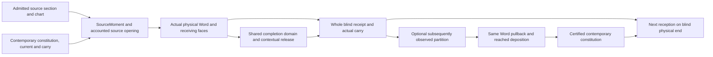

# The retained physical path joins source, comparison, release and continuation

October 6, 2026. Refs #73, #62, #63, #148. Architectural consolidation of source
`074a6267ecb515b10aa199790efed83c833baeeb`; no new owner, source law or experiment.

[implemented-source; native-pending] The prepared host consumer is one continuing physical
receiver. Its source section opens on contemporary material and the actual preceding carry;
its physical Word supplies receiving faces; an optional later observation returns through that
same Word and deposits at reached loci. The next reception consumes the resulting material and
the blind passage's actual end. Completion and release read this model's admitted source family.
They do not identify an erased truth without a learned terrain relation and independent evidence.

The [source trace](receipts/retained-physical-architecture-20261006/SOURCE_TRACE.v1.json) seals the
owners and line references below. The [demonstration contract](receipts/retained-physical-architecture-20261006/DEMONSTRATION_CONTRACT.v1.json)
consumes the already queued native controls only after their fresh acceptance. No compiler,
training, benchmark, data generation or scientific run was launched for this consolidation.

## One retained medium, two explicitly joined clocks

`physical::PhysicalResident` retains `Constitution`, `Current`, `WordOpening` and a complete
cell-free producing `Encoded` chart, borrowing the immutable `Field`. The constitution carries
learned maps, normal statistics and their exact remainders; the opening carries participating
physical state. The current is the source section's declared frame/origin. Its station clock is
distinct from the absolute pump/refinement clock advanced by `ReceptionCarry`. The receiver does
not infer erased selective advances or reset either clock between admitted calls.

The transient `PhysicalPrediction` owns the actual Word, source moment, producing material,
current, phases, chart and opening support. `finish` drops them without deposition; `observe_at`
consumes them once. `PhysicalResident::receive` obtains an observation only after the blind
constructor returns. A refused comparison keeps the old constitution and the executed blind
carry. A refused forward leaves the resident unchanged. A successful comparison installs the
certified successor but still carries the blind end; a hypothetical source-perturbed end is never
installed. `into_parts` provides an in-memory continuation, not a cold-save format.

## Actual source-to-observable consumers

All line references are at the pinned source, rather than changing live-main bytes.

| Join | Owner and consuming operation | Required relation or observable |
|---|---|---|
| Complete producing chart | `prediction.rs:1588,1670`, `DamagedSection::of_runs/admit` | Every run has the same empty `Encoded` part, including D, labels, fibre and conduct; supported `D=I_A`, identity labels, source E and complex R shapes agree |
| Source station clock | `moment.rs:1576,1603`, `SourceMoment::station_section` | Every class fits the source, no predecessor can advance it, source opening equals current lift; station j has declared phase `tau_g+1+j`, including holes |
| Contemporary source opening | `moment.rs:2304` -> `word.rs:1779`, `open_storage/open_exact_received` | Actual first and ordered-pair features enter through current E/pair material and transport; new source storage replaces old source storage through an accounted port imposition |
| Physical evolution | `prediction.rs:1855,1939`, `physical_forward/physical_domain_forward` -> actual Word | Junction participation/scattering, element, contact and loaded resonator relations execute at `opened_at+crossing`; actual carry and all local balances return |
| Receiving face | `receiving.rs:1620`, `ReceivingPhases::read` | `y_j=R P_R^(current.lift) Pi_R x_(e_j)` in the producing complex row chart, then actual GrainCells |
| Declared comparison | `prediction.rs:3302`, `PhysicalPrediction::observe_at` | Same commit and complete material, chart, whole section length and compared partition; Faces -> partitioned HolonRatio -> RatioCovector |
| Return and deposition | `port.rs:878` Word return -> `reference.rs:2224`, `compose_return` -> `constitution.rs:5891`, `deposited` | Same producing Word/anchors/phase/features; only compared and reached samples enter the selected material relation |
| Applied source move | `prediction.rs:2369,3602`, `physical_source_pairing` consumed by `observe_at` | Actual source-opening difference, received pairing, opening return and negative applied descent alignment agree exactly before publication |
| Completion and release | `prediction.rs:2067,2228,2285,3648` | One missing label remains shared through all first/pair ports and loaded responses; computed completed-model leader union projects to Released or Held at declared class tolerance zero |
| Continuing consumer | `physical.rs:114` | `(Theta,Current,carry,chart) -> blind receipt -> optional Theta' -> next section on receipt.carry` |

The opening law is precise. `word::interior_of` zeros source-ring storage while retaining
non-source storage, arriving waves, contact displacement/rate and resonator motion. The carry is
first crossed into contemporary material at its actual absolute pump clock. The moment imposes
new storage on those emptied source rows. `SourceOpeningReceipt` checks

`energy_after - energy_before = imposed_source_energy - absorbed_source_energy`.

Thus retained motion continues, with an explicit source boundary exchange. This does not add the
same source passage to its previous storage again. The actual sparse moment reads its actual
first population and each intact ordered-pair population through the owned PopulationChart;
it does not pretend those are the complete source. The completion family separately fixes the
full N first population and `max(N-offset,0)` for each ordered-pair family, with their actual
chart weights. Intact endpoints enter at actual station offsets and phases; holes do not shift
later stations. Located conduct and an unjoined decoder are refused before a Word, rather than
mapped silently to this unit station law. Arbitrary raw data still needs its founded encoding.

This is the exact host physical path. Host row blocks/indexed regions use immutable inputs and
disjoint staged output through Rayon, followed by ordered reductions. Signed response propagation
visits its full ring/contact states and class columns. Libtest `--test-threads=1` alone does not
seal the Rayon pool; the queue owns its actual thread/environment and aggregate accounting.
Neither host/CUDA linkage nor this source trace establishes a card-resident physical consumer.

## Directionality is a paired return through the producing operands

For source injection I, physical tick composition Phi, receiving anchor A_j, phase P_j and
receiving material R_j, the actual boundary relation is

`L_j=R_j P_j A_j Phi_(j,0) I` and
`L_j*=I* Phi_(j,0)* A_j* P_j* R_j*`.

The receiving covector returns through this full composition, summed only over the declared
compared crossings. Coincident source/receiver locations do not erase phase or time. The adjoint
preserves the pairing `<g,L delta>=<L* g,delta>`; it does not invert physical evolution or reverse
its clock. A primal source contrast and a comparison covector are different operands. For the
receiving cost, the real gradient is the declared odometer representative `p_tilde-q`, with its
phase component retained. `compose_return` uses its negative as the normal-law descent sample.
The Maurer-Cartan form `R^-1 dR` equals `d log R` only in a commuting chart; no such equality is
asserted for arbitrary material transports. These distinctions consume the directionality input
at the existing [source-return owner](2026-10-06_THE_RECEIVING_COVECTOR_RETURNS_THROUGH_THE_SOURCE_CLOCK_AND_PRODUCING_WORD.md).

The native applied-source gate keeps R, source transport, loaded dynamics and the entered
interior fixed while changing only admitted E maps or pair output rows. It constructs

`delta_s=open_storage(Theta',Current)-open_storage(Theta,Current)`

from the same actual moment, including normal-law carried corrections. Its storage-only signed
response has zero *difference* of the common entered interior. This algebraic cancellation does
not reset the production state. The response executes the producing loaded tick family up to
the last compared crossing and reads through the same R and phase. The consumed equation is

`sum_compared <g_j,delta_y_j> = <WordReturn.opening,delta_s> = -JointReading.decrease`.

Both observable and composition defects must be exactly zero, in addition to the existing
applied move/gain certificate. The last term is applied first-order alignment, not a measured
finite surprise decrement. Exact operands, zero Word work-residual bound and zero adjoint
remainders are required. An execution-work bound is not converted to an observable error bound.
R-only learning has no source perturbation receipt; a coupled R/E update is not admitted here.

## Correlated completion and contextual release

For one hole in the supported exact linear regime, the source expansion is
`s(c)=s_fixed+z_c`. The same class c fills that station in every first and incident pair port.
Complete population denominators remain fixed; separately varying pair endpoints would enlarge
the domain incorrectly. The actual entered interior belongs to the fixed component alone.
The transient full states obey the same absolute loaded family:

`x_t(c)=x_fixed,t+z_c,t`,
`y_j(c)=R P_R^tau Pi_R x_fixed,e_j + R P_R^tau Pi_R z_c,e_j`.

The reader adds the fixed and each label response before quantization and computes the union
of their actual GrainCell leaders. It does not execute candidate completed Words or ask for a
preferred class. Independent coordinate boxes can lose this correlation and introduce false
leaders. Multiple holes, leaky populations, rounded operands or nonlinear saturation use the
existing weaker enclosure/refusal route where this exact shared response is not admitted.

`decide_station` releases an erased class only when this model's admitted leader set has zero
class width; otherwise it returns the full unresolved fibre it obtained. Intact classes stay
Intact. A singleton establishes model constancy over compatible completions at this chart, clock
and grain. The identical-blind-input/different-erased-truth witness still bars a truth-recovery
claim without a terrain relation. Release does not discard the whole physical carry or establish
a minimal future-sufficient quotient of its hidden modes.

## What storage and work are actually reduced

| Mechanism | Reduction supported by the source | Limit of the claim |
|---|---|---|
| Retained contemporary medium | Resident stores no occurrence list, old Word, observation or response history; each next admitted call starts from contemporary state without replaying the past | Normal statistics, rational numerators, remainders, chart and full carry still cost storage; fixed topology is not constant bits or a minimal quotient |
| Phase-carried source features | First and offset-pair counts suffice for their declared source contractions and adjoints; source passage is transient | This feature quotient does not reconstruct arbitrary raw input or establish injectivity for another future receiver; exact count carrier overflow remains a refusal |
| Shared single-hole response | One sparse physical Word supplies the actual carry; fixed-plus-label responses preserve correlation without candidate Words or completed-source rebuilds | A+1 full signed response states and A-by-A receiving comparisons still execute; less aggregate CPU or peak memory than candidate execution has not been measured |
| Applied-source certificate | One signed full response reaches only the last compared crossing rather than executing a candidate Word | Two source opening contractions, an operand clone and receiving products add cost; this is a correctness gate, not a speedup |
| Class release | A singleton fibre has no unresolved class choice at the declared receiver tolerance | No physical-state mode or retained constitution coordinate is pruned by that fact |
| Rebase/factor/chart change | Exact constraints, decoder and residual may change representation | Representation change alone proves neither fewer stored degrees nor reduced work |

For a fixed declared continuation with unit costs c_j, executing each unit once costs `sum c_j`.
Recomputing every complete prefix would cost `sum (N-j+1)c_j`, before preparation and certification.
This accounting explains the work avoided by a sufficient continuing state under identical
admitted operations; it is not a measured speedup, nor a proposal to retain/replay update history.

Existing counters have bounded scopes. `SourceMoment::dense_bits` counts dense feature slots and
its held window; `Constitution::exact_bits` counts carried material bits. Neither is a total
`PhysicalResident` storage/peak-memory measurement. `Capacity::state_bits` bounds its admitted
source clock/cardinality, not learned Theta or general future fidelity. Rust `compression/cost.rs`
owns an actual codec pivot with decoder, description, residual and work comparison, but this
physical receiver does not automatically learn or consume that codec. Warm chart refinement in
`reference::Resident` is another consumer; `open_exact_received` uses fresh exact operands and
does not claim its amortized work saving. Compiler-cache reuse is an exterior build saving.

Field storage/work balances use their declared effort/flow metric. Aggregate CPU time, wall time
and resident bytes are different exterior readings. No SI joule calibration, receiving-ratio
thermal-port join or universal conserved sum of bits and operations is established by this path.

## Evidence boundaries and the next observable demonstration

The accepted `6f536ac3` producer archive establishes its twenty-eight focused controls and
matched complete-Word/response coordinates on that source only. The retained consumer, formal
modules and new runtime gate have their own pins. The successor `074a6267` still needs a fresh
matched link and all eight queued exact selectors. Static syntax, source trace and whitespace
checks do not supply type checking or execution. Broad workspace/source guards, doctests and an
idle-card device gate are separate. No prior receipt receives successor credit by ancestry.

The demonstration is already expressed by two queued controls. The retained-family selector
prints the whole unobserved `PhysicalRepair` after real R/pair deposition and continuation. The
carried source-return selector prints the actual pairing certificate, whole blind receipt and
whole subsequent unobserved reception for E and pair-output learning at nonzero source phase
and an advancing pump clock. They are bounded deterministic physical-law fixtures, not an
untouched scientific population, trained product, or new synthetic curriculum. Their matched
Word witnesses are exterior unit controls, never a production answer routine.

After fresh native acceptance, present those existing output records verbatim with their full
unfiltered raw log and source/executable/acceptance links. Present no desired or reference answer
beside the output. Do not invent output while the queue is pending. The concrete observation is
continued native motion, source-sensitive receiving change, the consumed pairing and the actual
Released/Held fibre. A refusal or failed gate is preserved whole. A larger timeout or another
fixture cannot substitute for the failed fixed claim. The demonstration introduces no job.

The remaining concrete joins are:

1. Fresh `074a6267` native acceptance, independently admitted broad/device gates, and kernel/axiom
   acceptance for prepared `SingleHoleResponse` and `SourceReceiverReturn` under their actual
   provider closures. A runtime directional check is not an all-directions operator theorem.
2. Native rational first/pair normalization, source storage injection, actual loaded tick,
   Encoded source clock/decoder and GrainCell instantiation of those formal maps. Their #62
   boundary squares remain explicit; source-present proofs are not borrowed kernel receipts.
3. Rounded/nonlinear source updates need observable/adjoint defect tubes and finite derivative
   remainder certificates. Energy residuals do not supply them; coupled R/E moves remain open.
4. Located sparse conduct/clock and general decoder joins, founded raw boundary encodings, and
   useful repair/output on a genuinely untouched request partition remain unvalidated. The
   notebook's intact-station R-only consumer is prequential and does not exercise source learning.
5. Coarser future-sufficient retention, adaptive physical pruning/horizons and shared-clock rekey
   capacity for learned material need actual future-receiver detection/error coverage. No hidden
   mode is removed by the current singleton certificate.
6. Whole `PhysicalResident` cold restore and native card-resident passage/restore are not joined
   by its in-memory `into_parts` or by host/CUDA linkage.

The sole queue owns source/executable seals, cache/provider preflight, the measured fixed
projection, explicit outer lease and unchanged resource caps. This documentation branch leaves
all queued native/formal source worktrees and their immutable snapshots untouched.
